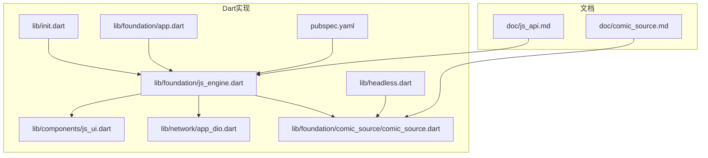
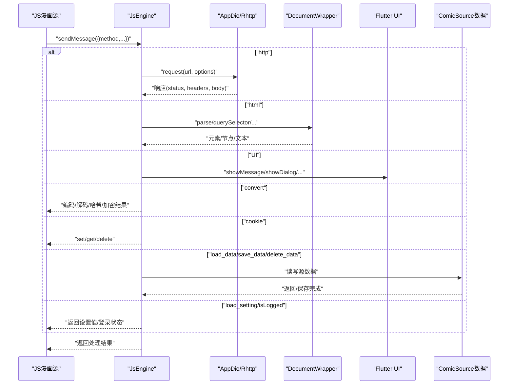
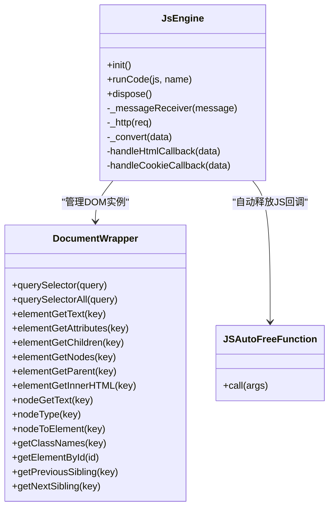
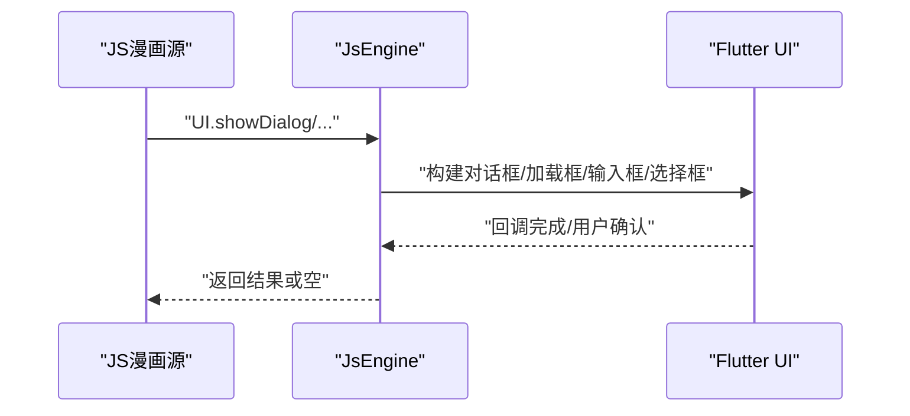
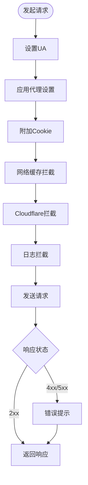
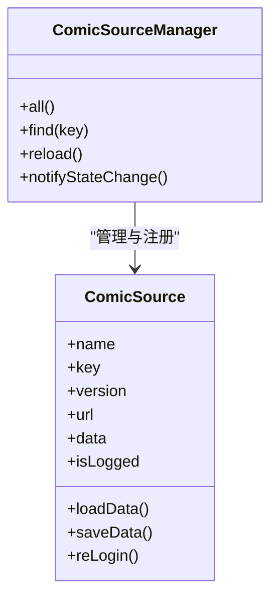
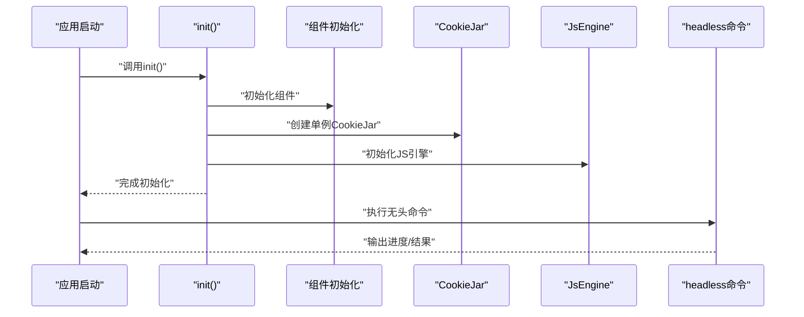
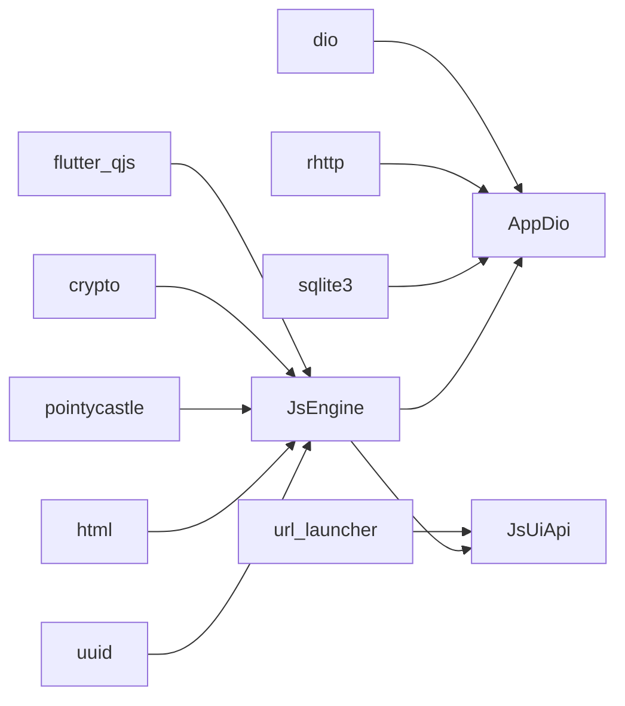

# API参考

<cite>
**本文档引用的文件**
- [js_api.md](file://doc/js_api.md)
- [comic_source.md](file://doc/comic_source.md)
- [js_engine.dart](file://lib/foundation/js_engine.dart)
- [comic_source.dart](file://lib/foundation/comic_source/comic_source.dart)
- [js_ui.dart](file://lib/components/js_ui.dart)
- [app_dio.dart](file://lib/network/app_dio.dart)
- [init.dart](file://lib/init.dart)
- [headless.dart](file://lib/headless.dart)
- [app.dart](file://lib/foundation/app.dart)
- [pubspec.yaml](file://pubspec.yaml)
</cite>

## 目录
1. [简介](#简介)
2. [项目结构](#项目结构)
3. [核心组件](#核心组件)
4. [架构总览](#架构总览)
5. [详细组件分析](#详细组件分析)
6. [依赖关系分析](#依赖关系分析)
7. [性能与稳定性](#性能与稳定性)
8. [故障排查指南](#故障排查指南)
9. [结论](#结论)
10. [附录：API索引与交叉引用](#附录api索引与交叉引用)

## 简介
本文件为Venera漫画阅读器的完整API参考文档，覆盖两部分：
- Dart API：描述应用侧（Flutter/Dart）对JS引擎、网络、UI桥接等能力的封装与调用方式。
- JavaScript API：面向漫画源脚本（ComicSource）的开发接口，涵盖网络请求、HTML解析、UI交互、数据存储、类型模型等。

文档目标是帮助开发者快速定位所需API、理解参数与返回值、掌握使用示例与注意事项，并提供版本兼容性与迁移建议。

## 项目结构
- 文档层
  - js_api.md：JS API参考（转换、网络、HTML、UI、工具、类型）
  - comic_source.md：漫画源开发指南（模板、页面类型、回调函数、配置项）
- Dart实现层
  - js_engine.dart：JS引擎初始化、消息通道、HTTP桥接、HTML DOM桥接、加密转换、随机数、Cookie桥接、UI桥接、UUID、设置读取、剪贴板、并发计算等
  - js_ui.dart：JS侧UI调用（消息到Flutter对话框、加载框、输入框、选择框、URL打开）
  - app_dio.dart：网络栈（基于rhttp适配器、拦截器、超时、缓存、Cloudflare处理、日志）
  - comic_source.dart：漫画源模型、管理器、数据持久化、评论/点赞/收藏等扩展接口
  - init.dart：应用初始化流程（组件初始化、CookieJar、JS引擎、翻译、OpenCC、更新检查）
  - headless.dart：无头模式命令行（WebDAV上传/下载、漫画源脚本更新、订阅更新）
  - app.dart：应用环境信息（版本、平台、语言、路径）
  - pubspec.yaml：依赖与版本约束

**图表来源**
- [js_api.md](file://doc/js_api.md#L1-L513)
- [comic_source.md](file://doc/comic_source.md#L1-L740)
- [js_engine.dart](file://lib/foundation/js_engine.dart#L1-L737)
- [js_ui.dart](file://lib/components/js_ui.dart#L1-L259)
- [app_dio.dart](file://lib/network/app_dio.dart#L1-L282)
- [comic_source.dart](file://lib/foundation/comic_source/comic_source.dart#L1-L502)
- [init.dart](file://lib/init.dart#L1-L124)
- [headless.dart](file://lib/headless.dart#L1-L245)
- [app.dart](file://lib/foundation/app.dart#L1-L113)
- [pubspec.yaml](file://pubspec.yaml#L1-L122)

**章节来源**
- [js_api.md](file://doc/js_api.md#L1-L513)
- [comic_source.md](file://doc/comic_source.md#L1-L740)
- [js_engine.dart](file://lib/foundation/js_engine.dart#L1-L737)
- [js_ui.dart](file://lib/components/js_ui.dart#L1-L259)
- [app_dio.dart](file://lib/network/app_dio.dart#L1-L282)
- [comic_source.dart](file://lib/foundation/comic_source/comic_source.dart#L1-L502)
- [init.dart](file://lib/init.dart#L1-L124)
- [headless.dart](file://lib/headless.dart#L1-L245)
- [app.dart](file://lib/foundation/app.dart#L1-L113)
- [pubspec.yaml](file://pubspec.yaml#L1-L122)

## 核心组件
- JS引擎与消息桥接
  - 初始化与全局注入：注入sendMessage、appVersion、全局函数
  - 消息路由：log、load_data、save_data、delete_data、http、html、convert、random、cookie、uuid、load_setting、isLogged、delay、UI、getLocale、getPlatform、setClipboard、getClipboard、compute
  - HTTP桥接：统一请求入口，支持bytes/plain响应、代理、Cookie管理、日志
  - HTML桥接：DOM解析、查询、属性、父子节点、文本、节点类型、元素转节点
  - 加密转换：UTF8/GBK/Base64、MD5/SHA系列、HMAC、AES-ECB/CBC/CFB/OFB、RSA解密
  - 随机数、UUID、剪贴板、并发计算
- UI桥接（JS -> Flutter）
  - showMessage、showDialog、launchUrl、showLoading、cancelLoading、showInputDialog、showSelectDialog
- 网络栈
  - 基于rhttp适配器，统一超时、重定向、DNS覆盖、TLS、Cookie管理、日志拦截
- 漫画源模型与管理
  - ComicSourceManager：扫描本地JS源、动态注册、更新检测
  - ComicSource：账户、探索页、分类、搜索、收藏、详情、评论、点赞、标签、链接处理、归档下载等
- 初始化与无头模式
  - init：组件初始化、CookieJar、JS引擎、翻译、OpenCC、更新检查
  - headless：WebDAV同步、漫画源更新、订阅更新

**章节来源**
- [js_engine.dart](file://lib/foundation/js_engine.dart#L80-L284)
- [js_ui.dart](file://lib/components/js_ui.dart#L11-L184)
- [app_dio.dart](file://lib/network/app_dio.dart#L128-L282)
- [comic_source.dart](file://lib/foundation/comic_source/comic_source.dart#L35-L108)
- [init.dart](file://lib/init.dart#L37-L77)
- [headless.dart](file://lib/headless.dart#L17-L245)

## 架构总览
下图展示JS源与Dart运行时之间的交互：JS通过sendMessage向Dart发送方法调用；Dart根据method分发到对应功能模块（网络、HTML、UI、转换、Cookie等），并返回结果或触发UI行为。

**图表来源**
- [js_engine.dart](file://lib/foundation/js_engine.dart#L112-L212)
- [app_dio.dart](file://lib/network/app_dio.dart#L128-L175)
- [js_ui.dart](file://lib/components/js_ui.dart#L14-L59)
- [comic_source.dart](file://lib/foundation/comic_source/comic_source.dart#L206-L231)

## 详细组件分析

### Dart API：JS引擎与消息桥接
- 初始化与全局注入
  - 注入sendMessage、appVersion、全局函数键值对设置
  - 支持从缓存或资源加载初始化JS脚本
- 消息路由
  - log：记录日志（级别映射）
  - load_data/save_data/delete_data：读取/保存/删除源自定义数据
  - http：统一HTTP请求，支持bytes/plain响应、代理、Cookie、日志
  - html：DOM解析与查询（文档/元素/节点）
  - convert：编码/解码、哈希、HMAC、AES、RSA
  - random：整数/浮点随机数
  - cookie：set/get/delete
  - uuid：生成UUID
  - load_setting/isLogged：读取设置默认值/登录状态
  - delay：延时
  - UI：消息到Flutter UI
  - getLocale/getPlatform/setClipboard/getClipboard：系统信息与剪贴板
  - compute：在隔离池执行JS函数
- HTTP桥接细节
  - 默认UA、可切换dart:io客户端、代理、Cookie管理、日志拦截
  - bytes/plain响应自动适配
- HTML桥接细节
  - 文档最大数量限制与回收
  - 元素/节点查询、属性、父子关系、文本、类型、ID、类名、兄弟节点
- 转换与加密
  - UTF8/GBK/Base64
  - MD5/SHA1/SHA256/SHA512/HMAC
  - AES-ECB/CBC/CFB/OFB、RSA解密（私钥DER解析）
- UI桥接
  - 对话框、加载框、输入框、选择框、URL打开
- 并发与资源
  - JSAutoFreeFunction自动释放JS回调
  - CookieJar统一管理

**图表来源**
- [js_engine.dart](file://lib/foundation/js_engine.dart#L48-L284)
- [js_engine.dart](file://lib/foundation/js_engine.dart#L577-L718)
- [js_engine.dart](file://lib/foundation/js_engine.dart#L720-L737)

**章节来源**
- [js_engine.dart](file://lib/foundation/js_engine.dart#L80-L284)

### Dart API：UI桥接（JS -> Flutter）
- showMessage：显示消息
- showDialog：带多个动作按钮的对话框，点击后自动关闭
- launchUrl：外部浏览器打开URL
- showLoading/cancelLoading：显示/取消加载对话框，支持取消回调
- showInputDialog：输入对话框，支持验证器
- showSelectDialog：选择对话框

**图表来源**
- [js_ui.dart](file://lib/components/js_ui.dart#L14-L184)

**章节来源**
- [js_ui.dart](file://lib/components/js_ui.dart#L11-L184)

### Dart API：网络栈（AppDio + RHttpAdapter）
- 统一超时（连接/发送/接收15秒）
- 代理设置（基于系统配置）
- Cookie管理（SQL存储）
- 缓存拦截器（网络缓存）
- Cloudflare拦截器（反爬处理）
- 日志拦截器（请求/响应日志，敏感头/数据掩码）
- DNS覆盖（静态映射）
- TLS设置（SNI、证书校验）

**图表来源**
- [app_dio.dart](file://lib/network/app_dio.dart#L128-L282)

**章节来源**
- [app_dio.dart](file://lib/network/app_dio.dart#L18-L126)
- [app_dio.dart](file://lib/network/app_dio.dart#L128-L282)

### Dart API：漫画源模型与管理
- ComicSourceManager
  - 扫描本地JS源文件、解析、注册
  - 更新检测、通知监听
- ComicSource
  - 账户、探索页、分类、搜索、收藏、详情、评论、点赞、标签、链接处理、归档下载
  - 数据持久化（JSON文件）、设置读取、重新登录
- 类型与回调
  - ExplorePageType、SearchOptions、CategoryComicsOptions、LinkHandler、ArchiveDownloader等

**图表来源**
- [comic_source.dart](file://lib/foundation/comic_source/comic_source.dart#L35-L108)
- [comic_source.dart](file://lib/foundation/comic_source/comic_source.dart#L110-L280)

**章节来源**
- [comic_source.dart](file://lib/foundation/comic_source/comic_source.dart#L35-L108)
- [comic_source.dart](file://lib/foundation/comic_source/comic_source.dart#L110-L280)

### Dart API：初始化与无头模式
- init：应用初始化、组件初始化、CookieJar、JS引擎、翻译、OpenCC、更新检查
- headless：WebDAV上传/下载、漫画源脚本批量更新、订阅更新进度与结果输出

**图表来源**
- [init.dart](file://lib/init.dart#L37-L77)
- [headless.dart](file://lib/headless.dart#L17-L245)

**章节来源**
- [init.dart](file://lib/init.dart#L37-L77)
- [headless.dart](file://lib/headless.dart#L17-L245)

## 依赖关系分析
- JS引擎依赖
  - flutter_qjs：QuickJS引擎
  - crypto、pointycastle：加密算法
  - html：DOM解析
  - uuid：UUID生成
- 网络依赖
  - dio、rhttp：HTTP客户端与适配器
  - sqlite3、sqlite3_flutter_libs：Cookie/缓存存储
- UI与系统
  - url_launcher：外部浏览器
  - path_provider：应用目录
  - flutter_saf：文件访问（Android SAF）

**图表来源**
- [pubspec.yaml](file://pubspec.yaml#L11-L91)
- [js_engine.dart](file://lib/foundation/js_engine.dart#L1-L31)
- [app_dio.dart](file://lib/network/app_dio.dart#L1-L16)

**章节来源**
- [pubspec.yaml](file://pubspec.yaml#L11-L91)

## 性能与稳定性
- JS引擎
  - 文档实例上限与回收，避免内存泄漏
  - AES/RSA按块处理，避免大块一次性处理
  - compute隔离执行，避免阻塞主线程
- 网络
  - 统一超时与重定向限制，降低卡顿风险
  - Cookie与缓存拦截减少重复请求
  - Cloudflare拦截提升反爬成功率
- 初始化
  - 异常捕获与日志记录，防止崩溃传播
  - 并行初始化组件，缩短启动时间

[本节为通用指导，无需特定文件引用]

## 故障排查指南
- JS引擎初始化失败
  - 检查初始化JS脚本是否正确加载
  - 查看日志中的“JS Engine Init Error”定位问题
- HTTP请求异常
  - 使用MyLogInterceptor查看请求/响应日志
  - 关注状态码与错误提示（401/403/404/429等）
  - 检查代理、DNS覆盖、TLS设置
- Cookie相关问题
  - 使用handleCookieCallback进行set/get/delete验证
  - 确认域匹配与路径
- UI桥接无效
  - 确保JS侧传入的回调类型为JSInvokable
  - 检查showDialog动作列表与样式
- 数据持久化异常
  - 确认saveData未被频繁调用导致竞争
  - 检查文件权限与路径

**章节来源**
- [js_engine.dart](file://lib/foundation/js_engine.dart#L107-L110)
- [app_dio.dart](file://lib/network/app_dio.dart#L18-L126)
- [js_ui.dart](file://lib/components/js_ui.dart#L61-L103)
- [comic_source.dart](file://lib/foundation/comic_source/comic_source.dart#L216-L231)

## 结论
本API参考系统性地梳理了Venera的Dart与JavaScript双端API：Dart侧提供JS引擎、网络、UI桥接与漫画源管理；JS侧提供漫画源开发所需的网络、HTML解析、UI交互与数据存储接口。通过消息通道与统一的网络栈，两者协同实现高效、稳定的漫画源执行环境。建议在开发漫画源时遵循文档中的类型与回调约定，充分利用设置、数据持久化与UI桥接能力，确保良好的用户体验与可维护性。

[本节为总结，无需特定文件引用]

## 附录：API索引与交叉引用

### JavaScript API索引（按模块）
- Convert（数据转换）
  - encodeUtf8/decodeUtf8、encodeBase64/decodeBase64、md5/sha1/sha256/sha512、hmac/hmacString、decryptAesEcb/Cbc/Cfb/Ofb、decryptRsa、hexEncode
  - 参考：[js_api.md](file://doc/js_api.md#L16-L83)
- Network（网络请求）
  - fetchBytes/sendRequest/get/post/put/delete/patch、setCookies/getCookies/deleteCookies、fetch包装
  - 参考：[js_api.md](file://doc/js_api.md#L84-L131)
- Html（HTML解析）
  - HtmlDocument构造、querySelector/querySelectorAll/getElementById、dispose
  - HtmlElement：querySelector/querySelectorAll/getElementById、text/attributes/children/nodes/parent/innerHtml/classNames/id/localName/previousSibling/nextSibling
  - HtmlNode：type/toElement/text
  - 参考：[js_api.md](file://doc/js_api.md#L132-L223)
- UI（界面交互）
  - showMessage、showDialog、launchUrl、showLoading/cancelLoading、showInputDialog、showSelectDialog
  - 参考：[js_api.md](file://doc/js_api.md#L224-L253)
- Utils（工具）
  - createUuid/randomInt/randomDouble、console
  - 参考：[js_api.md](file://doc/js_api.md#L254-L271)
- Types（类型定义）
  - Cookie、Comic、ComicDetails、Comment、ImageLoadingConfig、ComicSource类与成员
  - 参考：[js_api.md](file://doc/js_api.md#L272-L513)

### 漫画源开发API索引（按功能）
- 基本信息与生命周期
  - name/key/version/minAppVersion/url、init()
  - 参考：[comic_source.md](file://doc/comic_source.md#L60-L100)
- 账户体系
  - account.login/loginWithWebview/loginWithCookies/logout/registerWebsite
  - 参考：[comic_source.md](file://doc/comic_source.md#L101-L176)
- 探索页
  - explore[].title/type/load/loadNext
  - 参考：[comic_source.md](file://doc/comic_source.md#L177-L221)
- 分类页与分类漫画
  - category.*、categoryComics.load、ranking.*
  - 参考：[comic_source.md](file://doc/comic_source.md#L222-L316)
- 搜索
  - search.load/loadNext、optionList、enableTagsSuggestions/onTagSuggestionSelected
  - 参考：[comic_source.md](file://doc/comic_source.md#L317-L380)
- 收藏
  - favorites.multiFolder/addOrDelFavorite/loadFolders/addFolder/deleteFolder/loadComics/loadNext
  - 参考：[comic_source.md](file://doc/comic_source.md#L381-L452)
- 单漫详情
  - comic.loadInfo/loadThumbnails/starRating/loadEp/onImageLoad/onThumbnailLoad/likeComic/loadComments/sendComment/loadChapterComments/sendChapterComment/likeComment/voteComment/idMatch/onClickTag/link/domains/linkToId/enableTagsTranslate
  - 参考：[comic_source.md](file://doc/comic_source.md#L453-L662)
- 设置与翻译
  - settings.*、translation.*
  - 参考：[comic_source.md](file://doc/comic_source.md#L663-L740)

### Dart API索引（按模块）
- JsEngine
  - 初始化、sendMessage路由、HTTP桥接、HTML桥接、转换、随机数、Cookie、UUID、设置、剪贴板、compute
  - 参考：[js_engine.dart](file://lib/foundation/js_engine.dart#L48-L284)
- JsUiApi
  - UI消息处理：showMessage、showDialog、launchUrl、showLoading、cancelLoading、showInputDialog、showSelectDialog
  - 参考：[js_ui.dart](file://lib/components/js_ui.dart#L11-L184)
- AppDio/RHttpAdapter
  - 请求适配、拦截器、超时、代理、DNS覆盖、TLS、Cookie、日志
  - 参考：[app_dio.dart](file://lib/network/app_dio.dart#L128-L282)
- ComicSource与管理
  - ComicSourceManager、ComicSource、数据持久化、设置读取、重新登录
  - 参考：[comic_source.dart](file://lib/foundation/comic_source/comic_source.dart#L35-L280)
- 初始化与无头模式
  - init、headless命令：webdav、updatescript、updatesubscribe
  - 参考：[init.dart](file://lib/init.dart#L37-L77)、[headless.dart](file://lib/headless.dart#L17-L245)

### 版本兼容性与迁移指南
- 应用版本
  - 当前版本：1.6.2（见App.version）
  - 参考：[app.dart](file://lib/foundation/app.dart#L16)
- 漫画源最小版本
  - ComicSource.minAppVersion用于声明最低兼容版本
  - 参考：[js_api.md](file://doc/js_api.md#L442)
- 依赖版本
  - flutter_qjs、rhttp、dio、pointycastle、crypto、html、uuid等
  - 参考：[pubspec.yaml](file://pubspec.yaml#L11-L91)
- 迁移建议
  - 若需使用dart:io客户端，请在请求头中设置“http_client=dart:io”
  - 若出现域名解析问题，启用DNS覆盖或检查SNI/TLS设置
  - 若出现Cookie跨域问题，使用setCookies并确保域匹配

**章节来源**
- [app.dart](file://lib/foundation/app.dart#L16)
- [js_api.md](file://doc/js_api.md#L442)
- [pubspec.yaml](file://pubspec.yaml#L11-L91)
- [app_dio.dart](file://lib/network/app_dio.dart#L177-L282)