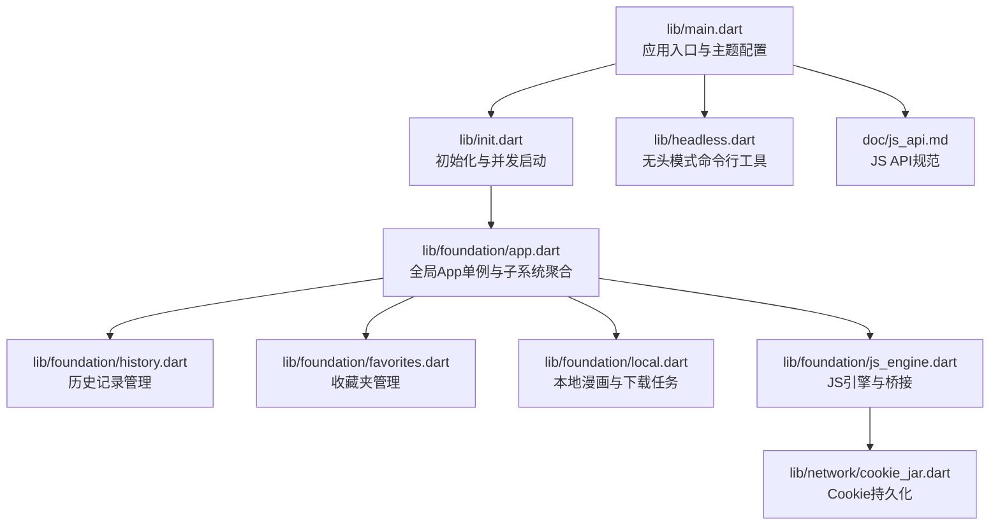
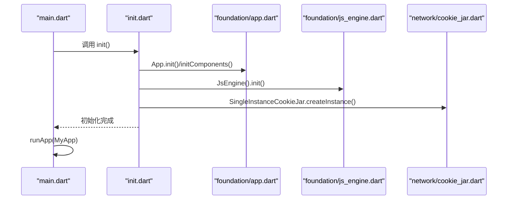
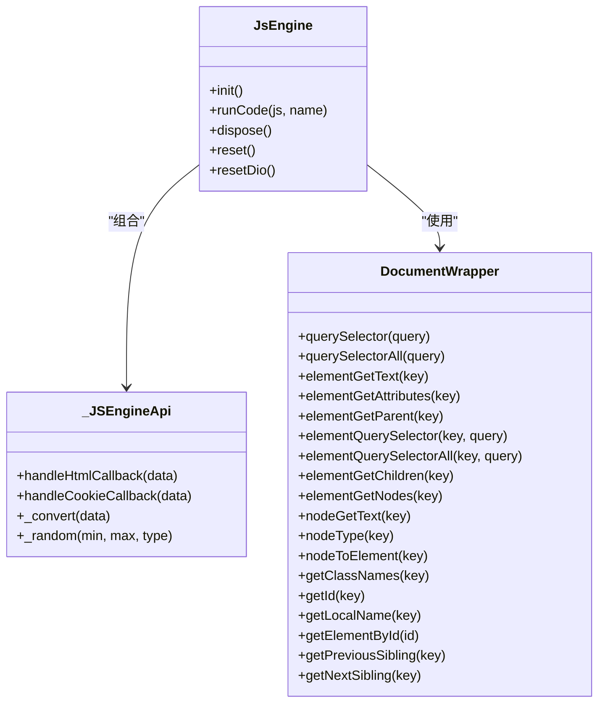
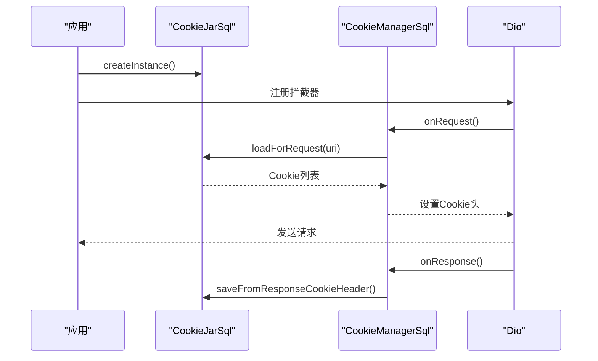
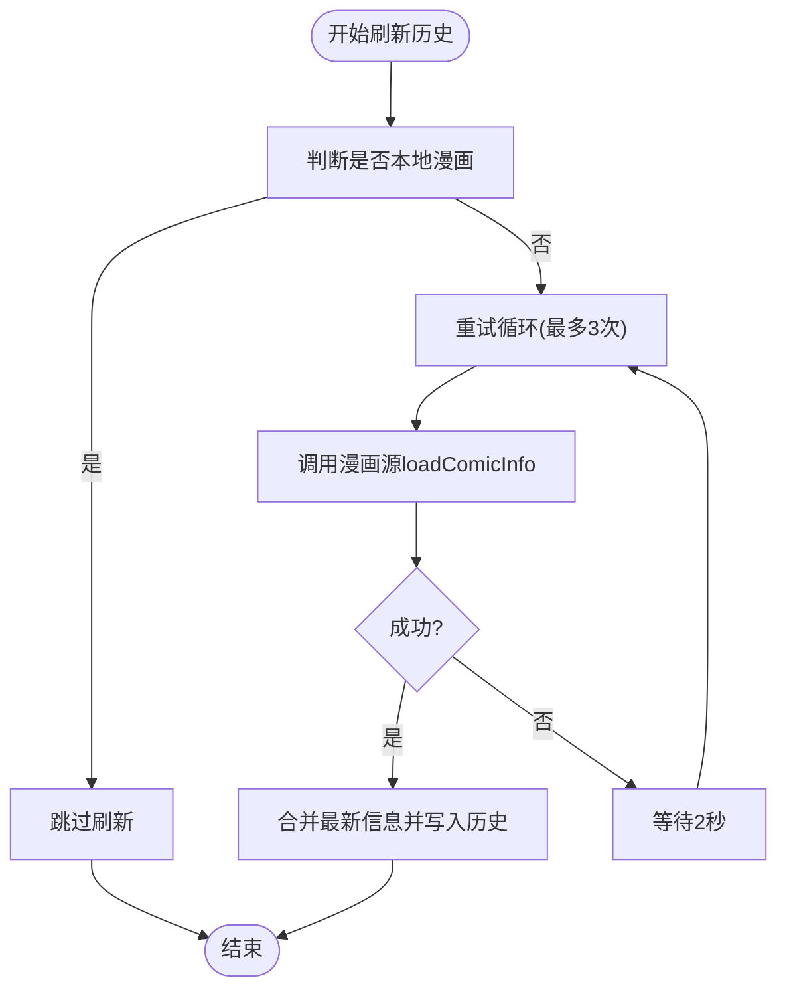
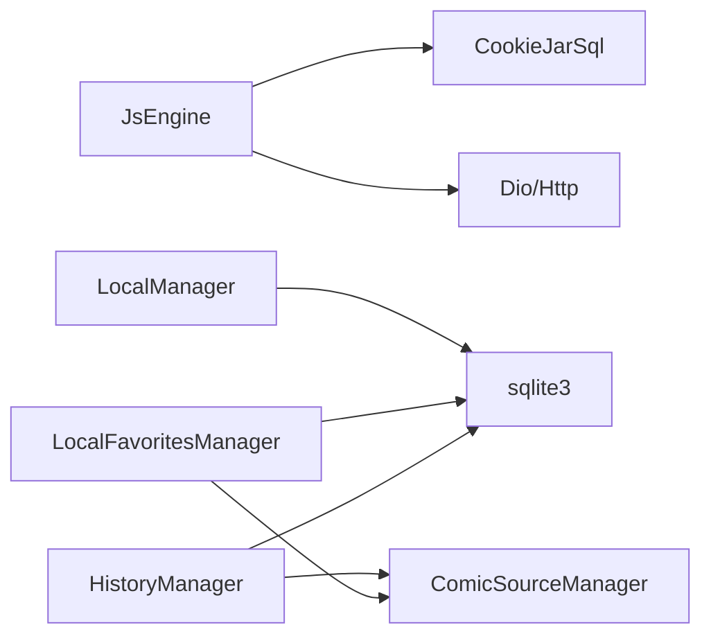

# Dart API参考

<cite>
**本文引用的文件**
- [lib/main.dart](file://lib/main.dart)
- [lib/init.dart](file://lib/init.dart)
- [lib/headless.dart](file://lib/headless.dart)
- [lib/foundation/app.dart](file://lib/foundation/app.dart)
- [lib/foundation/history.dart](file://lib/foundation/history.dart)
- [lib/foundation/favorites.dart](file://lib/foundation/favorites.dart)
- [lib/foundation/local.dart](file://lib/foundation/local.dart)
- [lib/foundation/js_engine.dart](file://lib/foundation/js_engine.dart)
- [lib/foundation/comic_type.dart](file://lib/foundation/comic_type.dart)
- [lib/foundation/comic_source/comic_source.dart](file://lib/foundation/comic_source/comic_source.dart)
- [lib/network/cookie_jar.dart](file://lib/network/cookie_jar.dart)
- [doc/js_api.md](file://doc/js_api.md)
- [pubspec.yaml](file://pubspec.yaml)
</cite>

## 目录
1. [简介](#简介)
2. [项目结构](#项目结构)
3. [核心组件](#核心组件)
4. [架构总览](#架构总览)
5. [详细组件分析](#详细组件分析)
6. [依赖关系分析](#依赖关系分析)
7. [性能考量](#性能考量)
8. [故障排查指南](#故障排查指南)
9. [结论](#结论)
10. [附录](#附录)

## 简介
本参考文档面向Flutter/Dart开发者，系统梳理应用中与“JavaScript引擎API”“网络请求API”“历史记录管理API”“收藏夹管理API”“本地存储API”“UI组件API”相关的类、接口与方法。文档覆盖：
- 类定义、构造函数、方法签名、参数说明、返回值类型与使用示例（以路径引用代替具体代码）
- 异步操作处理、错误处理机制与性能优化建议
- 常见使用模式与最佳实践

## 项目结构
应用采用按功能域分层的组织方式：入口与启动流程位于顶层；核心业务能力分布在foundation、network、pages等目录；文档与资源在doc与assets中。

图表来源
- [lib/main.dart](file://lib/main.dart#L20-L58)
- [lib/init.dart](file://lib/init.dart#L37-L77)
- [lib/foundation/app.dart](file://lib/foundation/app.dart#L15-L112)
- [lib/foundation/history.dart](file://lib/foundation/history.dart#L181-L596)
- [lib/foundation/favorites.dart](file://lib/foundation/favorites.dart#L205-L800)
- [lib/foundation/local.dart](file://lib/foundation/local.dart#L176-L710)
- [lib/foundation/js_engine.dart](file://lib/foundation/js_engine.dart#L48-L284)
- [lib/network/cookie_jar.dart](file://lib/network/cookie_jar.dart#L9-L244)
- [lib/headless.dart](file://lib/headless.dart#L17-L244)
- [doc/js_api.md](file://doc/js_api.md#L1-L513)

章节来源
- [lib/main.dart](file://lib/main.dart#L20-L58)
- [lib/init.dart](file://lib/init.dart#L37-L77)

## 核心组件
- 全局应用单例：封装平台信息、数据/缓存路径、导航键、子系统初始化与重建触发
- 历史记录管理器：基于SQLite的异步写入、批量删除、缓存与监听通知
- 收藏夹管理器：多文件夹结构、事务批量操作、标签翻译与更新检查
- 本地漫画管理器：下载任务队列、章节扫描、文件系统交互与目录清理
- JS引擎：QuickJS桥接、消息通道、HTML解析、加密转换、随机数、UI桥接
- Cookie持久化：SQLite存储、域名/路径匹配、请求拦截器集成

章节来源
- [lib/foundation/app.dart](file://lib/foundation/app.dart#L15-L112)
- [lib/foundation/history.dart](file://lib/foundation/history.dart#L181-L596)
- [lib/foundation/favorites.dart](file://lib/foundation/favorites.dart#L205-L800)
- [lib/foundation/local.dart](file://lib/foundation/local.dart#L176-L710)
- [lib/foundation/js_engine.dart](file://lib/foundation/js_engine.dart#L48-L284)
- [lib/network/cookie_jar.dart](file://lib/network/cookie_jar.dart#L9-L244)

## 架构总览
应用通过初始化流程并发启动多个子系统，随后进入主界面。JS引擎作为脚本执行与桥接中枢，连接网络、UI与本地资源；历史、收藏与本地漫画通过SQLite持久化，配合异步隔离与事务保证一致性。

图表来源
- [lib/main.dart](file://lib/main.dart#L20-L58)
- [lib/init.dart](file://lib/init.dart#L37-L77)
- [lib/foundation/app.dart](file://lib/foundation/app.dart#L82-L98)
- [lib/foundation/js_engine.dart](file://lib/foundation/js_engine.dart#L80-L110)
- [lib/network/cookie_jar.dart](file://lib/network/cookie_jar.dart#L197-L213)

## 详细组件分析

### JavaScript引擎API（JsEngine）
- 角色与职责
  - 提供JS运行时与桥接通道，接收来自JS的消息并调用Dart侧实现
  - 内置Convert、Network、Html、UI等API族，支持加密解密、HTTP请求、DOM解析、随机数、UUID生成等
- 关键类与方法
  - JsEngine
    - 构造：单例工厂
    - 方法：init()、runCode()、dispose()、reset()、resetDio()
    - 消息路由：handleMessage -> _messageReceiver -> 分派至各功能分支
  - _JSEngineApi（mixin）
    - HTML解析：parse/querySelector/querySelectorAll/属性访问/父子节点/文本/类型转换
    - Cookie：set/get/delete
    - 加密转换：UTF8/GBK/Base64/HMAC/AES(RSA仅解密)
    - 随机数：整型/浮点
  - DocumentWrapper：对DOM树元素/节点进行索引与查询
  - JSAutoFreeFunction：JS函数自动释放包装
- 异步与错误
  - runCode为同步求值；HTTP请求通过Dio异步返回；异常统一记录日志
  - JS异常封装为JavaScriptRuntimeException
- 使用示例（路径）
  - 初始化与重置：[lib/foundation/js_engine.dart](file://lib/foundation/js_engine.dart#L48-L110)
  - 消息路由与UI桥接：[lib/foundation/js_engine.dart](file://lib/foundation/js_engine.dart#L112-L212)
  - HTML解析与查询：[lib/foundation/js_engine.dart](file://lib/foundation/js_engine.dart#L291-L358)
  - 加密转换示例：[lib/foundation/js_engine.dart](file://lib/foundation/js_engine.dart#L402-L525)
  - Cookie管理：[lib/foundation/js_engine.dart](file://lib/foundation/js_engine.dart#L360-L400)
- 性能与最佳实践
  - 大量文档解析时注意上限控制与及时dispose
  - 使用JSPool执行复杂计算，避免阻塞主线程
  - 合理设置User-Agent与代理，必要时切换dart:io客户端

图表来源
- [lib/foundation/js_engine.dart](file://lib/foundation/js_engine.dart#L48-L284)
- [lib/foundation/js_engine.dart](file://lib/foundation/js_engine.dart#L577-L718)

章节来源
- [lib/foundation/js_engine.dart](file://lib/foundation/js_engine.dart#L48-L284)
- [doc/js_api.md](file://doc/js_api.md#L16-L513)

### 网络请求API（Cookie持久化与拦截）
- 角色与职责
  - CookieJarSql：SQLite存储Cookie，按域名/路径匹配加载与保存
  - SingleInstanceCookieJar：全局单例，随应用初始化创建
  - CookieManagerSql：Dio拦截器，自动注入请求头与响应头
- 关键类与方法
  - CookieJarSql
    - 构造：传入数据库路径
    - 方法：saveFromResponse()/loadForRequest()/delete()/deleteUri()/deleteAll()
  - SingleInstanceCookieJar
    - 工厂：createInstance()创建并缓存实例
  - CookieManagerSql
    - onRequest/onResponse：读取/写入Cookie
- 使用示例（路径）
  - 创建单例并注入Dio：[lib/network/cookie_jar.dart](file://lib/network/cookie_jar.dart#L197-L213)
  - 请求拦截器注册：[lib/foundation/js_engine.dart](file://lib/foundation/js_engine.dart#L237-L240)

图表来源
- [lib/network/cookie_jar.dart](file://lib/network/cookie_jar.dart#L197-L244)
- [lib/foundation/js_engine.dart](file://lib/foundation/js_engine.dart#L237-L240)

章节来源
- [lib/network/cookie_jar.dart](file://lib/network/cookie_jar.dart#L9-L244)
- [lib/foundation/js_engine.dart](file://lib/foundation/js_engine.dart#L214-L272)

### 历史记录管理API（HistoryManager）
- 角色与职责
  - 基于SQLite的历史表，支持添加、查询、批量删除、缓存与监听通知
  - 提供刷新历史信息（从漫画源拉取最新封面/标题）与流式进度更新
- 关键类与方法
  - History：历史项模型（类型、时间、标题、副标题、封面、章节/页码、已读章节集合、最大页）
  - HistoryManager
    - 构造：单例工厂
    - 方法：init()/addHistory()/addHistoryAsync()/find()/getAll()/getRecent()/count()/clearHistory()/remove()/batchDeleteHistories()
    - 刷新：refreshHistoryInfo()/refreshAllHistoriesStream()
- 异步与错误
  - addHistoryAsync通过Isolate写库，避免阻塞UI
  - 刷新失败重试最多3次，延迟2秒
- 使用示例（路径）
  - 添加历史（异步）：[lib/foundation/history.dart](file://lib/foundation/history.dart#L260-L278)
  - 查询与缓存：[lib/foundation/history.dart](file://lib/foundation/history.dart#L364-L383)
  - 刷新单个/全部历史：[lib/foundation/history.dart](file://lib/foundation/history.dart#L438-L578)

图表来源
- [lib/foundation/history.dart](file://lib/foundation/history.dart#L438-L495)

章节来源
- [lib/foundation/history.dart](file://lib/foundation/history.dart#L181-L596)

### 收藏夹管理API（LocalFavoritesManager）
- 角色与职责
  - 多文件夹结构，每张表代表一个收藏夹；支持增删改查、排序、批量移动/复制、标签翻译
  - 与关注更新联动，维护更新时间与状态
- 关键类与方法
  - FavoriteItem：收藏项模型（名称、作者、类型、标签、ID、封面路径、收藏时间）
  - LocalFavoritesManager
    - 构造：单例工厂
    - 文件夹：createFolder()/deleteFolder()/updateOrder()
    - 收藏：addComic()/moveFavorite()/batchMoveFavorites()/batchCopyFavorites()
    - 查询：find()/findWithModel()/getFolderComics()/getAllComics()
    - 计数与去重：initCounts()/reduceHashedId()/refreshHashedIds()
- 异步与错误
  - 批量操作使用事务，失败回滚
  - 标签翻译在数据库列中持久化
- 使用示例（路径）
  - 新建文件夹与添加漫画：[lib/foundation/favorites.dart](file://lib/foundation/favorites.dart#L499-L661)
  - 批量移动/复制：[lib/foundation/favorites.dart](file://lib/foundation/favorites.dart#L696-L775)
  - 查询与计数：[lib/foundation/favorites.dart](file://lib/foundation/favorites.dart#L326-L471)

章节来源
- [lib/foundation/favorites.dart](file://lib/foundation/favorites.dart#L205-L800)

### 本地存储API（LocalManager）
- 角色与职责
  - 管理本地漫画目录、章节、下载任务；提供搜索、图片枚举、下载任务恢复与删除
- 关键类与方法
  - LocalComic：本地漫画模型（目录名、章节、封面、类型、已下载章节、创建时间）
  - LocalManager
    - 构造：单例工厂
    - 存储：init()/setNewPath()/findDefaultPath()
    - 数据：add()/remove()/find()/findByName()/search()/getComics()/getRecent()/count()
    - 图片：getImages()
    - 下载：addTask()/removeTask()/moveToFirst()/completeTask()/restoreDownloadingTasks()
    - 删除：deleteComic()/deleteComicChapters()/batchDeleteComics()
- 异步与错误
  - 目录删除在隔离中执行，避免阻塞UI
  - 下载任务持久化到JSON，启动时恢复
- 使用示例（路径）
  - 添加本地漫画与恢复任务：[lib/foundation/local.dart](file://lib/foundation/local.dart#L316-L559)
  - 批量删除与关联清理：[lib/foundation/local.dart](file://lib/foundation/local.dart#L618-L658)

章节来源
- [lib/foundation/local.dart](file://lib/foundation/local.dart#L176-L710)

### UI组件API（MyApp与页面）
- 角色与职责
  - MyApp负责主题、语言、窗口管理、生命周期鉴权遮罩与错误兜底
  - 主页面与认证页面由App.rootContext导航
- 关键类与方法
  - MyApp：initState()/didChangeAppLifecycleState()/build()
  - 主题与颜色：translateColorSetting()/getTheme()
  - 错误处理：ErrorWidget.builder
- 使用示例（路径）
  - 应用启动与窗口初始化：[lib/main.dart](file://lib/main.dart#L20-L58)
  - 生命周期鉴权遮罩与导航：[lib/main.dart](file://lib/main.dart#L82-L118)
  - 主题与国际化：[lib/main.dart](file://lib/main.dart#L144-L235)

章节来源
- [lib/main.dart](file://lib/main.dart#L60-L291)

### 无头模式API（headless.dart）
- 角色与职责
  - 命令行模式执行WebDAV上传/下载、漫画源脚本更新、订阅漫画更新检查
- 关键方法
  - runHeadlessMode(args)：解析命令并执行
  - WebDAV：uploadData()/downloadData()
  - 更新脚本：checkComicSourceUpdate()/update()
  - 订阅更新：updateFolder()/getUpdatedComicsAsJson()
- 使用示例（路径）
  - 命令解析与执行：[lib/headless.dart](file://lib/headless.dart#L17-L244)

章节来源
- [lib/headless.dart](file://lib/headless.dart#L17-L244)

## 依赖关系分析
- 组件耦合
  - JsEngine依赖Cookie持久化与Dio；与ComicSource/ComicType协作
  - History/Favorites/Local均依赖SQLite与ChangeNotifier
- 外部依赖
  - QuickJS（flutter_qjs）、SQLite3、Dio、PointyCastle、HTML解析等
- 循环依赖
  - 未发现直接循环；模块间通过服务单例与消息通道解耦

图表来源
- [lib/foundation/js_engine.dart](file://lib/foundation/js_engine.dart#L80-L110)
- [lib/network/cookie_jar.dart](file://lib/network/cookie_jar.dart#L9-L32)
- [lib/foundation/history.dart](file://lib/foundation/history.dart#L189-L231)
- [lib/foundation/favorites.dart](file://lib/foundation/favorites.dart#L213-L276)
- [lib/foundation/local.dart](file://lib/foundation/local.dart#L185-L299)
- [lib/foundation/comic_source/comic_source.dart](file://lib/foundation/comic_source/comic_source.dart)

章节来源
- [pubspec.yaml](file://pubspec.yaml#L11-L91)

## 性能考量
- 异步与隔离
  - 历史写入与收藏/本地删除使用Isolate或事务，避免阻塞UI
  - JS计算通过JSPool执行，减少主线程压力
- 缓存策略
  - 历史管理器维护ID缓存与最近修改缓存，降低重复查询成本
  - 收藏夹维护哈希ID集，快速判断存在性
- I/O与存储
  - 下载任务持久化与恢复，目录删除在隔离中执行
  - SQLite按需迁移字段，避免全量重建
- 网络
  - Cookie统一管理，减少重复请求；可选dart:io客户端与代理
- 建议
  - 大量DOM解析后及时dispose
  - 批量操作使用事务，失败回滚
  - 控制同时刷新历史的任务数量，避免过度请求

[本节为通用指导，无需列出具体文件来源]

## 故障排查指南
- JS引擎初始化失败
  - 检查初始化日志与资源加载路径
  - 参考：[lib/foundation/js_engine.dart](file://lib/foundation/js_engine.dart#L80-L110)
- Cookie不生效或丢失
  - 核对域名/路径匹配规则与过期时间清理逻辑
  - 参考：[lib/network/cookie_jar.dart](file://lib/network/cookie_jar.dart#L89-L132)
- 历史刷新失败
  - 查看重试次数与延迟；确认漫画源接口可用
  - 参考：[lib/foundation/history.dart](file://lib/foundation/history.dart#L449-L495)
- 收藏夹批量操作异常
  - 确认事务是否回滚；检查目标文件夹是否存在
  - 参考：[lib/foundation/favorites.dart](file://lib/foundation/favorites.dart#L705-L730)
- 本地漫画删除后残留
  - 确认是否调用批量删除并清理历史/收藏
  - 参考：[lib/foundation/local.dart](file://lib/foundation/local.dart#L618-L658)

章节来源
- [lib/foundation/js_engine.dart](file://lib/foundation/js_engine.dart#L80-L110)
- [lib/network/cookie_jar.dart](file://lib/network/cookie_jar.dart#L89-L132)
- [lib/foundation/history.dart](file://lib/foundation/history.dart#L449-L495)
- [lib/foundation/favorites.dart](file://lib/foundation/favorites.dart#L705-L730)
- [lib/foundation/local.dart](file://lib/foundation/local.dart#L618-L658)

## 结论
本项目通过清晰的模块划分与桥接设计，将JS脚本能力、网络与本地存储有机整合。历史、收藏与本地漫画管理均采用SQLite与异步隔离，兼顾性能与可靠性。推荐在扩展新功能时遵循现有模式：优先使用Isolate/事务，统一错误日志，保持API边界清晰。

[本节为总结，无需列出具体文件来源]

## 附录
- JS API规范（Convert/Network/Html/UI/Utils/Types）
  - 参考：[doc/js_api.md](file://doc/js_api.md#L1-L513)
- 平台与依赖
  - 参考：[pubspec.yaml](file://pubspec.yaml#L11-L91)