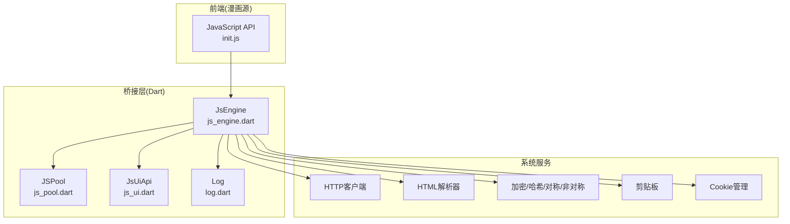
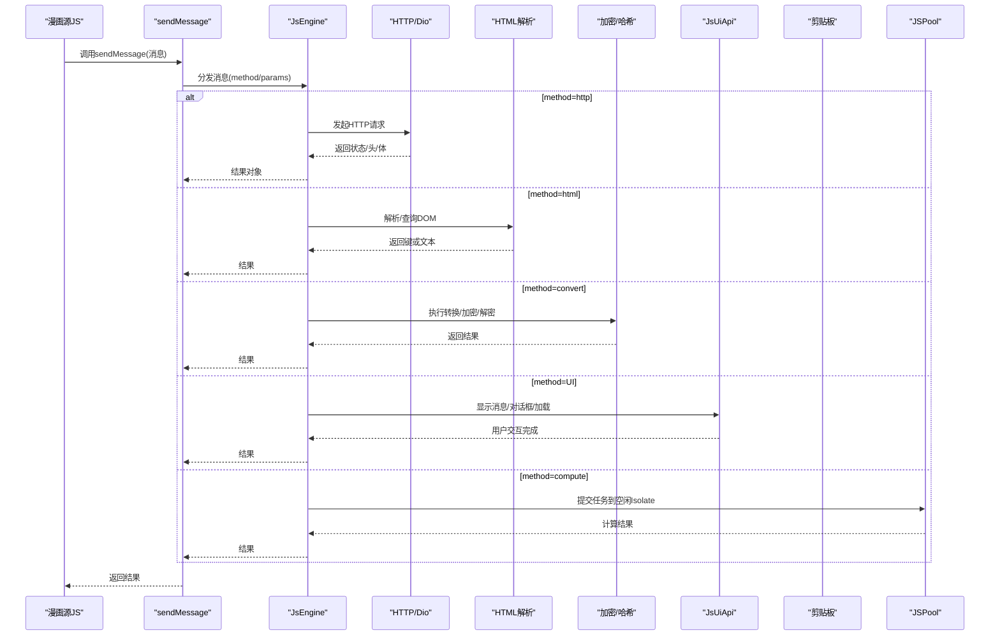
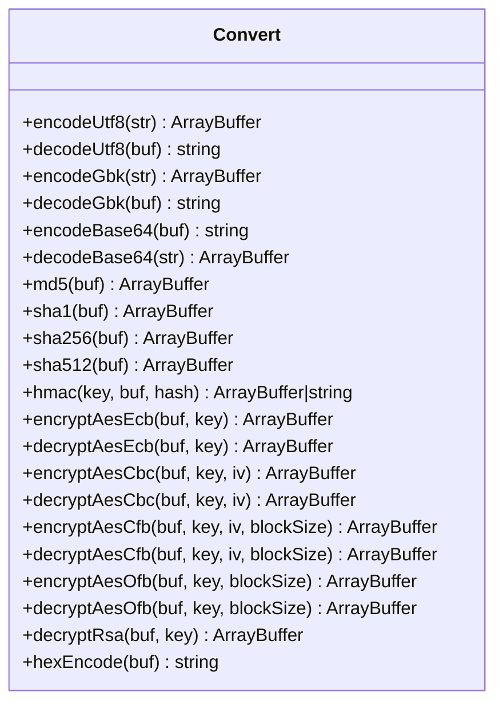
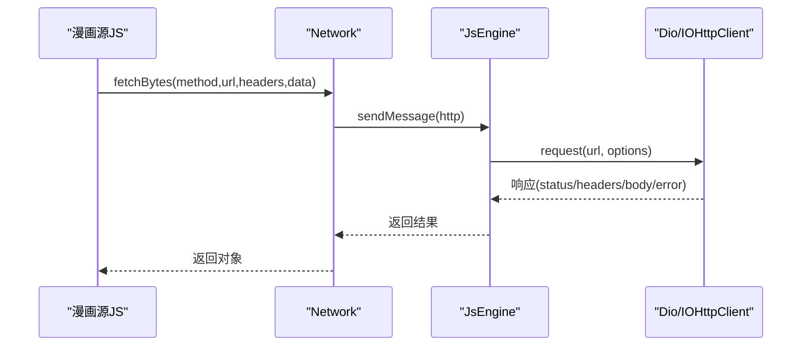
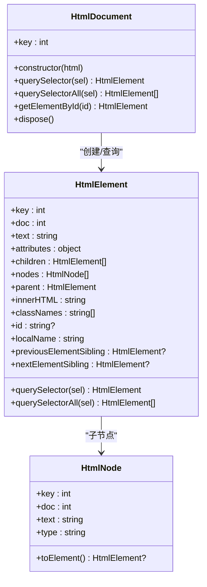
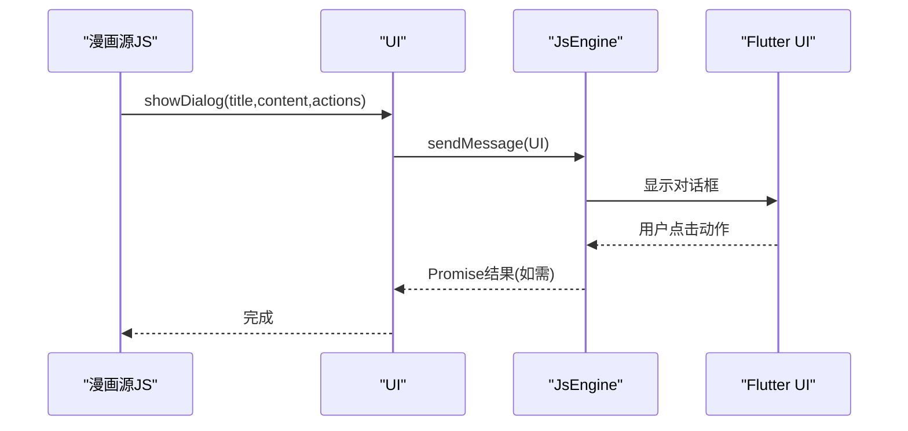
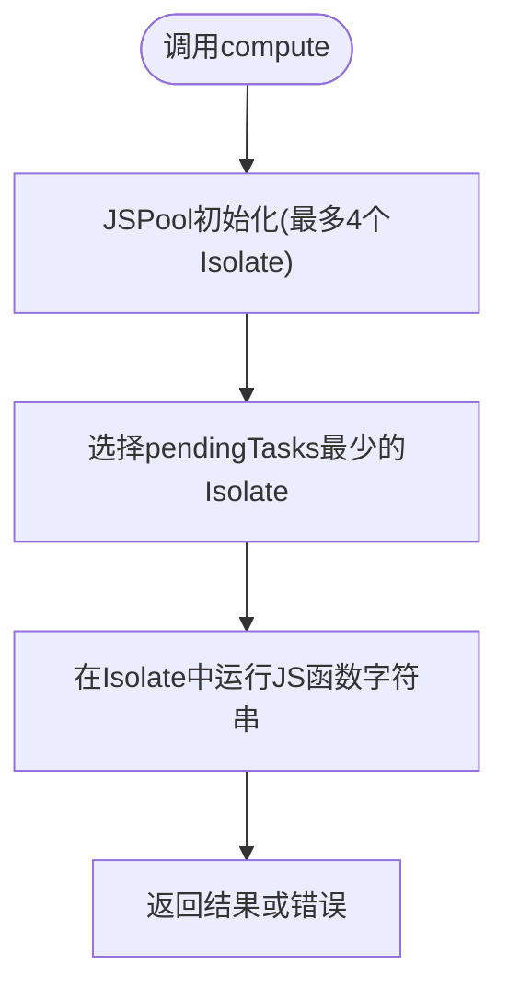
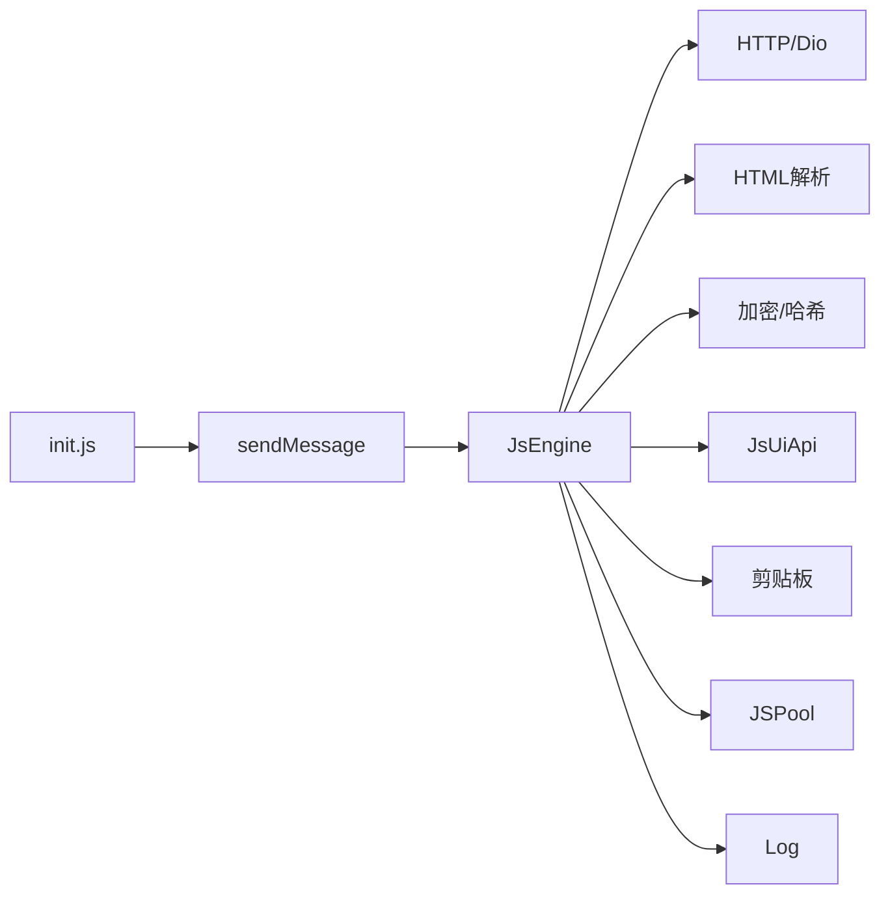

# JavaScript API参考

<cite>
**本文引用的文件**
- [js_api.md](file://doc/js_api.md)
- [init.js](file://assets/init.js)
- [js_engine.dart](file://lib/foundation/js_engine.dart)
- [js_pool.dart](file://lib/foundation/js_pool.dart)
- [js_ui.dart](file://lib/components/js_ui.dart)
- [log.dart](file://lib/foundation/log.dart)
- [comic_source.md](file://doc/comic_source.md)
</cite>

## 目录
1. [简介](#简介)
2. [项目结构](#项目结构)
3. [核心组件](#核心组件)
4. [架构总览](#架构总览)
5. [详细组件分析](#详细组件分析)
6. [依赖关系分析](#依赖关系分析)
7. [性能与并发特性](#性能与并发特性)
8. [常见问题与故障排查](#常见问题与故障排查)
9. [结论](#结论)
10. [附录：完整API清单与示例路径](#附录完整api清单与示例路径)

## 简介
本参考文档面向漫画源开发者，系统性梳理Venera应用中的JavaScript沙盒API，涵盖加密解密、网络请求、HTML解析、UI交互、工具函数以及数据类型定义。文档按功能分组呈现，为每个API提供签名、参数、返回值、使用要点与注意事项，并结合实际源码映射，帮助开发者快速上手与安全使用。

## 项目结构
- 文档与初始化脚本位于doc与assets目录，定义了API规范与沙盒初始化逻辑。
- Dart后端通过JsEngine桥接JavaScript与原生能力，负责HTTP、HTML解析、转换、UI、剪贴板等调用。
- JSPool提供多Isolate计算池，用于执行外部JS代码，避免阻塞主线程。
- 日志系统统一记录JS侧日志，便于调试与审计。

图表来源
- [init.js](file://assets/init.js#L1-L1520)
- [js_engine.dart](file://lib/foundation/js_engine.dart#L1-L284)
- [js_pool.dart](file://lib/foundation/js_pool.dart#L1-L164)
- [js_ui.dart](file://lib/components/js_ui.dart#L1-L184)
- [log.dart](file://lib/foundation/log.dart#L1-L116)

章节来源
- [js_api.md](file://doc/js_api.md#L1-L513)
- [init.js](file://assets/init.js#L1-L1520)
- [js_engine.dart](file://lib/foundation/js_engine.dart#L1-L284)

## 核心组件
- Convert 加密解密与编码转换
- Network 网络请求与Cookie管理
- Html DOM解析与查询
- UI 交互与对话框
- Utils 工具函数与日志
- 类型定义 数据模型与配置

章节来源
- [js_api.md](file://doc/js_api.md#L16-L272)
- [init.js](file://assets/init.js#L27-L361)
- [js_engine.dart](file://lib/foundation/js_engine.dart#L402-L525)

## 架构总览
JavaScript沙盒通过sendMessage与Dart层通信，Dart层根据method路由到对应处理分支（HTTP、HTML、转换、UI、剪贴板、计算池等）。网络请求默认使用Dio，支持可选的dart:io客户端；HTML解析基于html包；加密解密基于pointycastle；UI交互通过JsUiApi桥接到Flutter UI；日志统一写入Log并持久化。

图表来源
- [js_engine.dart](file://lib/foundation/js_engine.dart#L112-L212)
- [js_engine.dart](file://lib/foundation/js_engine.dart#L214-L272)
- [js_engine.dart](file://lib/foundation/js_engine.dart#L286-L358)
- [js_engine.dart](file://lib/foundation/js_engine.dart#L402-L525)
- [js_pool.dart](file://lib/foundation/js_pool.dart#L30-L39)

## 详细组件分析

### Convert 加密解密与编码转换
- 字符串与字节数组互转（UTF-8、GBK）
- Base64编解码
- 哈希算法（MD5、SHA1、SHA256、SHA512）
- HMAC（支持多种哈希）
- 对称加密（AES-ECB/CBC/CFB/OFB）
- 非对称解密（RSA，私钥解析）
- 十六进制编码

图表来源
- [init.js](file://assets/init.js#L27-L361)
- [js_engine.dart](file://lib/foundation/js_engine.dart#L402-L525)

章节来源
- [js_api.md](file://doc/js_api.md#L16-L82)
- [init.js](file://assets/init.js#L27-L361)
- [js_engine.dart](file://lib/foundation/js_engine.dart#L402-L525)

### Network 网络请求与Cookie管理
- fetchBytes/sendRequest/get/post/put/patch/delete
- setCookies/getCookies/deleteCookies
- fetch浏览器风格封装（返回ok/status/statusText/headers/arrayBuffer/text/json）

图表来源
- [init.js](file://assets/init.js#L461-L642)
- [js_engine.dart](file://lib/foundation/js_engine.dart#L214-L272)

章节来源
- [js_api.md](file://doc/js_api.md#L84-L131)
- [init.js](file://assets/init.js#L461-L642)
- [js_engine.dart](file://lib/foundation/js_engine.dart#L214-L272)

### Html DOM解析与查询
- HtmlDocument构造与查询（querySelector/querySelectorAll/getElementById/dispose）
- HtmlElement属性与导航（text/attributes/children/nodes/parent/innerHtml/classNames/id/localName/previousElementSibling/nextElementSibling）
- HtmlNode节点类型与文本（type/toElement/text）

图表来源
- [init.js](file://assets/init.js#L647-L980)
- [js_engine.dart](file://lib/foundation/js_engine.dart#L286-L358)

章节来源
- [js_api.md](file://doc/js_api.md#L132-L223)
- [init.js](file://assets/init.js#L647-L980)
- [js_engine.dart](file://lib/foundation/js_engine.dart#L286-L358)

### UI 交互与对话框
- showMessage/showDialog/launchUrl/showLoading/cancelLoading/showInputDialog/showSelectDialog
- 支持回调返回Promise时按钮显示加载态
- 输入对话框支持图片展示（URL或ArrayBuffer）

图表来源
- [init.js](file://assets/init.js#L1342-L1445)
- [js_ui.dart](file://lib/components/js_ui.dart#L14-L184)

章节来源
- [js_api.md](file://doc/js_api.md#L224-L253)
- [init.js](file://assets/init.js#L1342-L1445)
- [js_ui.dart](file://lib/components/js_ui.dart#L14-L184)

### Utils 工具函数与日志
- createUuid/randomInt/randomDouble
- console.log/warn/error
- setClipboard/getClipboard
- compute(在独立Isolate中执行JS函数字符串)

图表来源
- [js_pool.dart](file://lib/foundation/js_pool.dart#L8-L40)
- [js_pool.dart](file://lib/foundation/js_pool.dart#L121-L134)

章节来源
- [js_api.md](file://doc/js_api.md#L254-L271)
- [init.js](file://assets/init.js#L372-L406)
- [init.js](file://assets/init.js#L982-L1001)
- [init.js](file://assets/init.js#L1488-L1505)
- [init.js](file://assets/init.js#L1514-L1520)
- [js_pool.dart](file://lib/foundation/js_pool.dart#L8-L40)

### 类型定义
- Cookie: name/value/domain
- Comic: id/title/subtitle/subTitle/cover/tags/description/maxPage/language/favoriteId/stars
- ComicDetails: title/subtitle/subTitle/cover/description/tags/chapters/isFavorite/subId/thumbnails/recommend/commentCount/likesCount/isLiked/uploader/updateTime/uploadTime/url/stars/maxPage/comments
- Comment: userName/avatar/content/time/replyCount/id/isLiked/score/voteStatus
- ImageLoadingConfig: url/method/data/headers/onResponse/modifyImage/onLoadFailed
- ComicSource: name/key/version/minAppVersion/url.loadData/loadSetting/saveData/deleteData/isLogged/init.translation.translate
- Image: 图像操作（copyRange/copyAndRotate90/fillImageAt/fillImageRangeAt/width/height/empty）

章节来源
- [js_api.md](file://doc/js_api.md#L272-L513)
- [init.js](file://assets/init.js#L444-L455)
- [init.js](file://assets/init.js#L1018-L1030)
- [init.js](file://assets/init.js#L1057-L1078)
- [init.js](file://assets/init.js#L1093-L1103)
- [init.js](file://assets/init.js#L1122-L1130)
- [init.js](file://assets/init.js#L1132-L1222)
- [init.js](file://assets/init.js#L1226-L1336)

## 依赖关系分析
- JavaScript API通过sendMessage与Dart层耦合，method字段决定路由。
- JsEngine集中处理HTTP、HTML、转换、UI、剪贴板、计算池等。
- JSPool提供多实例隔离执行，避免单点阻塞。
- 日志系统统一输出，支持文件落盘与长度/数量限制。

图表来源
- [init.js](file://assets/init.js#L8-L24)
- [js_engine.dart](file://lib/foundation/js_engine.dart#L112-L212)
- [js_pool.dart](file://lib/foundation/js_pool.dart#L8-L40)
- [log.dart](file://lib/foundation/log.dart#L20-L116)

章节来源
- [js_engine.dart](file://lib/foundation/js_engine.dart#L112-L212)
- [js_pool.dart](file://lib/foundation/js_pool.dart#L8-L40)
- [log.dart](file://lib/foundation/log.dart#L20-L116)

## 性能与并发特性
- 多Isolate计算池：默认4个实例，自动选择待处理任务最少的实例，提升吞吐。
- HTML文档上限保护：超过阈值会清理最旧文档，防止内存膨胀。
- 网络请求：默认使用Dio，支持切换dart:io客户端与代理；响应体自动适配Uint8List。
- UI交互：对话框与加载框通过异步Promise处理用户输入，避免阻塞。

章节来源
- [js_pool.dart](file://lib/foundation/js_pool.dart#L8-L40)
- [js_engine.dart](file://lib/foundation/js_engine.dart#L294-L302)
- [js_engine.dart](file://lib/foundation/js_engine.dart#L225-L240)

## 常见问题与故障排查
- 网络请求失败：检查headers是否包含User-Agent；必要时使用extra传递拦截器参数；若需要dart:io客户端，设置headers.http_client=dart:io。
- HTML解析异常：确保传入合法HTML字符串；注意dispose及时释放资源。
- 加密/解密错误：确认key/iv格式正确；HMAC hash名称需与支持列表一致。
- UI无响应：确保回调返回Promise时按钮会显示加载态；输入对话框validator返回非空字符串会显示错误提示。
- 日志查看：使用console.log/warn/error或UI日志面板；日志文件会在特定目录生成。

章节来源
- [js_engine.dart](file://lib/foundation/js_engine.dart#L214-L272)
- [js_engine.dart](file://lib/foundation/js_engine.dart#L294-L302)
- [js_engine.dart](file://lib/foundation/js_engine.dart#L428-L441)
- [js_ui.dart](file://lib/components/js_ui.dart#L130-L164)
- [log.dart](file://lib/foundation/log.dart#L41-L88)

## 结论
Venera的JavaScript沙盒以JsEngine为核心，通过sendMessage桥接Dart层能力，提供从加密解密、网络请求、DOM解析到UI交互的完整API族。配合JSPool的多Isolate执行与严格的日志/资源管理，既保证了安全性与稳定性，也为漫画源开发提供了强大而灵活的工具集。

## 附录：完整API清单与示例路径
以下为各API的签名、参数、返回值与注意事项概览，具体实现请参阅相应源码路径。

- Convert
  - Convert.encodeUtf8(str): ArrayBuffer
  - Convert.decodeUtf8(buf): string
  - Convert.encodeGbk(str): ArrayBuffer
  - Convert.decodeGbk(buf): string
  - Convert.encodeBase64(buf): string
  - Convert.decodeBase64(str): ArrayBuffer
  - Convert.md5(buf): ArrayBuffer
  - Convert.sha1(buf): ArrayBuffer
  - Convert.sha256(buf): ArrayBuffer
  - Convert.sha512(buf): ArrayBuffer
  - Convert.hmac(key, buf, hash): ArrayBuffer|string
  - Convert.encryptAesEcb(buf, key): ArrayBuffer
  - Convert.decryptAesEcb(buf, key): ArrayBuffer
  - Convert.encryptAesCbc(buf, key, iv): ArrayBuffer
  - Convert.decryptAesCbc(buf, key, iv): ArrayBuffer
  - Convert.encryptAesCfb(buf, key, iv, blockSize): ArrayBuffer
  - Convert.decryptAesCfb(buf, key, iv, blockSize): ArrayBuffer
  - Convert.encryptAesOfb(buf, key, blockSize): ArrayBuffer
  - Convert.decryptAesOfb(buf, key, blockSize): ArrayBuffer
  - Convert.decryptRsa(buf, key): ArrayBuffer
  - Convert.hexEncode(buf): string

  章节来源
  - [js_api.md](file://doc/js_api.md#L16-L82)
  - [init.js](file://assets/init.js#L27-L361)
  - [js_engine.dart](file://lib/foundation/js_engine.dart#L402-L525)

- Network
  - Network.fetchBytes(method, url, headers, data): Promise<{status, headers, body}>
  - Network.sendRequest(method, url, headers, data): Promise<{status, headers, body}>
  - Network.get(url, headers): Promise<{status, headers, body}>
  - Network.post(url, headers, data): Promise<{status, headers, body}>
  - Network.put(url, headers, data): Promise<{status, headers, body}>
  - Network.patch(url, headers, data): Promise<{status, headers, body}>
  - Network.delete(url, headers): Promise<{status, headers, body}>
  - Network.setCookies(url, cookies)
  - Network.getCookies(url)
  - Network.deleteCookies(url)
  - fetch(url, options): 浏览器风格封装

  章节来源
  - [js_api.md](file://doc/js_api.md#L84-L131)
  - [init.js](file://assets/init.js#L461-L642)
  - [js_engine.dart](file://lib/foundation/js_engine.dart#L214-L272)

- Html
  - new HtmlDocument(html)
  - HtmlDocument.querySelector(sel): HtmlElement
  - HtmlDocument.querySelectorAll(sel): HtmlElement[]
  - HtmlDocument.getElementById(id): HtmlElement
  - HtmlDocument.dispose()
  - HtmlElement.querySelector(sel): HtmlElement
  - HtmlElement.querySelectorAll(sel): HtmlElement[]
  - HtmlElement.getElementById(id): HtmlElement
  - HtmlElement.text: string
  - HtmlElement.attributes: object
  - HtmlElement.children: HtmlElement[]
  - HtmlElement.nodes: HtmlNode[]
  - HtmlElement.parent: HtmlElement|null
  - HtmlElement.innerHTML: string
  - HtmlElement.classNames: string[]
  - HtmlElement.id: string|null
  - HtmlElement.localName: string
  - HtmlElement.previousElementSibling: HtmlElement|null
  - HtmlElement.nextElementSibling: HtmlElement|null
  - HtmlNode.type: string
  - HtmlNode.toElement(): HtmlElement|null
  - HtmlNode.text: string

  章节来源
  - [js_api.md](file://doc/js_api.md#L132-L223)
  - [init.js](file://assets/init.js#L647-L980)
  - [js_engine.dart](file://lib/foundation/js_engine.dart#L286-L358)

- UI
  - UI.showMessage(message)
  - UI.showDialog(title, content, actions)
  - UI.launchUrl(url)
  - UI.showLoading(onCancel): number
  - UI.cancelLoading(id)
  - UI.showInputDialog(title, validator, image?): Promise<string|null>
  - UI.showSelectDialog(title, options, initialIndex?): Promise<number|null>

  章节来源
  - [js_api.md](file://doc/js_api.md#L224-L253)
  - [init.js](file://assets/init.js#L1342-L1445)
  - [js_ui.dart](file://lib/components/js_ui.dart#L14-L184)

- Utils
  - createUuid(): string
  - randomInt(min, max): number
  - randomDouble(min, max): number
  - console.log/warn/error
  - setClipboard(text): Promise<void>
  - getClipboard(): Promise<string>
  - compute(jsFunction, ...args): Promise<any>

  章节来源
  - [js_api.md](file://doc/js_api.md#L254-L271)
  - [init.js](file://assets/init.js#L372-L406)
  - [init.js](file://assets/init.js#L982-L1001)
  - [init.js](file://assets/init.js#L1488-L1505)
  - [init.js](file://assets/init.js#L1514-L1520)
  - [js_pool.dart](file://lib/foundation/js_pool.dart#L8-L40)

- 类型定义
  - Cookie(name, value, domain)
  - Comic(id, title, subtitle, subTitle, cover, tags, description, maxPage, language, favoriteId, stars)
  - ComicDetails(title, subtitle, subTitle, cover, description, tags, chapters, isFavorite, subId, thumbnails, recommend, commentCount, likesCount, isLiked, uploader, updateTime, uploadTime, url, stars, maxPage, comments)
  - Comment(userName, avatar, content, time, replyCount, id, isLiked, score, voteStatus)
  - ImageLoadingConfig(url, method, data, headers, onResponse, modifyImage, onLoadFailed)
  - ComicSource(name, key, version, minAppVersion, url, loadData, loadSetting, saveData, deleteData, isLogged, init, translation, translate)
  - Image(copyRange, copyAndRotate90, fillImageAt, fillImageRangeAt, width, height, empty)

  章节来源
  - [js_api.md](file://doc/js_api.md#L272-L513)
  - [init.js](file://assets/init.js#L444-L455)
  - [init.js](file://assets/init.js#L1018-L1030)
  - [init.js](file://assets/init.js#L1057-L1078)
  - [init.js](file://assets/init.js#L1093-L1103)
  - [init.js](file://assets/init.js#L1122-L1130)
  - [init.js](file://assets/init.js#L1132-L1222)
  - [init.js](file://assets/init.js#L1226-L1336)

- 漫画源扩展API（示例路径）
  - 搜索与详情：comic.loadInfo, comic.loadThumbnails, comic.loadEp, comic.onImageLoad, comic.onThumbnailLoad, comic.starRating, comic.likeComic, comic.loadComments, comic.sendComment, comic.loadChapterComments, comic.sendChapterComment, comic.likeComment, comic.voteComment, comic.idMatch, comic.onClickTag, comic.link
  - 章节评论与富文本支持、回复控制、标签翻译开关等

  章节来源
  - [comic_source.md](file://doc/comic_source.md#L448-L659)