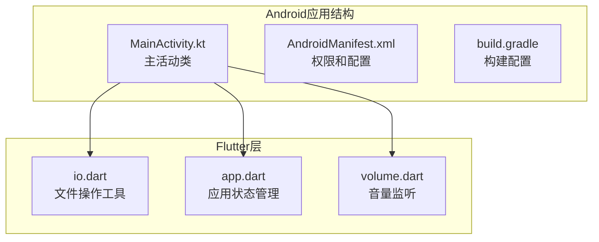
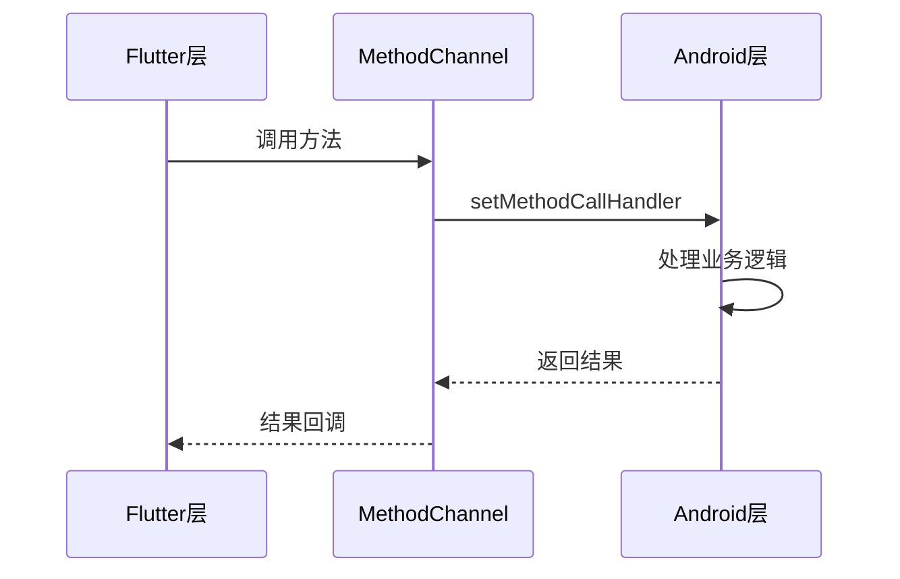
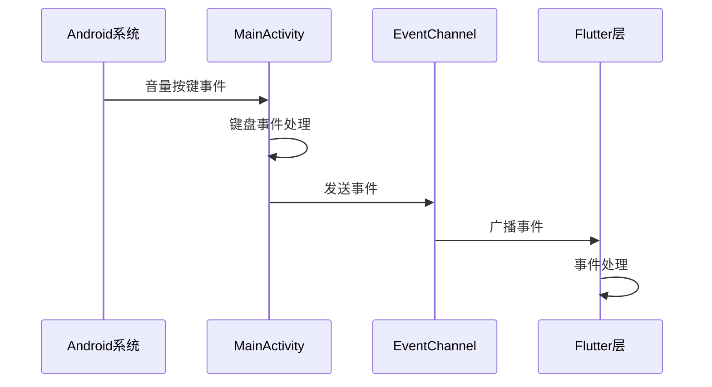
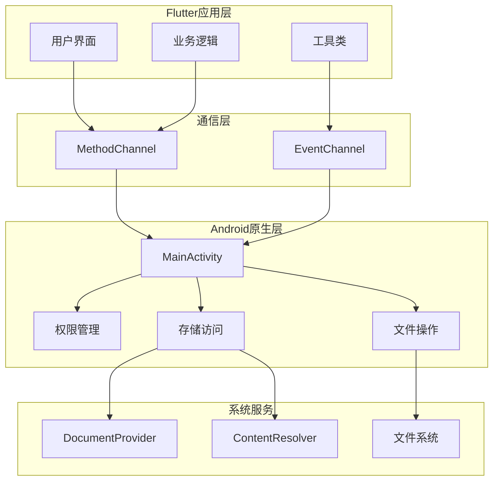
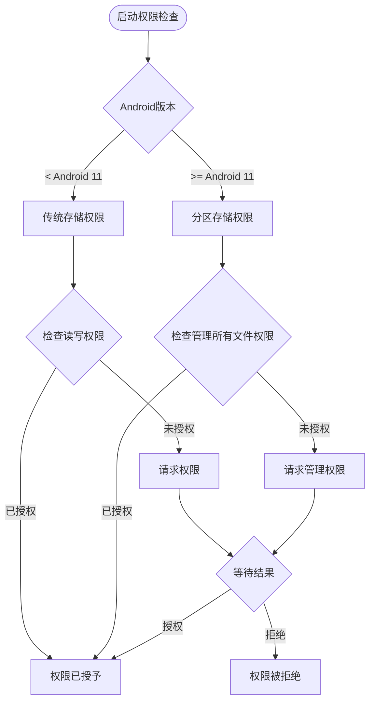
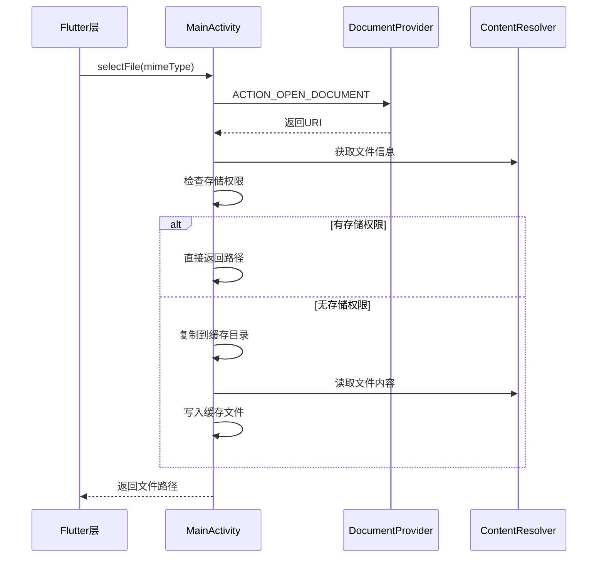
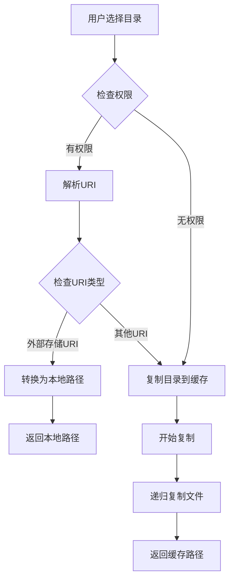
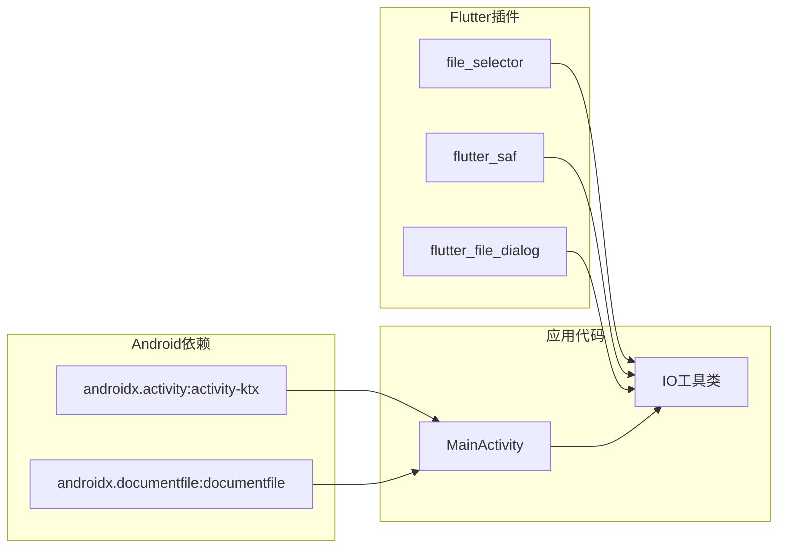
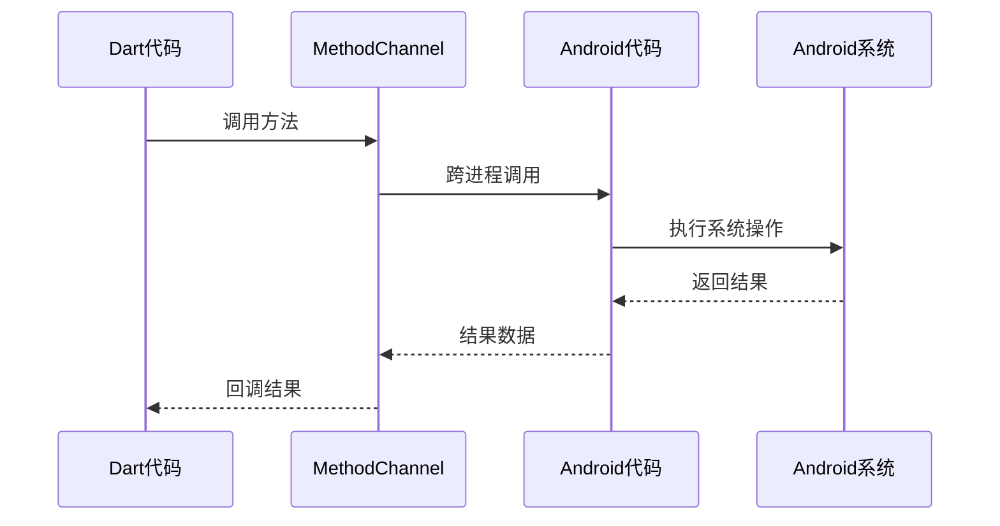

# Android平台集成

<cite>
**本文档引用的文件**
- [MainActivity.kt](file://android/app/src/main/kotlin/com/github/wgh136/venera/MainActivity.kt)
- [AndroidManifest.xml](file://android/app/src/main/AndroidManifest.xml)
- [build.gradle](file://android/app/build.gradle)
- [build.gradle](file://android/build.gradle)
- [settings.gradle](file://android/settings.gradle)
- [AndroidManifest.xml](file://android/app/src/debug/AndroidManifest.xml)
- [AndroidManifest.xml](file://android/app/src/profile/AndroidManifest.xml)
- [io.dart](file://lib/utils/io.dart)
- [app.dart](file://lib/foundation/app.dart)
- [volume.dart](file://lib/utils/volume.dart)
</cite>

## 目录
1. [简介](#简介)
2. [项目结构](#项目结构)
3. [核心组件](#核心组件)
4. [架构概览](#架构概览)
5. [详细组件分析](#详细组件分析)
6. [依赖关系分析](#依赖关系分析)
7. [性能考虑](#性能考虑)
8. [故障排除指南](#故障排除指南)
9. [结论](#结论)

## 简介

Venera应用的Android平台集成为跨平台开发提供了完整的原生功能支持。该集成实现了以下关键功能：
- Android特定的存储权限管理系统
- DocumentProvider集成的文件选择器
- MethodChannel和EventChannel跨平台通信机制
- 共享文本处理和音量按键事件监听
- 文件复制机制和缓存管理

本文档将深入解释MainActivity.kt中的核心实现，包括权限处理、文件操作、通信桥接等关键组件。

## 项目结构

Android平台集成主要位于`android/app/src/main/kotlin/com/github/wgh136/venera/`目录下，核心文件包括：

**图表来源**
- [MainActivity.kt](file://android/app/src/main/kotlin/com/github/wgh136/venera/MainActivity.kt#L1-L50)
- [AndroidManifest.xml](file://android/app/src/main/AndroidManifest.xml#L1-L30)

**章节来源**
- [MainActivity.kt](file://android/app/src/main/kotlin/com/github/wgh136/venera/MainActivity.kt#L1-L50)
- [AndroidManifest.xml](file://android/app/src/main/AndroidManifest.xml#L1-L75)

## 核心组件

### MethodChannel通信机制

Venera应用通过多个MethodChannel实现与Flutter层的通信：

**图表来源**
- [MainActivity.kt](file://android/app/src/main/kotlin/com/github/wgh136/venera/MainActivity.kt#L105-L141)
- [io.dart](file://lib/utils/io.dart#L213-L246)

### EventChannel事件流

音量按键事件通过EventChannel实现实时传输：

**图表来源**
- [MainActivity.kt](file://android/app/src/main/kotlin/com/github/wgh136/venera/MainActivity.kt#L143-L159)
- [volume.dart](file://lib/utils/volume.dart#L1-L31)

**章节来源**
- [MainActivity.kt](file://android/app/src/main/kotlin/com/github/wgh136/venera/MainActivity.kt#L105-L193)
- [io.dart](file://lib/utils/io.dart#L213-L312)

## 架构概览

Venera的Android平台集成采用分层架构设计：

**图表来源**
- [MainActivity.kt](file://android/app/src/main/kotlin/com/github/wgh136/venera/MainActivity.kt#L1-L50)
- [AndroidManifest.xml](file://android/app/src/main/AndroidManifest.xml#L1-L75)

## 详细组件分析

### MainActivity核心功能

MainActivity作为Android平台的核心入口，实现了以下关键功能：

#### 权限管理系统

**图表来源**
- [MainActivity.kt](file://android/app/src/main/kotlin/com/github/wgh136/venera/MainActivity.kt#L277-L332)

#### 文件选择器集成

文件选择器通过ACTION_OPEN_DOCUMENT实现，支持多种文件类型：

**图表来源**
- [MainActivity.kt](file://android/app/src/main/kotlin/com/github/wgh136/venera/MainActivity.kt#L348-L404)

#### 目录选择器实现

目录选择通过ACTION_OPEN_DOCUMENT_TREE实现，支持树形目录结构：

**图表来源**
- [MainActivity.kt](file://android/app/src/main/kotlin/com/github/wgh136/venera/MainActivity.kt#L222-L275)

**章节来源**
- [MainActivity.kt](file://android/app/src/main/kotlin/com/github/wgh136/venera/MainActivity.kt#L277-L404)

### AndroidManifest配置

AndroidManifest.xml定义了应用的权限和配置：

#### 权限声明

| 权限名称 | 用途 | Android版本要求 |
|---------|------|----------------|
| INTERNET | 网络访问 | 所有版本 |
| MANAGE_EXTERNAL_STORAGE | 管理外部存储 | Android 11+ |
| READ_EXTERNAL_STORAGE | 读取外部存储 | Android 10及以下 |
| WRITE_EXTERNAL_STORAGE | 写入外部存储 | Android 10及以下 |
| USE_BIOMETRIC | 生物识别认证 | 所有版本 |

#### Intent过滤器配置

应用配置了多个Intent过滤器以支持不同场景：

1. **主Activity配置**：标准启动和主题设置
2. **外部链接处理**：支持nhentai.net、e-hentai.org、exhentai.org的链接
3. **共享文本处理**：支持文本分享功能
4. **包可见性查询**：支持文本处理功能

**章节来源**
- [AndroidManifest.xml](file://android/app/src/main/AndroidManifest.xml#L1-L75)

### Gradle构建配置

构建配置文件定义了应用的编译参数和依赖管理：

#### 编译配置

- **compileSdk**: 使用Flutter SDK的编译版本
- **targetSdk**: 使用Flutter SDK的目标版本  
- **minSdk**: 使用Flutter SDK的最小版本
- **Java版本**: 17 (JDK 17兼容)

#### ABI分割配置

应用支持多架构ABI：
- armeabi-v7a (ARM 32位)
- arm64-v8a (ARM 64位)
- x86_64 (Intel 64位)

#### 签名配置

支持Debug和Release两种签名配置，使用独立的keystore文件。

**章节来源**
- [build.gradle](file://android/app/build.gradle#L32-L138)

## 依赖关系分析

### Android平台特定依赖

**图表来源**
- [build.gradle](file://android/app/build.gradle#L134-L137)
- [io.dart](file://lib/utils/io.dart#L1-L15)

### 跨平台通信依赖

**图表来源**
- [MainActivity.kt](file://android/app/src/main/kotlin/com/github/wgh136/venera/MainActivity.kt#L105-L141)
- [io.dart](file://lib/utils/io.dart#L213-L246)

**章节来源**
- [build.gradle](file://android/app/build.gradle#L134-L137)
- [io.dart](file://lib/utils/io.dart#L1-L200)

## 性能考虑

### 存储权限优化

1. **延迟权限请求**：仅在需要时请求权限，避免不必要的权限对话框
2. **权限检查缓存**：缓存权限状态，减少重复检查
3. **异步文件操作**：大文件复制使用后台线程，避免UI阻塞

### 文件操作优化

1. **缓冲区大小**：使用合理的缓冲区大小进行文件复制
2. **递归复制**：目录复制采用递归算法，支持深层目录结构
3. **内存管理**：及时释放文件流和临时对象

### 事件处理优化

1. **生命周期感知**：使用LifecycleObserver自动管理资源
2. **事件订阅管理**：音量事件监听器随生命周期自动清理
3. **线程池管理**：文件复制操作使用独立线程，避免主线程阻塞

## 故障排除指南

### 常见权限问题

**问题**: 分区存储权限请求失败
**解决方案**: 
1. 检查Android版本是否为11及以上
2. 确认MANAGE_EXTERNAL_STORAGE权限声明
3. 验证系统设置中应用权限状态

**问题**: 文件选择器无法返回路径
**解决方案**:
1. 检查DocumentProvider是否正常工作
2. 验证文件URI有效性
3. 确认存储权限状态

### 文件复制问题

**问题**: 大文件复制超时
**解决方案**:
1. 检查设备存储空间
2. 验证目标目录可写权限
3. 考虑使用更小的缓冲区大小

**问题**: 目录复制不完整
**解决方案**:
1. 检查源目录权限
2. 验证目标目录创建权限
3. 确认网络连接稳定性

### 通信通道问题

**问题**: MethodChannel调用无响应
**解决方案**:
1. 检查通道名称一致性
2. 验证Flutter引擎初始化完成
3. 确认回调函数正确注册

**问题**: EventChannel事件丢失
**解决方案**:
1. 检查事件订阅状态
2. 验证生命周期管理
3. 确认事件处理器正确实现

**章节来源**
- [MainActivity.kt](file://android/app/src/main/kotlin/com/github/wgh136/venera/MainActivity.kt#L334-L346)
- [io.dart](file://lib/utils/io.dart#L269-L312)

## 结论

Venera应用的Android平台集成为跨平台开发提供了完整的原生功能支持。通过精心设计的权限管理系统、DocumentProvider集成、MethodChannel和EventChannel通信机制，以及优化的文件操作策略，实现了高性能、稳定的Android平台支持。

关键优势包括：
- 完整的Android 11+分区存储支持
- 流畅的文件选择和复制体验
- 可靠的跨平台通信机制
- 良好的性能和资源管理
- 完善的错误处理和故障排除机制

开发者可以基于此架构扩展更多Android特定功能，同时保持与Flutter生态系统的良好兼容性。