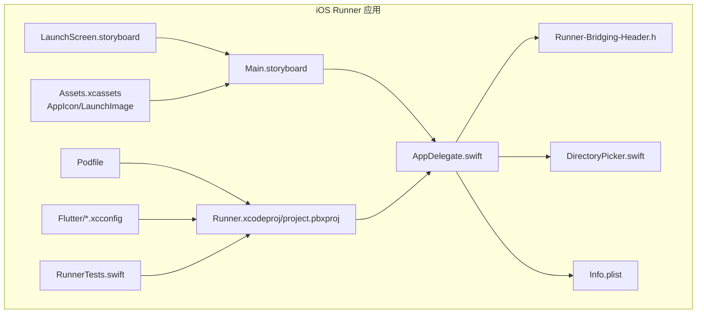
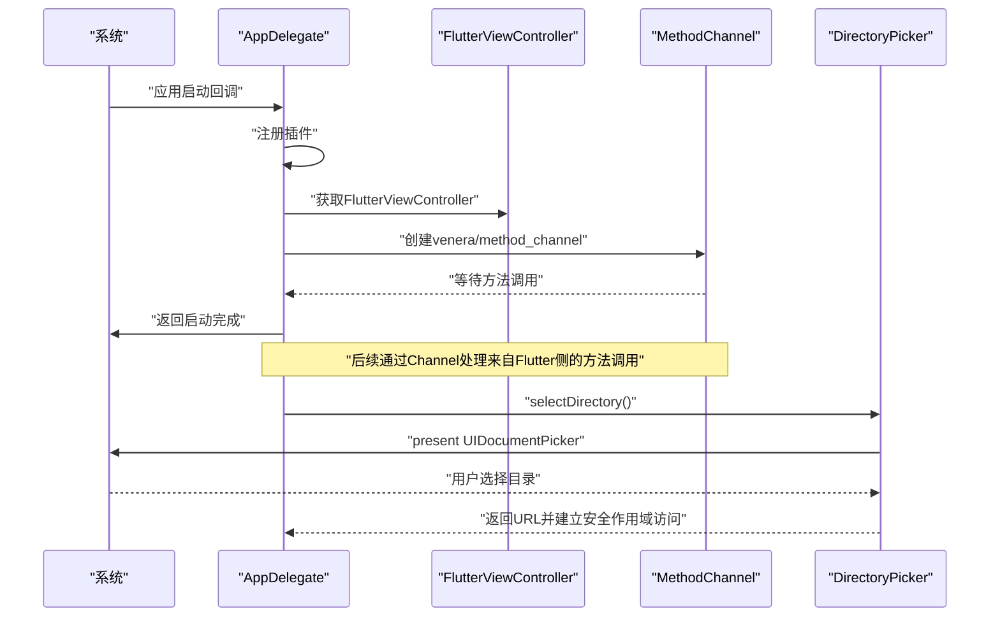
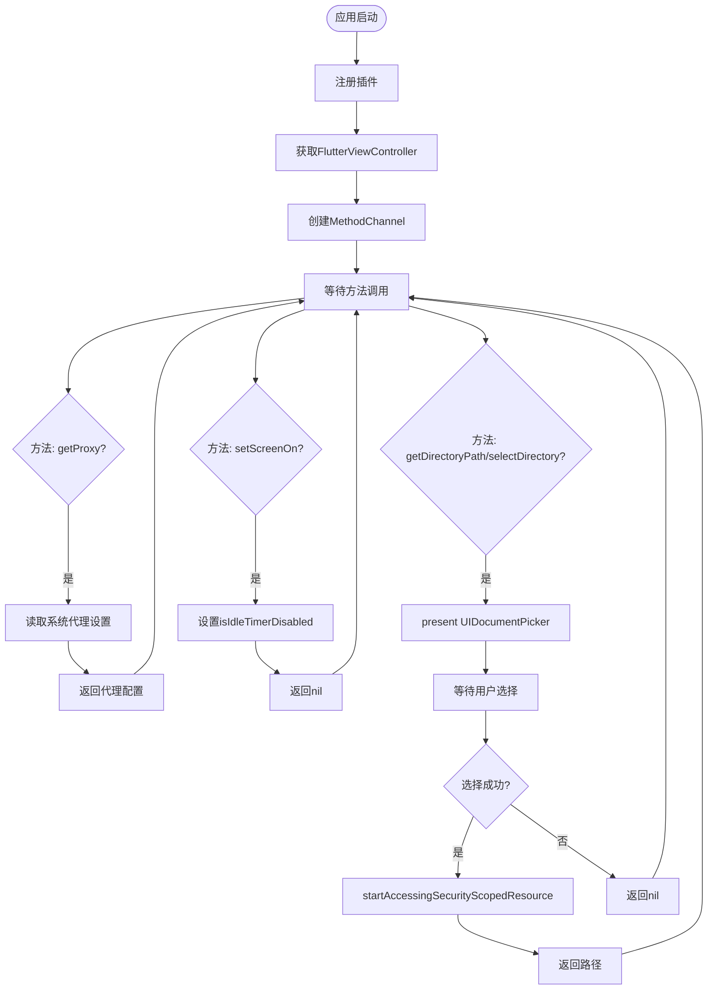
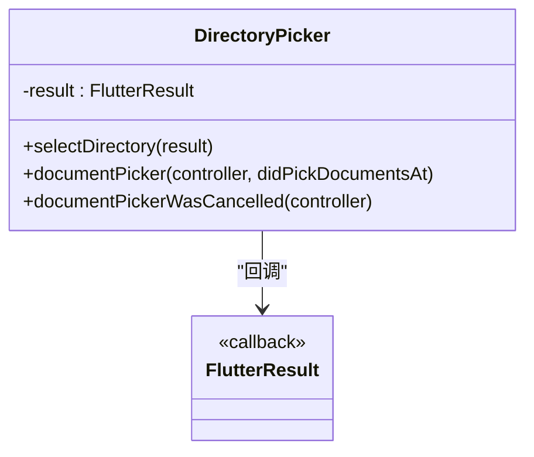
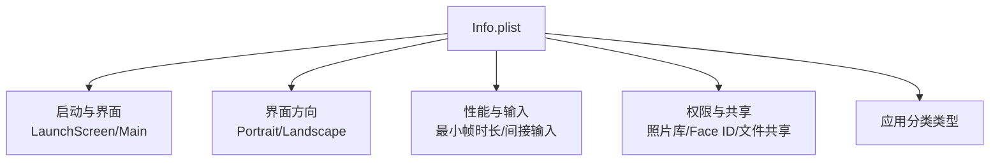
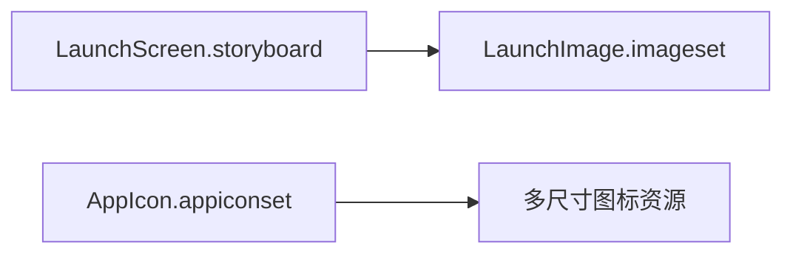
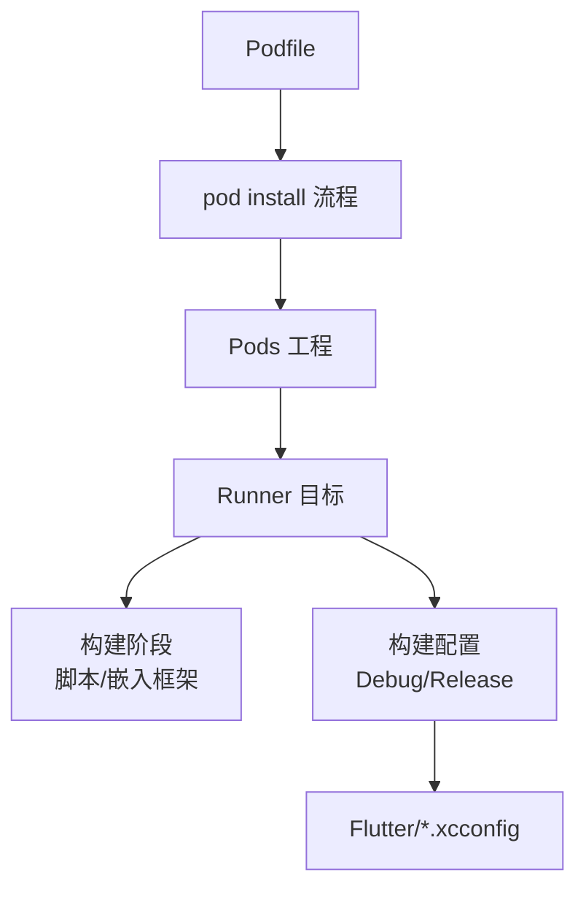
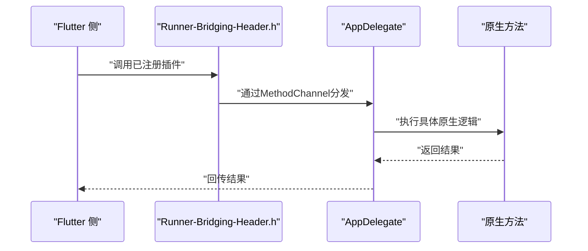
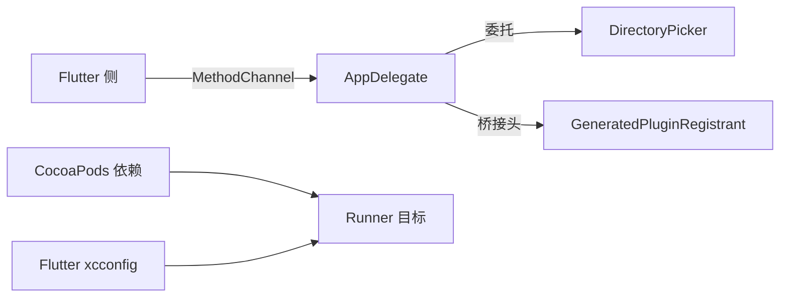

# iOS平台集成

<cite>
**本文引用的文件**
- [AppDelegate.swift](file://ios/Runner/AppDelegate.swift)
- [Info.plist](file://ios/Runner/Info.plist)
- [LaunchScreen.storyboard](file://ios/Runner/Base.lproj/LaunchScreen.storyboard)
- [Main.storyboard](file://ios/Runner/Base.lproj/Main.storyboard)
- [DirectoryPicker.swift](file://ios/Runner/DirectoryPicker.swift)
- [Runner-Bridging-Header.h](file://ios/Runner/Runner-Bridging-Header.h)
- [Podfile](file://ios/Podfile)
- [project.pbxproj](file://ios/Runner.xcodeproj/project.pbxproj)
- [Debug.xcconfig](file://ios/Flutter/Debug.xcconfig)
- [Release.xcconfig](file://ios/Flutter/Release.xcconfig)
- [AppIcon Contents.json](file://ios/Runner/Assets.xcassets/AppIcon.appiconset/Contents.json)
- [LaunchImage Contents.json](file://ios/Runner/Assets.xcassets/LaunchImage.imageset/Contents.json)
- [RunnerTests.swift](file://ios/RunnerTests/RunnerTests.swift)
- [pubspec.yaml](file://pubspec.yaml)
</cite>

## 目录
1. [简介](#简介)
2. [项目结构](#项目结构)
3. [核心组件](#核心组件)
4. [架构总览](#架构总览)
5. [详细组件分析](#详细组件分析)
6. [依赖关系分析](#依赖关系分析)
7. [性能考虑](#性能考虑)
8. [故障排除指南](#故障排除指南)
9. [结论](#结论)
10. [附录](#附录)

## 简介
本文件面向iOS平台的Venera应用集成，系统性阐述从Xcode工程到Flutter桥接、从权限配置到沙盒访问、从启动画面到应用图标与本地化、从推送通知到后台任务与内存优化，以及从开发环境到App Store发布的完整实现路径。文档以仓库中实际存在的iOS相关文件为依据，提供可操作的配置说明与最佳实践建议。

## 项目结构
iOS相关源码主要位于ios/Runner目录，包含应用入口、资源、配置与测试等模块；同时通过CocoaPods管理第三方依赖，Xcode工程文件组织了构建阶段与目标配置。

**图表来源**
- [AppDelegate.swift](file://ios/Runner/AppDelegate.swift#L1-L92)
- [Info.plist](file://ios/Runner/Info.plist#L1-L60)
- [LaunchScreen.storyboard](file://ios/Runner/Base.lproj/LaunchScreen.storyboard#L1-L38)
- [Main.storyboard](file://ios/Runner/Base.lproj/Main.storyboard#L1-L27)
- [DirectoryPicker.swift](file://ios/Runner/DirectoryPicker.swift#L1-L37)
- [Runner-Bridging-Header.h](file://ios/Runner/Runner-Bridging-Header.h#L1-L2)
- [project.pbxproj](file://ios/Runner.xcodeproj/project.pbxproj#L1-L688)
- [Podfile](file://ios/Podfile#L1-L45)
- [Debug.xcconfig](file://ios/Flutter/Debug.xcconfig#L1-L3)
- [Release.xcconfig](file://ios/Flutter/Release.xcconfig#L1-L3)
- [RunnerTests.swift](file://ios/RunnerTests/RunnerTests.swift#L1-L13)

**章节来源**
- [project.pbxproj](file://ios/Runner.xcodeproj/project.pbxproj#L197-L232)
- [Podfile](file://ios/Podfile#L1-L45)

## 核心组件
- 应用入口与桥接：AppDelegate负责注册插件、建立Flutter MethodChannel、处理系统代理查询、屏幕常亮控制、目录选择与沙盒资源访问。
- 目录选择器：封装UIDocumentPickerViewController，用于安全地选择iCloud或外部容器中的目录并建立安全作用域访问。
- 资源与界面：LaunchScreen与Main.storyboard定义启动画面与主窗口内容；Assets.xcassets承载应用图标与启动图片。
- 构建与配置：Podfile声明iOS版本与依赖安装流程；Flutter xcconfig与Xcode工程共同决定编译与打包行为。

**章节来源**
- [AppDelegate.swift](file://ios/Runner/AppDelegate.swift#L14-L58)
- [DirectoryPicker.swift](file://ios/Runner/DirectoryPicker.swift#L4-L20)
- [Info.plist](file://ios/Runner/Info.plist#L27-L47)
- [LaunchScreen.storyboard](file://ios/Runner/Base.lproj/LaunchScreen.storyboard#L16-L27)
- [Main.storyboard](file://ios/Runner/Base.lproj/Main.storyboard#L11-L21)
- [AppIcon Contents.json](file://ios/Runner/Assets.xcassets/AppIcon.appiconset/Contents.json#L1-L134)
- [LaunchImage Contents.json](file://ios/Runner/Assets.xcassets/LaunchImage.imageset/Contents.json#L1-L24)
- [Podfile](file://ios/Podfile#L1-L45)
- [project.pbxproj](file://ios/Runner.xcodeproj/project.pbxproj#L328-L347)

## 架构总览
下图展示了iOS端的启动流程、Flutter桥接与原生交互的关键节点。

**图表来源**
- [AppDelegate.swift](file://ios/Runner/AppDelegate.swift#L14-L58)
- [DirectoryPicker.swift](file://ios/Runner/DirectoryPicker.swift#L8-L20)

## 详细组件分析

### AppDelegate.swift 分析
- 插件注册：应用启动时注册GeneratedPluginRegistrant，确保Flutter插件可用。
- MethodChannel：创建名为“venera/method_channel”的方法通道，处理来自Flutter侧的调用。
- 方法实现要点：
  - 查询系统代理：读取系统HTTP代理设置并返回字符串格式。
  - 屏幕常亮：根据布尔参数启用/禁用空闲定时器。
  - 目录选择：委托DirectoryPicker执行目录选取。
  - 沙盒资源释放：停止对安全作用域资源的访问并清理URL引用。
- 目录选择流程：使用UIDocumentPickerViewController打开目录选择器，用户确认后调用startAccessingSecurityScopedResource建立访问权限，随后将路径回传给Flutter侧。

**图表来源**
- [AppDelegate.swift](file://ios/Runner/AppDelegate.swift#L24-L55)
- [AppDelegate.swift](file://ios/Runner/AppDelegate.swift#L60-L90)

**章节来源**
- [AppDelegate.swift](file://ios/Runner/AppDelegate.swift#L14-L90)

### DirectoryPicker.swift 分析
- 功能职责：封装目录选择逻辑，作为UIDocumentPickerDelegate处理用户选择与取消事件。
- 关键点：
  - 使用forOpeningContentTypes指定类型为文件夹(.folder)。
  - 允许单选，避免多选带来的复杂性。
  - 通过FlutterResult回调将URL路径或nil回传给调用方。

**图表来源**
- [DirectoryPicker.swift](file://ios/Runner/DirectoryPicker.swift#L4-L36)

**章节来源**
- [DirectoryPicker.swift](file://ios/Runner/DirectoryPicker.swift#L1-L37)

### Info.plist 配置分析
- 基本信息：Bundle标识、显示名称、版本号等。
- 启动与界面：指定启动Storyboard与主Storyboard。
- 方向支持：支持竖屏及横屏（含iPad上下翻转）。
- 性能与输入：允许最小帧时长在手机端关闭，支持间接输入事件。
- 权限与共享：照片库使用描述、文件共享开关、打开文档支持、Face ID使用描述、应用分类类型等。

**图表来源**
- [Info.plist](file://ios/Runner/Info.plist#L27-L57)

**章节来源**
- [Info.plist](file://ios/Runner/Info.plist#L1-L60)

### LaunchScreen 与应用图标
- 启动画面：LaunchScreen.storyboard通过居中ImageView展示启动图片，保证启动时的视觉一致性。
- 应用图标：AppIcon.appiconset包含iPhone/iPad/car和marketing尺寸的图标资源，由Contents.json统一描述。
- 启动图片：LaunchImage.imageset包含不同分辨率的启动图片资源。

**图表来源**
- [LaunchScreen.storyboard](file://ios/Runner/Base.lproj/LaunchScreen.storyboard#L16-L27)
- [AppIcon Contents.json](file://ios/Runner/Assets.xcassets/AppIcon.appiconset/Contents.json#L1-L134)
- [LaunchImage Contents.json](file://ios/Runner/Assets.xcassets/LaunchImage.imageset/Contents.json#L1-L24)

**章节来源**
- [LaunchScreen.storyboard](file://ios/Runner/Base.lproj/LaunchScreen.storyboard#L1-L38)
- [AppIcon Contents.json](file://ios/Runner/Assets.xcassets/AppIcon.appiconset/Contents.json#L1-L134)
- [LaunchImage Contents.json](file://ios/Runner/Assets.xcassets/LaunchImage.imageset/Contents.json#L1-L24)

### CocoaPods 与构建配置
- Podfile：声明iOS最低版本、目标配置映射、引入flutter工具并安装所有iOS pods；post_install阶段追加额外构建设置。
- Xcode工程：project.pbxproj定义了Runner目标、构建阶段（脚本、嵌入框架）、资源与源文件、配置列表等。
- Flutter xcconfig：Debug与Release分别包含Pods生成的配置与Generated.xcconfig，确保构建变量一致。

**图表来源**
- [Podfile](file://ios/Podfile#L1-L45)
- [project.pbxproj](file://ios/Runner.xcodeproj/project.pbxproj#L155-L195)
- [Debug.xcconfig](file://ios/Flutter/Debug.xcconfig#L1-L3)
- [Release.xcconfig](file://ios/Flutter/Release.xcconfig#L1-L3)

**章节来源**
- [Podfile](file://ios/Podfile#L1-L45)
- [project.pbxproj](file://ios/Runner.xcodeproj/project.pbxproj#L1-L688)
- [Debug.xcconfig](file://ios/Flutter/Debug.xcconfig#L1-L3)
- [Release.xcconfig](file://ios/Flutter/Release.xcconfig#L1-L3)

### Flutter 与 iOS 原生桥接
- 桥接头文件：Runner-Bridging-Header.h导入GeneratedPluginRegistrant.h，使Objective-C/Swift代码可访问Flutter生成的插件注册类。
- MethodChannel：在AppDelegate中创建命名通道，处理来自Flutter侧的同步调用，如代理查询、屏幕常亮、目录选择等。
- 依赖声明：pubspec.yaml声明了大量跨平台与原生相关的包，为iOS功能提供支撑（如sqlite3、local_auth、photo_view等）。

**图表来源**
- [Runner-Bridging-Header.h](file://ios/Runner/Runner-Bridging-Header.h#L1-L2)
- [AppDelegate.swift](file://ios/Runner/AppDelegate.swift#L24-L55)
- [pubspec.yaml](file://pubspec.yaml#L11-L90)

**章节来源**
- [Runner-Bridging-Header.h](file://ios/Runner/Runner-Bridging-Header.h#L1-L2)
- [AppDelegate.swift](file://ios/Runner/AppDelegate.swift#L14-L58)
- [pubspec.yaml](file://pubspec.yaml#L11-L90)

## 依赖关系分析
- 组件耦合：
  - AppDelegate与DirectoryPicker通过协议委托交互，降低直接耦合。
  - MethodChannel作为解耦接口，连接Flutter与原生逻辑。
- 外部依赖：
  - CocoaPods管理第三方库，Xcode构建阶段自动嵌入框架。
  - Flutter SDK与Generated.xcconfig提供统一的构建变量与路径。

**图表来源**
- [AppDelegate.swift](file://ios/Runner/AppDelegate.swift#L12-L12)
- [DirectoryPicker.swift](file://ios/Runner/DirectoryPicker.swift#L4-L4)
- [Runner-Bridging-Header.h](file://ios/Runner/Runner-Bridging-Header.h#L1-L2)
- [Podfile](file://ios/Podfile#L30-L38)
- [project.pbxproj](file://ios/Runner.xcodeproj/project.pbxproj#L176-L185)

**章节来源**
- [AppDelegate.swift](file://ios/Runner/AppDelegate.swift#L1-L92)
- [DirectoryPicker.swift](file://ios/Runner/DirectoryPicker.swift#L1-L37)
- [Runner-Bridging-Header.h](file://ios/Runner/Runner-Bridging-Header.h#L1-L2)
- [Podfile](file://ios/Podfile#L1-L45)
- [project.pbxproj](file://ios/Runner.xcodeproj/project.pbxproj#L1-L688)

## 性能考虑
- 启动性能：
  - 关闭CADisableMinimumFrameDurationOnPhone可提升动画流畅度，但需权衡能耗。
  - 使用间接输入事件支持提高响应速度。
- 内存管理：
  - 及时释放安全作用域资源（stopAccessingSecurityScopedResource），避免长时间持有URL导致内存占用上升。
  - 合理使用FlutterViewController生命周期，避免重复创建与泄漏。
- 网络与代理：
  - 通过系统代理查询减少不必要的网络开销，结合缓存策略优化加载性能。
- 构建优化：
  - Release配置启用Swift整体编译模式与优化级别，减小二进制体积并提升运行效率。

**章节来源**
- [Info.plist](file://ios/Runner/Info.plist#L44-L47)
- [AppDelegate.swift](file://ios/Runner/AppDelegate.swift#L45-L49)
- [project.pbxproj](file://ios/Runner.xcodeproj/project.pbxproj#L596-L604)

## 故障排除指南
- 目录选择无响应或返回nil：
  - 确认UIDocumentPicker正确present且用户未取消。
  - 检查是否调用startAccessingSecurityScopedResource并及时释放。
- 代理查询为空：
  - 系统未配置代理时返回空字符串属预期行为。
- 启动画面不显示：
  - 检查Info.plist中的UILaunchStoryboardName与LaunchScreen.storyboard是否存在。
- 构建失败（Podfile.lock不一致）：
  - 执行pod install并确保Xcode检查脚本通过。
- 测试工程：
  - RunnerTests.swift为空示例，可根据需要扩展单元测试覆盖关键路径。

**章节来源**
- [AppDelegate.swift](file://ios/Runner/AppDelegate.swift#L72-L90)
- [Info.plist](file://ios/Runner/Info.plist#L27-L29)
- [RunnerTests.swift](file://ios/RunnerTests/RunnerTests.swift#L1-L13)

## 结论
Venera在iOS平台的集成以Flutter为核心，通过AppDelegate与MethodChannel实现与原生能力的桥接，配合DirectoryPicker完成目录选择与沙盒资源访问。借助Info.plist与Assets.xcassets完善权限与视觉体验，Podfile与Xcode工程确保依赖与构建的一致性。遵循本文的配置与优化建议，可有效解决iOS平台特有的技术挑战并提升应用稳定性与性能。

## 附录
- 开发环境与代码签名：
  - 使用Xcode 15+与iOS 13+目标，确保支持现代特性与安全性。
  - 在Runner目标的Signing与Capabilities中配置团队与证书，启用必要的权限（如照片库、文件共享）。
- 推送通知与后台任务：
  - 本仓库未包含推送通知与后台任务的具体实现，可在AppDelegate中按需添加UNUserNotificationCenter与后台任务API。
- 本地化支持：
  - 通过Info.plist与Flutter的flutter_localizations支持多语言，建议在iOS端补充Localizable.strings与InfoPlist.strings。
- App Store 发布：
  - 准备App Store Connect元数据与截图，确保应用图标与描述符合规范；在Xcode Archive并上传至App Store Connect。