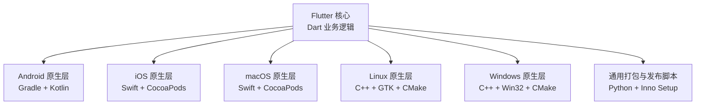
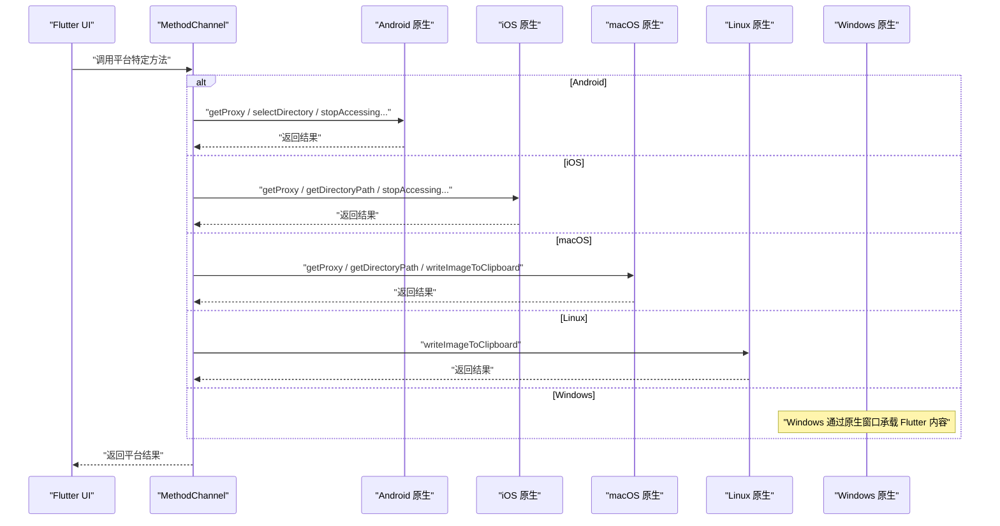
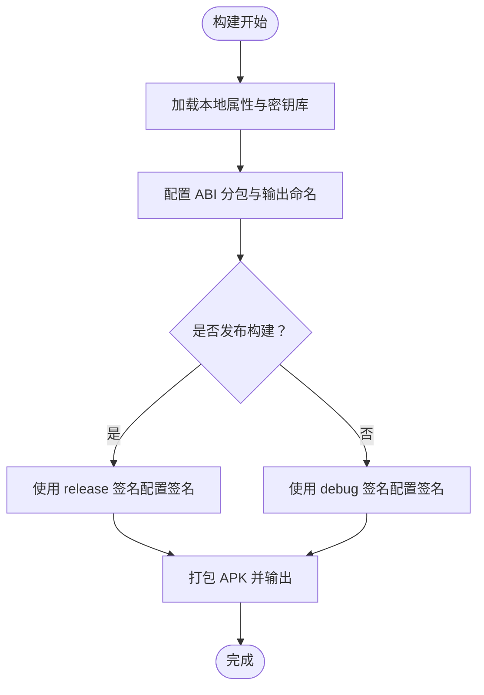
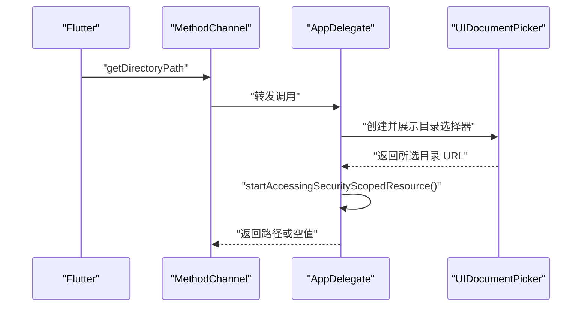
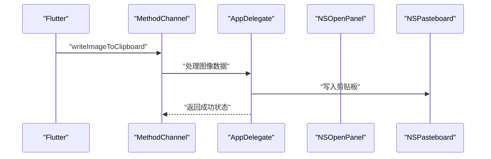
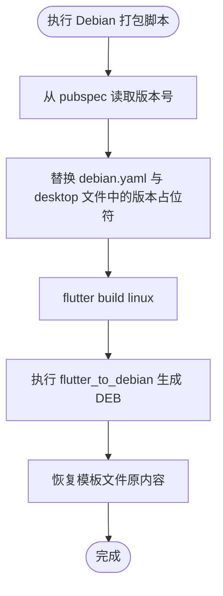
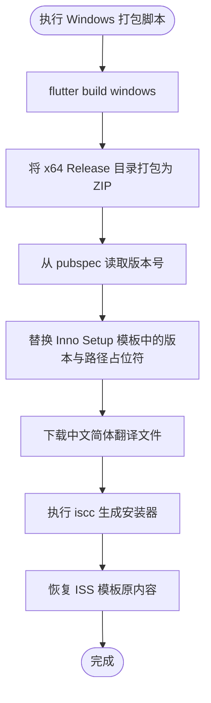
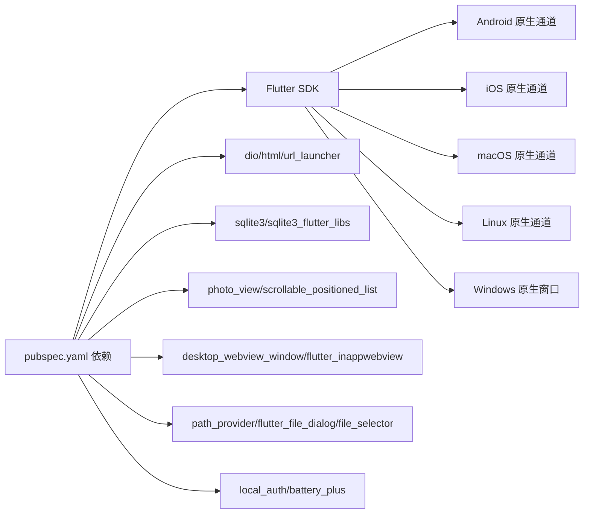

# 平台集成

<cite>
**本文引用的文件**
- [Android 清单文件](file://android/app/src/main/AndroidManifest.xml)
- [Android 应用构建脚本](file://android/app/build.gradle)
- [Android Gradle 属性](file://android/gradle.properties)
- [Android 设置脚本](file://android/settings.gradle)
- [iOS 应用委托](file://ios/Runner/AppDelegate.swift)
- [iOS 应用信息配置](file://ios/Runner/Info.plist)
- [iOS 依赖管理](file://ios/Podfile)
- [macOS 应用委托](file://macos/Runner/AppDelegate.swift)
- [macOS 依赖管理](file://macos/Podfile)
- [Linux 应用入口](file://linux/my_application.cc)
- [Linux CMake 构建脚本](file://linux/CMakeLists.txt)
- [Windows 应用入口](file://windows/runner/main.cpp)
- [Windows CMake 构建脚本](file://windows/CMakeLists.txt)
- [Windows 打包脚本](file://windows/build.py)
- [Debian 打包脚本](file://debian/build.py)
- [项目依赖清单](file://pubspec.yaml)
</cite>

## 目录
1. [简介](#简介)
2. [项目结构](#项目结构)
3. [核心组件](#核心组件)
4. [架构总览](#架构总览)
5. [详细组件分析](#详细组件分析)
6. [依赖关系分析](#依赖关系分析)
7. [性能考虑](#性能考虑)
8. [故障排查指南](#故障排查指南)
9. [结论](#结论)
10. [附录](#附录)

## 简介
本文件面向需要理解与维护 Venera 多平台集成的开发者，系统性说明 Android、iOS、Windows、macOS 与 Linux 平台的原生集成方式、权限与平台特性、构建与打包脚本、以及跨平台代码与平台特定代码的分离策略。文档同时提供调试方法与常见问题解决方案，帮助团队高效开展多平台开发与发布。

## 项目结构
Venera 采用 Flutter 跨平台框架，通过平台特定的原生层（Android/iOS/macOS/Linux/Windows）与 Dart 业务逻辑解耦。各平台的原生工程位于独立目录中，配合统一的 pubspec 依赖管理与 Flutter 工具链完成构建与分发。

**图表来源**
- [项目依赖清单](file://pubspec.yaml#L1-L122)
- [Android 应用构建脚本](file://android/app/build.gradle#L1-L138)
- [iOS 依赖管理](file://ios/Podfile#L1-L45)
- [macOS 依赖管理](file://macos/Podfile#L1-L44)
- [Linux CMake 构建脚本](file://linux/CMakeLists.txt#L1-L146)
- [Windows CMake 构建脚本](file://windows/CMakeLists.txt#L1-L109)
- [Windows 打包脚本](file://windows/build.py#L1-L40)
- [Debian 打包脚本](file://debian/build.py#L1-L36)

**章节来源**
- [项目依赖清单](file://pubspec.yaml#L1-L122)

## 核心组件
- 跨平台业务逻辑：由 Flutter/Dart 实现，负责页面、网络、存储、UI 交互等。
- 平台特定通道：通过 MethodChannel 暴露系统能力（如代理查询、目录选择、剪贴板写入），在各平台以原生实现对接。
- 构建与打包：各平台使用原生工具链（Gradle、CocoaPods、CMake、Inno Setup）完成编译、打包与安装器生成。

**章节来源**
- [Android 清单文件](file://android/app/src/main/AndroidManifest.xml#L1-L75)
- [Android 应用构建脚本](file://android/app/build.gradle#L1-L138)
- [iOS 应用委托](file://ios/Runner/AppDelegate.swift#L1-L92)
- [macOS 应用委托](file://macos/Runner/AppDelegate.swift#L1-L92)
- [Linux 应用入口](file://linux/my_application.cc#L1-L172)
- [Windows 应用入口](file://windows/runner/main.cpp#L1-L44)

## 架构总览
下图展示跨平台调用与平台特定通道的交互关系，以及各平台的构建与打包路径。

**图表来源**
- [Android 清单文件](file://android/app/src/main/AndroidManifest.xml#L1-L75)
- [Android 应用构建脚本](file://android/app/build.gradle#L1-L138)
- [iOS 应用委托](file://ios/Runner/AppDelegate.swift#L1-L92)
- [macOS 应用委托](file://macos/Runner/AppDelegate.swift#L1-L92)
- [Linux 应用入口](file://linux/my_application.cc#L1-L172)
- [Windows 应用入口](file://windows/runner/main.cpp#L1-L44)

## 详细组件分析

### Android 集成
- 权限与意图
  - 网络访问、外部存储读写、生物识别等权限在清单中声明。
  - 支持处理 nhentai/e-hentai/exhentai 的链接跳转与分享文本的隐式意图。
- 构建配置
  - 使用 Gradle 插件与 Flutter Gradle 插件组合，启用 ABI 分包与签名配置。
  - 编译与运行时目标 JDK 版本统一为 17；启用增量打包与资源压缩。
- 原生通道
  - 通过 GeneratedPluginRegistrant 注册插件，结合 Kotlin Activity/KTX 与 DocumentFile 依赖增强文件操作能力。
- 发布与打包
  - 通过 Gradle 任务生成多 ABI 的 APK，并按版本号规则重命名输出文件；可选生成通用 APK。

**图表来源**
- [Android 应用构建脚本](file://android/app/build.gradle#L1-L138)
- [Android 清单文件](file://android/app/src/main/AndroidManifest.xml#L1-L75)

**章节来源**
- [Android 清单文件](file://android/app/src/main/AndroidManifest.xml#L1-L75)
- [Android 应用构建脚本](file://android/app/build.gradle#L1-L138)
- [Android Gradle 属性](file://android/gradle.properties#L1-L6)
- [Android 设置脚本](file://android/settings.gradle#L1-L26)

### iOS 集成
- 权限与系统能力
  - 通过 Info.plist 声明 Face ID 使用说明、文件共享与打开文档能力。
  - 在 AppDelegate 中注册插件并设置 MethodChannel，处理代理查询、屏幕常亮控制、目录选择与安全作用域资源访问。
- 依赖管理
  - 使用 CocoaPods 管理 Flutter 与第三方依赖，启用模块化头与框架模式。
- 原生通道
  - 提供 getProxy、setScreenOn、getDirectoryPath、stopAccessingSecurityScopedResource 等方法，使用 UIDocumentPickerDelegate 与 UTType.folder 进行目录选择。

**图表来源**
- [iOS 应用委托](file://ios/Runner/AppDelegate.swift#L1-L92)
- [iOS 应用信息配置](file://ios/Runner/Info.plist#L1-L60)

**章节来源**
- [iOS 应用委托](file://ios/Runner/AppDelegate.swift#L1-L92)
- [iOS 应用信息配置](file://ios/Runner/Info.plist#L1-L60)
- [iOS 依赖管理](file://ios/Podfile#L1-L45)

### macOS 集成
- 系统能力与通道
  - 通过 MethodChannel 提供 getProxy、getDirectoryPath、writeImageToClipboard 等方法。
  - 使用 NSOpenPanel 选择目录并调用安全作用域资源访问接口。
- 依赖管理
  - 使用 CocoaPods 管理 Flutter 与第三方依赖，启用模块化头与框架模式。
- 原生窗口
  - 应用启动后创建 FlutterViewController 并注册插件，设置剪贴板通道处理图像写入。

**图表来源**
- [macOS 应用委托](file://macos/Runner/AppDelegate.swift#L1-L92)

**章节来源**
- [macOS 应用委托](file://macos/Runner/AppDelegate.swift#L1-L92)
- [macOS 依赖管理](file://macos/Podfile#L1-L44)

### Linux 集成
- 原生窗口与剪贴板
  - 通过 GTK 创建窗口并嵌入 Flutter 视图；注册 MethodChannel 处理 writeImageToClipboard，将像素数据转换为 GdkPixbuf 并写入默认剪贴板。
- 构建与打包
  - 使用 CMake 与 pkg-config 检测 GTK3 与 WebKit2 依赖；安装阶段复制资源与 AOT 库。
- 发布脚本
  - 通过 Python 脚本读取版本号，调用 flutter_to_debian 生成 DEB 包，并恢复模板内容。

**图表来源**
- [Debian 打包脚本](file://debian/build.py#L1-L36)
- [Linux CMake 构建脚本](file://linux/CMakeLists.txt#L1-L146)

**章节来源**
- [Linux 应用入口](file://linux/my_application.cc#L1-L172)
- [Linux CMake 构建脚本](file://linux/CMakeLists.txt#L1-L146)
- [Debian 打包脚本](file://debian/build.py#L1-L36)

### Windows 集成
- 原生窗口与控制台
  - 通过 Win32Window 承载 Flutter 内容，自动附加控制台以便调试；初始化 COM 以支持库与插件。
- 构建与打包
  - 使用 CMake 与 Flutter 工具链生成可执行文件；打包脚本将 Release 输出目录压缩为 ZIP，并生成 Inno Setup 安装器。
- 安装器本地化
  - 自动下载中文简体翻译资源以生成安装界面本地化。

**图表来源**
- [Windows 打包脚本](file://windows/build.py#L1-L40)
- [Windows CMake 构建脚本](file://windows/CMakeLists.txt#L1-L109)
- [Windows 应用入口](file://windows/runner/main.cpp#L1-L44)

**章节来源**
- [Windows 应用入口](file://windows/runner/main.cpp#L1-L44)
- [Windows CMake 构建脚本](file://windows/CMakeLists.txt#L1-L109)
- [Windows 打包脚本](file://windows/build.py#L1-L40)

## 依赖关系分析
- 跨平台依赖：通过 pubspec 统一声明，包含网络、数据库、WebView、文件对话框、分享、加密等。
- 平台特定依赖：各平台通过原生工具链引入系统级能力（Android 权限与存储、iOS/macOS 文件系统访问、Linux GTK/WebKit、Windows Win32）。
- 通道与桥接：Flutter MethodChannel 将 Dart 方法映射到各平台原生实现，形成稳定的跨语言调用边界。

**图表来源**
- [项目依赖清单](file://pubspec.yaml#L1-L122)
- [Android 清单文件](file://android/app/src/main/AndroidManifest.xml#L1-L75)
- [iOS 应用委托](file://ios/Runner/AppDelegate.swift#L1-L92)
- [macOS 应用委托](file://macos/Runner/AppDelegate.swift#L1-L92)
- [Linux 应用入口](file://linux/my_application.cc#L1-L172)
- [Windows 应用入口](file://windows/runner/main.cpp#L1-L44)

**章节来源**
- [项目依赖清单](file://pubspec.yaml#L1-L122)

## 性能考虑
- Android
  - 启用资源压缩与代码混淆，合理设置 ABI 过滤，减少包体与运行时开销。
  - 使用 DocumentFile 与 Activity KTX 提升文件操作稳定性与兼容性。
- iOS/macOS
  - 通过安全作用域资源访问避免沙盒限制带来的性能与权限问题。
  - 使用模块化头与框架模式降低编译时间与链接复杂度。
- Linux/Windows
  - CMake 编译优化选项与资源复制策略影响启动速度与安装体积。
  - 建议在发布构建中启用链接器优化与裁剪未使用资源。

[本节为通用建议，不直接分析具体文件]

## 故障排查指南
- Android 权限相关
  - 若无法访问外部存储，请检查清单中权限声明与运行时授权流程；确认目标 SDK 与存储策略适配。
- iOS 目录选择失败
  - 确认 Info.plist 中文件共享与打开文档开关已启用；检查安全作用域资源访问是否成功调用。
- macOS 剪贴板写入失败
  - 检查图像数据格式与长度；确认 NSPasteboard 写入流程无异常。
- Linux 剪贴板写入异常
  - 确认 GTK 环境与默认剪贴板可用；检查像素数据尺寸与通道数。
- Windows 控制台与调试
  - 确保调试器附加控制台；检查 COM 初始化与窗口创建流程。
- 打包与安装器
  - Android：确认签名配置与 ABI 输出命名规则；检查 Gradle 依赖元数据开关。
  - Windows：确认 Inno Setup 语言包下载与模板替换；验证 ZIP 与安装器生成路径。
  - Debian：确认 flutter_to_debian 可用与模板恢复逻辑。

**章节来源**
- [Android 清单文件](file://android/app/src/main/AndroidManifest.xml#L1-L75)
- [Android 应用构建脚本](file://android/app/build.gradle#L1-L138)
- [iOS 应用委托](file://ios/Runner/AppDelegate.swift#L1-L92)
- [macOS 应用委托](file://macos/Runner/AppDelegate.swift#L1-L92)
- [Linux 应用入口](file://linux/my_application.cc#L1-L172)
- [Windows 应用入口](file://windows/runner/main.cpp#L1-L44)
- [Windows 打包脚本](file://windows/build.py#L1-L40)
- [Debian 打包脚本](file://debian/build.py#L1-L36)

## 结论
Venera 通过 Flutter 实现跨平台核心逻辑，借助各平台原生层与 MethodChannel 深度集成系统能力。Android/iOS/macOS/Linux/Windows 各有明确的构建与打包流程，配合统一的依赖管理与发布脚本，形成可维护、可扩展的多平台体系。遵循本文档的集成策略与故障排查方法，可有效提升开发效率与发布质量。

[本节为总结性内容，不直接分析具体文件]

## 附录
- 平台特定配置与构建要点概览
  - Android：权限、ABI 分包、签名与输出命名规则。
  - iOS：Info.plist 权限与系统能力、CocoaPods 依赖、MethodChannel 方法集。
  - macOS：目录选择与剪贴板通道、CocoaPods 依赖。
  - Linux：GTK/WebKit 依赖、CMake 安装策略、Python 打包脚本。
  - Windows：Win32 窗口承载、CMake 构建、Inno Setup 安装器与本地化。

[本节为概览性内容，不直接分析具体文件]