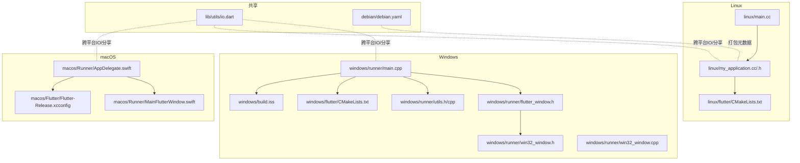
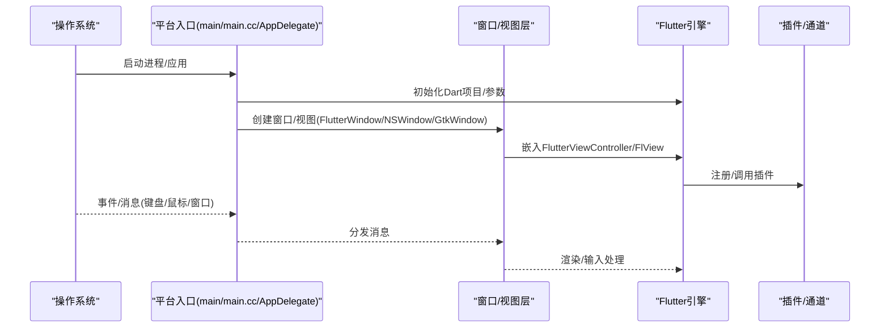
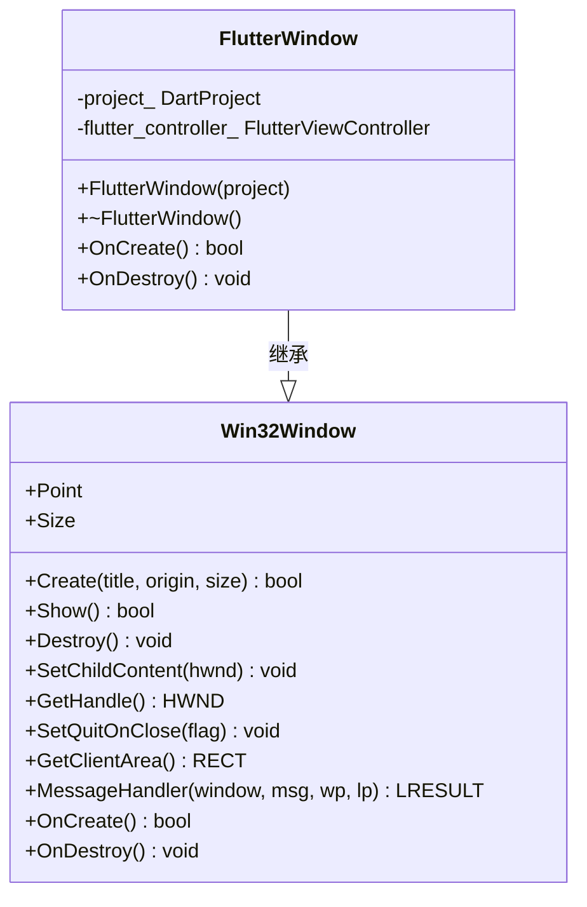
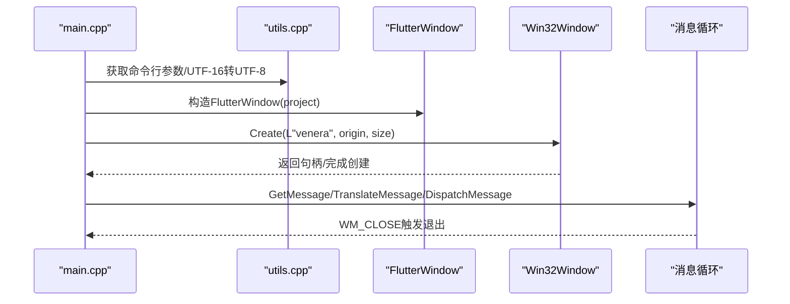
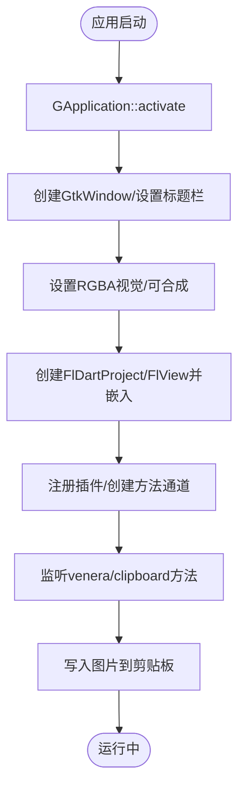
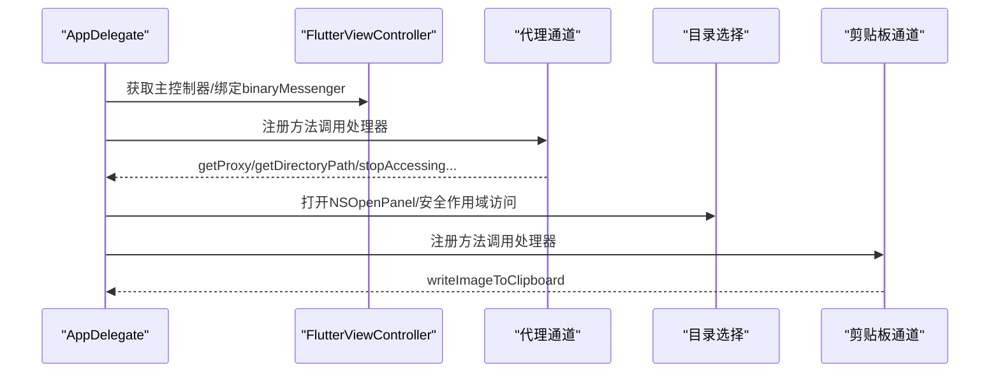
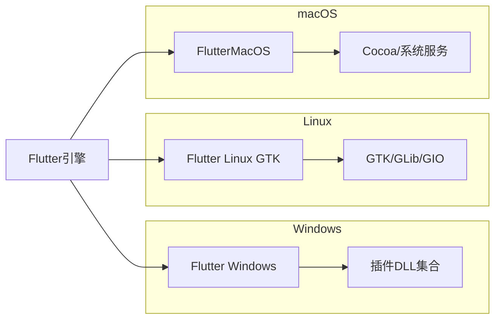

# 桌面平台集成

<cite>
**本文引用的文件**
- [windows/runner/main.cpp](file://windows/runner/main.cpp)
- [windows/runner/flutter_window.h](file://windows/runner/flutter_window.h)
- [windows/runner/win32_window.h](file://windows/runner/win32_window.h)
- [windows/runner/win32_window.cpp](file://windows/runner/win32_window.cpp)
- [windows/runner/utils.h](file://windows/runner/utils.h)
- [windows/runner/utils.cpp](file://windows/runner/utils.cpp)
- [windows/flutter/CMakeLists.txt](file://windows/flutter/CMakeLists.txt)
- [windows/build.iss](file://windows/build.iss)
- [linux/my_application.cc](file://linux/my_application.cc)
- [linux/my_application.h](file://linux/my_application.h)
- [linux/main.cc](file://linux/main.cc)
- [linux/flutter/CMakeLists.txt](file://linux/flutter/CMakeLists.txt)
- [macos/Runner/AppDelegate.swift](file://macos/Runner/AppDelegate.swift)
- [macos/Runner/MainFlutterWindow.swift](file://macos/Runner/MainFlutterWindow.swift)
- [macos/Flutter/Flutter-Release.xcconfig](file://macos/Flutter/Flutter-Release.xcconfig)
- [debian/debian.yaml](file://debian/debian.yaml)
- [lib/utils/io.dart](file://lib/utils/io.dart)
</cite>

## 目录
1. [简介](#简介)
2. [项目结构](#项目结构)
3. [核心组件](#核心组件)
4. [架构总览](#架构总览)
5. [详细组件分析](#详细组件分析)
6. [依赖分析](#依赖分析)
7. [性能考虑](#性能考虑)
8. [故障排查指南](#故障排查指南)
9. [结论](#结论)
10. [附录](#附录)

## 简介
本文件面向需要在Windows、macOS与Linux三大桌面平台集成Venera应用的开发者，系统梳理平台入口点、窗口与视图管理、构建与打包配置、文件系统与权限差异、以及调试与性能优化策略。文档以仓库中现有实现为依据，避免臆测，帮助开发者高效维护与扩展桌面平台支持。

## 项目结构
桌面平台相关源码分布于三个子目录：windows、linux、macos；每个平台均包含：
- 应用入口与窗口类（如main.cpp、main.cc、AppDelegate.swift）
- Flutter集成层（Flutter引擎初始化、视图控制器、插件注册）
- 构建脚本（CMakeLists.txt）
- 平台特定的打包配置（Inno Setup、Debian YAML等）

图表来源
- [windows/runner/main.cpp](file://windows/runner/main.cpp#L1-L44)
- [windows/runner/flutter_window.h](file://windows/runner/flutter_window.h#L1-L34)
- [windows/runner/win32_window.h](file://windows/runner/win32_window.h#L1-L103)
- [windows/runner/win32_window.cpp](file://windows/runner/win32_window.cpp#L123-L194)
- [windows/runner/utils.h](file://windows/runner/utils.h#L1-L20)
- [windows/runner/utils.cpp](file://windows/runner/utils.cpp#L1-L66)
- [windows/flutter/CMakeLists.txt](file://windows/flutter/CMakeLists.txt#L1-L110)
- [windows/build.iss](file://windows/build.iss#L1-L99)
- [linux/my_application.cc](file://linux/my_application.cc#L1-L172)
- [linux/my_application.h](file://linux/my_application.h#L1-L19)
- [linux/main.cc](file://linux/main.cc#L1-L7)
- [linux/flutter/CMakeLists.txt](file://linux/flutter/CMakeLists.txt#L1-L89)
- [macos/Runner/AppDelegate.swift](file://macos/Runner/AppDelegate.swift#L1-L92)
- [macos/Runner/MainFlutterWindow.swift](file://macos/Runner/MainFlutterWindow.swift#L1-L16)
- [macos/Flutter/Flutter-Release.xcconfig](file://macos/Flutter/Flutter-Release.xcconfig#L1-L3)
- [debian/debian.yaml](file://debian/debian.yaml#L1-L17)
- [lib/utils/io.dart](file://lib/utils/io.dart#L365-L425)

章节来源
- [windows/runner/main.cpp](file://windows/runner/main.cpp#L1-L44)
- [linux/my_application.cc](file://linux/my_application.cc#L1-L172)
- [macos/Runner/AppDelegate.swift](file://macos/Runner/AppDelegate.swift#L1-L92)
- [windows/flutter/CMakeLists.txt](file://windows/flutter/CMakeLists.txt#L1-L110)
- [linux/flutter/CMakeLists.txt](file://linux/flutter/CMakeLists.txt#L1-L89)
- [macos/Flutter/Flutter-Release.xcconfig](file://macos/Flutter/Flutter-Release.xcconfig#L1-L3)
- [windows/build.iss](file://windows/build.iss#L1-L99)
- [debian/debian.yaml](file://debian/debian.yaml#L1-L17)
- [lib/utils/io.dart](file://lib/utils/io.dart#L365-L425)

## 核心组件
- Windows入口与窗口
  - 入口：进程启动、控制台附加、COM初始化、命令行参数传递、Flutter项目初始化、窗口创建与消息循环。
  - 窗口抽象：Win32Window负责DPI感知、尺寸缩放、主题更新、消息分发；FlutterWindow承载Flutter视图。
  - 工具函数：UTF-16到UTF-8转换、控制台重定向。
- Linux入口与应用
  - 入口：main调用GApplication::run，激活应用时创建窗口、设置标题栏样式、嵌入FlView、注册插件。
  - 剪贴板通道：自定义方法通道处理写入图片到剪贴板。
- macOS入口与窗口
  - AppDelegate：注册方法通道，处理代理设置查询、目录选择与安全作用域资源访问、剪贴板写入图片。
  - MainFlutterWindow：创建FlutterViewController并注册插件。
- 构建与打包
  - Windows：Flutter CMake wrapper、AOT库输出、插件DLL清单；Inno Setup安装器脚本。
  - Linux：Flutter Linux GTK库链接、AOT库输出、Debian YAML描述包依赖。
  - macOS：Xcode配置包含Flutter生成配置与Pods集成。

章节来源
- [windows/runner/main.cpp](file://windows/runner/main.cpp#L8-L43)
- [windows/runner/win32_window.h](file://windows/runner/win32_window.h#L10-L103)
- [windows/runner/flutter_window.h](file://windows/runner/flutter_window.h#L11-L31)
- [windows/runner/utils.cpp](file://windows/runner/utils.cpp#L10-L65)
- [linux/my_application.cc](file://linux/my_application.cc#L48-L109)
- [macos/Runner/AppDelegate.swift](file://macos/Runner/AppDelegate.swift#L9-L91)
- [macos/Runner/MainFlutterWindow.swift](file://macos/Runner/MainFlutterWindow.swift#L4-L14)
- [windows/flutter/CMakeLists.txt](file://windows/flutter/CMakeLists.txt#L18-L109)
- [linux/flutter/CMakeLists.txt](file://linux/flutter/CMakeLists.txt#L22-L88)
- [windows/build.iss](file://windows/build.iss#L68-L99)
- [debian/debian.yaml](file://debian/debian.yaml#L1-L17)

## 架构总览
下图展示三大桌面平台从入口到Flutter视图的通用流程，以及平台特有部分（窗口、消息循环、方法通道、打包）。

图表来源
- [windows/runner/main.cpp](file://windows/runner/main.cpp#L20-L39)
- [windows/runner/flutter_window.h](file://windows/runner/flutter_window.h#L12-L31)
- [windows/runner/win32_window.h](file://windows/runner/win32_window.h#L31-L56)
- [linux/my_application.cc](file://linux/my_application.cc#L90-L97)
- [macos/Runner/MainFlutterWindow.swift](file://macos/Runner/MainFlutterWindow.swift#L5-L14)
- [macos/Runner/AppDelegate.swift](file://macos/Runner/AppDelegate.swift#L10-L40)

## 详细组件分析

### Windows：入口、窗口与消息循环
- 进程入口负责控制台附加、COM初始化、命令行参数转码、创建Flutter项目与窗口、进入消息循环。
- Win32Window提供高DPI感知、物理像素缩放、主题更新、WM消息分发；FlutterWindow覆写OnCreate/OnDestroy托管FlutterViewController。
- 工具函数提供UTF-16到UTF-8转换与控制台重定向，便于调试。

图表来源
- [windows/runner/win32_window.h](file://windows/runner/win32_window.h#L13-L100)
- [windows/runner/flutter_window.h](file://windows/runner/flutter_window.h#L12-L31)

图表来源
- [windows/runner/main.cpp](file://windows/runner/main.cpp#L8-L43)
- [windows/runner/utils.cpp](file://windows/runner/utils.cpp#L24-L42)
- [windows/runner/win32_window.cpp](file://windows/runner/win32_window.cpp#L123-L170)

章节来源
- [windows/runner/main.cpp](file://windows/runner/main.cpp#L8-L43)
- [windows/runner/win32_window.h](file://windows/runner/win32_window.h#L10-L103)
- [windows/runner/win32_window.cpp](file://windows/runner/win32_window.cpp#L123-L194)
- [windows/runner/flutter_window.h](file://windows/runner/flutter_window.h#L11-L31)
- [windows/runner/utils.h](file://windows/runner/utils.h#L1-L20)
- [windows/runner/utils.cpp](file://windows/runner/utils.cpp#L1-L66)

### Linux：应用生命周期与剪贴板通道
- main.cc通过g_application_run启动GApplication。
- activate回调创建窗口、根据桌面环境决定使用header bar或传统标题栏、设置RGBA视觉、嵌入FlView并注册插件。
- 自定义方法通道处理“写入图片到剪贴板”，将二进制图像数据转换为GdkPixbuf并写入默认剪贴板。

图表来源
- [linux/main.cc](file://linux/main.cc#L3-L6)
- [linux/my_application.cc](file://linux/my_application.cc#L48-L109)
- [linux/my_application.cc](file://linux/my_application.cc#L20-L45)

章节来源
- [linux/main.cc](file://linux/main.cc#L1-L7)
- [linux/my_application.cc](file://linux/my_application.cc#L1-L172)
- [linux/my_application.h](file://linux/my_application.h#L1-L19)
- [linux/flutter/CMakeLists.txt](file://linux/flutter/CMakeLists.txt#L22-L88)

### macOS：方法通道与安全作用域资源
- AppDelegate在应用启动后注册两个方法通道：
  - venera/method_channel：查询系统代理设置、打开目录选择对话框、释放安全作用域资源。
  - venera/clipboard：将二进制图像数据写入NSPasteboard。
- MainFlutterWindow创建FlutterViewController并注册生成的插件。

图表来源
- [macos/Runner/AppDelegate.swift](file://macos/Runner/AppDelegate.swift#L9-L66)
- [macos/Runner/AppDelegate.swift](file://macos/Runner/AppDelegate.swift#L68-L86)
- [macos/Runner/MainFlutterWindow.swift](file://macos/Runner/MainFlutterWindow.swift#L4-L14)

章节来源
- [macos/Runner/AppDelegate.swift](file://macos/Runner/AppDelegate.swift#L1-L92)
- [macos/Runner/MainFlutterWindow.swift](file://macos/Runner/MainFlutterWindow.swift#L1-L16)
- [macos/Flutter/Flutter-Release.xcconfig](file://macos/Flutter/Flutter-Release.xcconfig#L1-L3)

### 文件系统、路径与权限差异
- Windows
  - 控制台调试：入口会尝试附加父控制台或在调试器存在时创建新控制台。
  - 命令行参数：UTF-16转UTF-8后传给Flutter引擎。
  - 分享文件：当非Windows平台使用跨平台分享接口，Windows分支将临时写入缓存再分享。
- Linux
  - 剪贴板：通过GdkPixbuf将二进制图像写入默认剪贴板。
- macOS
  - 安全作用域资源：目录选择后需startAccessingSecurityScopedResource，结束后调用停止访问。
  - 方法通道：代理查询、剪贴板写入等通过FlutterMethodChannel实现。
- 跨平台IO
  - 提供IOOverrides适配Android场景，同时封装了文件/目录复制、大小计算、名称清理等工具函数。

章节来源
- [windows/runner/main.cpp](file://windows/runner/main.cpp#L10-L14)
- [windows/runner/utils.cpp](file://windows/runner/utils.cpp#L24-L42)
- [lib/utils/io.dart](file://lib/utils/io.dart#L365-L425)
- [linux/my_application.cc](file://linux/my_application.cc#L20-L45)
- [macos/Runner/AppDelegate.swift](file://macos/Runner/AppDelegate.swift#L31-L86)

### 构建与打包配置
- Windows
  - Flutter CMake：生成flutter_windows.dll、AOT库、C++包装器；链接插件静态库。
  - 安装器：Inno Setup脚本，清理旧版本、复制插件DLL与数据目录、创建开始菜单/桌面快捷方式。
- Linux
  - Flutter CMake：链接GTK/GLib/GIO，生成AOT库。
  - Debian：YAML描述包名、版本、架构、依赖（libwebkit2gtk-4.1-0, libgtk-3-0）。
- macOS
  - Xcode配置：包含Pods生成配置与Flutter生成配置，集成插件与资源。

章节来源
- [windows/flutter/CMakeLists.txt](file://windows/flutter/CMakeLists.txt#L18-L109)
- [windows/build.iss](file://windows/build.iss#L16-L99)
- [linux/flutter/CMakeLists.txt](file://linux/flutter/CMakeLists.txt#L22-L88)
- [debian/debian.yaml](file://debian/debian.yaml#L1-L17)
- [macos/Flutter/Flutter-Release.xcconfig](file://macos/Flutter/Flutter-Release.xcconfig#L1-L3)

## 依赖分析
- 平台耦合度
  - Windows：直接依赖Win32 API与Flutter Windows引擎；通过CMake链接插件DLL。
  - Linux：依赖GTK/GLib/GIO；通过CMake链接Flutter Linux GTK库。
  - macOS：依赖Cocoa/FlutterMacOS；通过Xcode与Pods集成。
- 插件与通道
  - 三平台均通过Flutter引擎注册插件；Windows/Linux通过CMake生成的包装器与插件静态库；macOS通过Xcode Pods。
  - 方法通道命名统一为“venera/*”，用于代理查询、剪贴板写入、目录选择等平台特性。
- 外部依赖
  - Windows：WebView2Loader、SQLite、window_manager等插件DLL。
  - Linux：libwebkit2gtk-4.1-0、libgtk-3-0。
  - macOS：系统代理查询、NSPasteboard。

图表来源
- [windows/flutter/CMakeLists.txt](file://windows/flutter/CMakeLists.txt#L18-L109)
- [linux/flutter/CMakeLists.txt](file://linux/flutter/CMakeLists.txt#L22-L88)
- [macos/Flutter/Flutter-Release.xcconfig](file://macos/Flutter/Flutter-Release.xcconfig#L1-L3)

章节来源
- [windows/flutter/CMakeLists.txt](file://windows/flutter/CMakeLists.txt#L18-L109)
- [linux/flutter/CMakeLists.txt](file://linux/flutter/CMakeLists.txt#L22-L88)
- [windows/build.iss](file://windows/build.iss#L68-L91)
- [debian/debian.yaml](file://debian/debian.yaml#L12-L12)

## 性能考虑
- 窗口与渲染
  - Windows：启用DPI感知与全DPI支持，避免高DPI下的模糊与尺寸偏差。
  - Linux：在支持合成时设置RGBA视觉，减少闪烁与提升透明效果。
  - macOS：使用标准FlutterViewController，确保插件注册及时。
- 输入与消息循环
  - Windows：消息泵采用GetMessage/TranslateMessage/DispatchMessage，保持UI响应性。
- 资源加载
  - 数据目录与插件DLL按需加载，避免启动时阻塞。
- 跨平台IO
  - 使用内存复制与异步读取，减少磁盘抖动；对大文件操作建议分块处理。

[本节为通用建议，不直接分析具体文件]

## 故障排查指南
- Windows
  - 控制台无输出：确认是否成功附加父控制台或在调试器中创建控制台。
  - 命令行乱码：检查UTF-16到UTF-8转换逻辑与参数传递。
  - 窗口未显示：检查Create返回值与Show调用；确认DPI缩放与主题更新。
- Linux
  - 剪贴板异常：验证GdkPixbuf创建与gtk_clipboard_set_image调用；确认运行桌面环境支持。
  - 启动失败：检查GTK/GLib/GIO依赖是否满足；查看CMake链接日志。
- macOS
  - 目录选择无效：确认NSOpenPanel结果与安全作用域资源访问状态；调用停止访问接口。
  - 剪贴板写入失败：检查图像数据格式与NSImage构造。
- 打包问题
  - Windows：确认Inno Setup脚本中的文件列表与版本号替换；检查插件DLL是否随包发布。
  - Linux：确认Debian YAML中的依赖项与架构匹配；验证AOT库路径。
  - macOS：确认Xcode配置包含Flutter生成配置与Pods产物。

章节来源
- [windows/runner/main.cpp](file://windows/runner/main.cpp#L10-L14)
- [windows/runner/utils.cpp](file://windows/runner/utils.cpp#L24-L42)
- [linux/my_application.cc](file://linux/my_application.cc#L20-L45)
- [macos/Runner/AppDelegate.swift](file://macos/Runner/AppDelegate.swift#L31-L86)
- [windows/build.iss](file://windows/build.iss#L68-L99)
- [debian/debian.yaml](file://debian/debian.yaml#L12-L12)

## 结论
Venera在三大桌面平台通过统一的Flutter引擎与平台入口实现了高度一致的UI体验，同时保留了必要的平台特性（窗口管理、方法通道、打包）。遵循本文的架构与最佳实践，开发者可以稳定地维护与扩展桌面平台支持。

[本节为总结性内容，不直接分析具体文件]

## 附录
- 快速对照表
  - Windows：入口main.cpp、窗口Win32Window/FlutterWindow、CMake与Inno Setup。
  - Linux：入口main.cc、应用my_application、CMake与Debian YAML。
  - macOS：入口AppDelegate/MainFlutterWindow、Xcode配置。
  - 跨平台IO：lib/utils/io.dart提供文件/目录工具与平台分支逻辑。

[本节为概览性内容，不直接分析具体文件]