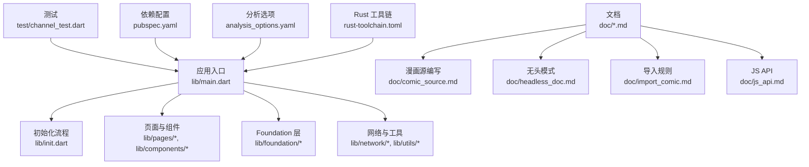
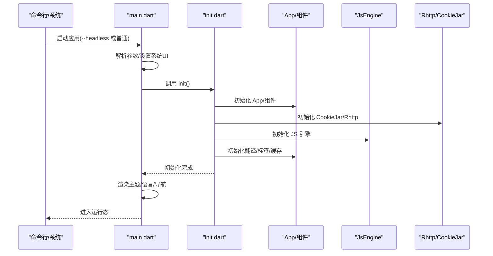
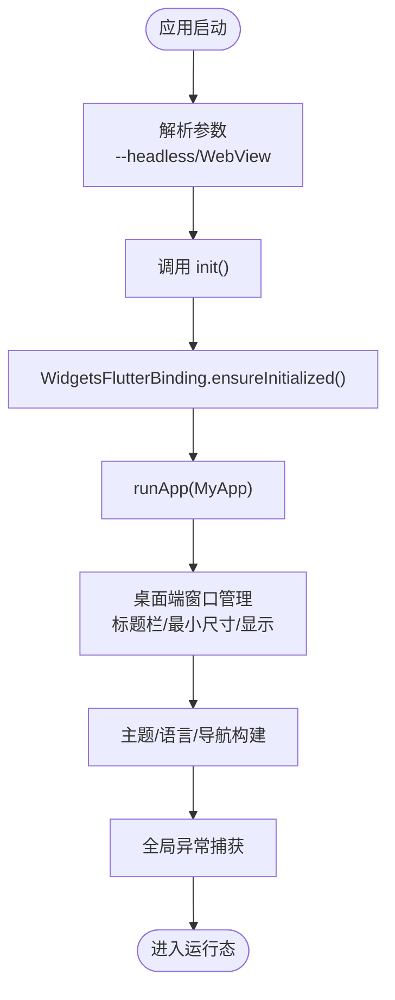
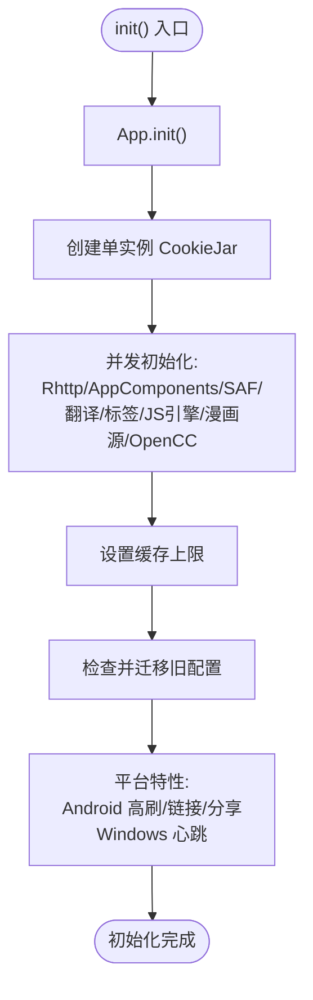
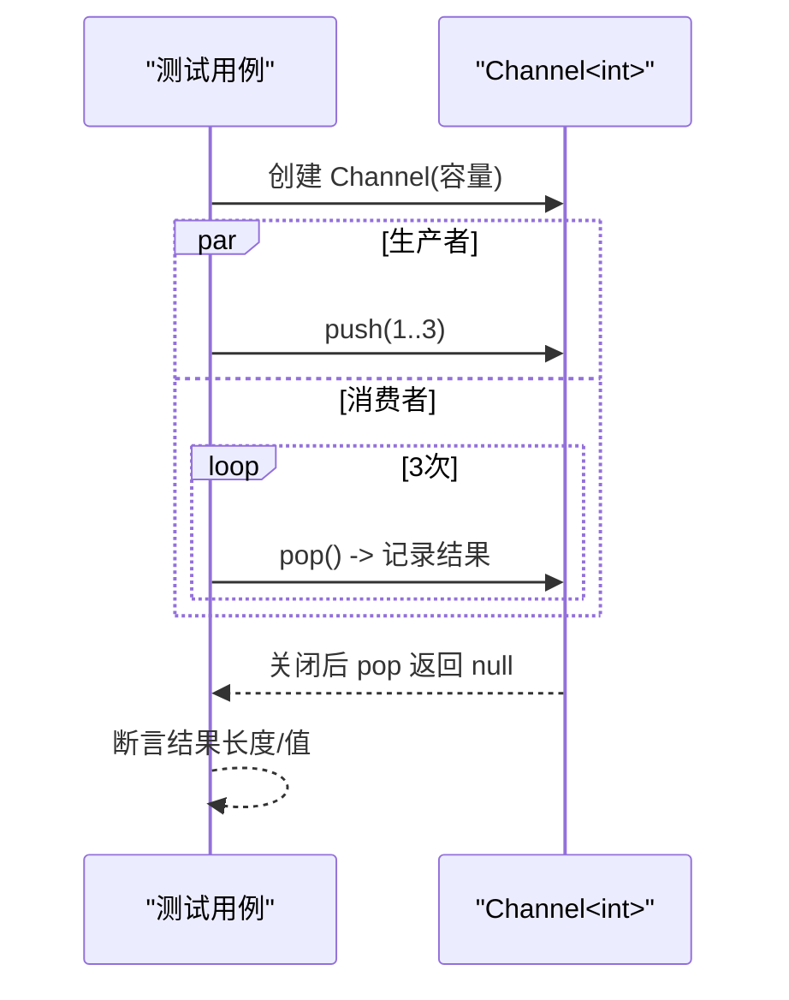
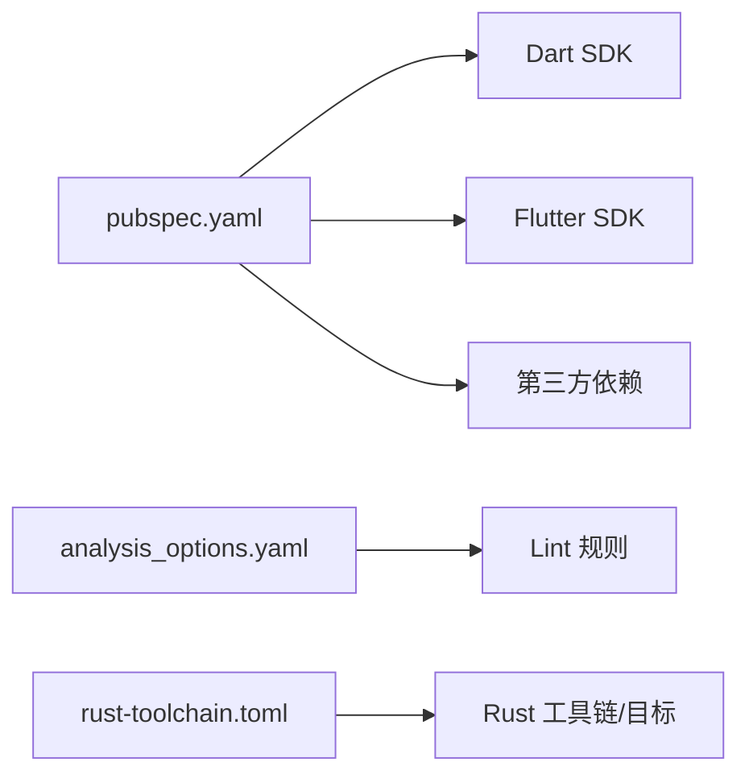

# 开发指南

<cite>
**本文引用的文件**
- [README.md](file://README.md)
- [pubspec.yaml](file://pubspec.yaml)
- [analysis_options.yaml](file://analysis_options.yaml)
- [rust-toolchain.toml](file://rust-toolchain.toml)
- [lib/main.dart](file://lib/main.dart)
- [lib/init.dart](file://lib/init.dart)
- [test/channel_test.dart](file://test/channel_test.dart)
- [doc/comic_source.md](file://doc/comic_source.md)
- [doc/headless_doc.md](file://doc/headless_doc.md)
- [doc/import_comic.md](file://doc/import_comic.md)
- [doc/js_api.md](file://doc/js_api.md)
</cite>

## 目录
1. [简介](#简介)
2. [项目结构](#项目结构)
3. [核心组件](#核心组件)
4. [架构总览](#架构总览)
5. [详细组件分析](#详细组件分析)
6. [依赖关系分析](#依赖关系分析)
7. [性能考虑](#性能考虑)
8. [调试与测试指南](#调试与测试指南)
9. [贡献指南](#贡献指南)
10. [故障排查](#故障排查)
11. [结论](#结论)

## 简介
本开发指南面向希望参与 Venera（漫画阅读器）项目的开发者，涵盖开发环境搭建、代码规范、调试与测试策略、GitHub 工作流与自动化构建、以及贡献流程。Venera 支持本地与网络漫画阅读，并通过 JavaScript 源脚本扩展来源能力；同时提供无头模式以支持命令行自动化任务。

## 项目结构
仓库采用按平台与功能分层的组织方式：
- 平台层：android、ios、linux、macos、windows
- 应用入口与核心逻辑：lib（包含入口 main.dart、初始化 init.dart、页面与组件）
- 文档：doc（包含漫画源编写、无头模式、导入规则、JS API）
- 测试：test（包含单元测试示例）
- 配置：pubspec.yaml（Flutter/Dart 依赖）、analysis_options.yaml（分析与 Lint 规则）、rust-toolchain.toml（Rust 工具链）

图表来源
- [lib/main.dart](file://lib/main.dart#L1-L321)
- [lib/init.dart](file://lib/init.dart#L1-L124)
- [pubspec.yaml](file://pubspec.yaml#L1-L122)
- [analysis_options.yaml](file://analysis_options.yaml#L1-L31)
- [rust-toolchain.toml](file://rust-toolchain.toml#L1-L4)
- [test/channel_test.dart](file://test/channel_test.dart#L1-L115)
- [doc/comic_source.md](file://doc/comic_source.md#L1-L740)
- [doc/headless_doc.md](file://doc/headless_doc.md#L1-L181)
- [doc/import_comic.md](file://doc/import_comic.md#L1-L62)
- [doc/js_api.md](file://doc/js_api.md#L1-L513)

章节来源
- [README.md](file://README.md#L1-L39)
- [pubspec.yaml](file://pubspec.yaml#L1-L122)
- [analysis_options.yaml](file://analysis_options.yaml#L1-L31)
- [rust-toolchain.toml](file://rust-toolchain.toml#L1-L4)

## 核心组件
- 应用入口与生命周期管理：负责解析参数、初始化系统 UI、窗口管理、主题与语言设置、错误捕获等。
- 初始化流程：集中初始化 App、Cookie Jar、HTTP 客户端、组件、JS 引擎、漫画源管理、翻译与缓存等。
- 页面与导航：主页、认证页、设置页等，配合动态颜色与多语言支持。
- 基础设施与工具：日志、缓存、链接处理、文本分享、OpenCC 繁简转换、标签翻译等。

章节来源
- [lib/main.dart](file://lib/main.dart#L1-L321)
- [lib/init.dart](file://lib/init.dart#L1-L124)

## 架构总览
下图展示应用启动到渲染的关键交互：

图表来源
- [lib/main.dart](file://lib/main.dart#L20-L58)
- [lib/init.dart](file://lib/init.dart#L37-L77)

## 详细组件分析

### 入口与生命周期（main.dart）
- 参数解析：支持 --headless 无头模式与 WebView 标题栏检测。
- 初始化：确保 Flutter 绑定已初始化，执行 init()，桌面端设置窗口标题栏样式与最小尺寸。
- 错误处理：全局异常捕获并记录日志。
- 主题与语言：根据设置选择动态色彩、字体回退、明暗主题与区域化资源。
- 导航与覆盖：在需要时插入遮罩层，处理生命周期事件触发认证页。

图表来源
- [lib/main.dart](file://lib/main.dart#L20-L58)

章节来源
- [lib/main.dart](file://lib/main.dart#L1-L321)

### 初始化流程（init.dart）
- 组件初始化：App、组件系统、SAF 任务、翻译、标签、JS 引擎、漫画源管理、OpenCC。
- 并行初始化：使用 Future.wait 并发启动多个子系统。
- 配置迁移：检查旧配置并迁移至新格式。
- 平台特性：Android 设置高刷、Windows 心跳通道、链接与文本分享处理。

图表来源
- [lib/init.dart](file://lib/init.dart#L37-L77)

章节来源
- [lib/init.dart](file://lib/init.dart#L1-L124)

### 测试组件（test/channel_test.dart）
- 单元测试：验证 Channel 的生产-消费模型，包括容量限制、关闭行为与多消费者场景。
- 测试策略：异步推送/弹出、结果断言、并发等待。

图表来源
- [test/channel_test.dart](file://test/channel_test.dart#L1-L115)

章节来源
- [test/channel_test.dart](file://test/channel_test.dart#L1-L115)

### 漫画源编写（doc/comic_source.md）
- 源列表：通过 JSON 列表加载 JS 源脚本，支持 CDN 与仓库镜像。
- 模板与 API：基于模板类扩展，实现探索页、分类、搜索、收藏、详情、评论、设置与翻译等模块。
- 类型与数据结构：Comic、ComicDetails、Comment、ImageLoadingConfig 等。
- 多类型探索页：多部分页、多页列表、混合类型。
- 登录与账户：账号密码登录、WebView 登录、Cookie 登录与注销。
- 设置与回调：输入、选择、开关、回调按钮等。

章节来源
- [doc/comic_source.md](file://doc/comic_source.md#L1-L740)

### 无头模式（doc/headless_doc.md）
- 使用方式：命令行传入 --headless 与具体命令。
- 子命令：WebDAV 同步（上传/下载）、更新漫画源脚本、订阅更新并返回更新列表。
- 输出格式：统一 JSON 对象，包含进度与最终汇总，便于脚本解析。

章节来源
- [doc/headless_doc.md](file://doc/headless_doc.md#L1-L181)

### 导入规则（doc/import_comic.md）
- 目录结构：支持带章节与不带章节两种结构，封面可选，排序依据文件名。
- 归档格式：支持 CBZ/CB7/ZIP/7Z 等归档格式。

章节来源
- [doc/import_comic.md](file://doc/import_comic.md#L1-L62)

### JS API（doc/js_api.md）
- 数据转换：UTF-8 编解码、Base64、MD5/SHA 家族、HMAC、AES/RSA 加解密、十六进制。
- 网络：通用请求封装、GET/POST/PUT/DELETE/PATCH、Cookie 管理、fetch 包装。
- HTML 解析：DOM 查询、属性访问、父子节点遍历。
- UI 与工具：消息提示、对话框、URL 打开、加载对话框、输入/选择对话框、UUID/随机数、console 日志。
- 类型定义：Cookie、Comic、ComicDetails、Comment、ImageLoadingConfig、ComicSource。

章节来源
- [doc/js_api.md](file://doc/js_api.md#L1-L513)

## 依赖关系分析
- Flutter 版本与 SDK：Dart >=3.8.0 <4.0.0，Flutter 3.38.5。
- 关键依赖：sqlite3、dio、html、photo_view、flutter_qjs、flutter_inappwebview、webdav_client、battery_plus、local_auth、yaml、lodepng_flutter 等。
- 分析与 Lint：启用 Flutter 推荐 Lint 规则，可按需调整规则集。
- Rust 工具链：指定版本与交叉目标，用于原生能力或构建。

图表来源
- [pubspec.yaml](file://pubspec.yaml#L7-L9)
- [analysis_options.yaml](file://analysis_options.yaml#L8-L10)
- [rust-toolchain.toml](file://rust-toolchain.toml#L1-L4)

章节来源
- [pubspec.yaml](file://pubspec.yaml#L1-L122)
- [analysis_options.yaml](file://analysis_options.yaml#L1-L31)
- [rust-toolchain.toml](file://rust-toolchain.toml#L1-L4)

## 性能考虑
- 并行初始化：通过并发启动多个子系统减少冷启动时间。
- 缓存策略：根据设置限制缓存大小，避免内存压力。
- 平台优化：Android 高刷率设置、Windows 心跳通道保持前台活跃。
- 图像与网络：通过 JS API 的 ImageLoadingConfig 与网络请求封装控制加载与重试策略。

## 调试与测试指南

### 开发环境搭建
- Flutter 安装与配置：参考官方安装指南。
- Rust 工具链：安装指定版本与交叉编译目标，满足原生构建需求。
- IDE 设置：建议使用支持 Flutter 的 IDE，并启用分析器与 Lint 提示。
- 调试工具：利用 Flutter DevTools 进行性能与内存分析。

章节来源
- [README.md](file://README.md#L21-L25)
- [rust-toolchain.toml](file://rust-toolchain.toml#L1-L4)

### 代码规范与约定
- 分析与 Lint：遵循 Flutter 推荐规则，必要时自定义规则并进行抑制。
- 文件命名：按功能模块划分目录，页面与组件分离，资源与文档独立。
- 注释标准：对公共 API 与复杂逻辑添加清晰注释，保持一致性。

章节来源
- [analysis_options.yaml](file://analysis_options.yaml#L8-L31)

### 调试技巧
- 全局异常捕获：在入口与错误回调中记录异常堆栈，便于定位问题。
- 平台特性：针对 Android/Windows 的特殊行为（如高刷、心跳）进行针对性调试。
- 日志输出：结合日志模块输出关键路径信息。

章节来源
- [lib/main.dart](file://lib/main.dart#L54-L56)
- [lib/init.dart](file://lib/init.dart#L66-L68)

### 测试策略
- 单元测试：使用 Flutter Test 编写，覆盖核心数据结构与算法（如 Channel）。
- 集成测试：对初始化流程、页面导航与平台特性进行端到端验证。
- 性能测试：结合 DevTools 与基准测试评估初始化与渲染性能。

章节来源
- [test/channel_test.dart](file://test/channel_test.dart#L1-L115)

## 贡献指南
- 代码提交规范：建议采用清晰的提交信息，描述变更目的与影响范围。
- 问题报告：提供复现步骤、设备与系统信息、日志片段与期望/实际行为。
- 功能请求：描述使用场景、预期 API 或行为，并附上相关文档链接。
- 参与路径：从修复小问题开始，逐步参与模块设计与文档完善。

## 故障排查
- 初始化失败：检查 init() 中各子系统的异常日志，确认依赖可用性与权限。
- 平台差异：Android 高刷设置失败、Windows 心跳异常等，分别查看对应平台处理逻辑。
- 无头模式：确认命令格式与输出 JSON 结构，解析 Progress/ProgressError 与最终汇总。

章节来源
- [lib/init.dart](file://lib/init.dart#L57-L77)
- [doc/headless_doc.md](file://doc/headless_doc.md#L105-L181)

## 结论
本指南提供了从环境搭建到贡献参与的完整路径，结合现有代码与文档，开发者可以快速理解项目架构、掌握调试与测试方法，并按照规范高效协作。建议在开发过程中持续关注初始化流程、平台特性与 JS 源生态，以保证功能稳定性与扩展性。