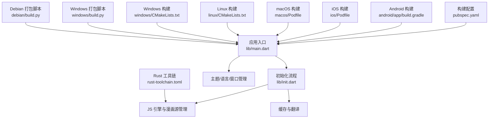
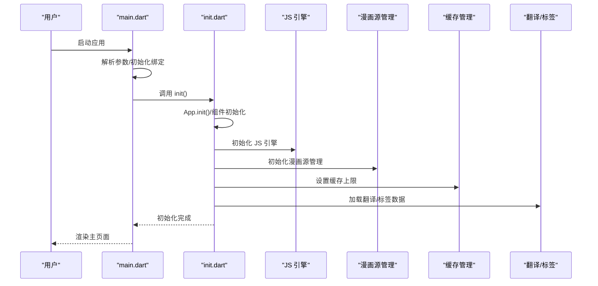
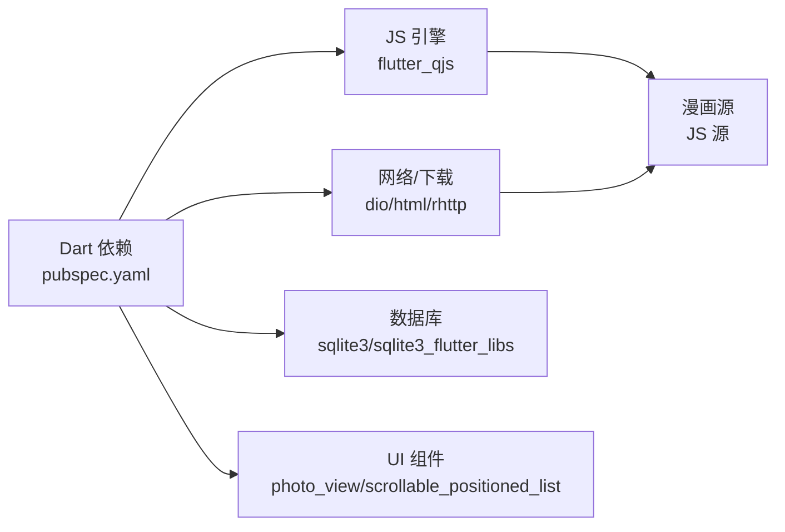

# 快速开始

<cite>
**本文引用的文件**
- [README.md](file://README.md)
- [pubspec.yaml](file://pubspec.yaml)
- [rust-toolchain.toml](file://rust-toolchain.toml)
- [lib/main.dart](file://lib/main.dart)
- [lib/init.dart](file://lib/init.dart)
- [android/app/build.gradle](file://android/app/build.gradle)
- [android/gradle.properties](file://android/gradle.properties)
- [ios/Podfile](file://ios/Podfile)
- [macos/Podfile](file://macos/Podfile)
- [linux/CMakeLists.txt](file://linux/CMakeLists.txt)
- [windows/CMakeLists.txt](file://windows/CMakeLists.txt)
- [windows/build.py](file://windows/build.py)
- [debian/build.py](file://debian/build.py)
- [doc/comic_source.md](file://doc/comic_source.md)
- [doc/import_comic.md](file://doc/import_comic.md)
- [ios/Runner/AppDelegate.swift](file://ios/Runner/AppDelegate.swift)
- [macos/Runner/AppDelegate.swift](file://macos/Runner/AppDelegate.swift)
</cite>

## 目录
1. [简介](#简介)
2. [项目结构](#项目结构)
3. [核心组件](#核心组件)
4. [架构总览](#架构总览)
5. [详细组件分析](#详细组件分析)
6. [依赖关系分析](#依赖关系分析)
7. [性能注意事项](#性能注意事项)
8. [故障排查指南](#故障排查指南)
9. [结论](#结论)
10. [附录](#附录)

## 简介
Venera 是一款支持本地与网络漫画阅读的跨平台应用，基于 Flutter 开发，并通过 JavaScript 引擎动态加载漫画源。本“快速开始”旨在帮助新用户在最短时间内完成环境搭建、从源码编译、运行应用以及进行基本操作（添加漫画源、浏览漫画等）。

## 项目结构
仓库采用 Flutter 标准多平台布局：根目录包含 Flutter 应用层（lib）、平台适配层（android、ios、linux、macos、windows），以及文档与打包脚本（doc、debian、windows 等）。关键特性与构建信息集中在以下文件中：
- 应用入口与主题/国际化/窗口管理：lib/main.dart
- 初始化流程与 JS 源引擎、缓存、翻译等：lib/init.dart
- 构建与依赖声明：pubspec.yaml
- Rust 工具链与目标平台：rust-toolchain.toml
- 平台构建配置：各平台的构建脚本与配置文件

图表来源
- [lib/main.dart](file://lib/main.dart#L20-L58)
- [lib/init.dart](file://lib/init.dart#L37-L77)
- [pubspec.yaml](file://pubspec.yaml#L1-L122)
- [rust-toolchain.toml](file://rust-toolchain.toml#L1-L4)
- [android/app/build.gradle](file://android/app/build.gradle#L32-L132)
- [ios/Podfile](file://ios/Podfile#L1-L45)
- [macos/Podfile](file://macos/Podfile#L1-L44)
- [linux/CMakeLists.txt](file://linux/CMakeLists.txt#L1-L146)
- [windows/CMakeLists.txt](file://windows/CMakeLists.txt#L1-L109)
- [windows/build.py](file://windows/build.py#L1-L40)
- [debian/build.py](file://debian/build.py#L1-L36)

章节来源
- [README.md](file://README.md#L1-L39)
- [pubspec.yaml](file://pubspec.yaml#L1-L122)
- [rust-toolchain.toml](file://rust-toolchain.toml#L1-L4)

## 核心组件
- 应用入口与生命周期
  - 入口函数负责解析参数、初始化 IO、调用 init() 完成全局初始化，随后渲染主界面。
  - 支持无头模式（headless）与桌面标题栏样式设置。
- 初始化流程
  - 负责 App 初始化、CookieJar 创建、Rhttp 初始化、组件初始化、SAF 任务、翻译、JS 引擎、漫画源管理、OpenCC 等。
  - 设置缓存上限、检查旧配置迁移、处理链接与分享、设置高刷屏（Android）等。
- 主题与国际化
  - 动态色彩方案、字体回退策略、系统 UI 配置、多语言支持与区域设置。
- 平台集成
  - iOS/macOS 方法通道用于代理查询、目录选择、剪贴板写入等；Windows 通过 MethodChannel 发送心跳以保持运行状态。

章节来源
- [lib/main.dart](file://lib/main.dart#L20-L58)
- [lib/main.dart](file://lib/main.dart#L60-L291)
- [lib/init.dart](file://lib/init.dart#L37-L77)
- [lib/init.dart](file://lib/init.dart#L79-L104)
- [ios/Runner/AppDelegate.swift](file://ios/Runner/AppDelegate.swift#L24-L55)
- [macos/Runner/AppDelegate.swift](file://macos/Runner/AppDelegate.swift#L11-L40)

## 架构总览
下图展示了应用启动到渲染主页面的关键流程，以及初始化阶段对 JS 引擎、漫画源、缓存、翻译等模块的并行初始化。

图表来源
- [lib/main.dart](file://lib/main.dart#L20-L58)
- [lib/init.dart](file://lib/init.dart#L37-L77)

## 详细组件分析

### 环境搭建与编译
- Flutter SDK
  - 版本要求与依赖声明见 pubspec.yaml 的 environment 字段。
  - 参考官方安装指南后，执行 flutter pub get 获取 Dart 依赖。
- Rust 工具链
  - 使用 rust-toolchain.toml 指定版本与交叉编译目标（如 Android、Darwin 等）。
- 平台 SDK
  - Android：Gradle、NDK、JDK 17；在 android/app/build.gradle 中配置签名与 ABI 分割。
  - iOS：Podfile 指定最低系统版本与 Flutter Pods 安装。
  - macOS：Podfile 指定最低系统版本与 Flutter Pods 安装。
  - Linux：CMakeLists.txt 指定 GTK 依赖与资源安装路径。
  - Windows：CMakeLists.txt 指定编译器与资源安装路径；提供打包脚本 windows/build.py 与 debian/build.py。

章节来源
- [pubspec.yaml](file://pubspec.yaml#L7-L9)
- [rust-toolchain.toml](file://rust-toolchain.toml#L1-L4)
- [android/app/build.gradle](file://android/app/build.gradle#L32-L100)
- [android/gradle.properties](file://android/gradle.properties#L1-L6)
- [ios/Podfile](file://ios/Podfile#L1-L45)
- [macos/Podfile](file://macos/Podfile#L1-L44)
- [linux/CMakeLists.txt](file://linux/CMakeLists.txt#L54-L78)
- [windows/CMakeLists.txt](file://windows/CMakeLists.txt#L40-L58)
- [windows/build.py](file://windows/build.py#L1-L40)
- [debian/build.py](file://debian/build.py#L1-L36)

### 从源码编译
- 常用命令
  - Flutter 构建：flutter build apk（Android）、flutter build ios（iOS）、flutter build macos（macOS）、flutter build linux（Linux）、flutter build windows（Windows）。
  - 也可使用平台特定脚本：windows/build.py、debian/build.py。
- 关键配置
  - Android：签名配置、ABI 分割、NDK 版本、Java/Kotlin 版本。
  - iOS/macOS：Pod 安装、最低系统版本、Flutter Pods。
  - Linux/Windows：CMake 生成与安装规则、资源复制。

章节来源
- [README.md](file://README.md#L21-L25)
- [android/app/build.gradle](file://android/app/build.gradle#L32-L132)
- [ios/Podfile](file://ios/Podfile#L28-L38)
- [macos/Podfile](file://macos/Podfile#L27-L37)
- [linux/CMakeLists.txt](file://linux/CMakeLists.txt#L95-L145)
- [windows/CMakeLists.txt](file://windows/CMakeLists.txt#L61-L108)
- [windows/build.py](file://windows/build.py#L9-L17)
- [debian/build.py](file://debian/build.py#L28-L30)

### 基本使用教程
- 启动应用
  - 在终端执行 flutter run 或使用 IDE 启动模拟器/设备。
  - 首次启动会进行初始化（JS 引擎、漫画源、缓存、翻译等）。
- 添加漫画源
  - 进入“漫画源列表”，添加配置仓库地址（示例 CDN 链接）以加载 JS 源。
  - JS 源编写规范与模板参见文档。
- 浏览漫画
  - 从探索页或分类页查找漫画，进入详情页后可加载章节图片并进行阅读。
  - 支持收藏、评论、标签翻译等功能（若源支持）。

章节来源
- [lib/init.dart](file://lib/init.dart#L37-L77)
- [doc/comic_source.md](file://doc/comic_source.md#L16-L25)
- [doc/comic_source.md](file://doc/comic_source.md#L44-L740)

### 导入本地漫画
- 目录结构
  - 支持带章节与不带章节两种目录结构；封面可选，排序按文件名。
- 归档格式
  - 支持 CBZ、CB7、ZIP、7Z 等归档格式。

章节来源
- [doc/import_comic.md](file://doc/import_comic.md#L8-L62)

### 平台集成要点
- iOS/macOS 方法通道
  - 提供代理查询、目录选择、剪贴板写入等能力，便于与原生系统交互。
- Windows 心跳机制
  - 通过 MethodChannel 定时发送心跳，维持应用运行状态。

章节来源
- [ios/Runner/AppDelegate.swift](file://ios/Runner/AppDelegate.swift#L24-L55)
- [macos/Runner/AppDelegate.swift](file://macos/Runner/AppDelegate.swift#L11-L40)
- [lib/init.dart](file://lib/init.dart#L69-L76)

## 依赖关系分析
- Dart 依赖
  - 包含 sqlite3、dio、html、photo_view、flutter_qjs、webdav_client 等，用于数据库、网络、图片、JS 引擎、WebDAV 等功能。
- Rust 与 JS 引擎
  - 通过 flutter_qjs 与 rhttp 等包集成 JS 引擎与网络请求能力。
- 平台依赖
  - Android 依赖 AndroidX/Jetifier；iOS/macOS 依赖 CocoaPods；Linux 依赖 GTK；Windows 依赖 Flutter C++ 插件与资源。

图表来源
- [pubspec.yaml](file://pubspec.yaml#L11-L91)
- [lib/init.dart](file://lib/init.dart#L11-L21)

章节来源
- [pubspec.yaml](file://pubspec.yaml#L11-L91)

## 性能注意事项
- 初始化并行化
  - init() 中对多个子系统进行 Future.wait 并行初始化，缩短启动时间。
- 缓存与刷新
  - 启动时设置缓存上限，避免内存占用过高；支持更新检查与自动同步。
- 平台差异
  - Android 高刷屏设置、iOS/macOS 标题栏样式、Windows 心跳维持等，均针对平台特性优化体验。

章节来源
- [lib/init.dart](file://lib/init.dart#L41-L51)
- [lib/init.dart](file://lib/init.dart#L55-L65)
- [lib/main.dart](file://lib/main.dart#L31-L53)
- [lib/init.dart](file://lib/init.dart#L69-L76)

## 故障排查指南
- Flutter 安装与依赖
  - 确认 Flutter SDK 版本满足 pubspec.yaml 要求；执行 flutter pub get 获取依赖。
- Rust 工具链
  - 使用 rustup 安装 rust-toolchain.toml 指定版本；确保交叉编译目标已安装。
- Android 构建
  - 检查 JDK 17、NDK 版本、签名配置与 ABI 分割；必要时清理并重新生成。
- iOS/macOS 构建
  - 执行 pod install 安装 Pods；确认最低系统版本与 Flutter Pods 路径。
- Linux 构建
  - 确保 GTK 依赖可用；遵循 CMake 安装规则与资源复制。
- Windows 构建与打包
  - 使用 windows/build.py 自动构建并生成安装包；检查 Inno Setup 翻译文件下载。
- 日志与异常
  - 应用捕获未处理异常并记录日志；可在初始化阶段检查错误堆栈定位问题。

章节来源
- [pubspec.yaml](file://pubspec.yaml#L7-L9)
- [rust-toolchain.toml](file://rust-toolchain.toml#L1-L4)
- [android/app/build.gradle](file://android/app/build.gradle#L32-L132)
- [ios/Podfile](file://ios/Podfile#L13-L26)
- [macos/Podfile](file://macos/Podfile#L12-L25)
- [linux/CMakeLists.txt](file://linux/CMakeLists.txt#L54-L78)
- [windows/build.py](file://windows/build.py#L1-L40)
- [lib/init.dart](file://lib/init.dart#L24-L35)
- [lib/init.dart](file://lib/init.dart#L66-L68)

## 结论
通过本快速开始指南，您可以在本地完成 Flutter 与 Rust 环境准备、平台 SDK 配置，并成功从源码编译与运行 Venera。随后即可添加漫画源、导入本地漫画并进行阅读。遇到问题时，可依据“故障排查指南”逐项核对配置与日志，快速定位并解决。

## 附录
- 常用命令参考
  - flutter run
  - flutter build apk / ios / macos / linux / windows
  - python windows/build.py
  - python debian/build.py x64/arm64
- 相关文档
  - 漫画源编写与模板：参见 doc/comic_source.md
  - 本地漫画导入规范：参见 doc/import_comic.md

章节来源
- [README.md](file://README.md#L21-L25)
- [doc/comic_source.md](file://doc/comic_source.md#L1-L740)
- [doc/import_comic.md](file://doc/import_comic.md#L1-L62)