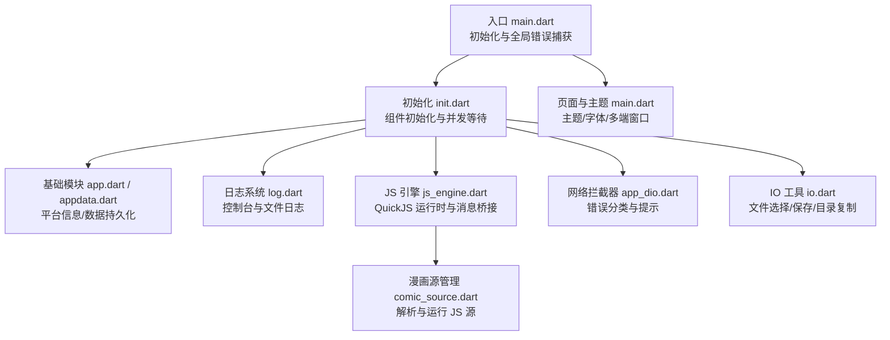
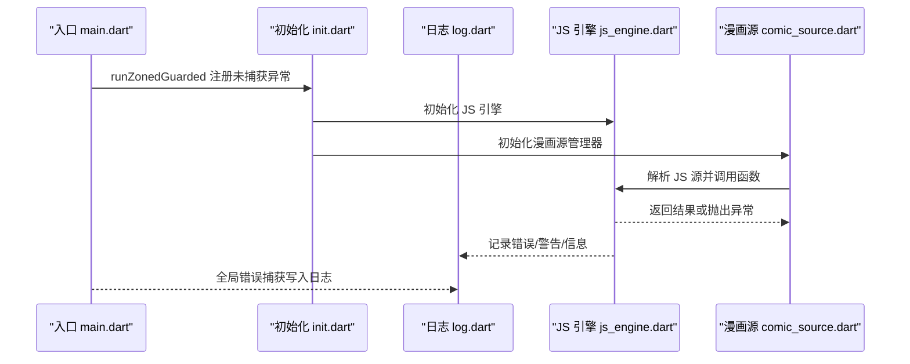
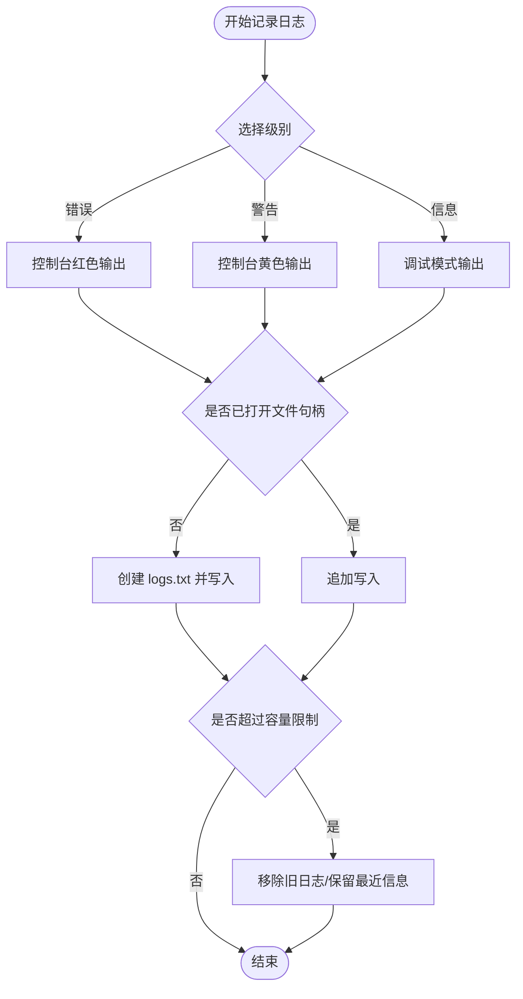
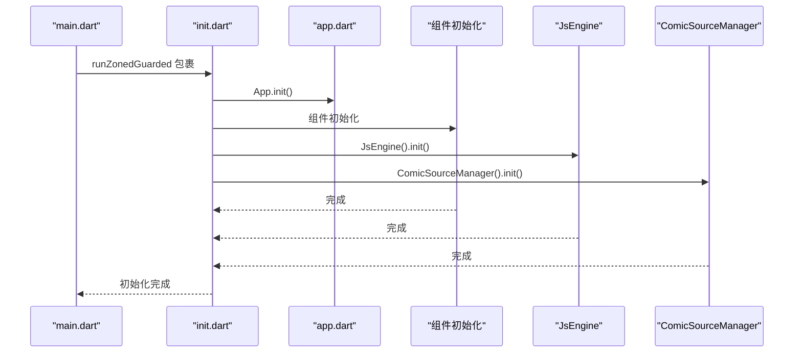
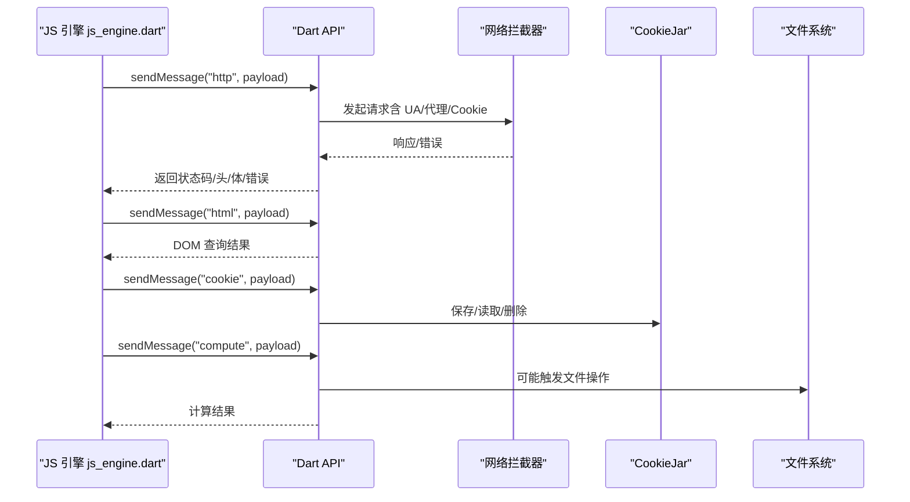
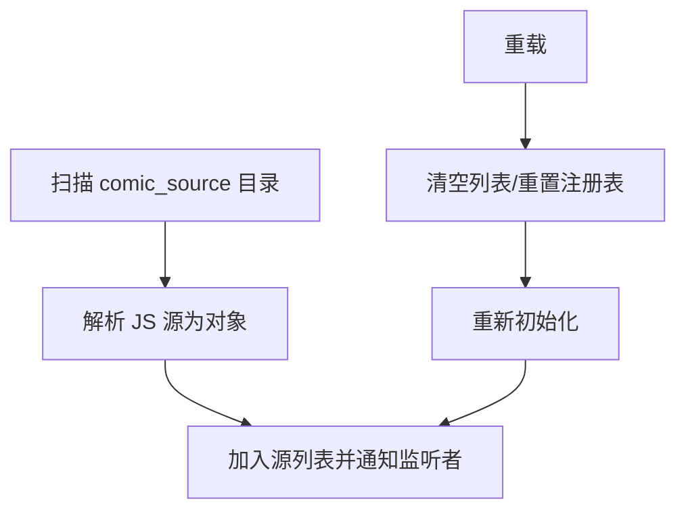
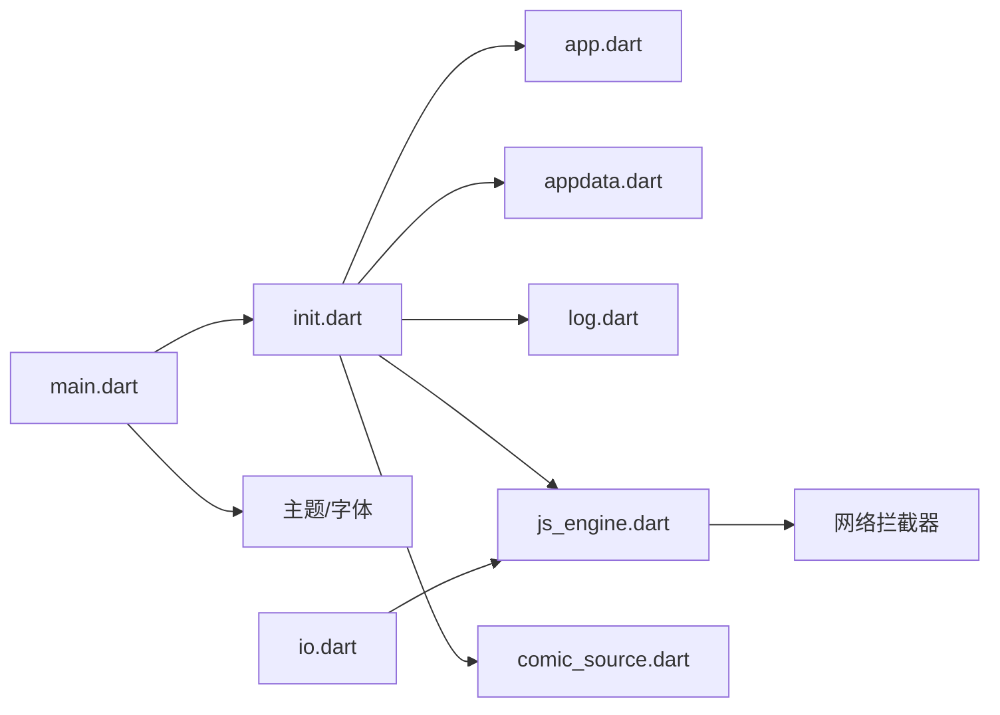

# 故障排除与常见问题

<cite>
**本文引用的文件**
- [README.md](file://README.md)
- [main.dart](file://lib/main.dart)
- [init.dart](file://lib/init.dart)
- [log.dart](file://lib/foundation/log.dart)
- [app.dart](file://lib/foundation/app.dart)
- [appdata.dart](file://lib/foundation/appdata.dart)
- [io.dart](file://lib/utils/io.dart)
- [js_engine.dart](file://lib/foundation/js_engine.dart)
- [comic_source.dart](file://lib/foundation/comic_source/comic_source.dart)
- [comic_source.md](file://doc/comic_source.md)
- [font.dart](file://patch/font.dart)
</cite>

## 目录
1. [简介](#简介)
2. [项目结构](#项目结构)
3. [核心组件](#核心组件)
4. [架构总览](#架构总览)
5. [详细组件分析](#详细组件分析)
6. [依赖关系分析](#依赖关系分析)
7. [性能考虑](#性能考虑)
8. [故障排除指南](#故障排除指南)
9. [结论](#结论)
10. [附录](#附录)

## 简介
本指南面向使用者与开发者，聚焦于应用在实际使用中可能遇到的典型问题与解决路径，包括漫画源加载失败、网络连接问题、字体显示异常、JavaScript 执行错误等，并提供调试工具与日志分析方法、性能优化建议与内存管理最佳实践，以及跨平台（Windows/Linux/macOS/Android/iOS）特有问题的定位与修复策略。

## 项目结构
应用采用 Flutter 多端架构，核心入口负责初始化、主题与窗口管理；基础层提供日志、配置、数据持久化与平台能力；网络层封装日志拦截与错误提示；JS 引擎用于运行漫画源脚本；页面与组件层提供 UI 与交互。

图表来源
- [main.dart](file://lib/main.dart#L20-L58)
- [init.dart](file://lib/init.dart#L37-L77)
- [log.dart](file://lib/foundation/log.dart#L20-L116)
- [js_engine.dart](file://lib/foundation/js_engine.dart#L48-L110)
- [comic_source.dart](file://lib/foundation/comic_source/comic_source.dart#L35-L108)
- [io.dart](file://lib/utils/io.dart#L17-L462)

章节来源
- [README.md](file://README.md#L1-L39)
- [main.dart](file://lib/main.dart#L20-L58)
- [init.dart](file://lib/init.dart#L37-L77)

## 核心组件
- 全局错误捕获与日志：应用启动时注册未捕获异常处理器，统一写入日志系统；日志支持文件落盘与长度限制，便于问题回溯。
- 初始化流程：并发初始化 App、CookieJar、翻译、OpenCC、JS 引擎、漫画源管理器等，避免单点阻塞导致崩溃。
- JS 引擎：通过 QuickJS 执行漫画源脚本，提供 HTTP 请求、DOM 解析、Cookie 管理、随机数、UUID、剪贴板、UI 交互等 API，并对异常进行记录。
- 漫画源管理：扫描本地 JS 源文件，解析并构建 ComicSource 对象，支持重载与更新检查。
- 平台与字体：根据桌面平台自动设置字体族与回退字体，确保中日韩文字显示稳定。

章节来源
- [main.dart](file://lib/main.dart#L54-L56)
- [log.dart](file://lib/foundation/log.dart#L20-L116)
- [init.dart](file://lib/init.dart#L37-L77)
- [js_engine.dart](file://lib/foundation/js_engine.dart#L48-L110)
- [comic_source.dart](file://lib/foundation/comic_source/comic_source.dart#L35-L108)
- [main.dart](file://lib/main.dart#L144-L176)

## 架构总览
下图展示从入口到日志、网络、JS 引擎与漫画源的关键交互路径，帮助快速定位问题来源。

图表来源
- [main.dart](file://lib/main.dart#L54-L56)
- [init.dart](file://lib/init.dart#L37-L77)
- [js_engine.dart](file://lib/foundation/js_engine.dart#L80-L110)
- [comic_source.dart](file://lib/foundation/comic_source/comic_source.dart#L54-L81)

## 详细组件分析

### 日志系统与调试工具
- 日志级别与输出：支持错误、警告、信息三类，控制台彩色打印，必要时写入文件 logs.txt（Android 写入外部存储，其他平台写入应用数据目录）。
- 日志容量与截断：限制单条内容最大长度与总条目上限，避免无限增长；超过上限时优先移除信息级别日志。
- 使用建议：问题复现后导出日志文件，结合错误堆栈定位具体模块与调用链。

图表来源
- [log.dart](file://lib/foundation/log.dart#L41-L88)

章节来源
- [log.dart](file://lib/foundation/log.dart#L20-L116)

### 初始化与并发启动
- 并发初始化：App、组件、翻译、OpenCC、JS 引擎、漫画源管理器等通过 Future.wait 并发启动，缩短冷启动时间。
- 错误隔离：每个 Future 包裹 wait 方法，避免未处理异常导致崩溃；全局 FlutterError.onError 也统一记录。
- 平台特性：Android 高刷模式设置、Windows 心跳通道、链接与分享处理等。

图表来源
- [main.dart](file://lib/main.dart#L26-L57)
- [init.dart](file://lib/init.dart#L37-L77)

章节来源
- [main.dart](file://lib/main.dart#L26-L57)
- [init.dart](file://lib/init.dart#L37-L77)

### JS 引擎与漫画源执行
- 运行时：初始化 QuickJS，注入全局 sendMessage、版本号等；加载 assets/init.js 或缓存的初始化脚本。
- 消息桥接：JS 通过 sendMessage 调用 Dart 层 API（HTTP、DOM、Cookie、随机数、UUID、剪贴板、UI、设置读取、延迟等），异常统一记录。
- HTTP 请求：默认 UA、响应体类型、Cookie 管理、代理适配；dart:io 客户端可选；错误分类与人性化提示。
- DOM 解析：支持 parse/querySelector/querySelectorAll/属性/父子节点/文本等操作，文档数量过多会清理最旧文档以控制内存。

图表来源
- [js_engine.dart](file://lib/foundation/js_engine.dart#L112-L212)
- [js_engine.dart](file://lib/foundation/js_engine.dart#L214-L272)
- [js_engine.dart](file://lib/foundation/js_engine.dart#L286-L358)

章节来源
- [js_engine.dart](file://lib/foundation/js_engine.dart#L48-L110)
- [js_engine.dart](file://lib/foundation/js_engine.dart#L112-L212)
- [js_engine.dart](file://lib/foundation/js_engine.dart#L214-L272)
- [js_engine.dart](file://lib/foundation/js_engine.dart#L286-L358)

### 漫画源管理与解析
- 加载：扫描 App.dataPath/comic_source 下的 .js 文件，逐个解析为 ComicSource 对象，异常会被记录但不会中断整体初始化。
- 重载：清空现有源并重新加载，通知监听者刷新 UI。
- 更新：维护可用更新列表，支持 UI 提示与批量更新。

图表来源
- [comic_source.dart](file://lib/foundation/comic_source/comic_source.dart#L54-L81)

章节来源
- [comic_source.dart](file://lib/foundation/comic_source/comic_source.dart#L35-L108)

### 字体与显示问题
- 主题字体：桌面平台（Windows/Linux）默认使用 Noto Sans CJK，并提供多级回退字体，确保中日韩字符显示。
- 字体补丁：提供 HarmonyOS Sans 的下载与集成脚本，演示如何替换字体家族与在 pubspec 中声明字体资源。
- 建议：若出现乱码或字体缺失，优先检查系统字体安装与回退链配置；必要时按补丁脚本方式引入新字体。

章节来源
- [main.dart](file://lib/main.dart#L144-L176)
- [font.dart](file://patch/font.dart#L6-L27)

## 依赖关系分析
- 启动阶段：main.dart 依赖 init.dart 完成全局初始化与错误捕获；init.dart 依赖 app.dart、appdata.dart、js_engine.dart、comic_source.dart 等模块。
- 日志与网络：日志系统贯穿各模块；网络拦截器在 JS 引擎与应用层均被使用，统一错误分类与提示。
- IO 与文件：IO 工具在文件选择、保存、目录复制等场景广泛使用，且在 Android 上通过 IOOverrides 适配 SAF/AndroidFile。

图表来源
- [main.dart](file://lib/main.dart#L20-L58)
- [init.dart](file://lib/init.dart#L37-L77)
- [js_engine.dart](file://lib/foundation/js_engine.dart#L48-L110)
- [io.dart](file://lib/utils/io.dart#L396-L401)

章节来源
- [main.dart](file://lib/main.dart#L20-L58)
- [init.dart](file://lib/init.dart#L37-L77)

## 性能考虑
- 并发初始化：通过 Future.wait 并行启动多个子系统，缩短启动时间。
- 日志容量控制：限制日志条目与单条长度，避免磁盘与内存压力。
- JS 文档缓存：DOM 文档数量过多会清理最旧实例，防止内存膨胀。
- IO 隔离：大文件复制在 Isolate 中执行，避免 UI 卡顿。
- 平台优化：Android 高刷模式、Windows 心跳通道，提升用户体验。

章节来源
- [init.dart](file://lib/init.dart#L41-L51)
- [log.dart](file://lib/foundation/log.dart#L25-L87)
- [js_engine.dart](file://lib/foundation/js_engine.dart#L294-L302)
- [io.dart](file://lib/utils/io.dart#L181-L184)

## 故障排除指南

### 一、漫画源加载失败
- 现象
  - 漫画源列表为空或加载异常。
  - 某些源解析时报错或不显示。
- 诊断步骤
  - 查看日志：确认 ComicSourceManager 初始化过程中的异常记录。
  - 检查源文件：确认 App.dataPath/comic_source 下的 .js 是否存在、命名是否规范。
  - 重载源：尝试在设置中重载漫画源，触发重新扫描与解析。
- 修复建议
  - 删除损坏的源文件后重载。
  - 确认源文件语法与 API 符合模板要求（参考文档）。
  - 若为网络源，检查源列表 URL 与网络连通性。

章节来源
- [comic_source.dart](file://lib/foundation/comic_source/comic_source.dart#L54-L81)
- [log.dart](file://lib/foundation/log.dart#L98-L104)
- [comic_source.md](file://doc/comic_source.md#L1-L740)

### 二、网络连接问题
- 现象
  - 页面加载超时、返回无效状态码、握手失败或频繁被重置。
- 诊断步骤
  - 查看网络拦截器日志，识别超时、握手失败、429 等错误类型。
  - 检查代理与 DNS 设置（应用支持代理与 DNS 覆盖）。
  - 在 Windows 上确认心跳通道是否正常（定时 MethodChannel 调用）。
- 修复建议
  - 切换系统代理或禁用代理重试。
  - 降低请求频率，避开 429 限流。
  - 使用直连或更换 CDN 源地址。

章节来源
- [js_engine.dart](file://lib/foundation/js_engine.dart#L214-L272)
- [init.dart](file://lib/init.dart#L69-L76)

### 三、字体显示异常
- 现象
  - 中文/日文/韩文显示为方块或缺失。
- 诊断步骤
  - 确认桌面平台字体回退链是否生效（Noto Sans CJK 及其回退）。
  - 检查系统字体安装情况与语言包。
- 修复建议
  - 按补丁脚本引入 HarmonyOS Sans 等字体资源，更新 pubspec 与主题字体配置。
  - 在设置中切换语言或主题，观察差异。

章节来源
- [main.dart](file://lib/main.dart#L144-L176)
- [font.dart](file://patch/font.dart#L6-L27)

### 四、JavaScript 执行错误
- 现象
  - 漫画源脚本报错、函数未定义、HTTP 请求失败、DOM 解析异常。
- 诊断步骤
  - 在 JS 引擎侧查看 sendMessage 调用链与返回值，定位具体 API 调用。
  - 检查 JS 源中 HTTP 请求头、Cookie、UA 是否正确。
  - 关注 DOM 文档数量上限与清理逻辑。
- 修复建议
  - 修正脚本语法与 API 使用，确保返回值符合预期。
  - 为请求设置合适的 User-Agent 与 Cookie。
  - 控制 DOM 文档生命周期，及时释放不再使用的文档实例。

章节来源
- [js_engine.dart](file://lib/foundation/js_engine.dart#L112-L212)
- [js_engine.dart](file://lib/foundation/js_engine.dart#L286-L358)

### 五、文件选择/保存/复制异常
- 现象
  - 文件选择弹窗无响应、保存位置不可用、目录复制卡住。
- 诊断步骤
  - 检查 isSelectingFiles 标记，确认外部程序调用期间生命周期状态。
  - Android 上确认 SAF 权限与 IOOverrides 是否正确覆盖。
  - 大文件复制是否在 Isolate 中执行。
- 修复建议
  - 等待当前文件操作完成再发起新的选择/保存。
  - 授予必要权限或改用缓存目录复制后再访问。
  - 将大任务放入 Isolate，避免 UI 卡顿。

章节来源
- [io.dart](file://lib/utils/io.dart#L17-L462)

### 六、跨平台特有问题
- Windows
  - 心跳通道：应用定期通过 MethodChannel 发送心跳，避免某些监控线程误判。
  - 字体：建议使用 Noto 系列回退链，必要时引入第三方字体。
- Linux
  - 透明背景与窗口管理：初始化时设置透明背景与最小尺寸，注意与桌面环境兼容性。
  - 字体：同上。
- Android
  - 高刷模式：尝试设置高刷新率，失败时记录错误但不影响主流程。
  - SAF/IO 适配：通过 IOOverrides 与 SAF 交互，必要时将外部目录复制到缓存再访问。
- macOS/iOS
  - 目录选择：通过 MethodChannel 调用原生接口，注意权限与沙盒限制。

章节来源
- [init.dart](file://lib/init.dart#L69-L76)
- [main.dart](file://lib/main.dart#L31-L53)
- [io.dart](file://lib/utils/io.dart#L365-L401)

### 七、调试工具与日志分析
- 如何导出日志
  - Android：logs.txt 位于外部存储根目录；其他平台：位于应用数据目录。
  - 导出后附带时间戳与错误堆栈，便于定位。
- 分析要点
  - 优先查看错误级别日志，关注网络拦截器与 JS 引擎的错误分类。
  - 结合初始化日志判断是启动阶段还是运行阶段问题。
  - 若涉及漫画源，重点查看 ComicSource 解析与 JS 函数调用链。

章节来源
- [log.dart](file://lib/foundation/log.dart#L41-L88)
- [init.dart](file://lib/init.dart#L37-L77)

## 结论
本指南提供了从入口初始化、日志系统、JS 引擎、漫画源管理到跨平台适配的全链路故障排除方法。建议在问题复现时同步开启日志、导出日志文件，并结合本文提供的诊断步骤与修复建议快速定位与解决问题。对于复杂问题，可分模块逐步缩小范围，优先验证网络与字体、再深入到 JS 执行与源文件解析。

## 附录
- 常用设置项参考
  - 缓存大小、代理、DNS 覆盖、忽略证书错误、预加载页数等，可在设置中调整并观察效果。
- 漫画源开发参考
  - 模板与 API 文档详见文档目录下的漫画源与 JS API 文档。

章节来源
- [appdata.dart](file://lib/foundation/appdata.dart#L165-L312)
- [comic_source.md](file://doc/comic_source.md#L1-L740)