# JavaScript沙盒引擎

<cite>
**本文档引用的文件**
- [js_engine.dart](file://lib/foundation/js_engine.dart)
- [js_pool.dart](file://lib/foundation/js_pool.dart)
- [init.js](file://assets/init.js)
- [js_ui.dart](file://lib/components/js_ui.dart)
- [log.dart](file://lib/foundation/log.dart)
- [pubspec.yaml](file://pubspec.yaml)
- [io.dart](file://lib/utils/io.dart)
</cite>

## 目录
1. [简介](#简介)
2. [项目结构](#项目结构)
3. [核心组件](#核心组件)
4. [架构概览](#架构概览)
5. [详细组件分析](#详细组件分析)
6. [依赖关系分析](#依赖关系分析)
7. [性能考虑](#性能考虑)
8. [故障排除指南](#故障排除指南)
9. [结论](#结论)
10. [附录](#附录)

## 简介

Venera应用的JavaScript沙盒引擎是一个基于QuickJS引擎的安全执行环境，专为漫画应用设计。该引擎通过Dart代码与JavaScript代码的双向通信，提供了受控的JavaScript执行环境，同时确保系统安全性和稳定性。

该沙盒引擎的核心目标是：
- 提供安全的JavaScript代码执行环境
- 实现Dart与JavaScript之间的类型化数据交换
- 支持异步操作和回调机制
- 实现内存管理和资源清理
- 提供调试和日志功能

## 项目结构

Venera应用的JavaScript沙盒引擎主要分布在以下关键目录中：

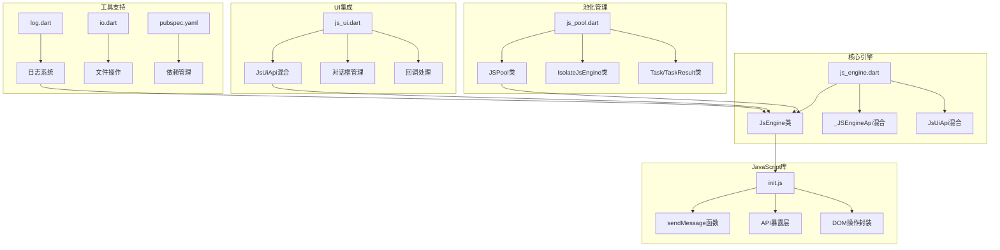

**图表来源**
- [js_engine.dart](file://lib/foundation/js_engine.dart#L48-L284)
- [js_pool.dart](file://lib/foundation/js_pool.dart#L8-L163)
- [init.js](file://assets/init.js#L1-L1520)
- [js_ui.dart](file://lib/components/js_ui.dart#L11-L184)

**章节来源**
- [js_engine.dart](file://lib/foundation/js_engine.dart#L1-L737)
- [js_pool.dart](file://lib/foundation/js_pool.dart#L1-L163)
- [init.js](file://assets/init.js#L1-L1520)
- [js_ui.dart](file://lib/components/js_ui.dart#L1-L259)

## 核心组件

### JsEngine类 - 主引擎

JsEngine是整个沙盒引擎的核心，负责QuickJS引擎的初始化、JavaScript代码执行和API暴露。

**主要职责：**
- QuickJS引擎初始化和配置
- JavaScript代码编译和执行
- Dart到JavaScript的API映射
- 内存管理和资源清理
- 错误处理和异常捕获

**关键特性：**
- 单例模式设计，确保引擎状态一致性
- 缓存机制，避免重复初始化
- 异常安全的执行环境
- 完整的生命周期管理

### JSPool类 - 池化管理

JSPool实现了多实例隔离的JavaScript执行池，提供并发执行能力和资源隔离。

**核心机制：**
- 最大4个隔离实例的池化管理
- 动态负载均衡分配
- 任务队列和结果返回
- 自动资源清理和隔离

### IsolateJsEngine类 - 隔离执行器

每个IsolateJsEngine在独立的Dart Isolate中运行，确保JavaScript代码的完全隔离执行。

**隔离特性：**
- 独立的内存空间
- 防止JavaScript代码相互影响
- 异常隔离和传播
- 资源独立管理

**章节来源**
- [js_engine.dart](file://lib/foundation/js_engine.dart#L48-L284)
- [js_pool.dart](file://lib/foundation/js_pool.dart#L8-L163)

## 架构概览

Venera的JavaScript沙盒引擎采用分层架构设计，实现了从底层引擎到上层应用的完整抽象：

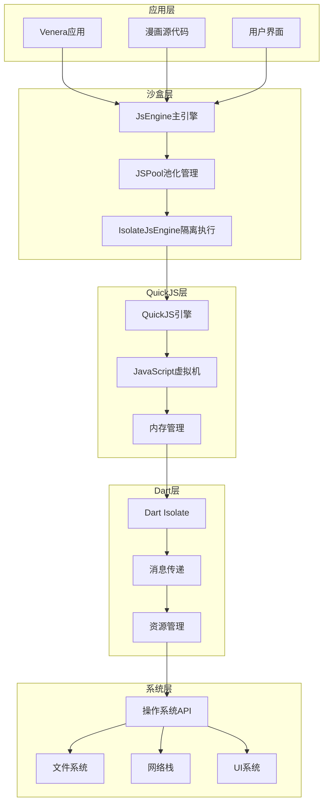

**图表来源**
- [js_engine.dart](file://lib/foundation/js_engine.dart#L80-L110)
- [js_pool.dart](file://lib/foundation/js_pool.dart#L91-L119)
- [js_ui.dart](file://lib/components/js_ui.dart#L14-L59)

### 数据流架构

JavaScript代码通过sendMessage函数与Dart层进行双向通信：

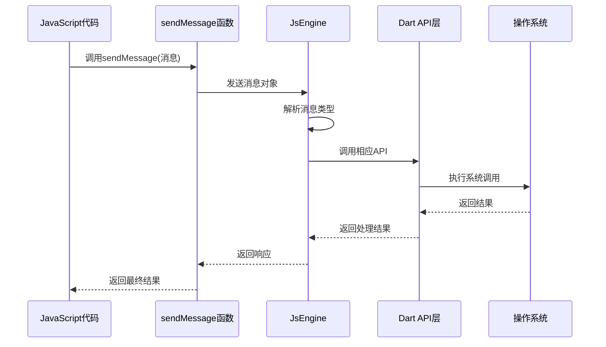

**图表来源**
- [init.js](file://assets/init.js#L14-L24)
- [js_engine.dart](file://lib/foundation/js_engine.dart#L112-L212)

## 详细组件分析

### JavaScript引擎初始化流程

JavaScript引擎的初始化过程经过精心设计，确保安全性和性能：

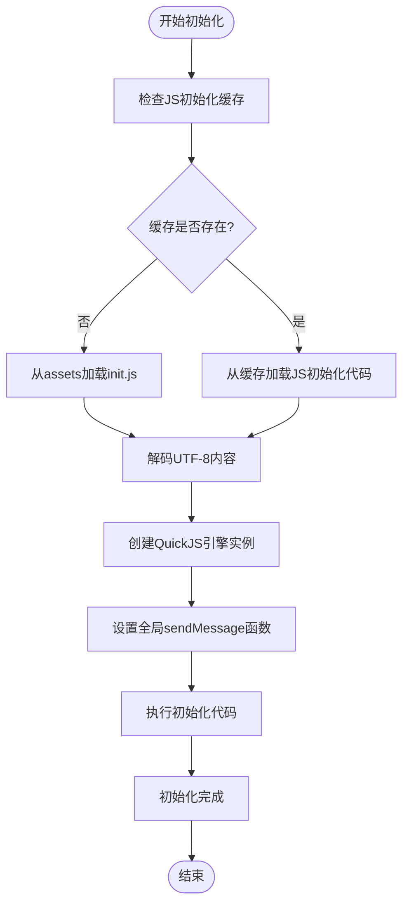

**图表来源**
- [js_engine.dart](file://lib/foundation/js_engine.dart#L80-L110)
- [js_engine.dart](file://lib/foundation/js_engine.dart#L93-L106)

### API暴露机制

Venera通过sendMessage函数向JavaScript暴露Dart层的功能：

#### 核心API分类

| API类别 | 功能描述 | JavaScript接口 | Dart实现 |
|---------|----------|----------------|----------|
| 网络请求 | HTTP/HTTPS请求 | Network.fetch() | _http()方法 |
| DOM操作 | HTML解析和查询 | HtmlDocument/HtmlElement | handleHtmlCallback() |
| 加密解密 | 多种算法支持 | Convert.* | _convert()方法 |
| UI交互 | 对话框和消息显示 | UI.* | handleUIMessage() |
| 数据存储 | 源数据读写 | ComicSource.* | 数据访问层 |
| 图像处理 | 图像操作和转换 | Image.* | 图像处理API |

#### sendMessage函数实现

sendMessage是JavaScript与Dart通信的桥梁，支持异步消息传递：

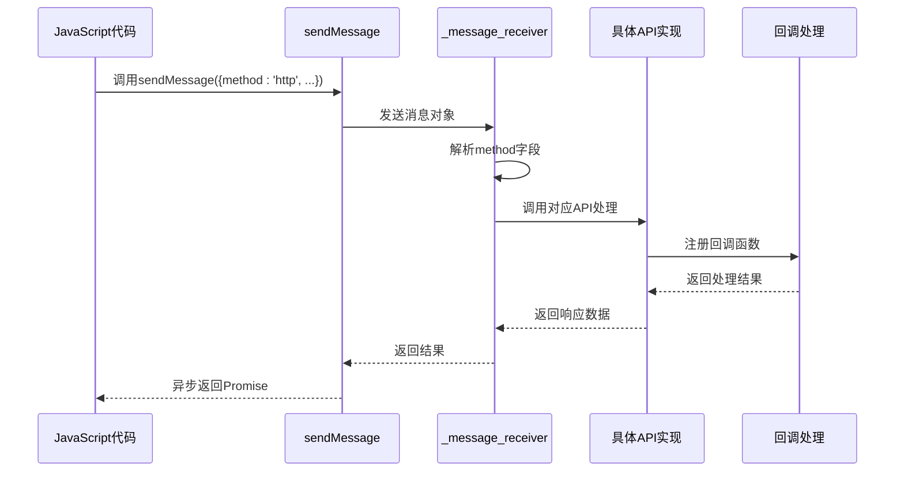

**图表来源**
- [init.js](file://assets/init.js#L8-L12)
- [js_engine.dart](file://lib/foundation/js_engine.dart#L112-L212)

**章节来源**
- [js_engine.dart](file://lib/foundation/js_engine.dart#L112-L212)
- [init.js](file://assets/init.js#L1-L1520)

### 沙盒安全机制

Venera的沙盒引擎实现了多层次的安全防护：

#### 1. 隔离执行模型

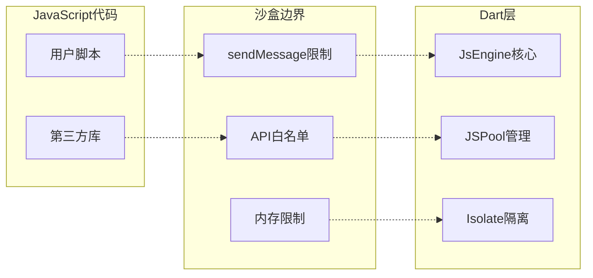

**图表来源**
- [js_pool.dart](file://lib/foundation/js_pool.dart#L50-L67)
- [js_engine.dart](file://lib/foundation/js_engine.dart#L191-L204)

#### 2. API访问控制

沙盒引擎对JavaScript可访问的API进行了严格限制：

| API类别 | 访问权限 | 安全措施 |
|---------|----------|----------|
| 系统API | 禁止访问 | Isolate隔离 |
| 文件系统 | 受限访问 | 路径白名单 |
| 网络请求 | 受控访问 | 代理和证书验证 |
| UI操作 | 受控访问 | 用户确认机制 |
| 加密功能 | 有限访问 | 算法白名单 |

#### 3. 内存管理策略

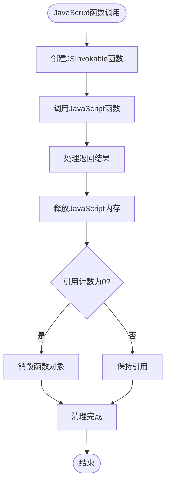

**图表来源**
- [js_engine.dart](file://lib/foundation/js_engine.dart#L720-L736)

**章节来源**
- [js_pool.dart](file://lib/foundation/js_pool.dart#L50-L163)
- [js_engine.dart](file://lib/foundation/js_engine.dart#L720-L736)

### 异步处理和回调机制

Venera沙盒引擎提供了完整的异步处理能力：

#### Promise链式调用

JavaScript中的异步操作通过sendMessage实现：

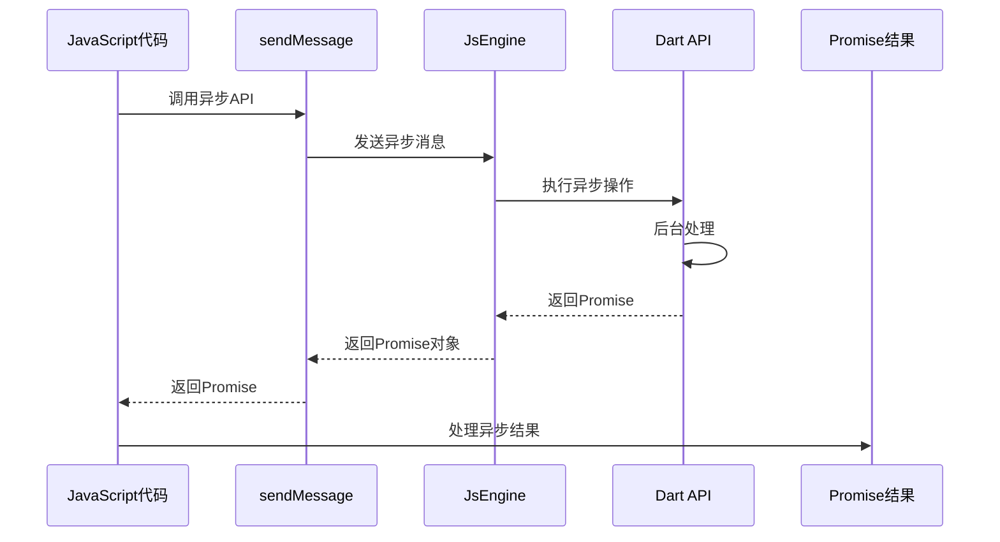

#### 回调函数管理

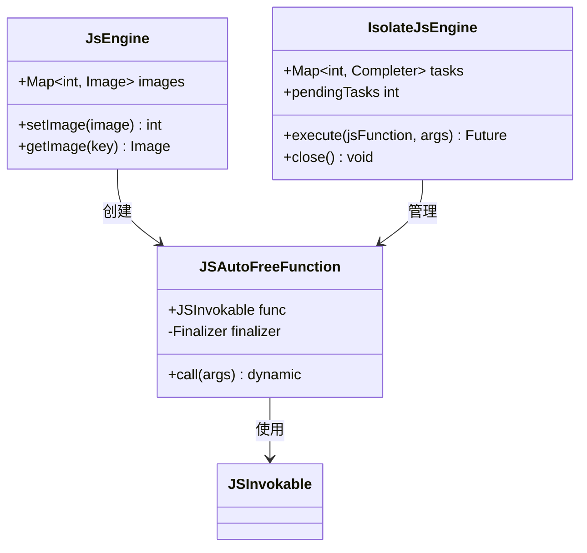

**图表来源**
- [js_engine.dart](file://lib/foundation/js_engine.dart#L720-L736)
- [js_pool.dart](file://lib/foundation/js_pool.dart#L121-L134)

**章节来源**
- [js_engine.dart](file://lib/foundation/js_engine.dart#L191-L212)
- [js_pool.dart](file://lib/foundation/js_pool.dart#L121-L163)

## 依赖关系分析

### 外部依赖管理

Venera应用使用了多个关键依赖来支持JavaScript沙盒引擎：

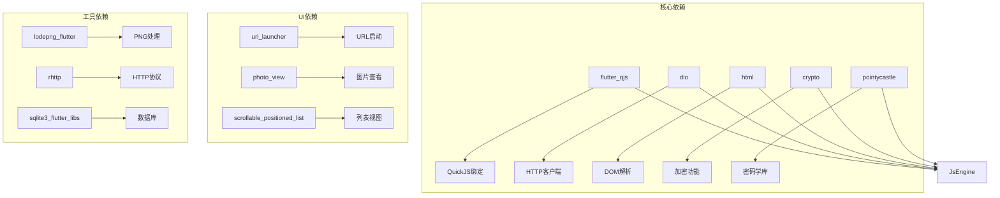

**图表来源**
- [pubspec.yaml](file://pubspec.yaml#L11-L90)

### 组件间耦合度分析

| 组件 | 内聚性 | 耦合度 | 说明 |
|------|--------|--------|------|
| JsEngine | 高内聚 | 中等耦合 | 核心引擎，与各模块有适度耦合 |
| JSPool | 高内聚 | 低耦合 | 独立的池化管理，与核心引擎松耦合 |
| IsolateJsEngine | 高内聚 | 低耦合 | 隔离执行器，与外部接口简单 |
| js_ui.dart | 中等内聚 | 低耦合 | UI集成层，职责明确 |
| init.js | 低内聚 | 高耦合 | JavaScript库，与Dart层紧密耦合 |

**章节来源**
- [pubspec.yaml](file://pubspec.yaml#L11-L90)

## 性能考虑

### 内存管理优化

Venera沙盒引擎采用了多种内存管理策略来确保性能和稳定性：

#### 1. 对象池化策略

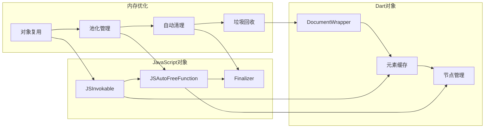

#### 2. 并发执行优化

- 最大4个隔离实例并行执行
- 动态负载均衡分配
- 任务队列优先级管理
- 内存使用监控和限制

#### 3. 缓存策略

- JavaScript初始化代码缓存
- DOM文档缓存管理（最多8个）
- 自动清理最旧文档
- 内存使用上限控制

**章节来源**
- [js_engine.dart](file://lib/foundation/js_engine.dart#L289-L304)
- [js_pool.dart](file://lib/foundation/js_pool.dart#L9-L28)

### 性能监控和调试

#### 日志系统

Venera实现了完整的日志记录系统：

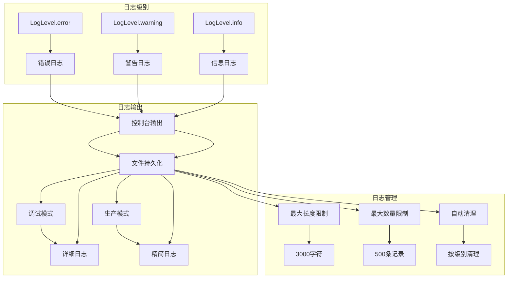

**图表来源**
- [log.dart](file://lib/foundation/log.dart#L18-L88)

**章节来源**
- [log.dart](file://lib/foundation/log.dart#L1-L117)

## 故障排除指南

### 常见问题诊断

#### 1. JavaScript执行错误

**症状：** JavaScript代码执行失败或抛出异常

**诊断步骤：**
1. 检查JavaScript语法和API调用
2. 验证sendMessage参数格式
3. 查看Dart端日志输出
4. 确认API访问权限

**解决方案：**
- 使用try-catch包装JavaScript代码
- 验证API参数类型和格式
- 检查网络连接和代理设置
- 确认文件路径和权限

#### 2. 内存泄漏问题

**症状：** 应用内存持续增长，性能下降

**诊断方法：**
1. 监控JSPool的pendingTasks数量
2. 检查JSInvokable对象的引用计数
3. 验证DocumentWrapper的清理情况
4. 分析IsolateJsEngine的任务队列

**修复建议：**
- 确保及时释放JavaScript函数引用
- 避免创建过多的DOM文档对象
- 及时调用dispose方法清理资源
- 监控内存使用趋势

#### 3. 隔离执行异常

**症状：** JavaScript代码在隔离环境中崩溃

**排查流程：**
1. 检查IsolateJsEngine的状态
2. 验证sendMessage函数的正确性
3. 确认QuickJS引擎初始化成功
4. 分析异常堆栈信息

**处理方案：**
- 重启隔离实例
- 清理异常状态
- 重新初始化引擎
- 记录详细的错误信息

### 调试工具和技巧

#### 1. 日志分析

启用详细日志模式来获取完整的执行轨迹：

```dart
// 启用详细日志
Log.ignoreLimitation = true;
Log.isMuted = false;

// 添加自定义日志
Log.info("JavaScript引擎", "初始化完成");
Log.warning("JavaScript引擎", "内存使用过高");
Log.error("JavaScript引擎", "执行异常", exception);
```

#### 2. 性能监控

监控关键性能指标：

```dart
// 监控JSPool状态
print("空闲实例数量: ${JSPool().instances.length}");
print("总任务数: ${JSPool().totalTasks}");

// 监控内存使用
print("Pending tasks: ${isolateEngine.pendingTasks}");
```

**章节来源**
- [log.dart](file://lib/foundation/log.dart#L43-L104)
- [js_pool.dart](file://lib/foundation/js_pool.dart#L61-L61)

## 结论

Venera应用的JavaScript沙盒引擎是一个设计精良、安全性高且性能优异的执行环境。通过以下关键特性实现了安全与功能的平衡：

### 核心优势

1. **强隔离性** - 通过Dart Isolate和QuickJS引擎实现完全的代码隔离
2. **类型安全** - 严格的参数验证和类型检查机制
3. **内存管理** - 自动化的垃圾回收和资源清理
4. **异步支持** - 完整的Promise和回调机制
5. **调试友好** - 详细的日志系统和错误报告

### 技术创新

- **池化架构** - 多实例并行执行提升性能
- **智能缓存** - 初始化代码和DOM文档的智能缓存
- **API白名单** - 受控的JavaScript API访问
- **自动清理** - 防止内存泄漏的自动化机制

### 应用价值

该沙盒引擎为Venera应用提供了：
- 安全的用户脚本执行环境
- 灵活的漫画源代码扩展能力
- 可靠的异步操作支持
- 完善的错误处理和调试功能

通过持续的优化和改进，Venera的JavaScript沙盒引擎将继续为用户提供强大而安全的JavaScript执行体验。

## 附录

### 最佳实践指南

#### JavaScript开发最佳实践

1. **参数验证**
   - 始终验证sendMessage参数的类型和格式
   - 使用try-catch处理可能的异常
   - 验证API返回值的有效性

2. **内存管理**
   - 及时释放不需要的JavaScript对象
   - 避免创建过多的DOM文档
   - 使用完畢后调用dispose方法

3. **错误处理**
   - 为所有异步操作添加错误处理
   - 使用finally块确保资源清理
   - 记录详细的错误信息用于调试

#### 安全编程指导

1. **输入验证**
   - 验证所有用户输入的数据
   - 检查文件路径和URL的有效性
   - 防止注入攻击和恶意代码

2. **权限控制**
   - 仅使用允许的API功能
   - 避免访问敏感系统资源
   - 遵循最小权限原则

3. **资源保护**
   - 及时清理临时文件和缓存
   - 防止内存泄漏和资源耗尽
   - 监控系统资源使用情况

### API参考

#### 核心API列表

| API名称 | 类型 | 描述 | 参数 | 返回值 |
|---------|------|------|------|--------|
| sendMessage | 函数 | 消息发送函数 | Object | Promise |
| setTimeout | 函数 | 延迟执行 | Function, number | Timer |
| setInterval | 函数 | 重复执行 | Function, number | Timer |
| Network.fetch | 方法 | HTTP请求 | string, Object | Promise |
| HtmlDocument | 构造函数 | HTML解析 | string | HtmlDocument |
| UI.showDialog | 方法 | 显示对话框 | Object | Promise |
| Convert.* | 方法族 | 编码转换 | various | various |

**章节来源**
- [init.js](file://assets/init.js#L14-L1520)
- [js_engine.dart](file://lib/foundation/js_engine.dart#L112-L212)