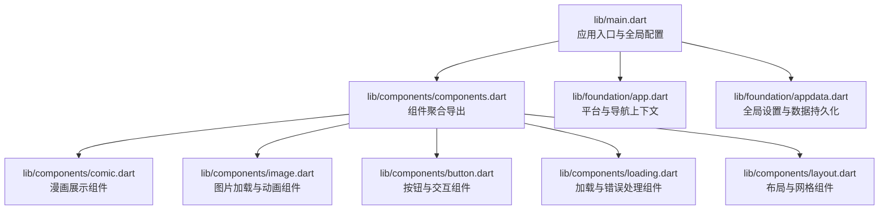
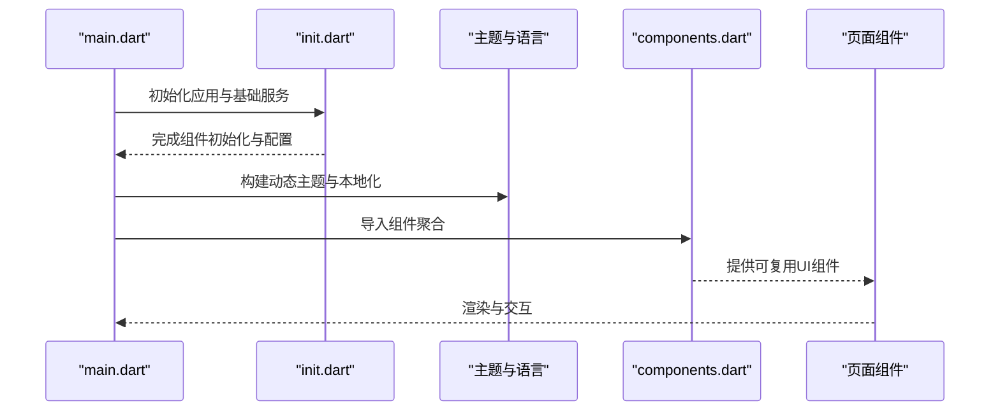
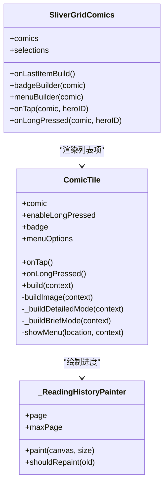
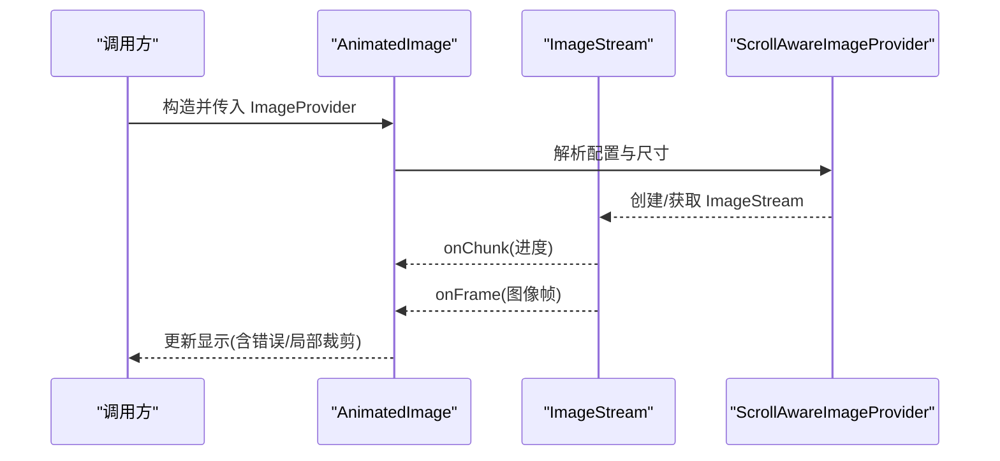
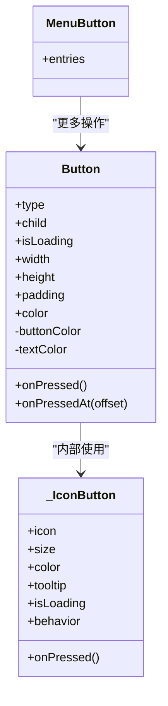
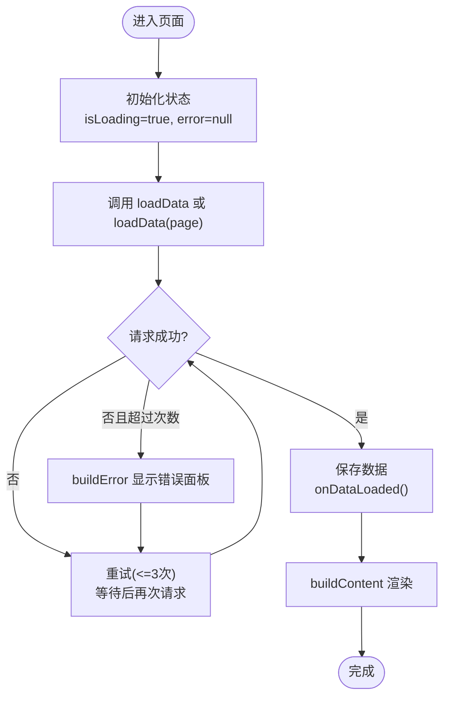
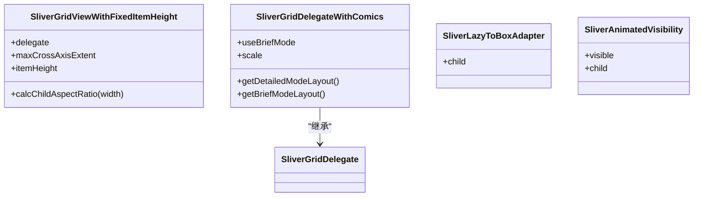
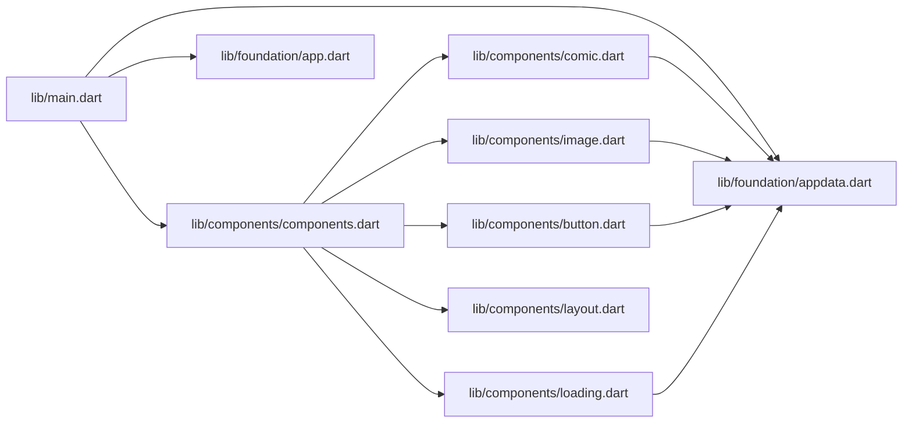

# UI组件系统

<cite>
**本文档引用的文件**
- [lib/main.dart](file://lib/main.dart)
- [lib/init.dart](file://lib/init.dart)
- [lib/components/components.dart](file://lib/components/components.dart)
- [lib/components/comic.dart](file://lib/components/comic.dart)
- [lib/components/image.dart](file://lib/components/image.dart)
- [lib/components/button.dart](file://lib/components/button.dart)
- [lib/components/loading.dart](file://lib/components/loading.dart)
- [lib/components/layout.dart](file://lib/components/layout.dart)
- [lib/foundation/app.dart](file://lib/foundation/app.dart)
- [lib/foundation/appdata.dart](file://lib/foundation/appdata.dart)
</cite>

## 目录
1. [简介](#简介)
2. [项目结构](#项目结构)
3. [核心组件](#核心组件)
4. [架构总览](#架构总览)
5. [组件详解](#组件详解)
6. [依赖关系分析](#依赖关系分析)
7. [性能与优化](#性能与优化)
8. [故障排查指南](#故障排查指南)
9. [结论](#结论)
10. [附录：开发规范与最佳实践](#附录开发规范与最佳实践)

## 简介
本文件系统性梳理 Venera 应用的 UI 组件体系，覆盖可复用组件的设计原则、组件库组织结构、组件间组合模式，以及漫画展示、图片加载与交互组件的实现机制。文档同时阐述状态管理、事件处理、动画效果与响应式布局，并给出主题系统、样式定制与跨平台适配策略，最后提供开发规范与最佳实践。

## 项目结构
Venera 的 UI 层位于 lib/components 目录，采用“按功能分组 + 部分聚合导出”的组织方式。入口在 lib/main.dart 中初始化全局主题、语言与窗口管理，并通过 components/components.dart 聚合导出各组件模块，便于页面层统一引入。

**图表来源**
- [lib/main.dart](file://lib/main.dart#L1-L321)
- [lib/components/components.dart](file://lib/components/components.dart#L1-L52)
- [lib/components/comic.dart](file://lib/components/comic.dart#L1-L800)
- [lib/components/image.dart](file://lib/components/image.dart#L1-L401)
- [lib/components/button.dart](file://lib/components/button.dart#L1-L390)
- [lib/components/loading.dart](file://lib/components/loading.dart#L1-L433)
- [lib/components/layout.dart](file://lib/components/layout.dart#L1-L192)
- [lib/foundation/app.dart](file://lib/foundation/app.dart#L1-L113)
- [lib/foundation/appdata.dart](file://lib/foundation/appdata.dart#L1-L312)

**章节来源**
- [lib/main.dart](file://lib/main.dart#L1-L321)
- [lib/components/components.dart](file://lib/components/components.dart#L1-L52)

## 核心组件
- 漫画展示组件：ComicTile、SliverGridComics、阅读进度绘制器等，支持详细/简要两种显示模式、徽章与菜单、长按与右键菜单、收藏与历史状态叠加。
- 图片加载组件：AnimatedImage 及其内部状态机，负责异步解码、流式进度、错误回退、可选局部裁剪绘制与跨帧切换动画。
- 交互组件：Button（多种风格）、MenuButton、HoverBox 等，提供悬停态、加载态、尺寸约束与点击反馈。
- 加载与错误：LoadingState/MultiPageLoadingState、网络错误面板、五点加载动画等，统一处理首次加载、分页加载与错误重试。
- 布局组件：固定高度网格、漫画专用网格代理、懒加载适配器、可见性动画等，支撑响应式与高性能渲染。

**章节来源**
- [lib/components/comic.dart](file://lib/components/comic.dart#L1-L800)
- [lib/components/image.dart](file://lib/components/image.dart#L1-L401)
- [lib/components/button.dart](file://lib/components/button.dart#L1-L390)
- [lib/components/loading.dart](file://lib/components/loading.dart#L1-L433)
- [lib/components/layout.dart](file://lib/components/layout.dart#L1-L192)

## 架构总览
应用启动时初始化全局设置与缓存，构建基于动态色彩的主题，并在桌面端集成窗口框架与快捷键。组件层通过聚合导出集中暴露，页面层仅需关注业务逻辑与组合使用。

**图表来源**
- [lib/main.dart](file://lib/main.dart#L20-L58)
- [lib/init.dart](file://lib/init.dart#L37-L77)
- [lib/components/components.dart](file://lib/components/components.dart#L1-L52)

## 组件详解

### 漫画展示组件（ComicTile 与 SliverGridComics）
- 设计原则
  - 可组合：通过 badgeBuilder、menuBuilder、onTap/onLongPressed 回调注入行为，避免硬编码。
  - 可视化状态叠加：收藏与阅读进度徽章，使用 Stack 定位叠加，不破坏原有布局。
  - 主题一致性：颜色与阴影遵循当前主题色阶与圆角规范。
- 实现要点
  - 图片提供器选择：根据来源类型选择本地、历史或缓存图片提供器。
  - 显示模式：详细模式包含封面+描述；简要模式以纯封面为主，底部多行文本遮罩。
  - 长按/右键菜单：弹出菜单项包含详情、复制标题、加入收藏、屏蔽等。
  - 阅读进度绘制：自定义绘制器按有无最大页数展示不同样式。
- 组合模式
  - 页面层通过 SliverGridComics 传入 comics 列表与回调，内部生成 Hero 动画标签，支持选择模式与最后一项回调。

**图表来源**
- [lib/components/comic.dart](file://lib/components/comic.dart#L26-L511)
- [lib/components/comic.dart](file://lib/components/comic.dart#L660-L733)

**章节来源**
- [lib/components/comic.dart](file://lib/components/comic.dart#L1-L800)

### 图片加载组件（AnimatedImage）
- 设计原则
  - 流式加载：监听 ImageStream 回调，逐步更新 UI，提升感知速度。
  - 错误兜底：异常时显示错误图标，支持外部 onError 回调。
  - 性能优先：使用 ResizeImage 缓存缩放结果，避免重复计算；在非活跃时保持 completer 以减少重建。
  - 动画过渡：使用 AnimatedSwitcher 在新旧图像间进行淡入淡出切换。
- 实现要点
  - 状态机：维护 ImageStream、ImageInfo、chunk 进度与异常状态，按需注册/注销监听。
  - 自定义绘制：支持 ImagePart 局部裁剪绘制，配合 BoxFit 计算目标矩形。
  - 可访问性：根据系统反色设置自动调整显示。
- 组合模式
  - 页面层直接使用 AnimatedImage 包裹缓存/网络图片提供器；必要时传入 onError 处理失败场景。

**图表来源**
- [lib/components/image.dart](file://lib/components/image.dart#L3-L73)
- [lib/components/image.dart](file://lib/components/image.dart#L151-L238)
- [lib/components/image.dart](file://lib/components/image.dart#L275-L334)

**章节来源**
- [lib/components/image.dart](file://lib/components/image.dart#L1-L401)

### 交互组件（Button 与 MenuButton）
- 设计原则
  - 风格统一：通过 ButtonType 控制外观（填充/描边/文字/普通），颜色与文本色随类型与悬停态变化。
  - 反馈明确：悬停高亮、按压动画、加载指示器、Tooltip 提示。
  - 尺寸约束：最小宽高与内边距标准化，支持自定义宽高与内边距。
- 实现要点
  - 悬停态：MouseRegion + AnimatedContainer 动态变更背景色与阴影。
  - 加载态：在按钮内容区域替换为圆形进度指示器。
  - 菜单按钮：基于 MenuButton 弹出菜单项，位置由触发控件定位。
- 组合模式
  - 页面层通过 Button.icon/Button.filled 等便捷构造函数快速创建常用按钮；需要精确控制时使用完整构造参数。

**图表来源**
- [lib/components/button.dart](file://lib/components/button.dart#L39-L280)
- [lib/components/button.dart](file://lib/components/button.dart#L282-L359)
- [lib/components/button.dart](file://lib/components/button.dart#L361-L390)

**章节来源**
- [lib/components/button.dart](file://lib/components/button.dart#L1-L390)

### 加载与错误组件（LoadingState / MultiPageLoadingState / NetworkError / FiveDotLoadingAnimation）
- 设计原则
  - 统一生命周期：抽象出 LoadingState 与 MultiPageLoadingState，封装加载、错误、重试与分页逻辑。
  - 友好提示：网络错误面板区分 Cloudflare 验证与一般错误，提供日志导出与一键重试。
  - 性能平衡：首次加载使用骨架占位，滚动到底部触发下一页；错误时短消息提示。
- 实现要点
  - 重试策略：最多三次重试，间隔微延迟，避免频繁抖动。
  - 分页状态：记录页码与最大页，滚动监听触发加载下一页面。
  - 动画：五点弹跳动画使用 AnimationController 控制，每点相位差形成流动感。
- 组合模式
  - 页面层继承抽象状态类，实现 loadData/loadData(int) 与 buildContent，即可获得完整的加载/错误/分页体验。

**图表来源**
- [lib/components/loading.dart](file://lib/components/loading.dart#L125-L229)
- [lib/components/loading.dart](file://lib/components/loading.dart#L231-L356)
- [lib/components/loading.dart](file://lib/components/loading.dart#L358-L433)

**章节来源**
- [lib/components/loading.dart](file://lib/components/loading.dart#L1-L433)

### 布局组件（SliverGridViewWithFixedItemHeight / SliverGridDelegateWithComics / SliverLazyToBoxAdapter / SliverAnimatedVisibility）
- 设计原则
  - 响应式网格：根据容器宽度动态计算列数与子项宽高比，保证视觉一致。
  - 性能优先：SliverLazyToBoxAdapter 将懒加载内容包裹为 SliverList，避免一次性渲染。
  - 可见性动画：通过 AnimatedSize 平滑显示/隐藏内容，避免布局抖动。
- 实现要点
  - 固定高度网格：计算子项宽高比，确保每行高度一致。
  - 漫画网格代理：根据全局设置切换详细/简要模式与缩放比例，动态重绘。
  - 可见性：根据布尔值在收缩与展开之间平滑过渡。
- 组合模式
  - 页面层使用 SliverGridComics 作为漫画列表容器，内部委托上述代理完成布局。

**图表来源**
- [lib/components/layout.dart](file://lib/components/layout.dart#L3-L37)
- [lib/components/layout.dart](file://lib/components/layout.dart#L39-L150)
- [lib/components/layout.dart](file://lib/components/layout.dart#L152-L192)

**章节来源**
- [lib/components/layout.dart](file://lib/components/layout.dart#L1-L192)

## 依赖关系分析
- 入口与主题
  - main.dart 负责初始化、动态主题与本地化、桌面窗口与快捷键集成，并通过 components/components.dart 导入组件。
- 组件与基础能力
  - 组件层广泛依赖 foundation 层的 App 上下文、appdata 设置、图片提供器与历史/收藏管理。
- 组件间耦合
  - 组件以“属性注入 + 回调”为主，降低耦合；少数组件（如漫画进度绘制）通过自定义绘制器与 UI 结构解耦。

**图表来源**
- [lib/main.dart](file://lib/main.dart#L1-L321)
- [lib/components/components.dart](file://lib/components/components.dart#L1-L52)
- [lib/foundation/app.dart](file://lib/foundation/app.dart#L1-L113)
- [lib/foundation/appdata.dart](file://lib/foundation/appdata.dart#L1-L312)

**章节来源**
- [lib/main.dart](file://lib/main.dart#L1-L321)
- [lib/components/components.dart](file://lib/components/components.dart#L1-L52)
- [lib/foundation/app.dart](file://lib/foundation/app.dart#L1-L113)
- [lib/foundation/appdata.dart](file://lib/foundation/appdata.dart#L1-L312)

## 性能与优化
- 图片加载
  - 使用 ResizeImage 缓存缩放结果，避免重复计算；在非活跃时保持 completer，减少重建成本。
  - 流式进度与错误回退，缩短首帧时间与提升稳定性。
- 列表渲染
  - Sliver 系列组件按需渲染，结合懒加载适配器与分页加载，降低内存占用。
  - 动画切换使用 AnimatedSwitcher，仅在图像切换时触发动画，避免全局重绘。
- 主题与字体
  - 动态色彩与系统字体回退策略，兼顾美观与可读性；桌面端针对字体与刷新率做特殊处理。
- 建议
  - 对高频重绘区域（如滚动列表）尽量使用不可变数据与稳定键值。
  - 合理设置缓存大小与预加载数量，平衡内存与加载速度。

[本节为通用性能建议，无需特定文件引用]

## 故障排查指南
- 图片加载失败
  - 检查 onError 回调是否被触发；确认网络连通与图片提供器可用性。
  - 若出现异常，查看日志导出功能，定位具体错误栈。
- 网络错误面板
  - 若为 Cloudflare 验证错误，使用内置验证流程；否则提供重试按钮与一键导出日志。
- 加载卡顿
  - 检查分页加载是否正确触发；确认滚动监听与状态更新逻辑。
  - 减少一次性渲染项数，使用懒加载适配器。
- 主题与语言
  - 确认主题模式与语言设置已生效；桌面端注意系统 UI 样式同步。

**章节来源**
- [lib/components/loading.dart](file://lib/components/loading.dart#L3-L97)
- [lib/components/loading.dart](file://lib/components/loading.dart#L125-L229)
- [lib/main.dart](file://lib/main.dart#L190-L289)

## 结论
Venera 的 UI 组件系统以“可组合、可扩展、可维护”为核心，通过组件聚合导出与抽象状态类，实现了漫画展示、图片加载、交互与布局的高内聚低耦合。配合动态主题、本地化与桌面端增强，满足跨平台与多场景需求。建议在后续迭代中持续完善组件文档与测试覆盖，进一步提升可复用性与可维护性。

[本节为总结性内容，无需特定文件引用]

## 附录：开发规范与最佳实践
- 设计原则
  - 单一职责：每个组件聚焦一个功能域，通过属性与回调扩展行为。
  - 可测试性：尽量将复杂逻辑抽离为纯函数或独立工具，便于单元测试。
  - 可访问性：提供语义化标签与反色支持，确保不同用户群体可用。
- 状态管理
  - 使用 Settings 与 ChangeNotifier 管理全局设置；组件内部状态尽量局部化，避免过度提升至页面级。
  - 对于长耗时任务，使用 LoadingState 抽象统一处理。
- 动画与交互
  - 使用 AnimatedBuilder/AnimatedSwitcher 精准控制动画范围，避免不必要的重建。
  - 按钮与菜单统一风格，保持一致的反馈时序与视觉层级。
- 响应式与跨平台
  - 使用 Sliver 系列与布局代理适配不同屏幕尺寸；桌面端补充窗口与快捷键支持。
  - 字体与主题遵循系统回退策略，确保在不同平台具有一致体验。
- 样式与主题
  - 优先使用主题色阶与圆角规范，避免硬编码颜色；必要时通过组件参数覆盖。
  - 动态色彩与明暗主题联动，确保在不同亮度下可读性与对比度。

[本节为通用规范建议，无需特定文件引用]