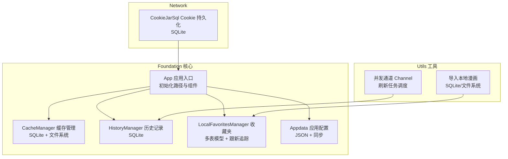
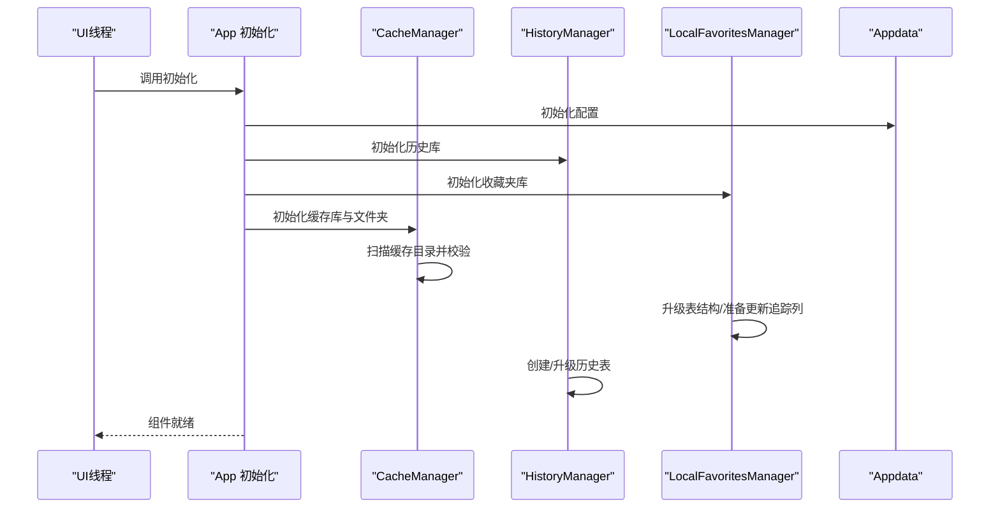
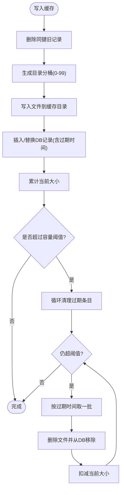
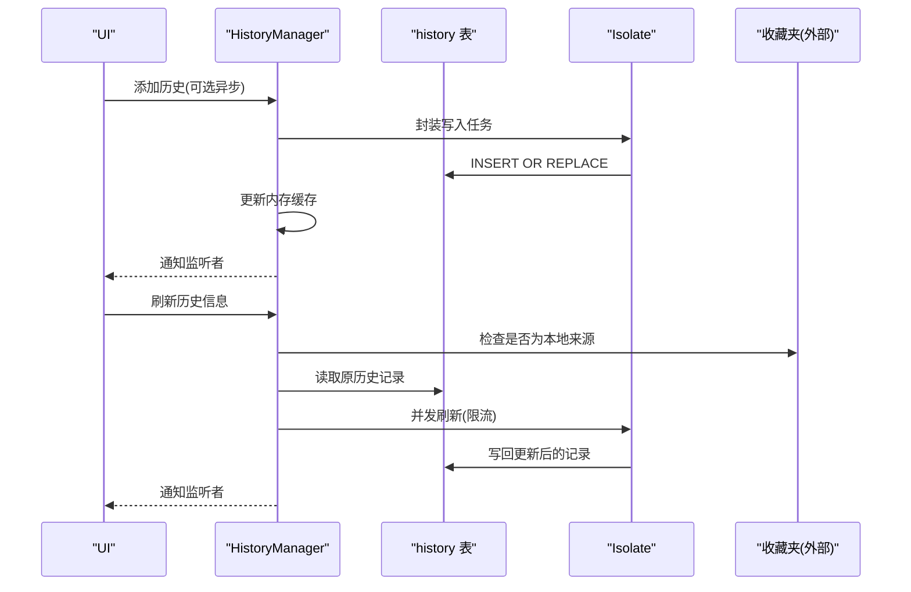
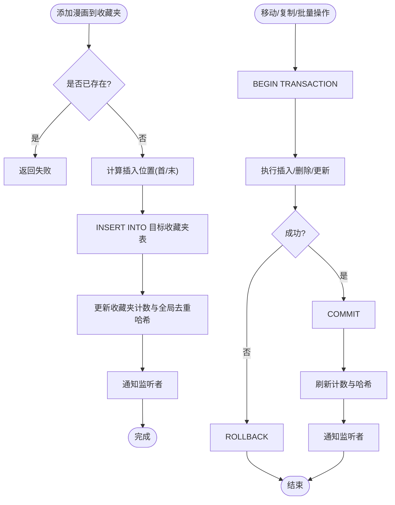
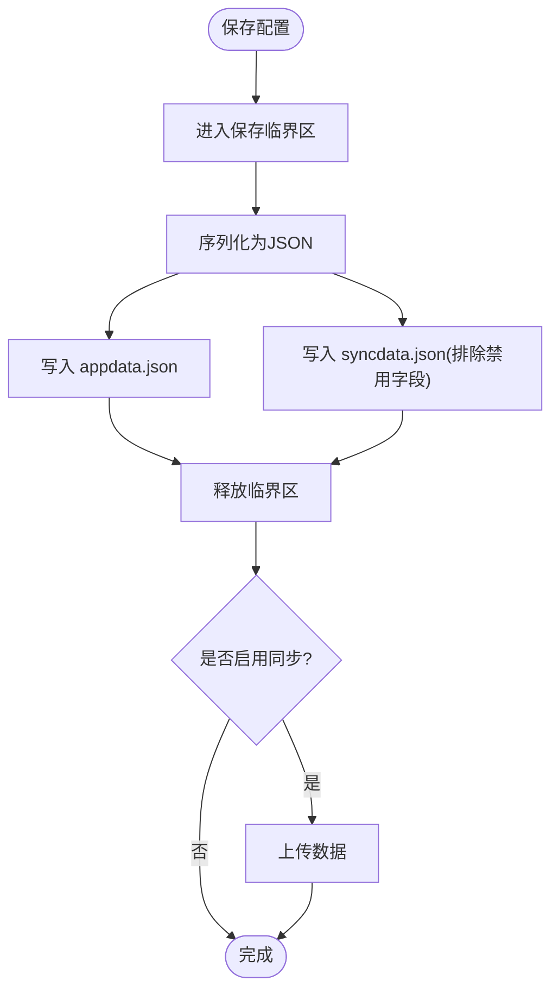
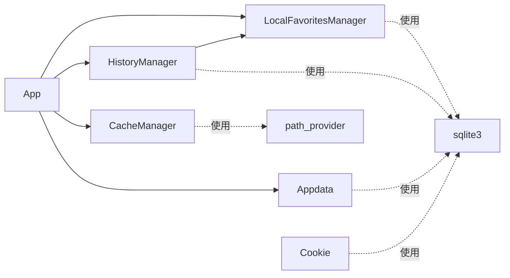
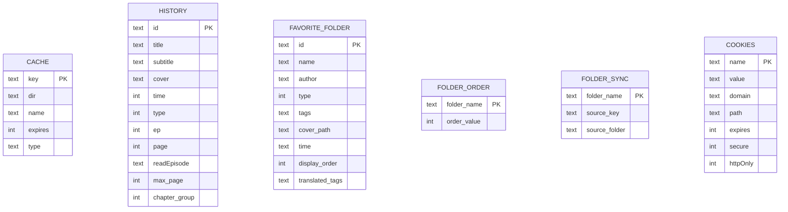

# 数据存储系统

<cite>
**本文档引用的文件**
- [cache_manager.dart](file://lib/foundation/cache_manager.dart)
- [favorites.dart](file://lib/foundation/favorites.dart)
- [history.dart](file://lib/foundation/history.dart)
- [app.dart](file://lib/foundation/app.dart)
- [appdata.dart](file://lib/foundation/appdata.dart)
- [init.dart](file://lib/init.dart)
- [cookie_jar.dart](file://lib/network/cookie_jar.dart)
- [import_comic.dart](file://lib/utils/import_comic.dart)
- [channel.dart](file://lib/utils/channel.dart)
</cite>

## 目录
1. [简介](#简介)
2. [项目结构](#项目结构)
3. [核心组件](#核心组件)
4. [架构总览](#架构总览)
5. [详细组件分析](#详细组件分析)
6. [依赖关系分析](#依赖关系分析)
7. [性能考量](#性能考量)
8. [故障排查指南](#故障排查指南)
9. [结论](#结论)
10. [附录](#附录)

## 简介
本文件面向Venera应用的数据存储系统，聚焦SQLite数据库设计、数据模型与存储策略，深入解析历史记录管理、收藏夹系统与本地漫画管理的实现机制，并覆盖数据持久化方案、缓存策略、数据同步与备份恢复、组件间协调关系（一致性与并发控制）、数据迁移与性能优化建议。

## 项目结构
数据存储相关代码主要集中在foundation与network目录：
- foundation：历史记录、收藏夹、缓存、应用配置等核心数据模块
- network：Cookie持久化使用SQLite
- utils：导入本地漫画等工具逻辑
- init：应用初始化流程，负责各存储组件的启动顺序与参数注入

图表来源
- [app.dart](file://lib/foundation/app.dart#L82-L98)
- [cache_manager.dart](file://lib/foundation/cache_manager.dart#L71-L87)
- [history.dart](file://lib/foundation/history.dart#L201-L231)
- [favorites.dart](file://lib/foundation/favorites.dart#L227-L276)
- [appdata.dart](file://lib/foundation/appdata.dart#L130-L160)
- [cookie_jar.dart](file://lib/network/cookie_jar.dart#L18-L32)
- [import_comic.dart](file://lib/utils/import_comic.dart#L83-L125)
- [channel.dart](file://lib/utils/channel.dart#L1-L58)

章节来源
- [app.dart](file://lib/foundation/app.dart#L82-L98)
- [init.dart](file://lib/init.dart#L37-L77)

## 核心组件
- CacheManager：基于SQLite的键值缓存，配合文件系统分片存储，支持过期清理与容量上限控制
- HistoryManager：历史阅读记录，包含章节/页码进度、分组章节、最近阅读列表、批量删除与异步写入
- LocalFavoritesManager：收藏夹系统，多表模型（每个收藏夹一张表），支持标签翻译、排序、移动/复制/批量操作、更新追踪字段
- Appdata：应用设置与搜索历史持久化，支持选择性字段同步与隐式数据
- CookieJarSql：网络Cookie的SQLite持久化
- 导入工具：本地漫画导入流程，涉及SQLite扫描与文件系统复制

章节来源
- [cache_manager.dart](file://lib/foundation/cache_manager.dart#L10-L281)
- [history.dart](file://lib/foundation/history.dart#L181-L596)
- [favorites.dart](file://lib/foundation/favorites.dart#L205-L1251)
- [appdata.dart](file://lib/foundation/appdata.dart#L11-L312)
- [cookie_jar.dart](file://lib/network/cookie_jar.dart#L9-L201)
- [import_comic.dart](file://lib/utils/import_comic.dart#L83-L310)

## 架构总览
系统采用“主Isolate + 多Isolate”的并发模式，避免UI阻塞；SQLite作为主要持久化介质，配合文件系统缓存与JSON配置文件，形成多层存储体系。

图表来源
- [init.dart](file://lib/init.dart#L37-L77)
- [app.dart](file://lib/foundation/app.dart#L82-L98)
- [cache_manager.dart](file://lib/foundation/cache_manager.dart#L71-L87)
- [history.dart](file://lib/foundation/history.dart#L201-L231)
- [favorites.dart](file://lib/foundation/favorites.dart#L227-L276)
- [appdata.dart](file://lib/foundation/appdata.dart#L130-L160)

## 详细组件分析

### CacheManager 缓存管理
- 存储结构：SQLite表cache（键、目录、名称、过期时间、类型）
- 文件组织：按目录分桶（0-99）+ MD5命名文件名，减少单目录文件数
- 生命周期：写入时计算过期时间；查询命中更新过期；定期清理过期条目；超过容量阈值逐出最旧
- 并发与隔离：扫描目录在Isolate中执行，避免主线程阻塞；仅主线程修改数据库以避免死锁
- 清理策略：先清理过期文件，再按过期时间升序淘汰，直至低于阈值；若存在未受控文件则重建缓存目录

图表来源
- [cache_manager.dart](file://lib/foundation/cache_manager.dart#L98-L116)
- [cache_manager.dart](file://lib/foundation/cache_manager.dart#L178-L242)

章节来源
- [cache_manager.dart](file://lib/foundation/cache_manager.dart#L10-L281)

### HistoryManager 历史记录管理
- 表结构：history（主键id，标题/副标题/封面，时间戳，类型，章节/页码/分组，最大页数，已读章节集合）
- 查询与缓存：维护历史ID缓存与最近变更缓存，加速查找与监听通知
- 异步写入：将写入操作封装为Isolate任务，避免阻塞UI
- 批量操作：事务包裹批量删除，保证一致性
- 更新刷新：对非本地来源的历史项，可从源站点刷新标题/封面等信息，保留阅读进度
- 清理策略：支持清空全部历史，或仅清理未收藏的历史项

图表来源
- [history.dart](file://lib/foundation/history.dart#L260-L278)
- [history.dart](file://lib/foundation/history.dart#L438-L495)
- [history.dart](file://lib/foundation/history.dart#L315-L338)

章节来源
- [history.dart](file://lib/foundation/history.dart#L181-L596)

### LocalFavoritesManager 收藏夹系统
- 多表模型：每个收藏夹对应一张表，表结构包含基础元信息、显示顺序、标签与翻译标签、更新追踪字段
- 动态表管理：自动检测并添加缺失列（如翻译标签、更新追踪列），支持重命名/删除收藏夹
- 排序与位置：通过display_order维护顺序；支持新增时插入到开头或末尾
- 移动/复制/批量操作：事务包裹，保证一致性；更新计数与去重哈希集
- 标签与搜索：支持原始标签与翻译标签检索；多关键词AND过滤
- 导入导出：支持收藏夹JSON导入/导出，兼容重复名称自动重命名
- 跟新追踪：为特定收藏夹准备更新追踪列，记录最后检查时间、是否有新更新、最后更新时间

图表来源
- [favorites.dart](file://lib/foundation/favorites.dart#L601-L661)
- [favorites.dart](file://lib/foundation/favorites.dart#L663-L737)
- [favorites.dart](file://lib/foundation/favorites.dart#L739-L775)
- [favorites.dart](file://lib/foundation/favorites.dart#L1084-L1116)
- [favorites.dart](file://lib/foundation/favorites.dart#L1118-L1147)

章节来源
- [favorites.dart](file://lib/foundation/favorites.dart#L205-L1251)

### Appdata 应用配置与同步
- 数据结构：settings（大量运行时配置）、searchHistory（搜索历史）
- 持久化：appdata.json与syncdata.json（可排除字段），隐式数据implicitData.json
- 同步机制：支持从另一设备同步settings（可排除自定义字段），合并后保存
- 保存策略：防止并发写入，保存完成后触发上传（如启用同步）

图表来源
- [appdata.dart](file://lib/foundation/appdata.dart#L20-L52)
- [appdata.dart](file://lib/foundation/appdata.dart#L97-L112)
- [appdata.dart](file://lib/foundation/appdata.dart#L130-L160)

章节来源
- [appdata.dart](file://lib/foundation/appdata.dart#L11-L312)

### CookieJarSql 网络Cookie持久化
- 表结构：cookies（主键name+domain+path，包含域、路径、过期、安全标志等）
- 功能：从响应保存Cookie、按请求加载匹配Cookie、删除指定Cookie或URI、清空所有
- 使用场景：配合网络层进行跨会话状态保持

章节来源
- [cookie_jar.dart](file://lib/network/cookie_jar.dart#L9-L201)

### 本地漫画导入流程
- SQLite扫描：读取外部数据库中的漫画元信息
- 校验与过滤：验证漫画目录完整性，生成本地漫画对象
- 目录复制：将漫画目录复制到应用本地存储，处理冲突重命名
- 结果汇总：返回导入结果与映射关系

章节来源
- [import_comic.dart](file://lib/utils/import_comic.dart#L83-L125)
- [import_comic.dart](file://lib/utils/import_comic.dart#L276-L310)

## 依赖关系分析
- 组件耦合
  - App统一初始化各组件，确保路径与依赖就绪
  - HistoryManager依赖LocalFavoritesManager用于清理未收藏历史
  - LocalFavoritesManager依赖Appdata设置（如新收藏插入位置、更新追踪收藏夹）
  - CacheManager与Appdata联动，根据设置调整缓存容量
  - CookieJarSql独立于业务，为网络层提供持久化能力
- 外部依赖
  - sqlite3包提供SQLite访问
  - path_provider提供应用数据/缓存目录
  - crypto用于缓存文件名哈希

图表来源
- [app.dart](file://lib/foundation/app.dart#L82-L98)
- [history.dart](file://lib/foundation/history.dart#L315-L338)
- [favorites.dart](file://lib/foundation/favorites.dart#L227-L276)
- [cache_manager.dart](file://lib/foundation/cache_manager.dart#L71-L87)
- [cookie_jar.dart](file://lib/network/cookie_jar.dart#L18-L32)

## 性能考量
- 异步写入与并发
  - 历史写入通过Isolate执行，避免阻塞UI
  - 刷新历史信息采用并发通道与限速策略，提升吞吐
- 查询优化
  - 历史ID与最近变更缓存降低频繁查询成本
  - 收藏夹使用display_order索引（主键组合）与事务批处理
- 存储分层
  - 小文件/临时内容走缓存DB+文件系统，大体量收藏夹走本地SQLite
- 容量与清理
  - 缓存容量阈值可配置，过期优先清理，必要时重建目录保证一致性

章节来源
- [history.dart](file://lib/foundation/history.dart#L238-L278)
- [history.dart](file://lib/foundation/history.dart#L500-L578)
- [cache_manager.dart](file://lib/foundation/cache_manager.dart#L168-L242)
- [favorites.dart](file://lib/foundation/favorites.dart#L696-L737)

## 故障排查指南
- 历史记录异常
  - 症状：历史无法刷新或显示错误
  - 排查：确认来源站点可用、重试次数与延迟设置、检查网络层Cookie有效性
  - 参考：历史刷新的重试与日志记录
- 收藏夹数据不一致
  - 症状：移动/复制后数量异常或重复
  - 排查：检查事务是否正常提交/回滚；核对display_order更新范围
- 缓存占用过高
  - 症状：磁盘空间不足
  - 排查：调整缓存容量阈值；检查是否存在未受控文件导致重建
- 配置不同步
  - 症状：设备间设置不一致
  - 排查：检查禁用同步字段列表；确认同步开关状态

章节来源
- [history.dart](file://lib/foundation/history.dart#L448-L495)
- [favorites.dart](file://lib/foundation/favorites.dart#L705-L730)
- [cache_manager.dart](file://lib/foundation/cache_manager.dart#L204-L242)
- [appdata.dart](file://lib/foundation/appdata.dart#L97-L112)

## 结论
Venera的数据存储系统以SQLite为核心，结合文件系统缓存与JSON配置，形成清晰的分层架构。通过Isolate异步写入、事务批处理与缓存策略，系统在功能丰富的同时兼顾了性能与可靠性。收藏夹的多表模型与更新追踪机制满足复杂管理需求；历史记录的并发刷新与一致性保障提升了用户体验。建议在后续版本中进一步完善数据迁移脚本与增量备份策略，以增强长期维护性与灾难恢复能力。

## 附录

### 数据模型概览

图表来源
- [cache_manager.dart](file://lib/foundation/cache_manager.dart#L74-L82)
- [history.dart](file://lib/foundation/history.dart#L207-L221)
- [favorites.dart](file://lib/foundation/favorites.dart#L524-L536)
- [favorites.dart](file://lib/foundation/favorites.dart#L231-L242)
- [cookie_jar.dart](file://lib/network/cookie_jar.dart#L21-L31)