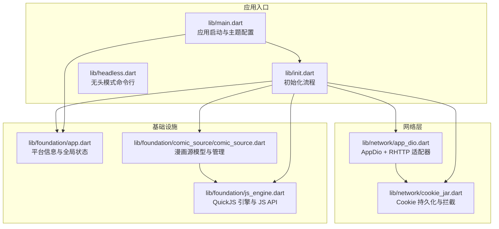
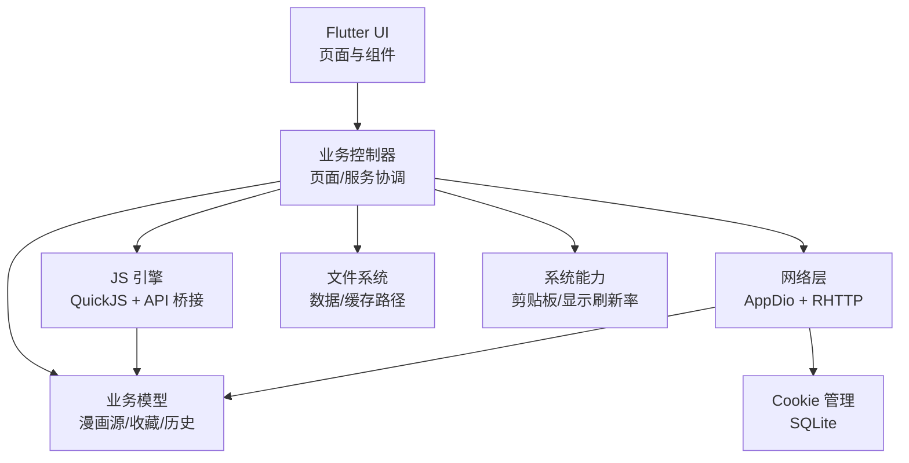
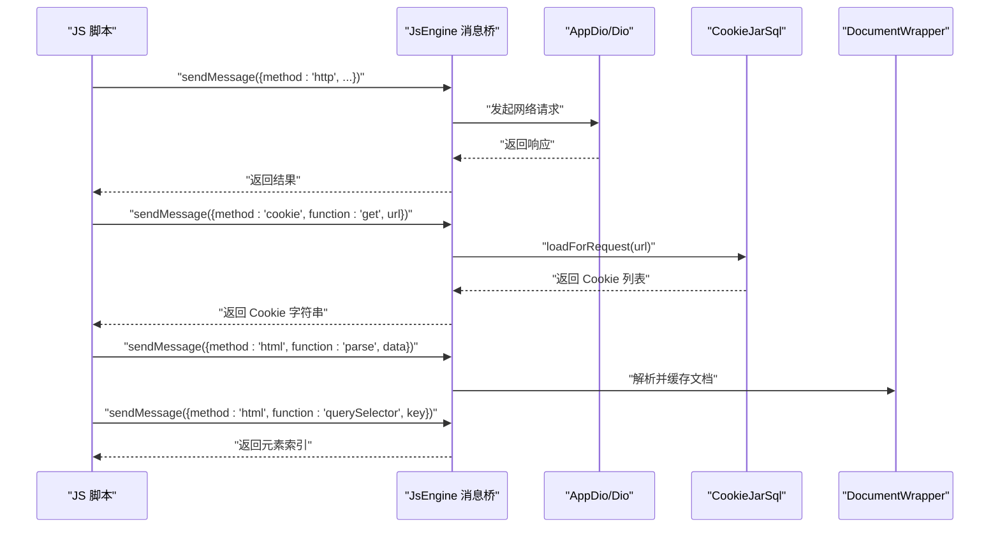
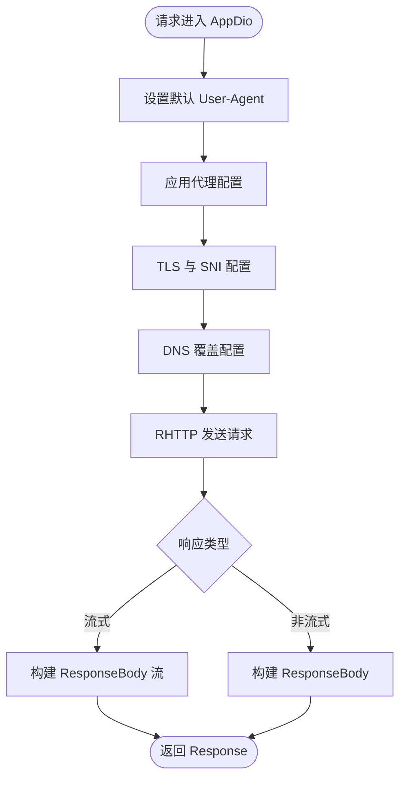
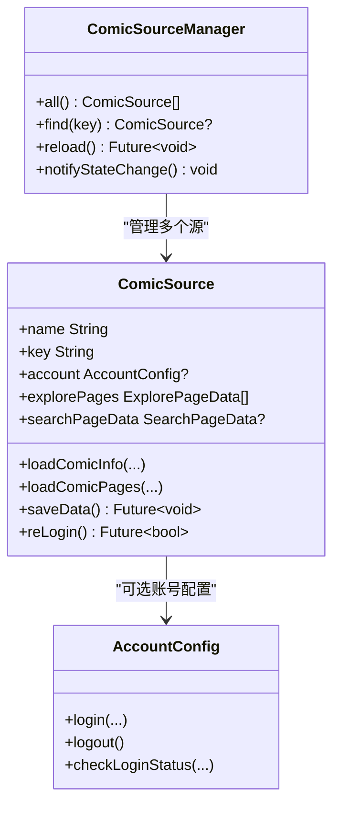
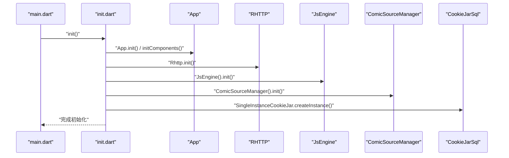
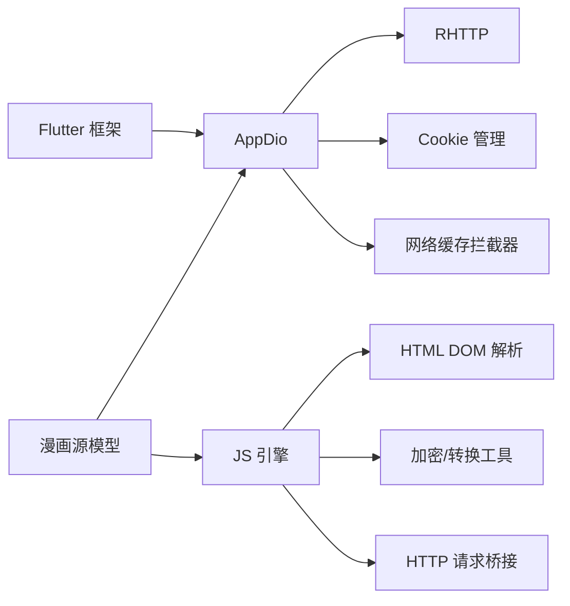

# 架构设计

<cite>
**本文引用的文件**
- [README.md](file://README.md)
- [pubspec.yaml](file://pubspec.yaml)
- [lib/main.dart](file://lib/main.dart)
- [lib/init.dart](file://lib/init.dart)
- [lib/headless.dart](file://lib/headless.dart)
- [lib/foundation/app.dart](file://lib/foundation/app.dart)
- [lib/foundation/js_engine.dart](file://lib/foundation/js_engine.dart)
- [lib/foundation/comic_source/comic_source.dart](file://lib/foundation/comic_source/comic_source.dart)
- [lib/network/app_dio.dart](file://lib/network/app_dio.dart)
- [lib/network/cookie_jar.dart](file://lib/network/cookie_jar.dart)
</cite>

## 目录
1. [引言](#引言)
2. [项目结构](#项目结构)
3. [核心组件](#核心组件)
4. [架构总览](#架构总览)
5. [详细组件分析](#详细组件分析)
6. [依赖分析](#依赖分析)
7. [性能考虑](#性能考虑)
8. [故障排查指南](#故障排查指南)
9. [结论](#结论)
10. [附录](#附录)

## 引言
本文件面向开发者与架构师，系统性阐述 Venera 应用的整体架构设计与实现要点。该应用采用 Flutter 跨平台框架，结合 QuickJS 作为可扩展的脚本引擎，通过 RHTTP 适配器统一网络访问，并以组件化与模块化的方式组织业务逻辑。本文将从系统边界、数据流、控制流与集成模式出发，解释各核心组件（JavaScript 引擎、网络层、数据存储层、UI 组件）之间的交互关系与设计权衡。

## 项目结构
Venera 的代码组织遵循“按功能域分层 + 模块化”的方式：
- 入口与运行时：lib/main.dart、lib/init.dart、lib/headless.dart
- 基础设施与平台能力：lib/foundation/*
- 网络栈与缓存：lib/network/*
- 业务模型与脚本源管理：lib/foundation/comic_source/*
- UI 组件库：lib/components/*

图表来源
- [lib/main.dart](file://lib/main.dart#L20-L58)
- [lib/init.dart](file://lib/init.dart#L37-L77)
- [lib/headless.dart](file://lib/headless.dart#L17-L34)
- [lib/foundation/app.dart](file://lib/foundation/app.dart#L82-L98)
- [lib/foundation/js_engine.dart](file://lib/foundation/js_engine.dart#L80-L110)
- [lib/foundation/comic_source/comic_source.dart](file://lib/foundation/comic_source/comic_source.dart#L54-L74)
- [lib/network/app_dio.dart](file://lib/network/app_dio.dart#L128-L175)
- [lib/network/cookie_jar.dart](file://lib/network/cookie_jar.dart#L18-L32)

章节来源
- [lib/main.dart](file://lib/main.dart#L20-L58)
- [lib/init.dart](file://lib/init.dart#L37-L77)
- [lib/headless.dart](file://lib/headless.dart#L17-L34)
- [lib/foundation/app.dart](file://lib/foundation/app.dart#L82-L98)
- [lib/foundation/js_engine.dart](file://lib/foundation/js_engine.dart#L80-L110)
- [lib/foundation/comic_source/comic_source.dart](file://lib/foundation/comic_source/comic_source.dart#L54-L74)
- [lib/network/app_dio.dart](file://lib/network/app_dio.dart#L128-L175)
- [lib/network/cookie_jar.dart](file://lib/network/cookie_jar.dart#L18-L32)

## 核心组件
- 应用入口与生命周期
  - main.dart：解析参数、初始化、设置窗口与主题、挂载根路由与错误兜底。
  - init.dart：并发初始化 App、Cookie、翻译、OpenCC、JS 引擎、漫画源管理器、缓存策略等。
  - headless.dart：无头模式命令行，支持 WebDAV 同步、漫画源更新、订阅更新检查等。
- 基础设施
  - app.dart：平台能力抽象、路径管理、导航键、本地化与全局状态持有者。
  - js_engine.dart：QuickJS 引擎封装、消息桥接、HTML DOM 包装、加密与转换工具、UI 扩展 API。
  - comic_source.dart：漫画源模型、源管理器、数据持久化与并发保存策略。
- 网络层
  - app_dio.dart：基于 RHTTP 的 HttpClientAdapter，统一超时、重定向、DNS、TLS、代理与日志。
  - cookie_jar.dart：SQLite 存储 Cookie，拦截请求/响应，域名与路径匹配规则。
- 数据与缓存
  - 缓存策略由初始化阶段设置，配合网络层拦截器使用。

章节来源
- [lib/main.dart](file://lib/main.dart#L20-L58)
- [lib/init.dart](file://lib/init.dart#L37-L77)
- [lib/headless.dart](file://lib/headless.dart#L17-L34)
- [lib/foundation/app.dart](file://lib/foundation/app.dart#L82-L98)
- [lib/foundation/js_engine.dart](file://lib/foundation/js_engine.dart#L80-L110)
- [lib/foundation/comic_source/comic_source.dart](file://lib/foundation/comic_source/comic_source.dart#L54-L74)
- [lib/network/app_dio.dart](file://lib/network/app_dio.dart#L128-L175)
- [lib/network/cookie_jar.dart](file://lib/network/cookie_jar.dart#L18-L32)

## 架构总览
Venera 采用“MVC + 组件化 + 模块化”混合架构：
- MVC 视图层：Flutter Widget 层，负责渲染与用户交互。
- 控制器层：页面与业务控制器，协调数据加载与状态变更。
- 模型层：漫画源模型、历史、收藏、本地数据等，承载业务数据与规则。
- 组件化：UI 组件库与通用控件，提升复用与一致性。
- 模块化：按功能域拆分模块（网络、基础、业务），降低耦合。

系统边界与集成点：
- 外部系统：Web 漫画站点、WebDAV、系统剪贴板、系统显示刷新率。
- 内部模块：JS 引擎、网络栈、Cookie 管理、缓存、日志与配置。

图表来源
- [lib/main.dart](file://lib/main.dart#L180-L290)
- [lib/init.dart](file://lib/init.dart#L37-L77)
- [lib/foundation/js_engine.dart](file://lib/foundation/js_engine.dart#L80-L110)
- [lib/network/app_dio.dart](file://lib/network/app_dio.dart#L128-L175)
- [lib/network/cookie_jar.dart](file://lib/network/cookie_jar.dart#L18-L32)
- [lib/foundation/app.dart](file://lib/foundation/app.dart#L82-L98)

## 详细组件分析

### JavaScript 引擎（QuickJS）与 JS API 桥接
- 初始化与全局注入
  - 在初始化阶段创建 QuickJS 引擎，注入全局方法与常量，加载内置初始化脚本。
  - 提供消息通道接收来自 JS 的调用，分发至日志、HTTP、DOM 解析、Cookie、UI、随机数、UUID、设置读取、平台信息、剪贴板等。
- JS API 能力
  - 日志记录、HTTP 请求（支持 Dart IO 客户端与代理）、HTML 文档解析与查询、Cookie 读写、随机数生成、UUID、设置读取、延迟执行、UI 扩展、国际化与平台信息、剪贴板读写、计算任务派发。
- 安全与限制
  - 设置保存不允许写入“setting”键；函数参数校验严格；异常统一记录。
- 性能与资源
  - DOM 文档数量上限保护；自动释放 JS 函数句柄；AES/RSA 等加密算法在 Dart 侧实现，避免 JS 环境复杂度。

图表来源
- [lib/foundation/js_engine.dart](file://lib/foundation/js_engine.dart#L112-L212)
- [lib/foundation/js_engine.dart](file://lib/foundation/js_engine.dart#L214-L272)
- [lib/network/cookie_jar.dart](file://lib/network/cookie_jar.dart#L89-L112)
- [lib/network/app_dio.dart](file://lib/network/app_dio.dart#L143-L174)

章节来源
- [lib/foundation/js_engine.dart](file://lib/foundation/js_engine.dart#L80-L110)
- [lib/foundation/js_engine.dart](file://lib/foundation/js_engine.dart#L112-L212)
- [lib/foundation/js_engine.dart](file://lib/foundation/js_engine.dart#L214-L272)
- [lib/foundation/js_engine.dart](file://lib/foundation/js_engine.dart#L286-L358)
- [lib/foundation/js_engine.dart](file://lib/foundation/js_engine.dart#L360-L392)
- [lib/foundation/js_engine.dart](file://lib/foundation/js_engine.dart#L402-L525)
- [lib/foundation/js_engine.dart](file://lib/foundation/js_engine.dart#L569-L574)

### 网络层与 RHTTP 适配器
- 统一适配器
  - AppDio 使用 RHttpAdapter，集中处理代理、超时、重定向、DNS、TLS 等配置。
- 拦截器体系
  - Cookie 管理：请求前注入 Cookie，响应后保存 Set-Cookie。
  - 缓存拦截：网络缓存管理器（与 AppDio 集成）。
  - Cloudflare 拦截：应对反爬挑战。
  - 日志拦截：请求/响应日志输出，敏感头与数据掩码。
- 并发控制
  - 支持通过请求头防止重复请求（串行化同一路径请求）。

图表来源
- [lib/network/app_dio.dart](file://lib/network/app_dio.dart#L177-L281)
- [lib/network/app_dio.dart](file://lib/network/app_dio.dart#L220-L260)

章节来源
- [lib/network/app_dio.dart](file://lib/network/app_dio.dart#L128-L175)
- [lib/network/app_dio.dart](file://lib/network/app_dio.dart#L177-L281)
- [lib/network/cookie_jar.dart](file://lib/network/cookie_jar.dart#L197-L213)

### 漫画源模型与管理
- 源管理器
  - 负责扫描本地脚本文件、解析并注册为 ComicSource 实例；提供更新可用列表通知。
- 源实例
  - 封装账号登录、分类/搜索/发现页、漫画详情与分页加载、评论/点赞/评分、归档下载等能力。
  - 数据持久化：每个源独立数据文件，保存账户、设置与自定义数据；并发保存与等待队列避免竞态。
- 与 JS 引擎协作
  - 源脚本通过 JS 引擎暴露的 API 完成网络请求、DOM 解析、Cookie 管理、UI 扩展等。

图表来源
- [lib/foundation/comic_source/comic_source.dart](file://lib/foundation/comic_source/comic_source.dart#L35-L108)
- [lib/foundation/comic_source/comic_source.dart](file://lib/foundation/comic_source/comic_source.dart#L110-L280)
- [lib/foundation/comic_source/comic_source.dart](file://lib/foundation/comic_source/comic_source.dart#L282-L320)

章节来源
- [lib/foundation/comic_source/comic_source.dart](file://lib/foundation/comic_source/comic_source.dart#L54-L74)
- [lib/foundation/comic_source/comic_source.dart](file://lib/foundation/comic_source/comic_source.dart#L206-L231)

### 初始化流程与系统边界
- 初始化顺序
  - App 初始化路径与导航键；单例 CookieJar 创建；并发初始化 RHTTP、组件、SAF、翻译、OpenCC、JS 引擎、漫画源管理器、缓存大小设置。
- 系统边界
  - Android：高刷显示模式设置、链接与文本分享处理。
  - Windows：心跳通道用于监控。
  - 无头模式：支持命令行执行 WebDAV 同步、漫画源更新、订阅更新检查。

图表来源
- [lib/main.dart](file://lib/main.dart#L20-L58)
- [lib/init.dart](file://lib/init.dart#L37-L77)
- [lib/foundation/app.dart](file://lib/foundation/app.dart#L82-L98)
- [lib/foundation/js_engine.dart](file://lib/foundation/js_engine.dart#L80-L110)
- [lib/foundation/comic_source/comic_source.dart](file://lib/foundation/comic_source/comic_source.dart#L54-L74)
- [lib/network/cookie_jar.dart](file://lib/network/cookie_jar.dart#L205-L213)

章节来源
- [lib/main.dart](file://lib/main.dart#L20-L58)
- [lib/init.dart](file://lib/init.dart#L37-L77)
- [lib/headless.dart](file://lib/headless.dart#L17-L34)

## 依赖分析
- 技术选型与动机
  - Flutter：跨平台 UI 与原生性能平衡，便于桌面与移动端统一开发。
  - QuickJS：轻量、嵌入式 JS 引擎，便于动态扩展漫画源脚本，降低运行时开销。
  - RHTTP：高性能网络库，提供代理、超时、重定向、DNS、TLS 等可控配置，适配复杂网络环境。
  - SQLite3：本地 Cookie 与缓存持久化，兼顾易部署与可靠性。
- 组件耦合与内聚
  - JS 引擎与漫画源强耦合，但通过消息桥与接口约束隔离具体实现。
  - 网络层通过适配器解耦底层实现，拦截器增强横切关注点。
  - 基础设施（App）集中管理平台能力与路径，降低上层对平台差异的感知。

图表来源
- [pubspec.yaml](file://pubspec.yaml#L11-L91)
- [lib/network/app_dio.dart](file://lib/network/app_dio.dart#L128-L175)
- [lib/foundation/js_engine.dart](file://lib/foundation/js_engine.dart#L80-L110)
- [lib/foundation/comic_source/comic_source.dart](file://lib/foundation/comic_source/comic_source.dart#L54-L74)

章节来源
- [pubspec.yaml](file://pubspec.yaml#L11-L91)

## 性能考虑
- 并发初始化：初始化阶段使用 Future.wait 并发启动多个子系统，缩短冷启动时间。
- 网络优化：RHTTP 提供连接池、超时与重定向限制，减少无效重试；AppDio 拦截器链按需启用，避免多余开销。
- JS 引擎：DOM 文档数量上限与自动释放机制，防止内存膨胀；加密算法在 Dart 侧实现，避免 JS 环境切换成本。
- 缓存策略：初始化阶段设置缓存上限，结合网络层缓存拦截器，平衡带宽与延迟。
- 移动端体验：Android 高刷显示模式设置，提升滚动与翻页流畅度。

## 故障排查指南
- 未捕获异常
  - 应用级与 Flutter 错误回调均会记录堆栈，定位问题来源。
- 网络错误
  - MyLogInterceptor 对常见错误进行语义化提示（超时、握手失败、连接被重置等），并输出请求/响应摘要。
- Cookie 问题
  - CookieJarSql 支持域名通配与路径匹配，确保请求携带正确 Cookie；异常 Cookie 头会记录警告。
- JS 异常
  - JsEngine 对消息处理异常进行统一记录；JS 运行时异常包装为可识别类型，便于前端反馈。

章节来源
- [lib/main.dart](file://lib/main.dart#L236-L244)
- [lib/network/app_dio.dart](file://lib/network/app_dio.dart#L18-L70)
- [lib/network/cookie_jar.dart](file://lib/network/cookie_jar.dart#L134-L147)
- [lib/foundation/js_engine.dart](file://lib/foundation/js_engine.dart#L107-L110)

## 结论
Venera 通过 Flutter 提供一致的跨平台体验，借助 QuickJS 与 RHTTP 实现灵活的脚本扩展与可靠的网络访问，配合 SQLite 与拦截器体系保障数据与性能。整体架构在保证可维护性的同时，兼顾了扩展性与运行效率。建议后续持续完善日志分级、错误上报与可观测性，进一步优化 JS 脚本的沙箱与安全边界。

## 附录
- 设计决策摘要
  - 选择 Flutter：统一多端开发与 UI 生态。
  - 选择 QuickJS：低侵入、易集成、便于社区贡献漫画源。
  - 选择 RHTTP：对网络细节的精细控制，满足复杂网络场景。
- 参考资料
  - 项目特性与构建说明见 [README.md](file://README.md#L10-L25)