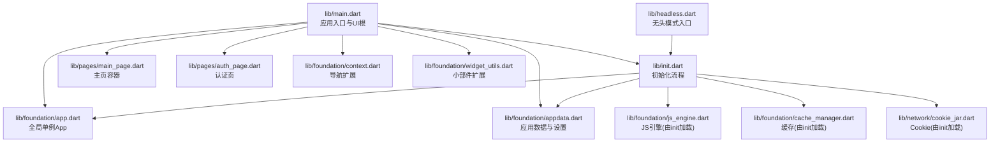
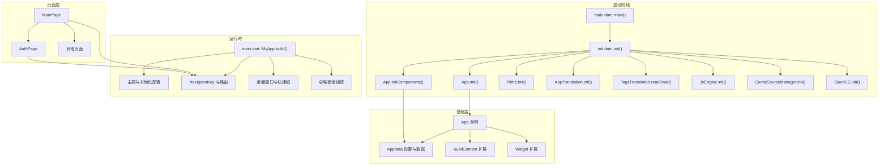
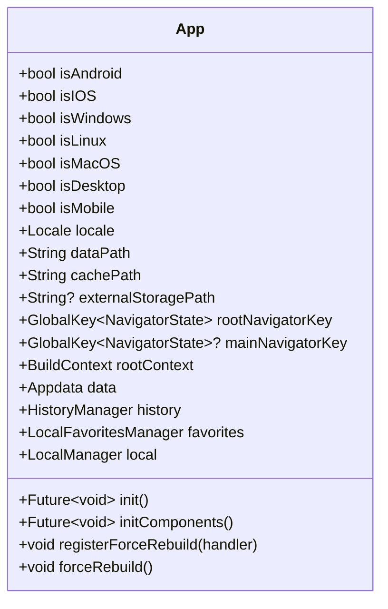
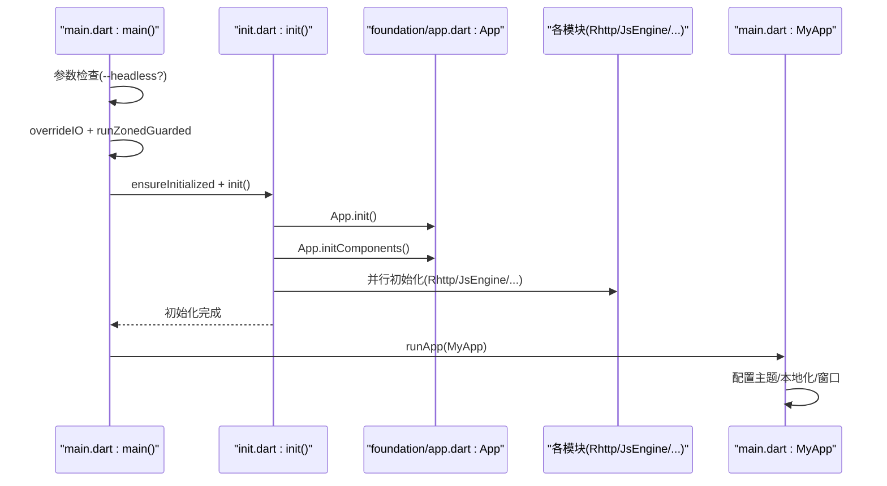
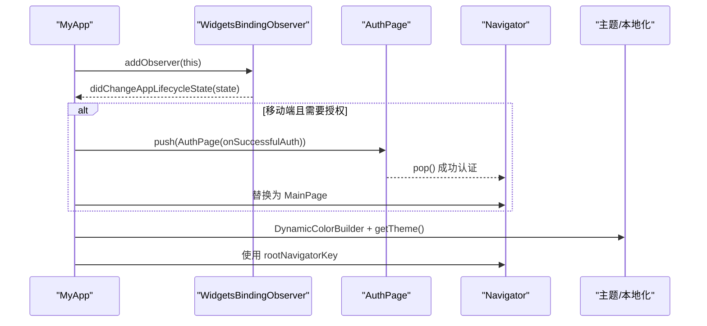
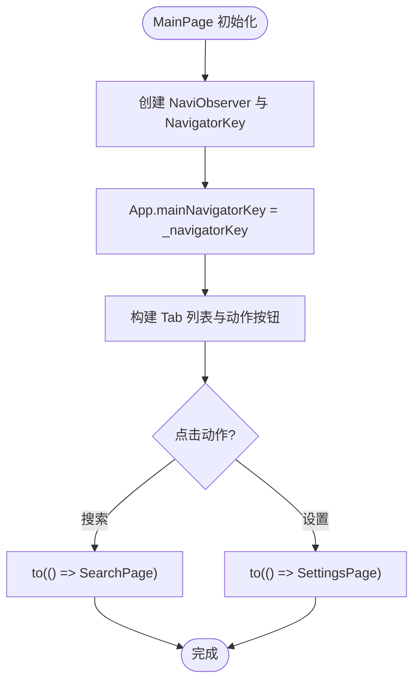
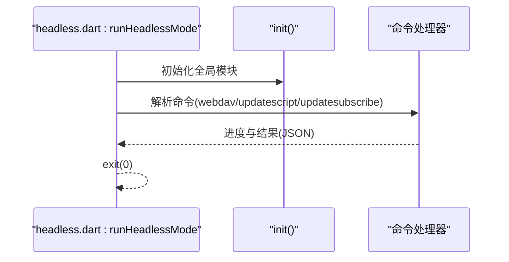
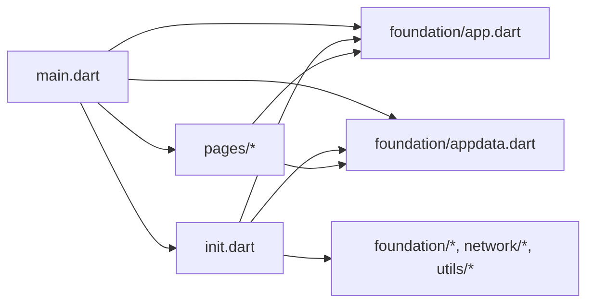

# 核心架构模式

<cite>
**本文引用的文件**
- [lib/main.dart](file://lib/main.dart)
- [lib/init.dart](file://lib/init.dart)
- [lib/headless.dart](file://lib/headless.dart)
- [lib/foundation/app.dart](file://lib/foundation/app.dart)
- [lib/foundation/appdata.dart](file://lib/foundation/appdata.dart)
- [lib/foundation/context.dart](file://lib/foundation/context.dart)
- [lib/foundation/widget_utils.dart](file://lib/foundation/widget_utils.dart)
- [lib/pages/main_page.dart](file://lib/pages/main_page.dart)
- [lib/pages/auth_page.dart](file://lib/pages/auth_page.dart)
</cite>

## 目录
1. [引言](#引言)
2. [项目结构](#项目结构)
3. [核心组件](#核心组件)
4. [架构总览](#架构总览)
5. [详细组件分析](#详细组件分析)
6. [依赖关系分析](#依赖关系分析)
7. [性能考虑](#性能考虑)
8. [故障排查指南](#故障排查指南)
9. [结论](#结论)

## 引言
本文件面向开发者，系统阐述 Venera 应用的核心架构模式与设计思想，重点覆盖以下方面：
- 整体架构：以 Flutter 为基础，采用“单例式全局状态 + 组件化页面 + 模块化初始化”的混合架构。
- MVC 模式应用：页面层（View）由 Flutter 组件构成；业务逻辑与状态通过 Foundation 层（Model）与页面交互；控制器职责由页面状态类与导航观察器承担。
- 组件化与模块化：页面按功能分层，Foundation 提供全局状态与工具扩展，Utils 提供通用能力，网络与脚本引擎作为可插拔模块。
- App 类设计理念：单例模式统一管理全局状态、平台检测、国际化与组件初始化；贯穿初始化阶段与运行时管理。
- 系统边界：明确初始化阶段（启动前）、运行时管理（UI 生命周期与导航）、组件生命周期（页面与导航栈）。

## 项目结构
Venera 的代码组织遵循“按功能域分层 + 按职责分包”的原则：
- lib/main.dart：应用入口，负责启动、初始化、主题与本地化配置、桌面窗口管理、错误兜底。
- lib/init.dart：集中初始化流程，串行/并行加载全局模块（网络、翻译、JS 引擎、漫画源、缓存等），并处理平台特性。
- lib/headless.dart：无头模式命令行入口，复用 init 流程，提供 WebDAV 同步、脚本更新、订阅更新等 CLI 能力。
- lib/foundation/*：基础层，包含全局单例 App、应用数据 Appdata、上下文扩展与工具、历史与收藏管理等。
- lib/pages/*：页面层，包含主页、认证页、设置页等，采用 StatefulWidget 承载视图状态与导航逻辑。
- lib/utils/*：通用工具层，如 IO、链接处理、文本分享、OpenCC 繁简转换、标签翻译等。

图表来源
- [lib/main.dart](file://lib/main.dart#L20-L58)
- [lib/init.dart](file://lib/init.dart#L37-L77)
- [lib/headless.dart](file://lib/headless.dart#L17-L34)

章节来源
- [lib/main.dart](file://lib/main.dart#L20-L58)
- [lib/init.dart](file://lib/init.dart#L37-L77)
- [lib/headless.dart](file://lib/headless.dart#L17-L34)

## 核心组件
本节聚焦于支撑整体架构的关键组件及其职责与协作方式。

- 全局单例 App
  - 角色：统一持有平台信息、路径、导航键、国际化策略、全局重建回调注册与触发。
  - 设计要点：单例模式避免多实例状态漂移；平台检测在构造期即确定；国际化优先级可覆盖设备语言。
  - 初始化：App.init() 解析应用缓存与支持目录；App.initComponents() 并行初始化数据、历史、收藏、本地管理等子系统。

- 应用数据 Appdata
  - 角色：持久化存储应用设置与搜索历史；支持增量同步与隐式数据（implicitData）持久化。
  - 设计要点：Settings 以 ChangeNotifier 实现响应式变更通知；提供 Comic 特定设置映射；禁用同步字段可配置。
  - 数据一致性：保存时并发写入主数据与同步数据文件，并在异常时回退与日志记录。

- 上下文与小部件扩展
  - 角色：为 BuildContext 提供导航、尺寸、颜色方案、消息提示等便捷方法；为 Widget 提供布局与样式扩展。
  - 设计要点：Navigation 扩展封装 Navigator 操作；Widget 扩展提供常用布局包装，降低样板代码。

- 页面容器与导航
  - 角色：MainPage 作为多 Tab 容器，承载首页、收藏、发现、分类四个页面；AuthPage 在移动端进入休眠或隐藏时弹出认证。
  - 设计要点：使用 NaviObserver 记录路由栈；通过 App.mainNavigatorKey 与全局导航键配合，实现跨页面跳转与返回。

章节来源
- [lib/foundation/app.dart](file://lib/foundation/app.dart#L15-L113)
- [lib/foundation/appdata.dart](file://lib/foundation/appdata.dart#L11-L163)
- [lib/foundation/context.dart](file://lib/foundation/context.dart#L6-L52)
- [lib/foundation/widget_utils.dart](file://lib/foundation/widget_utils.dart#L3-L120)
- [lib/pages/main_page.dart](file://lib/pages/main_page.dart#L14-L118)
- [lib/pages/auth_page.dart](file://lib/pages/auth_page.dart#L7-L72)

## 架构总览
Venera 的架构以“入口 -> 初始化 -> UI根 -> 页面容器 -> 导航与状态”为主线，辅以 Foundation 与 Utils 的横切能力。

图表来源
- [lib/main.dart](file://lib/main.dart#L20-L58)
- [lib/init.dart](file://lib/init.dart#L37-L77)
- [lib/foundation/app.dart](file://lib/foundation/app.dart#L82-L108)
- [lib/foundation/appdata.dart](file://lib/foundation/appdata.dart#L130-L160)
- [lib/pages/main_page.dart](file://lib/pages/main_page.dart#L14-L118)
- [lib/pages/auth_page.dart](file://lib/pages/auth_page.dart#L7-L72)

## 详细组件分析

### App 类：单例模式与全局状态管理
- 单例实现：通过私有类 _App 与外部导出的 App 实例，确保全局唯一性与静态访问。
- 平台检测：在构造期确定 isAndroid/isIOS/isWindows/isLinux/isMacOS/isDesktop/isMobile，用于 UI 与功能分支。
- 国际化：locale 属性综合设备语言与用户设置，支持 zh-Hant 自动映射为 zh-TW。
- 路径与导航：缓存与支持目录路径在 init 中解析；rootNavigatorKey 与 mainNavigatorKey 为全局导航提供统一入口。
- 组件初始化：initComponents 并行初始化数据、历史、收藏、本地管理，保证后续模块可用。
- 全局重建：registerForceRebuild 注册重建回调，forceRebuild 触发全树重建，用于主题、语言等全局切换。

图表来源
- [lib/foundation/app.dart](file://lib/foundation/app.dart#L15-L113)

章节来源
- [lib/foundation/app.dart](file://lib/foundation/app.dart#L15-L113)

### 初始化流程：启动前的系统边界
- 入口分流：main() 支持 --headless 无头模式；否则进入常规 UI 启动。
- IO 重定向：通过 overrideIO 将文件 IO 切换到安全实现，避免主线程阻塞。
- 初始化顺序：ensureInitialized -> init() -> runApp(MyApp) -> 桌面窗口初始化（window_manager）。
- 并行初始化：init() 内部使用 Future.wait 并行初始化网络、翻译、JS 引擎、漫画源、OpenCC 等模块。
- 平台特性：Android 高刷设置、Windows 心跳通道；异常统一记录到日志。

图表来源
- [lib/main.dart](file://lib/main.dart#L20-L58)
- [lib/init.dart](file://lib/init.dart#L37-L77)
- [lib/foundation/app.dart](file://lib/foundation/app.dart#L82-L108)

章节来源
- [lib/main.dart](file://lib/main.dart#L20-L58)
- [lib/init.dart](file://lib/init.dart#L37-L77)

### 运行时管理：UI 生命周期与导航
- MyApp：实现 WidgetsBindingObserver，监听 AppLifecycleState 变化；移动端隐藏/休眠时弹出 AuthPage；提供全局重建回调注册。
- 主题与本地化：DynamicColorBuilder 动态主题；根据设置选择系统/浅色/深色；locale 从设置或系统语言推断。
- 桌面端增强：隐藏标题栏、透明背景、最小尺寸、窗口位置恢复；Escape 键返回、鼠标后退手势。
- 错误兜底：ErrorWidget.builder 捕获未处理异常并输出日志与错误界面。

图表来源
- [lib/main.dart](file://lib/main.dart#L67-L118)
- [lib/pages/auth_page.dart](file://lib/pages/auth_page.dart#L7-L72)

章节来源
- [lib/main.dart](file://lib/main.dart#L67-L118)
- [lib/pages/auth_page.dart](file://lib/pages/auth_page.dart#L7-L72)

### 页面容器与导航：MVC 的视图与控制器
- MainPage：多 Tab 容器，使用 NaviPane 与 NaviObserver 管理路由栈；通过 App.mainNavigatorKey 与全局导航键联动。
- 导航扩展：foundation/context.dart 为 BuildContext 提供 to()/toReplacement()/pop() 等便捷方法，屏蔽 Navigator 细节。
- 控制器职责：页面状态类承担路由切换、动作按钮、页面构建等控制逻辑；App.mainNavigatorKey 为跨页面通信提供统一入口。

图表来源
- [lib/pages/main_page.dart](file://lib/pages/main_page.dart#L21-L118)
- [lib/foundation/context.dart](file://lib/foundation/context.dart#L17-L25)

章节来源
- [lib/pages/main_page.dart](file://lib/pages/main_page.dart#L21-L118)
- [lib/foundation/context.dart](file://lib/foundation/context.dart#L6-L52)

### 无头模式：命令行与后台任务
- 入口：--headless 参数触发 headless 流程，先执行 init() 再解析子命令。
- 命令类型：webdav(up/down)、updatescript(all)、updatesubscribe(批量/按ID)。
- 输出规范：统一以 JSON 结构打印状态与进度，便于外部脚本消费。
- 退出策略：命令完成后主动 exit(0)，避免 UI 保活。

图表来源
- [lib/headless.dart](file://lib/headless.dart#L17-L244)
- [lib/init.dart](file://lib/init.dart#L37-L77)

章节来源
- [lib/headless.dart](file://lib/headless.dart#L17-L244)
- [lib/init.dart](file://lib/init.dart#L37-L77)

## 依赖关系分析
- 入口依赖：main.dart 依赖 init.dart、foundation/app.dart、foundation/appdata.dart、pages/main_page.dart、pages/auth_page.dart。
- 初始化依赖：init.dart 依赖 foundation/app.dart、foundation/appdata.dart、foundation/js_engine.dart、foundation/cache_manager.dart、network/cookie_jar.dart 等模块。
- 页面依赖：pages/* 依赖 components/components.dart、foundation/app.dart、foundation/appdata.dart、utils/translations.dart 等。
- 基础层依赖：foundation/* 依赖 Flutter SDK、path_provider、local_auth 等；Appdata 依赖 path_provider 读写文件。

图表来源
- [lib/main.dart](file://lib/main.dart#L1-L18)
- [lib/init.dart](file://lib/init.dart#L1-L22)

章节来源
- [lib/main.dart](file://lib/main.dart#L1-L18)
- [lib/init.dart](file://lib/init.dart#L1-L22)

## 性能考虑
- 并行初始化：init() 使用 Future.wait 并行启动多个模块，缩短冷启动时间。
- 主题与字体：桌面端设置字体族与回退字体，避免 Android 状态栏高度异常导致的额外测量开销。
- 缓存与磁盘：CacheManager 限制缓存大小；Appdata 保存时并发写入主数据与同步数据文件，减少 I/O 阻塞。
- 桌面窗口：window_manager 在 ready 后再显示窗口，避免首帧闪烁；最小尺寸与透明背景减少渲染抖动。
- 无头模式：命令执行完成后立即退出，避免后台线程占用。

## 故障排查指南
- 未捕获异常：main.dart 使用 runZonedGuarded 与 ErrorWidget.builder 捕获异常并记录日志，定位问题。
- 初始化失败：init() 对每个 Future 调用 wait() 包装，避免单点异常导致崩溃；同时记录错误堆栈。
- 日志输出：Log.error 统一格式化异常与堆栈，便于定位。
- 平台差异：Android 高刷设置失败、Windows 心跳通道、桌面窗口透明背景等均在 init 或 main 中有容错与降级处理。

章节来源
- [lib/main.dart](file://lib/main.dart#L54-L57)
- [lib/init.dart](file://lib/init.dart#L24-L35)
- [lib/init.dart](file://lib/init.dart#L66-L76)

## 结论
Venera 的核心架构以“单例 App + Foundation 数据层 + 页面容器 + 并行初始化”为核心，既满足 Flutter 生态的组件化与模块化要求，又通过 Foundation 层统一全局状态与平台差异，实现跨平台一致体验。MVC 在本项目中体现为：页面（View）由 Flutter 组件构成；Foundation（Model）承载全局状态与数据；页面状态类（Controller）承担导航与交互逻辑。该架构在可维护性、可扩展性与跨平台兼容性之间取得平衡，适合持续演进与功能迭代。