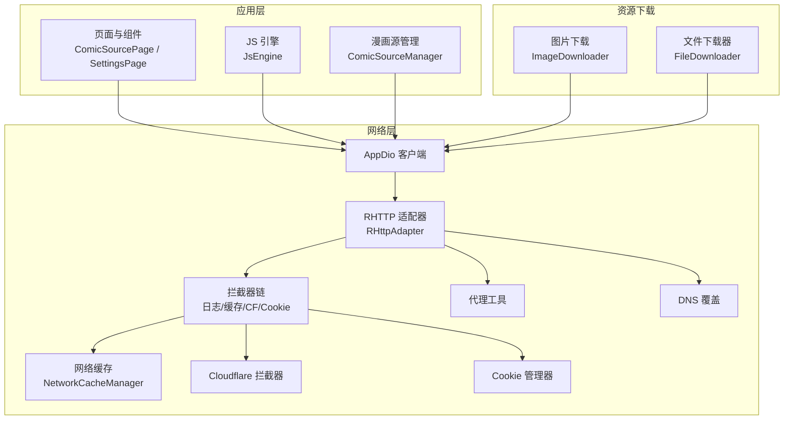
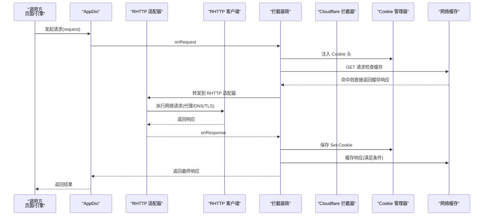
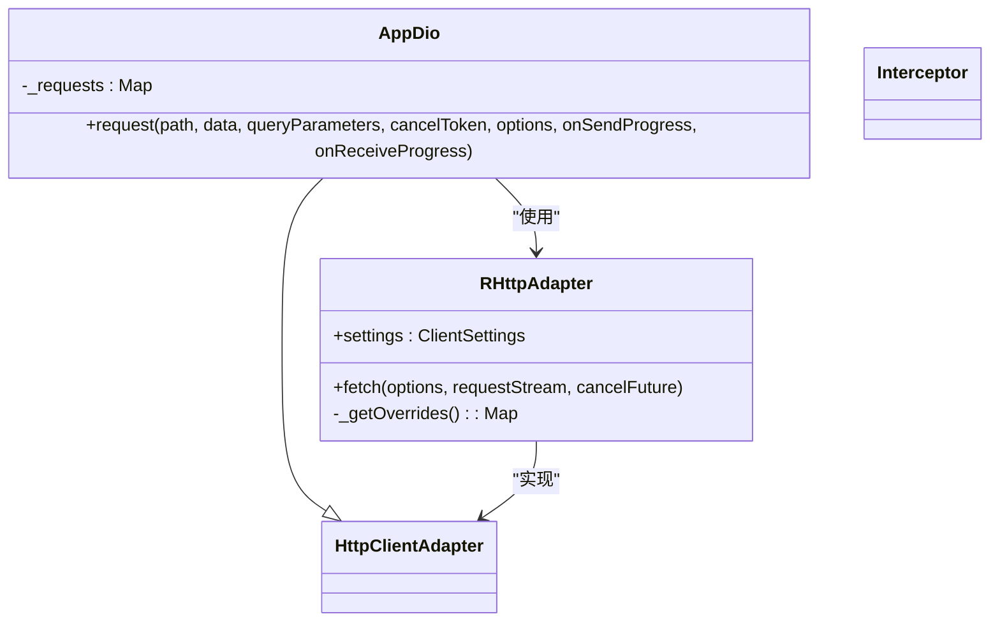
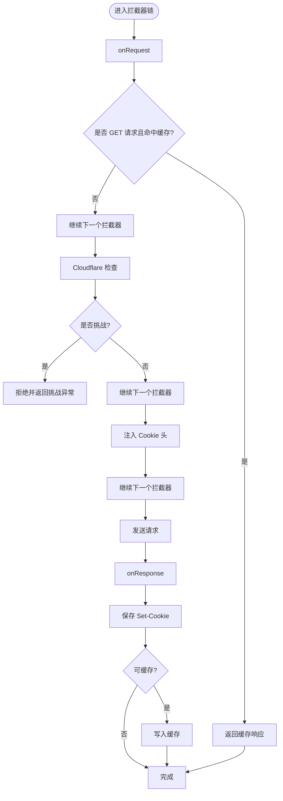
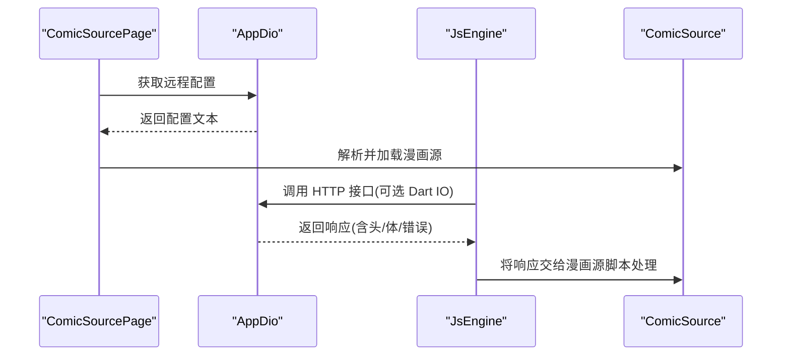
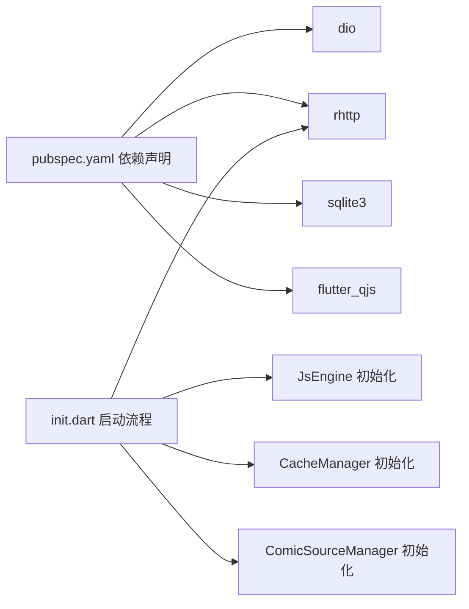

# 网络层架构

<cite>
**本文档引用的文件**
- [lib/network/app_dio.dart](file://lib/network/app_dio.dart)
- [lib/network/cache.dart](file://lib/network/cache.dart)
- [lib/network/cloudflare.dart](file://lib/network/cloudflare.dart)
- [lib/network/cookie_jar.dart](file://lib/network/cookie_jar.dart)
- [lib/network/images.dart](file://lib/network/images.dart)
- [lib/network/file_downloader.dart](file://lib/network/file_downloader.dart)
- [lib/network/proxy.dart](file://lib/network/proxy.dart)
- [lib/foundation/js_engine.dart](file://lib/foundation/js_engine.dart)
- [lib/init.dart](file://lib/init.dart)
- [lib/pages/comic_source_page.dart](file://lib/pages/comic_source_page.dart)
- [lib/pages/settings/settings_page.dart](file://lib/pages/settings/settings_page.dart)
- [lib/foundation/comic_source/comic_source.dart](file://lib/foundation/comic_source/comic_source.dart)
- [pubspec.yaml](file://pubspec.yaml)
</cite>

## 目录
1. [简介](#简介)
2. [项目结构](#项目结构)
3. [核心组件](#核心组件)
4. [架构总览](#架构总览)
5. [详细组件分析](#详细组件分析)
6. [依赖关系分析](#依赖关系分析)
7. [性能考虑](#性能考虑)
8. [故障排除指南](#故障排除指南)
9. [结论](#结论)

## 简介
本文件系统性梳理 Venera 应用的网络层架构，重点围绕基于 Dio 的网络栈设计、RHTTP 适配器实现、高性能网络请求处理机制展开。内容覆盖请求生命周期、中间件与拦截器、错误与重试策略、代理与 DNS 解析、SSL 证书验证、连接池管理、与漫画源系统的集成（请求头定制、响应处理、缓存策略），并提供性能优化建议与故障排除指导。

## 项目结构
网络层主要由以下模块构成：
- 基于 Dio 的统一网络客户端：AppDio 及其 RHTTP 适配器
- 拦截器体系：日志、缓存、Cloudflare 挑战处理、Cookie 管理
- 资源下载：图片流式下载、大文件分块断点续传
- 配置与工具：代理获取、DNS 覆盖、Cookie 数据库存储
- 集成点：漫画源脚本引擎、设置页、漫画源管理页

图表来源
- [lib/network/app_dio.dart](file://lib/network/app_dio.dart#L128-L175)
- [lib/network/cache.dart](file://lib/network/cache.dart#L27-L67)
- [lib/network/cloudflare.dart](file://lib/network/cloudflare.dart#L63-L99)
- [lib/network/cookie_jar.dart](file://lib/network/cookie_jar.dart#L215-L243)
- [lib/network/images.dart](file://lib/network/images.dart#L12-L89)
- [lib/network/file_downloader.dart](file://lib/network/file_downloader.dart#L9-L30)
- [lib/network/proxy.dart](file://lib/network/proxy.dart#L10-L20)

章节来源
- [lib/network/app_dio.dart](file://lib/network/app_dio.dart#L1-L282)
- [lib/network/cache.dart](file://lib/network/cache.dart#L1-L231)
- [lib/network/cloudflare.dart](file://lib/network/cloudflare.dart#L1-L223)
- [lib/network/cookie_jar.dart](file://lib/network/cookie_jar.dart#L1-L244)
- [lib/network/images.dart](file://lib/network/images.dart#L1-L325)
- [lib/network/file_downloader.dart](file://lib/network/file_downloader.dart#L1-L300)
- [lib/network/proxy.dart](file://lib/network/proxy.dart#L1-L61)

## 核心组件
- AppDio：封装 Dio 并注入 RHTTP 适配器，统一拦截器链（Cookie、缓存、Cloudflare、日志）；支持串行化相同路径请求，避免并发重复。
- RHttpAdapter：将 Dio 请求桥接到 RHTTP 客户端，负责代理、重定向、超时、DNS 覆盖、TLS 设置等。
- 拦截器体系：日志拦截器、网络缓存拦截器、Cloudflare 拦截器、Cookie 管理拦截器。
- 图片下载器：支持流式下载、进度上报、缓存命中、JS 回调处理、图像后处理与修改。
- 文件下载器：多任务分块下载、断点续传、范围请求、写盘节流与状态持久化。
- 代理与 DNS：从系统或用户配置读取代理，支持 DNS 覆盖映射。
- Cookie 管理：SQLite 存储，域/路径匹配，自动合并与去重，请求头注入与响应保存。

章节来源
- [lib/network/app_dio.dart](file://lib/network/app_dio.dart#L128-L175)
- [lib/network/cache.dart](file://lib/network/cache.dart#L27-L67)
- [lib/network/cloudflare.dart](file://lib/network/cloudflare.dart#L63-L99)
- [lib/network/cookie_jar.dart](file://lib/network/cookie_jar.dart#L215-L243)
- [lib/network/images.dart](file://lib/network/images.dart#L12-L89)
- [lib/network/file_downloader.dart](file://lib/network/file_downloader.dart#L9-L30)
- [lib/network/proxy.dart](file://lib/network/proxy.dart#L10-L20)

## 架构总览
下图展示从应用发起请求到响应返回的关键交互流程，以及拦截器在请求/响应阶段的介入点。

图表来源
- [lib/network/app_dio.dart](file://lib/network/app_dio.dart#L142-L174)
- [lib/network/app_dio.dart](file://lib/network/app_dio.dart#L220-L260)
- [lib/network/cache.dart](file://lib/network/cache.dart#L78-L135)
- [lib/network/cloudflare.dart](file://lib/network/cloudflare.dart#L82-L91)
- [lib/network/cookie_jar.dart](file://lib/network/cookie_jar.dart#L221-L237)

## 详细组件分析

### AppDio 与 RHTTP 适配器
- 统一客户端：继承 DioMixin，注入 RHTTP 适配器，初始化拦截器链（Cookie、缓存、Cloudflare、日志）。
- 请求串行化：通过内部字典记录正在处理的路径，遇到相同路径请求等待完成后再执行，避免重复并发。
- RHTTP 设置：代理、重定向次数、超时（连接/保活/心跳）、DNS 覆盖、TLS（SNI、证书校验）。
- 请求头默认值：若无 UA，则注入应用版本 UA；转发请求体为流或二进制。
- 错误映射：将底层异常映射为更友好的提示信息。

图表来源
- [lib/network/app_dio.dart](file://lib/network/app_dio.dart#L128-L175)
- [lib/network/app_dio.dart](file://lib/network/app_dio.dart#L177-L282)

章节来源
- [lib/network/app_dio.dart](file://lib/network/app_dio.dart#L128-L175)
- [lib/network/app_dio.dart](file://lib/network/app_dio.dart#L177-L282)

### 拦截器机制
- 日志拦截器：记录请求/响应关键信息，屏蔽敏感头与数据，统一错误消息格式。
- 网络缓存拦截器：仅对 GET 生效，支持“短时间缓存”“长缓存”“条件缓存（HEAD）”，缓存大小限制与淘汰。
- Cloudflare 拦截器：识别 403 与挑战标记，必要时抛出自定义异常交由上层处理。
- Cookie 管理拦截器：请求前注入 Cookie，响应后解析 Set-Cookie 并入库。

图表来源
- [lib/network/cache.dart](file://lib/network/cache.dart#L78-L135)
- [lib/network/cloudflare.dart](file://lib/network/cloudflare.dart#L82-L99)
- [lib/network/cookie_jar.dart](file://lib/network/cookie_jar.dart#L221-L237)

章节来源
- [lib/network/cache.dart](file://lib/network/cache.dart#L27-L67)
- [lib/network/cloudflare.dart](file://lib/network/cloudflare.dart#L63-L99)
- [lib/network/cookie_jar.dart](file://lib/network/cookie_jar.dart#L215-L243)

### 代理配置、DNS 解析与 TLS
- 代理：优先使用用户配置，其次尝试系统代理（平台通道），支持缓存以降低频繁查询开销。
- DNS：支持按域名覆盖解析地址，用于绕过特定 DNS 或测试目的。
- TLS：可开关 SNI 与证书校验，结合 Cloudflare 挑战处理提升稳定性。

章节来源
- [lib/network/proxy.dart](file://lib/network/proxy.dart#L10-L61)
- [lib/network/app_dio.dart](file://lib/network/app_dio.dart#L200-L214)
- [lib/network/app_dio.dart](file://lib/network/app_dio.dart#L193-L196)

### 与漫画源系统的集成
- JS 引擎：提供统一的 HTTP 调用接口，支持选择 Dart IO 或 AppDio 客户端，便于漫画源脚本灵活使用。
- 页面与设置：漫画源列表、更新检查、添加/编辑配置等均通过 AppDio 访问远端资源。
- 请求头定制：默认注入 UA；漫画源脚本可自定义头、方法、数据与回调。
- 响应处理：支持纯文本、字节流、JS 回调处理与图像后处理。
- 缓存策略：GET 请求可利用网络缓存拦截器，减少重复请求。

图表来源
- [lib/pages/comic_source_page.dart](file://lib/pages/comic_source_page.dart#L44-L50)
- [lib/foundation/js_engine.dart](file://lib/foundation/js_engine.dart#L214-L272)
- [lib/foundation/comic_source/comic_source.dart](file://lib/foundation/comic_source/comic_source.dart#L110-L120)

章节来源
- [lib/pages/comic_source_page.dart](file://lib/pages/comic_source_page.dart#L1-L800)
- [lib/foundation/js_engine.dart](file://lib/foundation/js_engine.dart#L1-L737)
- [lib/foundation/comic_source/comic_source.dart](file://lib/foundation/comic_source/comic_source.dart#L1-L502)

### 图片下载与缓存
- 流式下载：支持进度上报、内容长度估算、JS 回调处理与图像后处理。
- 缓存：命中本地缓存即直接输出；未命中则下载并写入缓存。
- 并发控制：同一图片键的并发请求会被合并，避免重复下载。
- 重试与失败回调：漫画源脚本可提供失败回调以动态调整请求参数并重试。

章节来源
- [lib/network/images.dart](file://lib/network/images.dart#L12-L89)
- [lib/network/images.dart](file://lib/network/images.dart#L119-L241)

### 大文件分块下载与断点续传
- 分块调度：根据文件大小动态选择块大小，支持并发块数上限。
- 断点续传：持久化下载状态，断点恢复继续；写盘加锁避免竞争。
- 进度统计：周期性统计并上报下载速度与累计字节数。
- 范围请求：按块生成 Range 请求，提高大文件下载效率。

章节来源
- [lib/network/file_downloader.dart](file://lib/network/file_downloader.dart#L67-L95)
- [lib/network/file_downloader.dart](file://lib/network/file_downloader.dart#L171-L193)
- [lib/network/file_downloader.dart](file://lib/network/file_downloader.dart#L195-L249)

## 依赖关系分析
- 核心依赖：Dio（HTTP 客户端库）、RHTTP（跨平台网络栈）、SQLite3（Cookie 存储）、QuickJS（JS 引擎）。
- 初始化顺序：应用启动时先初始化 RHTTP，再初始化各子系统（漫画源、JS 引擎、缓存等），确保网络栈可用。

图表来源
- [pubspec.yaml](file://pubspec.yaml#L11-L90)
- [lib/init.dart](file://lib/init.dart#L37-L56)

章节来源
- [pubspec.yaml](file://pubspec.yaml#L1-L122)
- [lib/init.dart](file://lib/init.dart#L1-L124)

## 性能考虑
- 连接复用与保活：RHTTP 适配器启用 keep-alive 与心跳，减少握手开销。
- 请求串行化：对相同路径的请求进行串行化，避免重复请求与服务器压力。
- 缓存策略：短时间缓存与条件缓存（HEAD）减少带宽与延迟。
- 流式下载：图片与大文件采用流式处理，降低内存峰值。
- 分块并发：大文件下载支持并发块调度，充分利用带宽。
- DNS 覆盖：在特定网络环境下可绕过异常 DNS 提升成功率。
- 代理缓存：代理配置可显著改善跨地域访问性能。

## 故障排除指南
- Cloudflare 挑战
  - 现象：403 或挑战标记出现。
  - 处理：拦截器识别并抛出挑战异常，引导用户通过 WebView 完成挑战，成功后保存 cf_clearance 等 Cookie。
- SSL 证书问题
  - 现象：握手失败或证书校验错误。
  - 处理：可在设置中关闭严格证书校验（不推荐长期开启），或检查系统证书与代理配置。
- 代理无效
  - 现象：请求超时或被阻断。
  - 处理：确认代理地址格式正确，系统代理通道返回值有效；必要时切换直连或更换代理。
- DNS 解析异常
  - 现象：域名无法解析或解析到错误 IP。
  - 处理：启用 DNS 覆盖功能，将域名映射到目标 IP；检查覆盖表格式与生效范围。
- 并发冲突与重复请求
  - 现象：相同资源多次下载或请求。
  - 处理：利用请求串行化与并发合并机制；确保上游逻辑不重复触发相同请求。
- 大文件下载中断
  - 现象：断点续传失败或写盘冲突。
  - 处理：检查下载状态文件完整性，确认并发写锁释放；必要时删除 .download 状态文件重新开始。

章节来源
- [lib/network/cloudflare.dart](file://lib/network/cloudflare.dart#L101-L223)
- [lib/network/app_dio.dart](file://lib/network/app_dio.dart#L193-L196)
- [lib/network/proxy.dart](file://lib/network/proxy.dart#L21-L60)
- [lib/network/app_dio.dart](file://lib/network/app_dio.dart#L200-L214)
- [lib/network/images.dart](file://lib/network/images.dart#L91-L117)
- [lib/network/file_downloader.dart](file://lib/network/file_downloader.dart#L34-L47)
- [lib/network/file_downloader.dart](file://lib/network/file_downloader.dart#L235-L246)

## 结论
Venera 的网络层以 AppDio 为核心，通过 RHTTP 适配器实现高性能、可配置的跨平台网络能力。拦截器链覆盖日志、缓存、Cloudflare 挑战与 Cookie 管理，形成完整的请求生命周期闭环。配合图片与大文件下载模块，满足漫画阅读场景下的高吞吐与低延迟需求。通过代理、DNS 覆盖与 TLS 配置，系统在复杂网络环境中具备良好的适应性与可维护性。