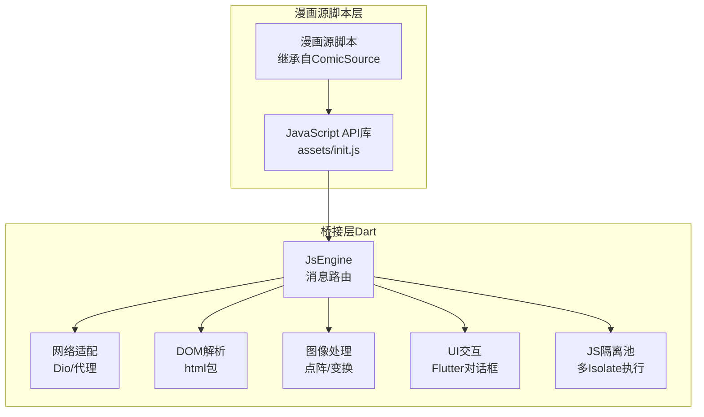
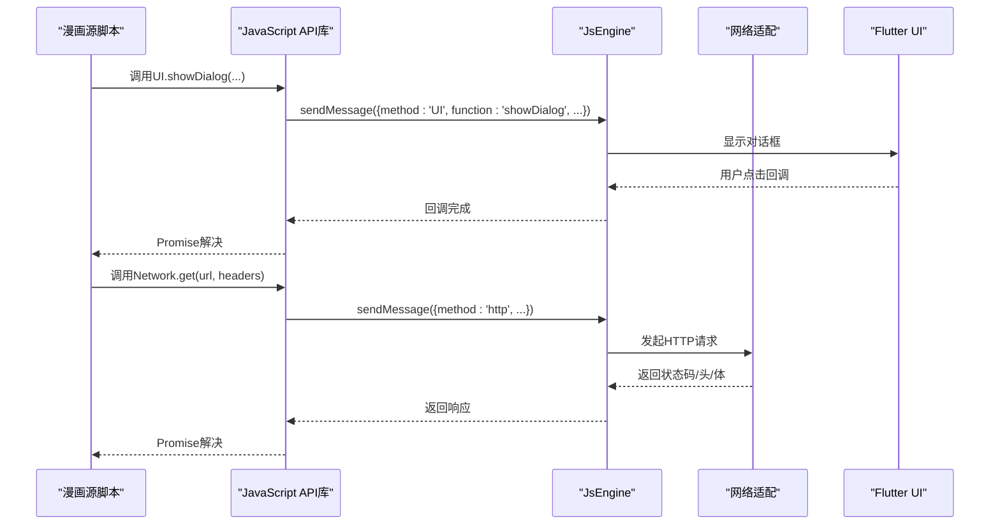
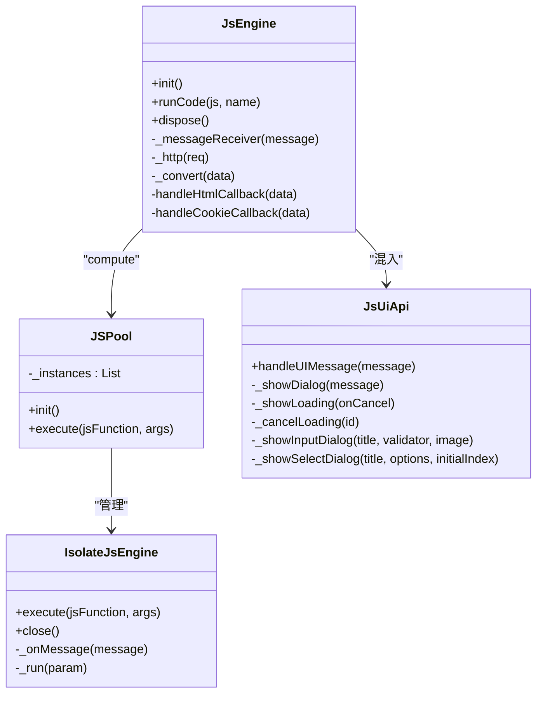

# JavaScript API参考

<cite>
**本文档引用的文件**
- [js_api.md](file://doc/js_api.md)
- [init.js](file://assets/init.js)
- [js_engine.dart](file://lib/foundation/js_engine.dart)
- [js_pool.dart](file://lib/foundation/js_pool.dart)
- [js_ui.dart](file://lib/components/js_ui.dart)
- [comic_source.md](file://doc/comic_source.md)
</cite>

## 目录
1. [简介](#简介)
2. [项目结构](#项目结构)
3. [核心组件](#核心组件)
4. [架构总览](#架构总览)
5. [详细组件分析](#详细组件分析)
6. [依赖关系分析](#依赖关系分析)
7. [性能考量](#性能考量)
8. [故障排除指南](#故障排除指南)
9. [结论](#结论)

## 简介
本参考文档面向漫画源开发者，系统梳理了Venera应用中的JavaScript API，覆盖数据转换、网络请求、DOM解析、UI交互、工具函数与类型定义等模块，并补充版本兼容性、废弃警告、沙盒限制与安全注意事项。所有API均基于漫画源脚本在嵌入式QuickJS引擎中的运行时接口实现。

## 项目结构
Venera通过Dart侧的JsEngine桥接，加载assets/init.js中的初始化库，向漫画源脚本暴露统一的JavaScript API。漫画源脚本通过sendMessage通道与Dart侧通信，实现HTTP请求、DOM解析、UI弹窗、剪贴板、随机数生成、加密解密等功能。

**图表来源**
- [init.js](file://assets/init.js#L1-L1520)
- [js_engine.dart](file://lib/foundation/js_engine.dart#L48-L284)
- [js_pool.dart](file://lib/foundation/js_pool.dart#L8-L40)

**章节来源**
- [js_engine.dart](file://lib/foundation/js_engine.dart#L80-L110)
- [init.js](file://assets/init.js#L1-L120)

## 核心组件
- 全局对象与函数
  - sendMessage：漫画源脚本与Dart侧通信的唯一入口
  - setTimeout/setInterval：基于延迟任务的消息通道封装
  - console：日志输出到应用日志系统
- Convert：数据转换与加密解密
- Network：HTTP请求与Cookie管理
- HtmlDocument/HtmlElement/HtmlNode：HTML解析与查询
- UI：消息提示、对话框、输入框、选择框、加载对话框、外部浏览器打开
- Utils：UUID生成、随机整数/浮点数
- 类型定义：Cookie、Comic、ComicDetails、Comment、ImageLoadingConfig、ComicSource
- APP：应用版本、语言、平台信息
- 剪贴板：setClipboard/getClipboard
- 计算：compute（多Isolate并行计算）

**章节来源**
- [js_api.md](file://doc/js_api.md#L1-L513)
- [init.js](file://assets/init.js#L1-L1520)
- [js_engine.dart](file://lib/foundation/js_engine.dart#L112-L212)

## 架构总览
漫画源脚本通过sendMessage发送方法名与参数，JsEngine根据method分发到对应处理器：HTTP、HTML解析、Cookie、随机数、UUID、UI、剪贴板、计算等。UI交互由JsUiApi桥接到Flutter界面；compute通过JSPool在独立Isolate中执行JavaScript函数。

**图表来源**
- [init.js](file://assets/init.js#L1342-L1445)
- [js_engine.dart](file://lib/foundation/js_engine.dart#L149-L272)
- [js_ui.dart](file://lib/components/js_ui.dart#L14-L59)

## 详细组件分析

### Convert 数据转换与加密解密
- 字符串与ArrayBuffer互转
  - Convert.encodeUtf8(str) → ArrayBuffer
  - Convert.decodeUtf8(buf) → string
  - Convert.encodeGbk(str) → ArrayBuffer
  - Convert.decodeGbk(buf) → string
- Base64编解码
  - Convert.encodeBase64(buf) → string
  - Convert.decodeBase64(str) → ArrayBuffer
- 哈希算法
  - md5/sha1/sha256/sha512
  - Convert.md5(buf) → ArrayBuffer
  - Convert.sha1(buf) → ArrayBuffer
  - Convert.sha256(buf) → ArrayBuffer
  - Convert.sha512(buf) → ArrayBuffer
- HMAC
  - Convert.hmac(key, buf, hash) → ArrayBuffer
  - Convert.hmacString(key, buf, hash) → string
- AES对称加密（ECB/CBC/CFB/OFB）
  - encryptAesEcb/decryptAesEcb
  - encryptAesCbc/decryptAesCbc
  - encryptAesCfb/decryptAesCfb
  - encryptAesOfb/decryptAesOfb
- RSA解密
  - Convert.decryptRsa(buf, key) → ArrayBuffer
- 十六进制编码
  - Convert.hexEncode(buf) → string

版本兼容性与废弃警告
- 无明确废弃标记，部分API在文档中标注了版本号（如ImageLoadingConfig的since字段），建议以最新版本为准。

使用示例路径
- [字符串转ArrayBuffer示例](file://assets/init.js#L32-L52)
- [AES-CBC解密示例](file://assets/init.js#L246-L255)

**章节来源**
- [js_api.md](file://doc/js_api.md#L16-L83)
- [init.js](file://assets/init.js#L27-L361)
- [js_engine.dart](file://lib/foundation/js_engine.dart#L402-L525)

### Network 网络请求与Cookie
- 通用请求
  - Network.fetchBytes(method, url, headers, data) → Promise<{status, headers, body: ArrayBuffer}>
  - Network.sendRequest(method, url, headers, data) → Promise<{status, headers, body: string}>
- 快捷方法
  - Network.get/post/put/patch/delete(url, headers?, data?)
- Cookie管理
  - Network.setCookies(url, cookies[])
  - Network.getCookies(url) → Promise<Cookie[]>
  - Network.deleteCookies(url)
- 浏览器fetch包装
  - fetch(url, options?) → Promise<Response-like>
    - 支持ok/status/statusText/headers/arrayBuffer()/text()/json()

版本兼容性与废弃警告
- fetch自1.2.0起提供，与浏览器fetch行为一致但仅返回必要方法。

使用示例路径
- [GET请求示例](file://assets/init.js#L522-L524)
- [fetch包装实现](file://assets/init.js#L620-L642)

**章节来源**
- [js_api.md](file://doc/js_api.md#L84-L131)
- [init.js](file://assets/init.js#L461-L642)
- [js_engine.dart](file://lib/foundation/js_engine.dart#L214-L272)

### Html DOM解析与查询
- HtmlDocument
  - new HtmlDocument(html)：从HTML字符串创建文档
  - querySelector/querySelectorAll/getElementById：查询元素
  - dispose()：释放资源
- HtmlElement
  - text/attributes/children/nodes/parent/innerHTML/classNames/id/localName/previousElementSibling/nextElementSibling
  - querySelector/querySelectorAll
- HtmlNode
  - type: "text"|"element"|"comment"|"document"|"unknown"
  - toElement(): HtmlElement|null
  - text: string

版本兼容性与废弃警告
- 无废弃标记，注意文档数量上限与自动清理机制。

使用示例路径
- [HtmlDocument构造与查询](file://assets/init.js#L647-L725)
- [HtmlElement属性访问](file://assets/init.js#L730-L928)
- [HtmlNode类型判断](file://assets/init.js#L930-L980)

**章节来源**
- [js_api.md](file://doc/js_api.md#L132-L224)
- [init.js](file://assets/init.js#L647-L980)
- [js_engine.dart](file://lib/foundation/js_engine.dart#L291-L358)

### UI 交互
- UI.showMessage(message)
- UI.showDialog(title, content, actions[])：动作可返回Promise，按钮显示加载指示
- UI.launchUrl(url)：外部浏览器打开
- UI.showLoading(onCancel?) → id：显示加载对话框，支持取消回调
- UI.cancelLoading(id)：关闭指定加载对话框
- UI.showInputDialog(title, validator?, image?) → Promise<string|null>
- UI.showSelectDialog(title, options[], initialIndex?) → Promise<number|null>

版本兼容性与废弃警告
- 部分功能自1.2.0/1.2.1/1.3.4/1.4.6/1.5.3起引入或增强。

使用示例路径
- [showDialog实现与回调](file://assets/init.js#L1363-L1371)
- [showLoading/cancelLoading](file://assets/init.js#L1391-L1410)
- [showInputDialog](file://assets/init.js#L1419-L1427)

**章节来源**
- [js_api.md](file://doc/js_api.md#L224-L253)
- [init.js](file://assets/init.js#L1342-L1445)
- [js_ui.dart](file://lib/components/js_ui.dart#L14-L184)

### Utils 工具函数
- createUuid()：生成时间戳UUID
- randomInt(min, max)：[min,max)整数
- randomDouble(min, max)：[min,max)浮点数
- console.log/warn/error：日志输出

版本兼容性与废弃警告
- 无废弃标记。

使用示例路径
- [UUID生成](file://assets/init.js#L372-L376)
- [随机数生成](file://assets/init.js#L384-L406)

**章节来源**
- [js_api.md](file://doc/js_api.md#L254-L271)
- [init.js](file://assets/init.js#L363-L406)

### 类型定义
- Cookie：name/value/domain
- Comic：id/title/subtitle/subTitle/cover/tags/description/maxPage/language/favoriteId/stars
- ComicDetails：title/subtitle/subTitle/cover/description/tags/chapters/isFavorite/subId/thumbnails/recommend/commentCount/likesCount/isLiked/uploader/updateTime/uploadTime/url/stars/maxPage/comments
- Comment：userName/avatar/content/time/replyCount/id/isLiked/score/voteStatus
- ImageLoadingConfig：url/method/data/headers/onResponse(modify response)/modifyImage(js脚本)/onLoadFailed
- ComicSource：name/key/version/minAppVersion/url + loadData/loadSetting/saveData/deleteData/isLogged + translate(key)

版本兼容性与废弃警告
- 某些字段标注since版本号，表示新增或变更。

使用示例路径
- [Cookie构造](file://assets/init.js#L451-L455)
- [Comic构造](file://assets/init.js#L1018-L1030)
- [ComicDetails构造](file://assets/init.js#L1057-L1078)
- [Comment构造](file://assets/init.js#L1093-L1103)
- [ImageLoadingConfig构造](file://assets/init.js#L1122-L1130)
- [ComicSource类](file://assets/init.js#L1132-L1222)

**章节来源**
- [js_api.md](file://doc/js_api.md#L272-L513)
- [init.js](file://assets/init.js#L444-L1222)

### APP 应用信息
- APP.version：应用版本
- APP.locale：语言地区代码
- APP.platform：运行平台名称

使用示例路径
- [APP.version](file://assets/init.js#L1456-L1458)
- [APP.locale](file://assets/init.js#L1464-L1468)
- [APP.platform](file://assets/init.js#L1474-L1478)

**章节来源**
- [init.js](file://assets/init.js#L1451-L1479)

### 剪贴板
- setClipboard(text)：Promise<void>
- getClipboard()：Promise<string>

使用示例路径
- [setClipboard](file://assets/init.js#L1488-L1493)
- [getClipboard](file://assets/init.js#L1501-L1505)

**章节来源**
- [init.js](file://assets/init.js#L1481-L1505)
- [js_engine.dart](file://lib/foundation/js_engine.dart#L184-L190)

### 计算（多Isolate）
- compute(func, ...args)：Promise<any>
  - 将func作为字符串传入，引擎在独立Isolate中执行
  - 参数需为数组，返回结果Promise

使用示例路径
- [compute实现](file://assets/init.js#L1514-L1520)
- [JSPool调度](file://lib/foundation/js_pool.dart#L30-L39)

**章节来源**
- [init.js](file://assets/init.js#L1507-L1520)
- [js_pool.dart](file://lib/foundation/js_pool.dart#L8-L40)

### 图像处理（扩展）
- Image：仅在onImageLoad.modifyImage中可用
  - copyRange(x,y,width,height) → Image|null
  - copyAndRotate90() → Image|null
  - fillImageAt(x,y,image)
  - fillImageRangeAt(x,y,image,srcX,srcY,width,height)
  - width/height
  - Image.empty(width,height) → Image

使用示例路径
- [Image类](file://assets/init.js#L1226-L1336)

**章节来源**
- [init.js](file://assets/init.js#L1224-L1336)

## 依赖关系分析

**图表来源**
- [js_engine.dart](file://lib/foundation/js_engine.dart#L48-L284)
- [js_pool.dart](file://lib/foundation/js_pool.dart#L8-L147)
- [js_ui.dart](file://lib/components/js_ui.dart#L11-L184)

**章节来源**
- [js_engine.dart](file://lib/foundation/js_engine.dart#L48-L284)
- [js_pool.dart](file://lib/foundation/js_pool.dart#L8-L147)
- [js_ui.dart](file://lib/components/js_ui.dart#L11-L184)

## 性能考量
- 多Isolate计算：compute通过JSPool在多个Isolate间负载均衡，适合CPU密集型任务；注意函数字符串化与参数序列化开销。
- DOM缓存限制：HTML文档最大缓存数量有限，超出会自动清理最旧文档，避免内存泄漏。
- 网络代理：当需要dart:io客户端时，启用代理与Cookie管理拦截器，可能增加延迟。
- UI弹窗：showLoading支持用户取消回调，避免长时间阻塞；输入验证器在Dart侧执行，确保输入合法。

[本节为通用指导，无需特定文件引用]

## 故障排除指南
- 网络错误
  - Network.fetchBytes/sendRequest返回error字段，需在调用处检查并抛出异常。
  - 自定义User-Agent缺失时自动注入默认UA。
- UI回调异常
  - showDialog中动作回调返回Promise时，按钮会显示加载指示直至完成；若回调抛错，对话框仍会关闭。
- compute异常
  - 若func不是字符串或args不是数组，JsEngine会抛出类型错误；确保传参格式正确。
- Cookie同步
  - setCookies/getCookies/deleteCookies通过CookieJarSql管理，注意域与路径匹配。

**章节来源**
- [init.js](file://assets/init.js#L482-L484)
- [js_engine.dart](file://lib/foundation/js_engine.dart#L214-L272)
- [js_engine.dart](file://lib/foundation/js_engine.dart#L191-L204)
- [js_ui.dart](file://lib/components/js_ui.dart#L66-L81)

## 结论
Venera的JavaScript API为漫画源开发提供了完备的运行时能力：从数据转换、网络请求、DOM解析到UI交互与多Isolate计算均有清晰的接口与实现。开发者应关注版本兼容性标注、沙盒限制与安全约束，合理使用compute与UI弹窗，确保漫画源在不同平台与设备上的稳定运行。