# 漫画源开发指南

<cite>
**本文档引用的文件**
- [README.md](file://README.md)
- [doc/comic_source.md](file://doc/comic_source.md)
- [doc/js_api.md](file://doc/js_api.md)
- [lib/init.dart](file://lib/init.dart)
- [lib/main.dart](file://lib/main.dart)
- [lib/foundation/comic_source/comic_source.dart](file://lib/foundation/comic_source/comic_source.dart)
- [lib/foundation/js_engine.dart](file://lib/foundation/js_engine.dart)
- [lib/foundation/comic_source/parser.dart](file://lib/foundation/comic_source/parser.dart)
- [lib/foundation/comic_source/models.dart](file://lib/foundation/comic_source/models.dart)
- [lib/network/cookie_jar.dart](file://lib/network/cookie_jar.dart)
- [assets/init.js](file://assets/init.js)
- [pubspec.yaml](file://pubspec.yaml)
</cite>

## 目录
1. [简介](#简介)
2. [项目结构](#项目结构)
3. [核心组件](#核心组件)
4. [架构概览](#架构概览)
5. [详细组件分析](#详细组件分析)
6. [依赖关系分析](#依赖关系分析)
7. [性能考虑](#性能考虑)
8. [故障排除指南](#故障排除指南)
9. [结论](#结论)

## 简介

Venera 是一个支持本地和网络漫画阅读的跨平台应用。该项目的核心特色是使用 JavaScript 创建漫画源，通过内置的 QuickJS 引擎实现与 Dart 后端的双向通信。该系统允许开发者以 JavaScript 编写漫画源，实现搜索、分类、详情加载和页面获取等功能。

## 项目结构

Venera 采用 Flutter 框架构建，整体项目结构清晰，分为多个关键模块：

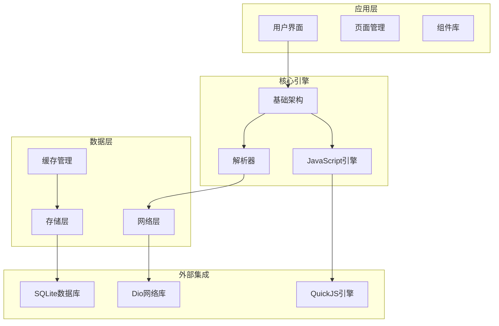

**图表来源**
- [lib/main.dart](file://lib/main.dart#L20-L58)
- [lib/init.dart](file://lib/init.dart#L37-L77)

**章节来源**
- [README.md](file://README.md#L1-L39)
- [pubspec.yaml](file://pubspec.yaml#L11-L122)

## 核心组件

### JavaScript 引擎系统

Venera 使用 FlutterQjs 作为 JavaScript 引擎，通过消息传递机制实现 Dart 和 JavaScript 之间的通信：

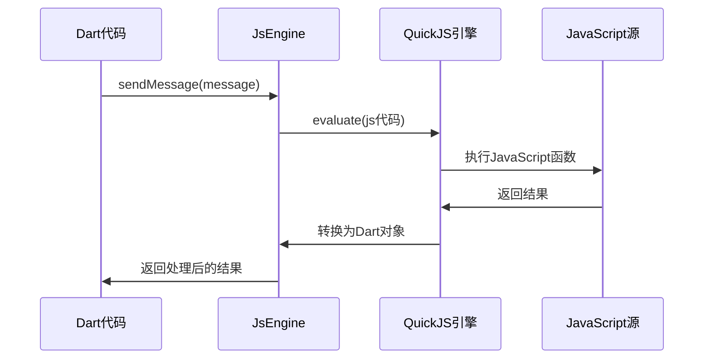

**图表来源**
- [lib/foundation/js_engine.dart](file://lib/foundation/js_engine.dart#L112-L212)
- [assets/init.js](file://assets/init.js#L1-L25)

### 漫画源管理系统

漫画源通过解析器动态加载和管理：

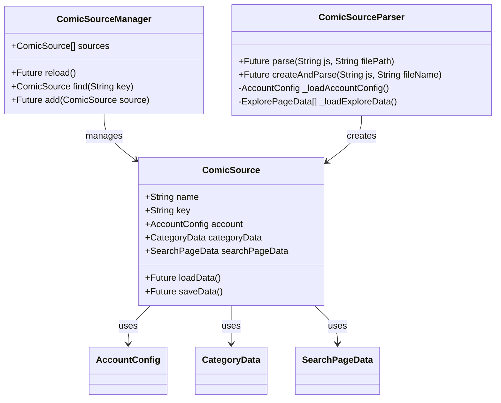

**图表来源**
- [lib/foundation/comic_source/comic_source.dart](file://lib/foundation/comic_source/comic_source.dart#L35-L108)
- [lib/foundation/comic_source/parser.dart](file://lib/foundation/comic_source/parser.dart#L53-L179)

**章节来源**
- [lib/foundation/comic_source/comic_source.dart](file://lib/foundation/comic_source/comic_source.dart#L110-L280)
- [lib/foundation/comic_source/parser.dart](file://lib/foundation/comic_source/parser.dart#L86-L179)

## 架构概览

### 双向通信架构

Venera 实现了一个完整的双向通信架构，允许 JavaScript 源与 Dart 后端进行深度交互：

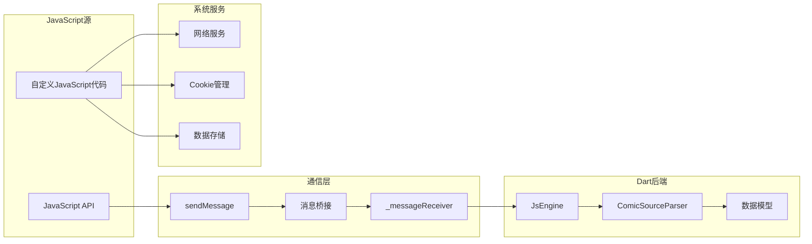

**图表来源**
- [lib/foundation/js_engine.dart](file://lib/foundation/js_engine.dart#L112-L212)
- [assets/init.js](file://assets/init.js#L7-L12)

### 数据流架构

漫画数据在系统中的流转过程：

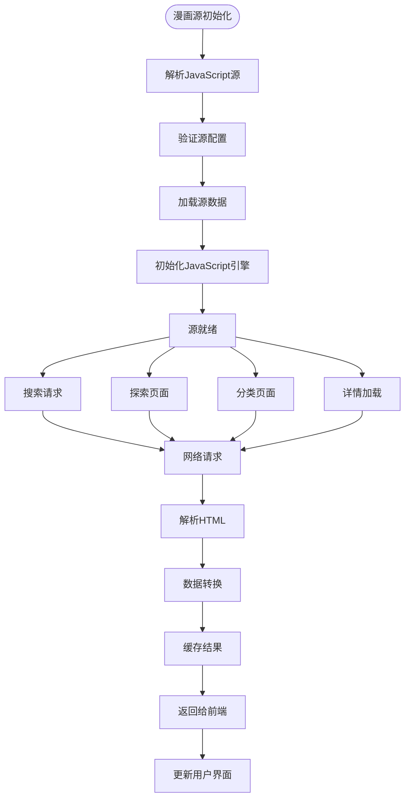

**图表来源**
- [lib/foundation/comic_source/parser.dart](file://lib/foundation/comic_source/parser.dart#L86-L179)
- [lib/foundation/js_engine.dart](file://lib/foundation/js_engine.dart#L214-L272)

**章节来源**
- [lib/foundation/js_engine.dart](file://lib/foundation/js_engine.dart#L48-L110)
- [lib/foundation/comic_source/parser.dart](file://lib/foundation/comic_source/parser.dart#L53-L85)

## 详细组件分析

### JavaScript API 系统

JavaScript API 提供了丰富的功能接口，涵盖了数据转换、网络请求、HTML 解析和 UI 交互：

#### 数据转换模块

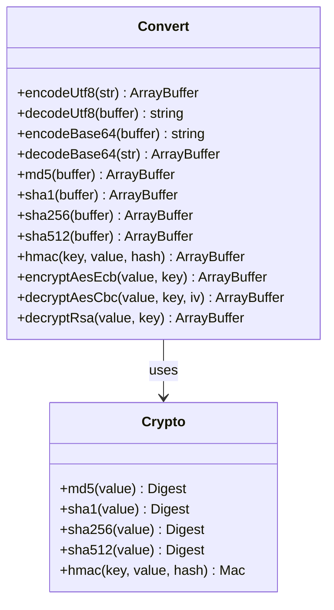

**图表来源**
- [assets/init.js](file://assets/init.js#L27-L361)
- [lib/foundation/js_engine.dart](file://lib/foundation/js_engine.dart#L402-L525)

#### 网络请求模块

网络模块提供了完整的 HTTP 请求能力，支持多种认证方式和代理配置：

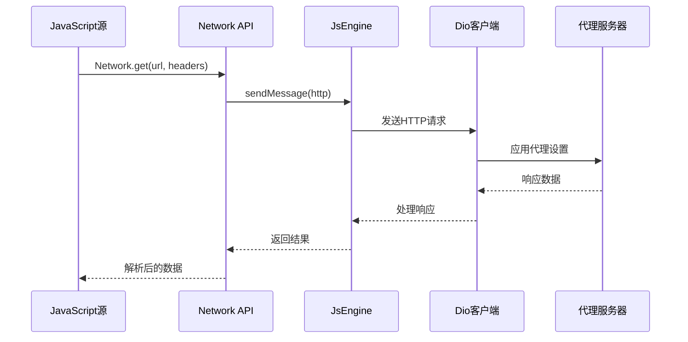

**图表来源**
- [assets/init.js](file://assets/init.js#L461-L611)
- [lib/foundation/js_engine.dart](file://lib/foundation/js_engine.dart#L214-L272)

**章节来源**
- [doc/js_api.md](file://doc/js_api.md#L84-L131)
- [assets/init.js](file://assets/init.js#L461-L642)

### 漫画源数据模型

系统定义了完整的数据模型来表示漫画相关信息：

#### 基础数据模型

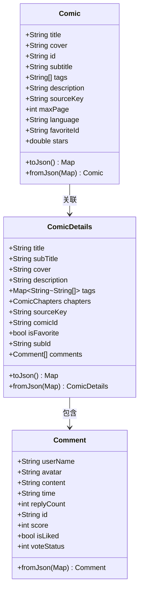

**图表来源**
- [lib/foundation/comic_source/models.dart](file://lib/foundation/comic_source/models.dart#L42-L321)

#### 页面跳转目标系统

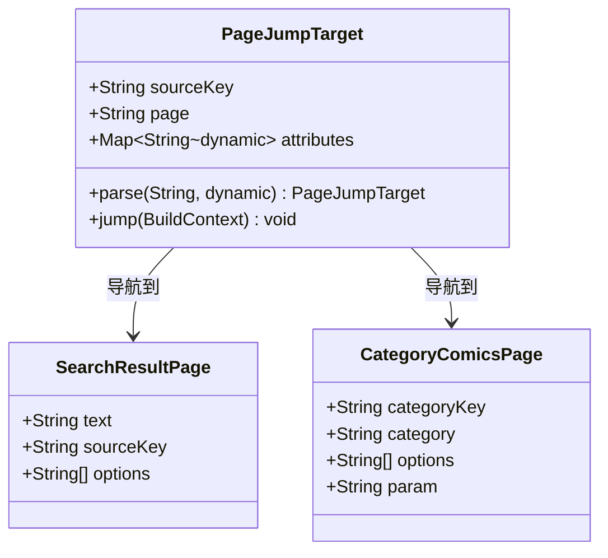

**图表来源**
- [lib/foundation/comic_source/models.dart](file://lib/foundation/comic_source/models.dart#L456-L561)

**章节来源**
- [lib/foundation/comic_source/models.dart](file://lib/foundation/comic_source/models.dart#L1-L562)

### Cookie 管理系统

系统实现了完整的 Cookie 管理机制，支持跨域和路径匹配：

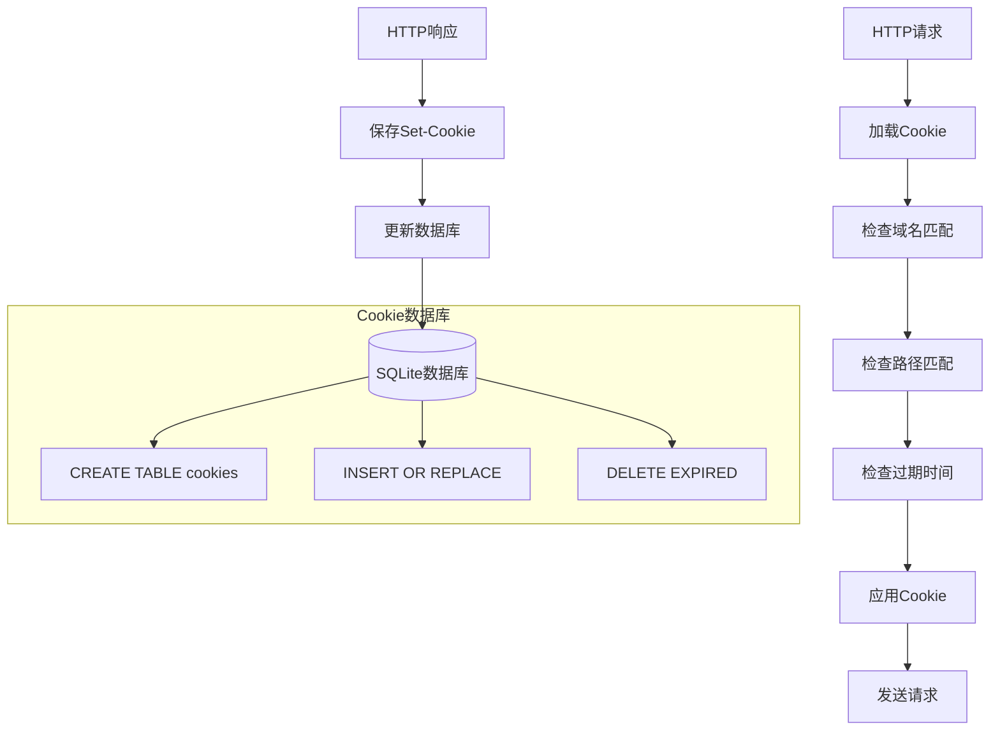

**图表来源**
- [lib/network/cookie_jar.dart](file://lib/network/cookie_jar.dart#L18-L194)

**章节来源**
- [lib/network/cookie_jar.dart](file://lib/network/cookie_jar.dart#L1-L244)

## 依赖关系分析

### 核心依赖关系

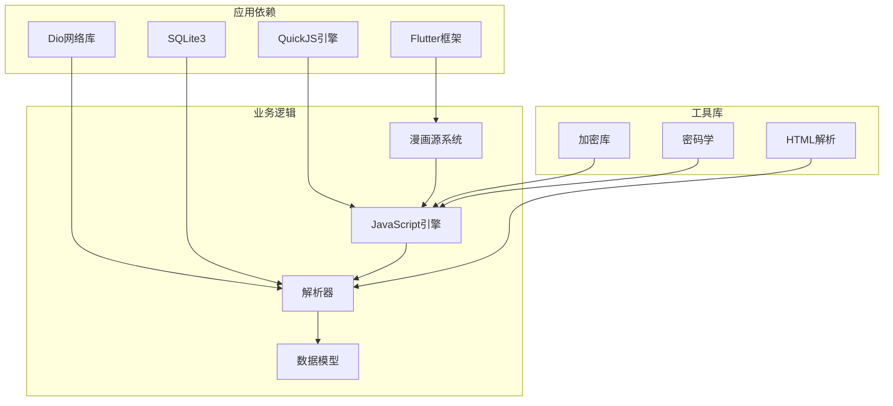

**图表来源**
- [pubspec.yaml](file://pubspec.yaml#L11-L91)

### 组件耦合度分析

系统采用了良好的分层架构，各组件之间保持较低的耦合度：

- **低耦合设计**: JavaScript 源与 Dart 后端通过消息传递解耦
- **高内聚模块**: 每个模块职责明确，功能单一
- **可扩展性**: 支持动态加载新的漫画源
- **可维护性**: 清晰的错误处理和日志记录

**章节来源**
- [pubspec.yaml](file://pubspec.yaml#L11-L122)

## 性能考虑

### JavaScript 引擎优化

系统在 JavaScript 引擎层面实现了多项性能优化：

1. **内存管理**: 自动清理不再使用的 DOM 文档
2. **缓存机制**: 预编译的 JavaScript 初始化代码
3. **异步处理**: 非阻塞的网络请求处理
4. **资源限制**: 最大文档数量限制防止内存泄漏

### 网络性能优化

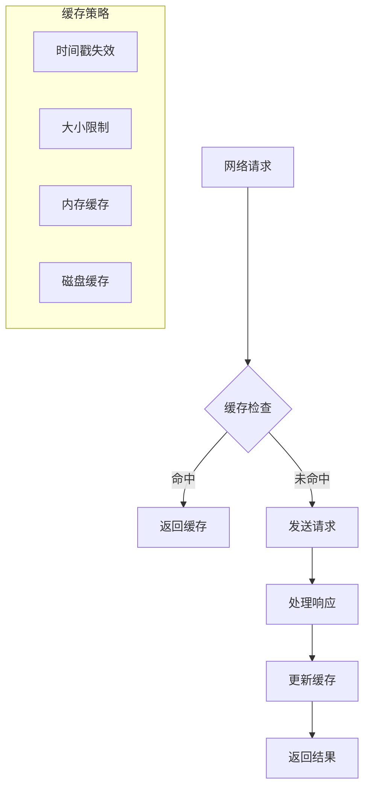

**图表来源**
- [lib/foundation/js_engine.dart](file://lib/foundation/js_engine.dart#L291-L358)

### 内存管理策略

系统实现了多层内存管理策略：

1. **JavaScript 对象自动清理**: DOM 文档数量超过阈值时自动清理
2. **数据持久化**: 关键数据定期保存到磁盘
3. **连接池管理**: 网络连接复用和超时控制
4. **垃圾回收**: 定期清理无用的临时数据

**章节来源**
- [lib/foundation/js_engine.dart](file://lib/foundation/js_engine.dart#L286-L358)

## 故障排除指南

### 常见问题诊断

#### JavaScript 源加载失败

**症状**: 漫画源无法加载或显示错误

**可能原因**:
1. JavaScript 语法错误
2. 必需字段缺失（name、key、version）
3. 版本兼容性问题
4. 网络请求超时

**解决方案**:
1. 检查 JavaScript 语法
2. 验证必需字段完整性
3. 确认版本兼容性
4. 检查网络连接

#### 数据解析错误

**症状**: 页面显示空白或数据不完整

**可能原因**:
1. HTML 结构变化
2. 数据格式不匹配
3. 编码问题

**解决方案**:
1. 更新选择器表达式
2. 调整数据解析逻辑
3. 检查字符编码

#### 网络请求问题

**症状**: 加载超时或返回空数据

**可能原因**:
1. 服务器限制
2. 代理配置错误
3. Cookie 认证失败

**解决方案**:
1. 检查服务器状态
2. 验证代理设置
3. 重新登录认证

### 调试技巧

#### 日志记录

系统提供了完善的日志记录机制：

```dart
// 错误日志
Log.error("组件名", "错误信息", stackTrace);

// 警告日志  
Log.warning("组件名", "警告信息");

// 信息日志
Log.info("组件名", "信息内容");
```

#### 开发者工具

1. **浏览器开发者工具**: 调试 JavaScript 代码
2. **日志查看器**: 查看应用运行日志
3. **网络监控**: 监控网络请求
4. **内存分析**: 分析内存使用情况

**章节来源**
- [lib/foundation/js_engine.dart](file://lib/foundation/js_engine.dart#L107-L110)
- [lib/init.dart](file://lib/init.dart#L24-L35)

## 结论

Venera 的漫画源开发系统提供了一个强大而灵活的平台，允许开发者通过 JavaScript 创建各种类型的漫画源。系统的设计充分考虑了性能、可维护性和扩展性，为漫画阅读应用的开发提供了完整的解决方案。

### 主要优势

1. **跨平台支持**: 基于 Flutter 框架，支持多平台部署
2. **动态加载**: 支持动态加载和卸载漫画源
3. **强大的 API**: 提供丰富的 JavaScript API 接口
4. **性能优化**: 多层次的性能优化策略
5. **易于扩展**: 清晰的架构设计便于功能扩展

### 发展方向

1. **性能进一步优化**: 持续改进 JavaScript 引擎性能
2. **功能增强**: 添加更多漫画源类型支持
3. **用户体验提升**: 改进用户界面和交互体验
4. **安全性加强**: 增强数据安全和隐私保护

该系统为漫画源开发者提供了一个完整的开发环境，无论是初学者还是有经验的开发者都能快速上手并创建高质量的漫画源。