# 漫画源数据模型

<cite>
**本文档引用的文件**
- [comic_source.dart](file://lib/foundation/comic_source/comic_source.dart)
- [models.dart](file://lib/foundation/comic_source/models.dart)
- [types.dart](file://lib/foundation/comic_source/types.dart)
- [category.dart](file://lib/foundation/comic_source/category.dart)
- [parser.dart](file://lib/foundation/comic_source/parser.dart)
- [comic_details_page/chapters.dart](file://lib/pages/comic_details_page/chapters.dart)
- [search_result_page.dart](file://lib/pages/search_result_page.dart)
- [category_comics_page.dart](file://lib/pages/category_comics_page.dart)
- [comic.dart](file://lib/components/comic.dart)
- [comic_source.md](file://doc/comic_source.md)
</cite>

## 目录
1. [简介](#简介)
2. [项目结构](#项目结构)
3. [核心组件](#核心组件)
4. [架构概览](#架构概览)
5. [详细组件分析](#详细组件分析)
6. [依赖分析](#依赖分析)
7. [性能考虑](#性能考虑)
8. [故障排除指南](#故障排除指南)
9. [结论](#结论)

## 简介

Venera 是一个支持本地和网络漫画阅读的漫画阅读器应用。本文档深入解释了漫画源系统中使用的各种数据结构和模型，包括 Comic、Category、SearchOptions 等核心实体。这些模型构成了漫画源数据处理的基础，支持从 JavaScript 源中提取、转换和展示漫画信息。

## 项目结构

漫画源数据模型主要位于 `lib/foundation/comic_source/` 目录下，采用模块化设计：

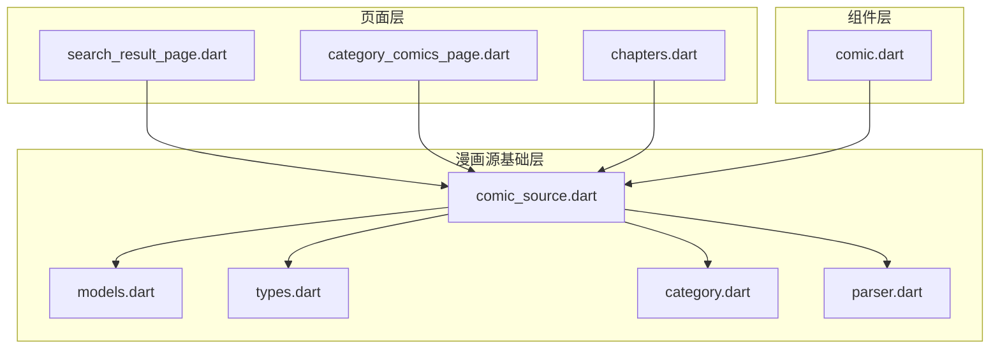

**图表来源**
- [comic_source.dart](file://lib/foundation/comic_source/comic_source.dart#L1-L502)
- [models.dart](file://lib/foundation/comic_source/models.dart#L1-L562)

**章节来源**
- [comic_source.dart](file://lib/foundation/comic_source/comic_source.dart#L1-L50)
- [models.dart](file://lib/foundation/comic_source/models.dart#L1-L50)

## 核心组件

### Comic 实体模型

Comic 是漫画源系统中最基本的数据模型，代表单个漫画条目：

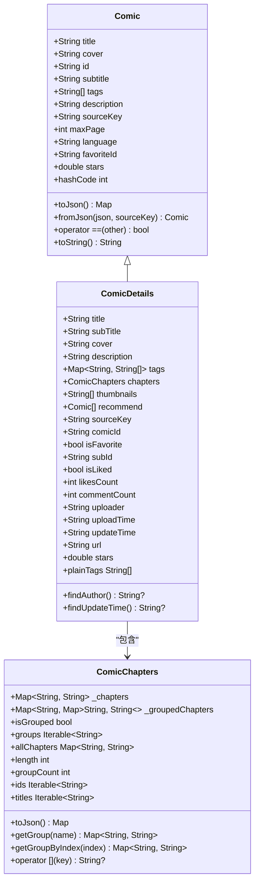

**图表来源**
- [models.dart](file://lib/foundation/comic_source/models.dart#L42-L117)
- [models.dart](file://lib/foundation/comic_source/models.dart#L139-L321)
- [models.dart](file://lib/foundation/comic_source/models.dart#L334-L454)

### 数据验证和约束

漫画源系统实现了多层次的数据验证机制：

1. **类型验证**：所有模型都包含严格的类型检查
2. **格式验证**：时间戳、评分等特殊字段有特定格式要求
3. **业务规则验证**：漫画 ID 和源键的组合唯一性

**章节来源**
- [models.dart](file://lib/foundation/comic_source/models.dart#L14-L28)
- [models.dart](file://lib/foundation/comic_source/models.dart#L94-L104)

### 搜索选项模型

SearchOptions 支持灵活的搜索参数配置：

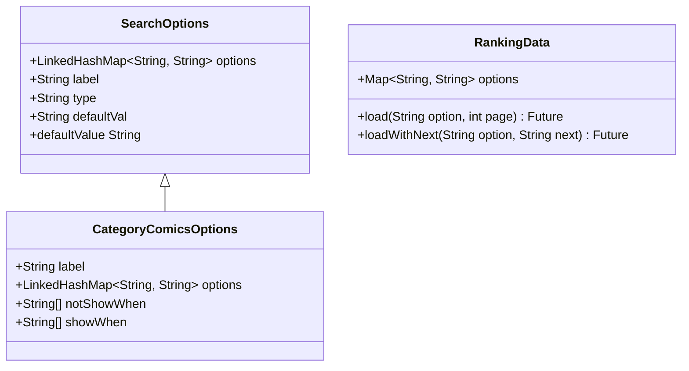

**图表来源**
- [comic_source.dart](file://lib/foundation/comic_source/comic_source.dart#L403-L415)
- [comic_source.dart](file://lib/foundation/comic_source/comic_source.dart#L465-L485)
- [comic_source.dart](file://lib/foundation/comic_source/comic_source.dart#L454-L463)

**章节来源**
- [comic_source.dart](file://lib/foundation/comic_source/comic_source.dart#L392-L415)

### 分类系统模型

分类系统支持固定分类和随机分类两种模式：

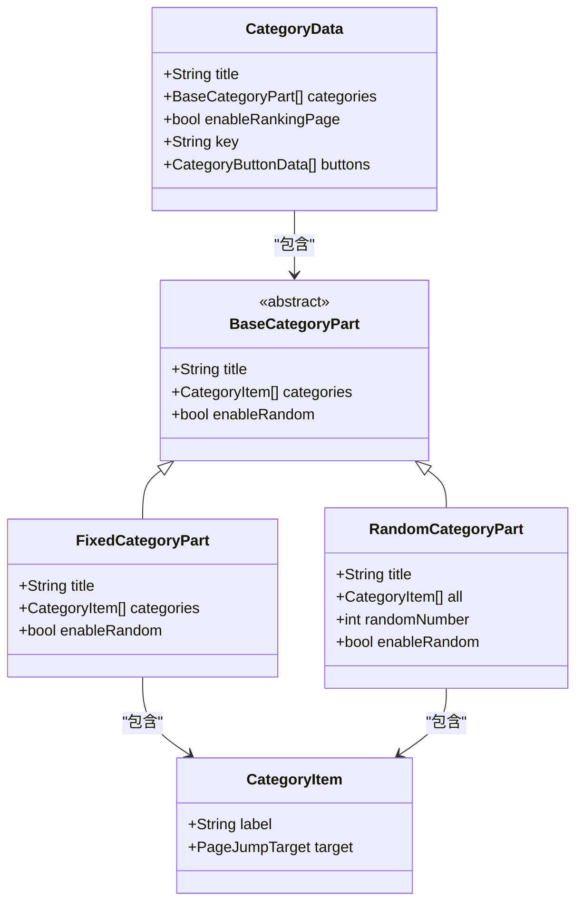

**图表来源**
- [category.dart](file://lib/foundation/comic_source/category.dart#L3-L24)
- [category.dart](file://lib/foundation/comic_source/category.dart#L56-L68)
- [category.dart](file://lib/foundation/comic_source/category.dart#L70-L71)

**章节来源**
- [category.dart](file://lib/foundation/comic_source/category.dart#L1-L71)

## 架构概览

漫画源数据模型采用分层架构设计，确保了良好的可扩展性和维护性：

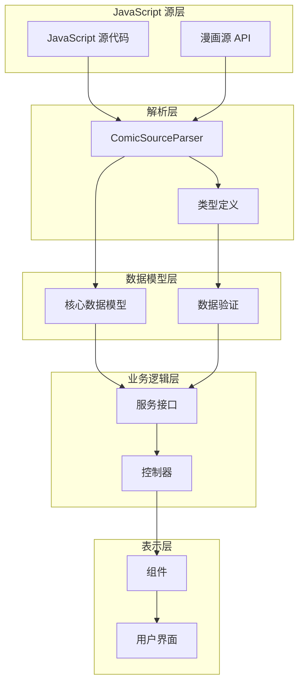

**图表来源**
- [parser.dart](file://lib/foundation/comic_source/parser.dart#L553-L603)
- [comic_source.dart](file://lib/foundation/comic_source/comic_source.dart#L35-L108)

## 详细组件分析

### 序列化和反序列化机制

漫画源系统实现了完整的序列化和反序列化机制：

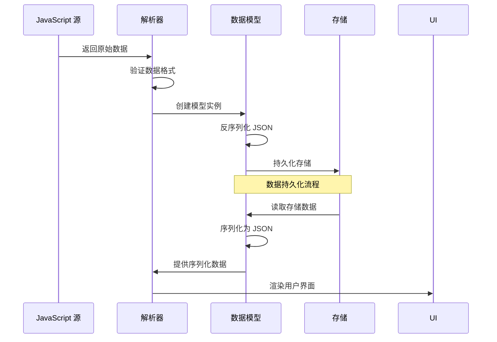

**图表来源**
- [models.dart](file://lib/foundation/comic_source/models.dart#L79-L92)
- [models.dart](file://lib/foundation/comic_source/models.dart#L227-L249)

#### 数据模型序列化流程

1. **JSON 序列化**：将 Dart 对象转换为 JSON 字符串
2. **字段映射**：处理字段名称差异（如 subTitle → subtitle）
3. **类型转换**：确保数据类型正确性
4. **空值处理**：合理处理 null 值和默认值

**章节来源**
- [models.dart](file://lib/foundation/comic_source/models.dart#L79-L104)

### 数据验证规则

漫画源系统实施了严格的数据验证规则：

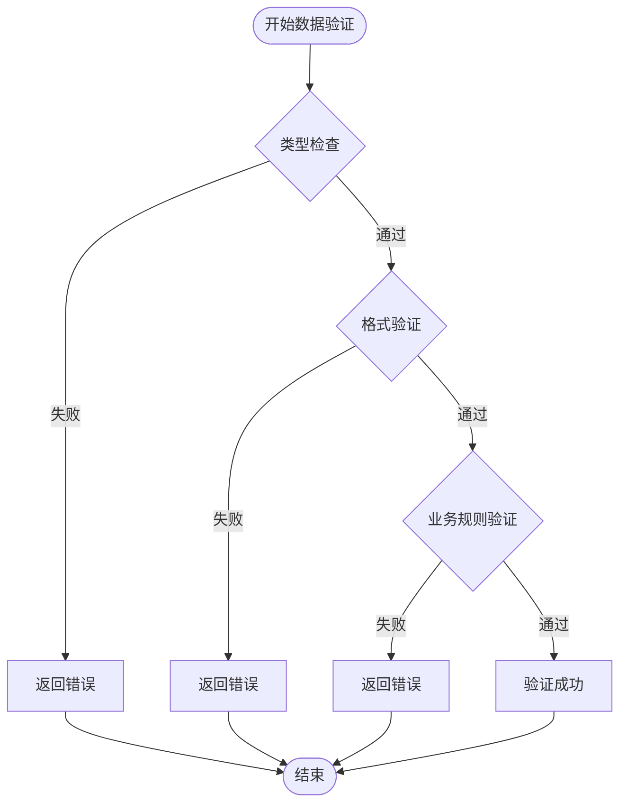

**图表来源**
- [models.dart](file://lib/foundation/comic_source/models.dart#L14-L28)
- [models.dart](file://lib/foundation/comic_source/models.dart#L287-L299)

#### 验证规则详情

1. **时间戳验证**：确保时间格式正确且在合理范围内
2. **评分验证**：限制评分为 0-5 的范围
3. **ID 唯一性**：漫画 ID 和源键的组合必须唯一
4. **标签验证**：标签格式和命名空间的有效性

**章节来源**
- [models.dart](file://lib/foundation/comic_source/models.dart#L287-L320)

### 模型间关系和依赖

漫画源数据模型之间存在复杂的依赖关系：

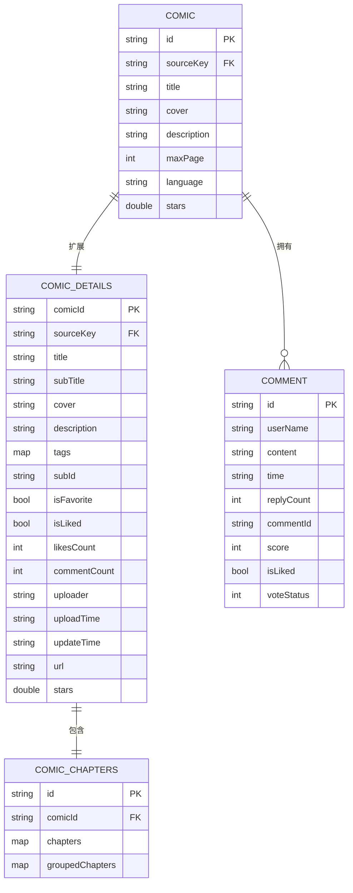

**图表来源**
- [models.dart](file://lib/foundation/comic_source/models.dart#L42-L117)
- [models.dart](file://lib/foundation/comic_source/models.dart#L139-L321)
- [models.dart](file://lib/foundation/comic_source/models.dart#L334-L454)

**章节来源**
- [models.dart](file://lib/foundation/comic_source/models.dart#L42-L321)

### 功能模块使用方式

#### 搜索功能中的数据模型使用

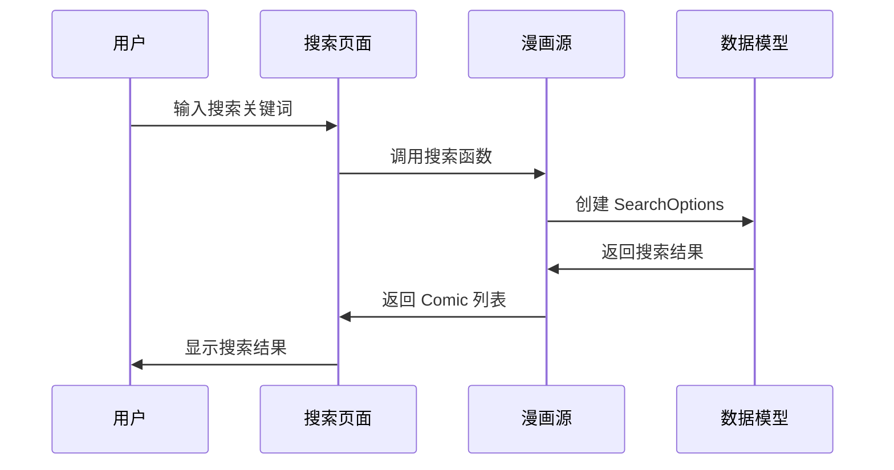

**图表来源**
- [search_result_page.dart](file://lib/pages/search_result_page.dart#L145-L178)
- [comic_source.dart](file://lib/foundation/comic_source/comic_source.dart#L378-L390)

#### 分类功能中的数据模型使用

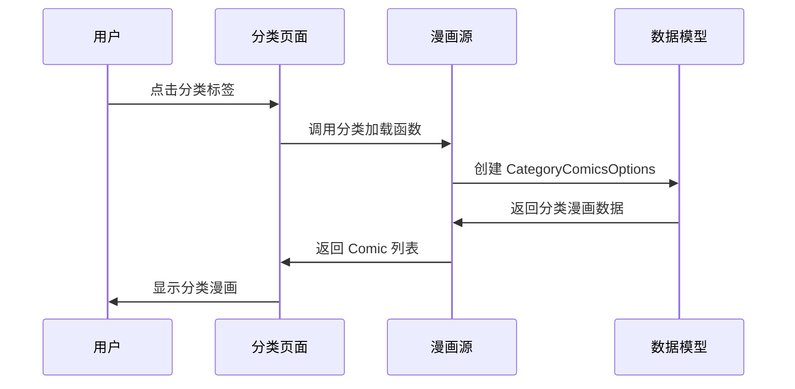

**图表来源**
- [category_comics_page.dart](file://lib/pages/category_comics_page.dart#L1-L34)
- [parser.dart](file://lib/foundation/comic_source/parser.dart#L553-L603)

**章节来源**
- [search_result_page.dart](file://lib/pages/search_result_page.dart#L496-L532)
- [category_comics_page.dart](file://lib/pages/category_comics_page.dart#L28-L34)

## 依赖分析

漫画源数据模型的依赖关系如下：

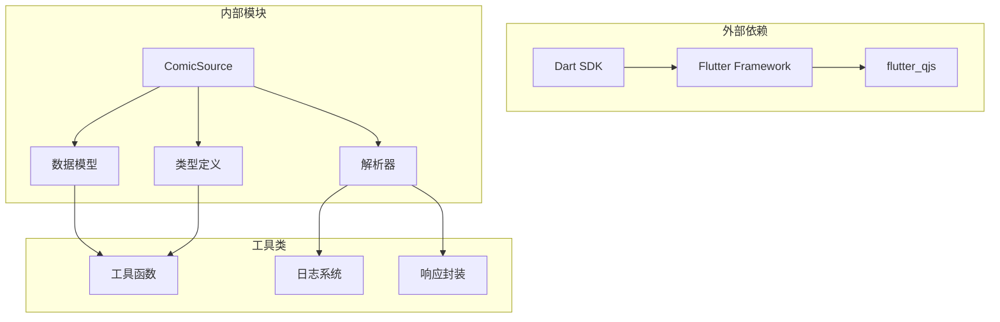

**图表来源**
- [comic_source.dart](file://lib/foundation/comic_source/comic_source.dart#L1-L24)
- [types.dart](file://lib/foundation/comic_source/types.dart#L1-L94)

### 组件耦合度分析

1. **低耦合设计**：各模块职责明确，相互独立
2. **接口抽象**：通过抽象类和接口实现松耦合
3. **依赖注入**：通过构造函数注入依赖，便于测试

**章节来源**
- [comic_source.dart](file://lib/foundation/comic_source/comic_source.dart#L35-L108)

## 性能考虑

### 内存优化策略

1. **延迟加载**：漫画详情和章节数据按需加载
2. **缓存机制**：图片和数据的智能缓存
3. **对象池**：重复使用的对象进行复用

### 数据处理优化

1. **流式处理**：大量数据的流式处理避免内存峰值
2. **异步操作**：耗时操作异步执行不阻塞 UI
3. **增量更新**：只更新变化的数据部分

## 故障排除指南

### 常见问题及解决方案

#### 数据解析错误

**问题症状**：
- 漫画列表显示为空
- 应用崩溃或异常

**排查步骤**：
1. 检查 JavaScript 源返回的数据格式
2. 验证数据类型和字段完整性
3. 查看解析器日志输出

**解决方案**：
- 确保返回数据符合预期格式
- 实现适当的错误处理和降级策略

#### 性能问题

**问题症状**：
- 页面加载缓慢
- 内存使用过高

**排查步骤**：
1. 分析数据模型的复杂度
2. 检查是否存在不必要的数据加载
3. 监控内存使用情况

**解决方案**：
- 实现数据分页和懒加载
- 优化数据结构和算法
- 添加缓存机制

**章节来源**
- [parser.dart](file://lib/foundation/comic_source/parser.dart#L598-L601)

## 结论

漫画源数据模型通过精心设计的架构和严格的验证机制，为 Venera 应用提供了稳定可靠的数据处理能力。该模型具有以下特点：

1. **模块化设计**：清晰的层次结构便于维护和扩展
2. **强类型系统**：编译时错误检测提高代码质量
3. **灵活的数据模型**：支持多种漫画源格式和数据结构
4. **完善的验证机制**：确保数据的完整性和一致性
5. **高性能实现**：优化的内存管理和异步处理

这些特性使得开发者能够轻松地创建和维护漫画源，同时为用户提供流畅的漫画阅读体验。通过遵循本文档的指导，开发者可以更好地理解和使用漫画源数据模型，进行高效的数据处理和业务逻辑开发。