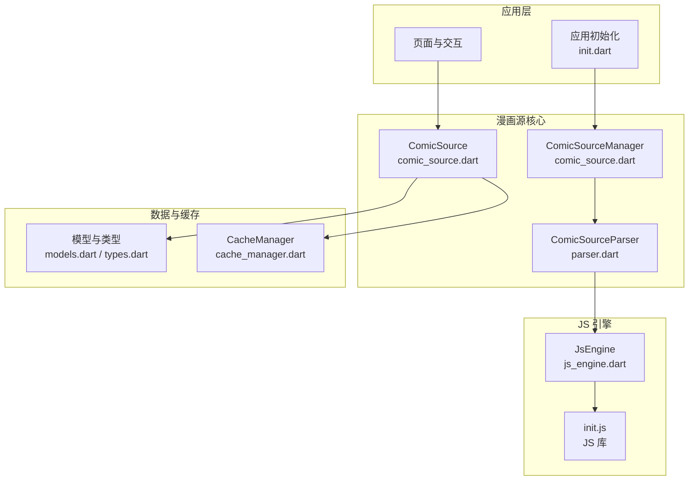
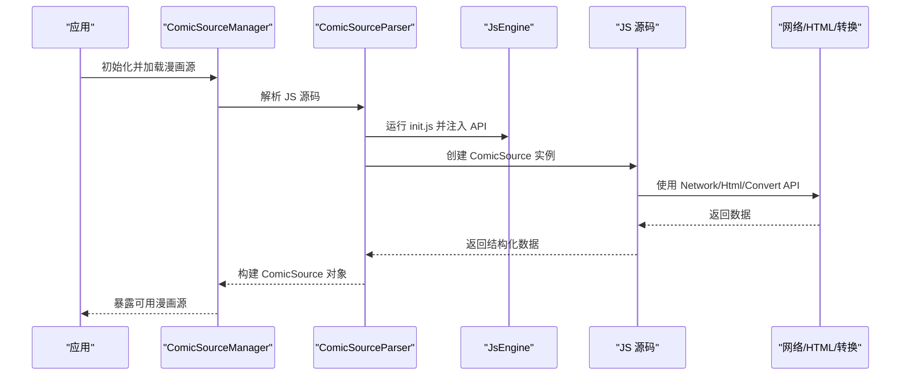
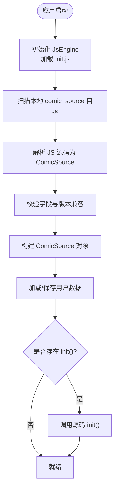
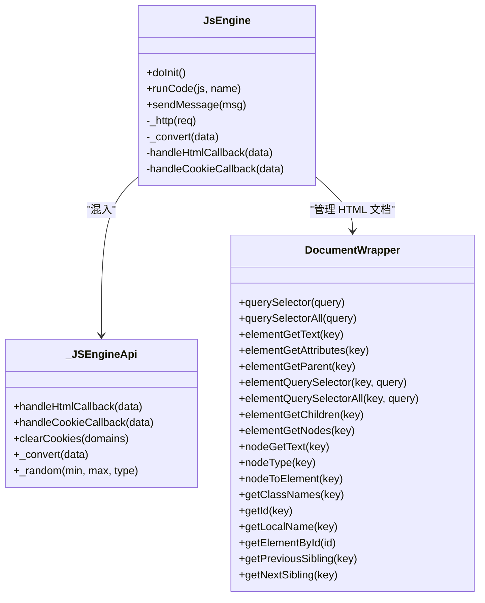
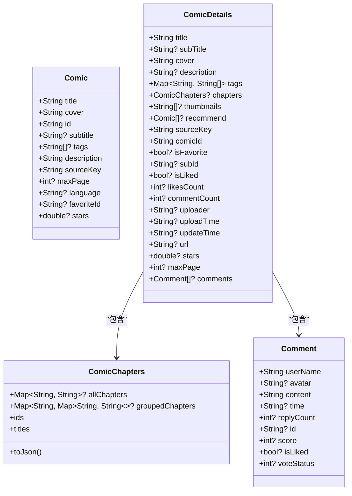
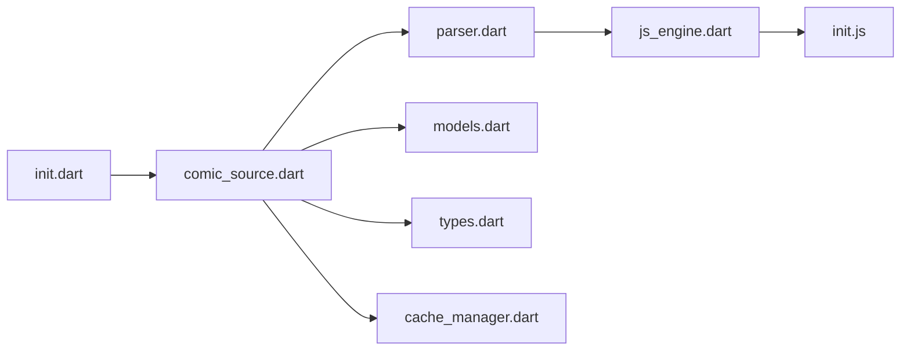

# 漫画源系统

<cite>
**本文档引用的文件**
- [comic_source.md](file://doc/comic_source.md)
- [js_api.md](file://doc/js_api.md)
- [init.dart](file://lib/init.dart)
- [comic_source.dart](file://lib/foundation/comic_source/comic_source.dart)
- [js_engine.dart](file://lib/foundation/js_engine.dart)
- [cache_manager.dart](file://lib/foundation/cache_manager.dart)
- [parser.dart](file://lib/foundation/comic_source/parser.dart)
- [models.dart](file://lib/foundation/comic_source/models.dart)
- [types.dart](file://lib/foundation/comic_source/types.dart)
- [init.js](file://assets/init.js)
</cite>

## 目录
1. [简介](#简介)
2. [项目结构](#项目结构)
3. [核心组件](#核心组件)
4. [架构总览](#架构总览)
5. [详细组件分析](#详细组件分析)
6. [依赖关系分析](#依赖关系分析)
7. [性能考虑](#性能考虑)
8. [故障排除指南](#故障排除指南)
9. [结论](#结论)
10. [附录](#附录)

## 简介
本文件面向漫画源开发者与维护者，系统性阐述漫画源的工作原理、JavaScript 源码解析流程、漫画数据提取与缓存机制，提供漫画源 API 的完整参考（方法、参数与返回值），并给出最佳实践、常见陷阱、内置源实现示例与自定义源开发指南。同时覆盖漫画源生命周期管理、错误处理与性能优化策略，为从入门到高级的完整学习路径提供指导。

## 项目结构
漫画源系统由 Dart 后端与 JavaScript 前端协作构成：Dart 负责初始化、JS 引擎管理、漫画源解析与缓存；JS 侧通过桥接 API 与 Dart 通信，完成网络请求、HTML 解析、数据转换与 UI 提示等任务。

图表来源
- [init.dart](file://lib/init.dart#L37-L77)
- [comic_source.dart](file://lib/foundation/comic_source/comic_source.dart#L35-L108)
- [parser.dart](file://lib/foundation/comic_source/parser.dart#L86-L179)
- [js_engine.dart](file://lib/foundation/js_engine.dart#L48-L110)
- [cache_manager.dart](file://lib/foundation/cache_manager.dart#L10-L90)

章节来源
- [init.dart](file://lib/init.dart#L37-L77)
- [comic_source.dart](file://lib/foundation/comic_source/comic_source.dart#L35-L108)

## 核心组件
- ComicSourceManager：管理漫画源集合，负责加载、解析与更新漫画源，暴露查询接口与变更通知。
- ComicSource：封装单个漫画源的所有能力（探索页、分类、搜索、收藏、详情、评论、标签翻译等）。
- JsEngine：JS 引擎与 Dart 的桥接层，提供 Convert、Network、Html、UI 等 API，处理消息收发与数据转换。
- ComicSourceParser：将 JS 源码解析为 ComicSource 对象，建立类型安全的数据通道。
- CacheManager：基于 SQLite 的本地缓存管理器，支持过期清理与容量控制。
- 模型与类型：Comic、ComicDetails、Comment、ComicChapters 等数据结构与函数式类型别名。

章节来源
- [comic_source.dart](file://lib/foundation/comic_source/comic_source.dart#L110-L280)
- [js_engine.dart](file://lib/foundation/js_engine.dart#L48-L284)
- [parser.dart](file://lib/foundation/comic_source/parser.dart#L86-L179)
- [cache_manager.dart](file://lib/foundation/cache_manager.dart#L10-L90)
- [models.dart](file://lib/foundation/comic_source/models.dart#L42-L117)
- [types.dart](file://lib/foundation/comic_source/types.dart#L3-L94)

## 架构总览
漫画源系统采用“Dart 管理 + JS 执行”的双层架构。Dart 负责应用生命周期与资源管理，JS 负责具体的数据抓取与页面解析。两者通过 sendMessage 机制进行异步通信，JS 侧通过 init.js 提供统一 API。

图表来源
- [init.dart](file://lib/init.dart#L37-L51)
- [parser.dart](file://lib/foundation/comic_source/parser.dart#L86-L179)
- [js_engine.dart](file://lib/foundation/js_engine.dart#L80-L110)
- [init.js](file://assets/init.js#L7-L24)

## 详细组件分析

### 组件 A：漫画源生命周期与解析流程
漫画源的生命周期从初始化开始，经过解析、实例化、数据持久化与可选的初始化回调，最终进入可用状态。

图表来源
- [init.dart](file://lib/init.dart#L37-L51)
- [parser.dart](file://lib/foundation/comic_source/parser.dart#L86-L179)
- [comic_source.dart](file://lib/foundation/comic_source/comic_source.dart#L206-L231)

章节来源
- [parser.dart](file://lib/foundation/comic_source/parser.dart#L86-L179)
- [comic_source.dart](file://lib/foundation/comic_source/comic_source.dart#L206-L243)

### 组件 B：JS 引擎与 API 桥接
JsEngine 将 Dart 与 JS 通信抽象为消息通道，提供 Convert、Network、Html、UI 等功能，并在 Dart 侧处理 HTTP 请求、HTML 文档、加密解密与随机数等。

图表来源
- [js_engine.dart](file://lib/foundation/js_engine.dart#L48-L284)
- [js_engine.dart](file://lib/foundation/js_engine.dart#L286-L575)
- [js_engine.dart](file://lib/foundation/js_engine.dart#L577-L718)

章节来源
- [js_engine.dart](file://lib/foundation/js_engine.dart#L48-L284)
- [init.js](file://assets/init.js#L27-L361)

### 组件 C：漫画源数据模型与类型
ComicSource 内部使用多种类型别名与数据模型，确保数据在 Dart 与 JS 之间安全传递。

图表来源
- [models.dart](file://lib/foundation/comic_source/models.dart#L42-L117)
- [models.dart](file://lib/foundation/comic_source/models.dart#L139-L321)
- [models.dart](file://lib/foundation/comic_source/models.dart#L323-L454)

章节来源
- [models.dart](file://lib/foundation/comic_source/models.dart#L42-L321)

### 组件 D：漫画源 API 参考（方法、参数与返回值）
以下为漫画源中常用 API 的参考摘要（详见文档）：

- 基础信息与账户
  - 类型：类 ComicSource
  - 字段：name、key、version、minAppVersion、url
  - 方法：init()（可选）、loadData()、saveData()、reLogin()

- 探索页（explore）
  - 类型：数组，元素为对象
  - 字段：title、type、load/page、loadNext/next
  - 支持类型：multiPartPage、multiPageComicList、mixed、singlePageWithMultiPart

- 分类页（category）
  - 类型：对象
  - 字段：title、parts（固定/随机/动态）、enableRankingPage

- 分类漫画（categoryComics）
  - 方法：load(category, param, options, page)、ranking.load(option, page)
  - 选项：optionList、ranking.options

- 搜索（search）
  - 方法：load(keyword, options, page) 或 loadNext(keyword, options, next)
  - 选项：optionList（select/multi-select/dropdown）

- 收藏（favorites）
  - 方法：addOrDelFavorite、loadFolders、addFolder、deleteFolder、loadComics、loadNext

- 单册详情（comic）
  - 方法：loadInfo(id)、loadThumbnails(id, next)、loadEp(comicId, epId)
  - 配置：onImageLoad、onThumbnailLoad、likeComic、starRating、loadComments/sendComment、loadChapterComments/sendChapterComment、likeComment/voteComment
  - 其他：idMatch、onClickTag、link、enableTagsTranslate、enableTagsSuggestions

- 设置（settings）
  - 类型：对象，键为设置项，值含 title、type、options/default、validator/callback

- 翻译（translation）
  - 类型：对象，键为语言代码，值为字符串映射

章节来源
- [comic_source.dart](file://lib/foundation/comic_source/comic_source.dart#L110-L280)
- [comic_source.dart](file://lib/foundation/comic_source/comic_source.dart#L330-L401)
- [comic_source.dart](file://lib/foundation/comic_source/comic_source.dart#L487-L493)
- [comic_source.dart](file://lib/foundation/comic_source/comic_source.dart#L495-L501)
- [js_api.md](file://doc/js_api.md#L1-L513)
- [comic_source.md](file://doc/comic_source.md#L44-L740)

### 组件 E：漫画源开发最佳实践与常见陷阱
- 最佳实践
  - 明确区分 explore 与 search 的职责边界，避免重复抓取。
  - 使用分页或 next 令牌时，优先实现 loadNext 以提升用户体验。
  - 在 comic.loadInfo 中补充必要元数据（如 tags、chapters、thumbnails），减少二次请求。
  - 合理使用 onImageLoad/onThumbnailLoad 处理防盗链与图片后处理。
  - 为搜索与分类提供稳定的 optionList，保持 UI 一致性。
  - 使用 enableTagsTranslate 与 enableTagsSuggestions 提升多语言体验。
  - 在 init() 中进行一次性初始化（如设置 UA、预热 Cookie）。

- 常见陷阱
  - 忘记设置 key 的合法性（仅允许字母、数字、下划线）。
  - minAppVersion 低于当前应用版本导致解析失败。
  - 在 favorites/addOrDelFavorite 中抛出“登录过期”异常，需确保 reLogin 流程正确。
  - HTML 解析频繁创建文档导致内存占用过高，应及时 dispose。
  - 未处理网络异常与空响应，导致前端卡顿或崩溃。
  - 图片加载配置不当导致加载失败或内存溢出。

章节来源
- [parser.dart](file://lib/foundation/comic_source/parser.dart#L181-L186)
- [parser.dart](file://lib/foundation/comic_source/parser.dart#L113-L121)
- [js_engine.dart](file://lib/foundation/js_engine.dart#L291-L358)
- [js_engine.dart](file://lib/foundation/js_engine.dart#L360-L400)

### 组件 F：内置漫画源实现示例与自定义开发指南
- 内置源实现示例
  - 参考模板与注释，按需实现 explore、category、categoryComics、search、favorites、comic 等模块。
  - 使用 js_api.md 中的 API 完成网络请求、HTML 解析与数据转换。

- 自定义开发指南
  - 准备工作：安装应用、准备编辑器、下载模板与 JS API 文档。
  - 编写步骤：填写基础信息、实现 init（可选）、账户登录/登出、探索页、分类页、搜索、收藏、详情页与评论。
  - 发布与维护：提供仓库地址与 JSON 列表，遵循版本号规范，定期更新。

章节来源
- [comic_source.md](file://doc/comic_source.md#L44-L740)
- [js_api.md](file://doc/js_api.md#L1-L513)

### 组件 G：漫画源生命周期管理、错误处理与性能优化
- 生命周期管理
  - 初始化：JsEngine.ensureInit → ComicSourceManager.doInit → 扫描本地 JS 文件 → 解析 → 实例化 → 加载用户数据 → 可选 init() 回调。
  - 更新：支持检查可用更新并通知 UI。

- 错误处理
  - JS 异常捕获与日志记录，避免影响主线程。
  - 网络请求错误通过 result.error 抛出，上层统一处理。
  - HTML 解析超限时自动清理最旧文档，防止内存泄漏。

- 性能优化
  - 使用 CacheManager 缓存图片与响应，控制缓存大小与过期时间。
  - 合理使用分页与 next 令牌，避免一次性加载过多数据。
  - 在 onImageLoad 中进行必要的图片压缩与防盗链处理。

章节来源
- [init.dart](file://lib/init.dart#L37-L77)
- [parser.dart](file://lib/foundation/comic_source/parser.dart#L86-L179)
- [js_engine.dart](file://lib/foundation/js_engine.dart#L214-L272)
- [js_engine.dart](file://lib/foundation/js_engine.dart#L291-L358)
- [cache_manager.dart](file://lib/foundation/cache_manager.dart#L167-L242)

## 依赖关系分析
漫画源系统内部模块耦合度低，主要通过 JsEngine 与 JS 源码通信，形成清晰的职责边界。

图表来源
- [init.dart](file://lib/init.dart#L37-L51)
- [comic_source.dart](file://lib/foundation/comic_source/comic_source.dart#L25-L33)
- [parser.dart](file://lib/foundation/comic_source/parser.dart#L1-L3)
- [js_engine.dart](file://lib/foundation/js_engine.dart#L1-L36)
- [cache_manager.dart](file://lib/foundation/cache_manager.dart#L1-L10)

章节来源
- [comic_source.dart](file://lib/foundation/comic_source/comic_source.dart#L25-L33)

## 性能考虑
- 缓存策略
  - CacheManager 使用 SQLite 记录缓存条目，按过期时间与容量阈值清理。
  - 写入时生成哈希命名文件，读取时更新过期时间，避免重复加载。
- 网络与解析
  - JsEngine 统一处理 HTTP 请求与 Cookie 管理，支持代理与日志拦截。
  - HTML 文档最多保留 8 个，超限时删除最旧文档，降低内存压力。
- 数据传输
  - 使用 Convert API 进行编码/解码、哈希与对称/非对称加密，保障数据安全与体积。

章节来源
- [cache_manager.dart](file://lib/foundation/cache_manager.dart#L97-L163)
- [js_engine.dart](file://lib/foundation/js_engine.dart#L214-L272)
- [js_engine.dart](file://lib/foundation/js_engine.dart#L291-L358)
- [init.js](file://assets/init.js#L27-L361)

## 故障排除指南
- 漫画源无法加载
  - 检查 JS 源码是否包含合法的类定义与必需字段（name/key/version）。
  - 确认 minAppVersion 与应用版本兼容。
  - 查看日志输出，定位解析异常或网络错误。

- 登录失败或会话过期
  - 确保 account.login/account.loginWithCookies 正确设置 Cookie。
  - 在 favorites/addOrDelFavorite 中抛出“登录过期”，触发 reLogin 流程。

- HTML 解析异常
  - 确保及时调用 HtmlDocument.dispose 释放资源。
  - 检查选择器是否匹配目标元素。

- 图片加载失败
  - 使用 onImageLoad/onThumbnailLoad 配置请求头与后处理逻辑。
  - 检查防盗链与图片尺寸限制。

章节来源
- [parser.dart](file://lib/foundation/comic_source/parser.dart#L96-L126)
- [parser.dart](file://lib/foundation/comic_source/parser.dart#L204-L222)
- [js_engine.dart](file://lib/foundation/js_engine.dart#L360-L400)
- [js_engine.dart](file://lib/foundation/js_engine.dart#L577-L718)

## 结论
漫画源系统通过 Dart 与 JS 的协同，提供了灵活、可扩展且高性能的漫画数据获取与展示能力。开发者只需遵循统一的 API 规范与最佳实践，即可快速构建高质量的漫画源。建议在开发过程中重视缓存策略、错误处理与性能优化，持续迭代以提升用户体验。

## 附录
- 术语
  - Res：封装结果与附加数据（如 maxPage/next）的对象。
  - PageJumpTarget：页面跳转目标，支持 search 与 category 两种页面类型。
  - ImageLoadingConfig：图片加载配置，支持请求头、响应处理与失败重试。

章节来源
- [parser.dart](file://lib/foundation/comic_source/parser.dart#L669-L690)
- [models.dart](file://lib/foundation/comic_source/models.dart#L456-L561)
- [types.dart](file://lib/foundation/comic_source/types.dart#L49-L56)