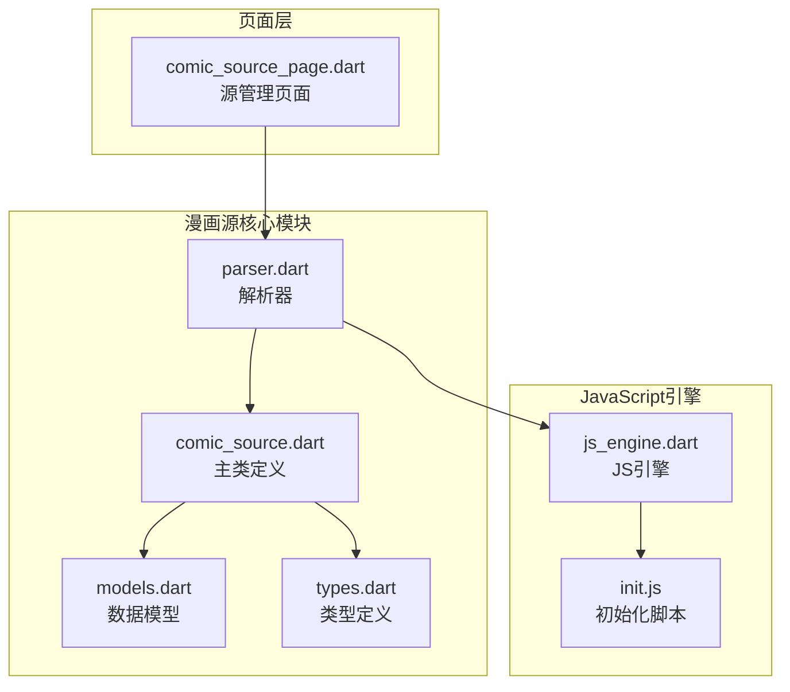
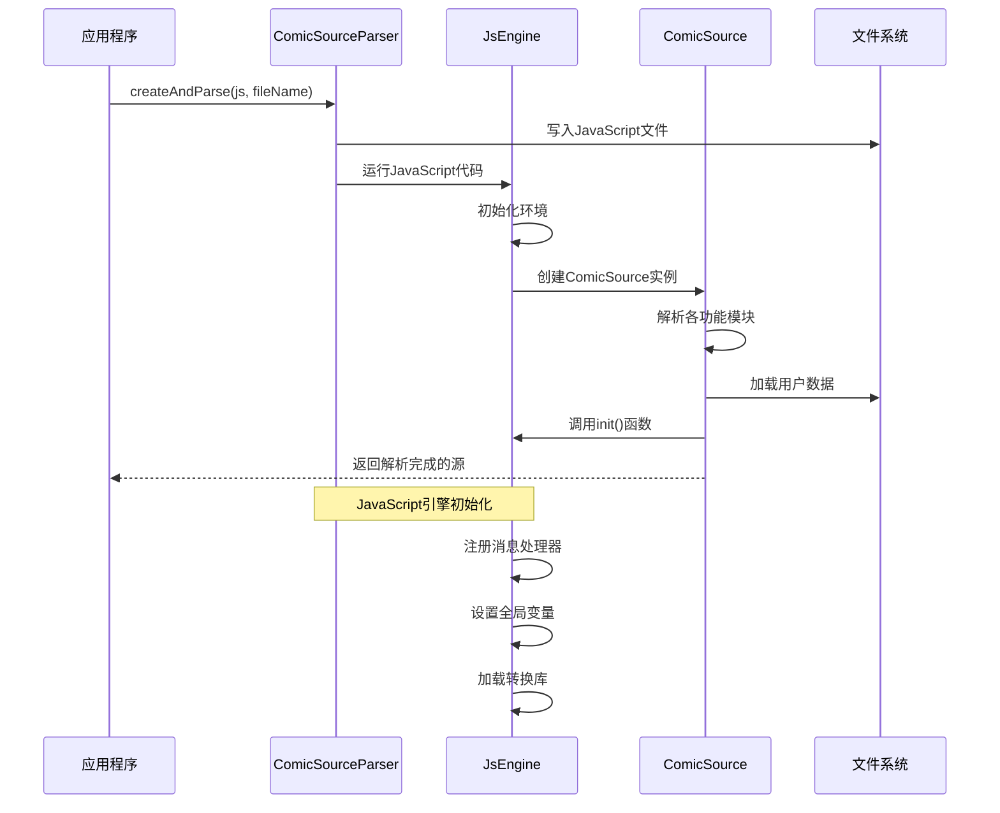
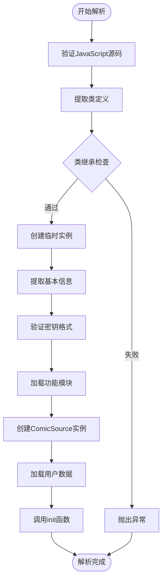
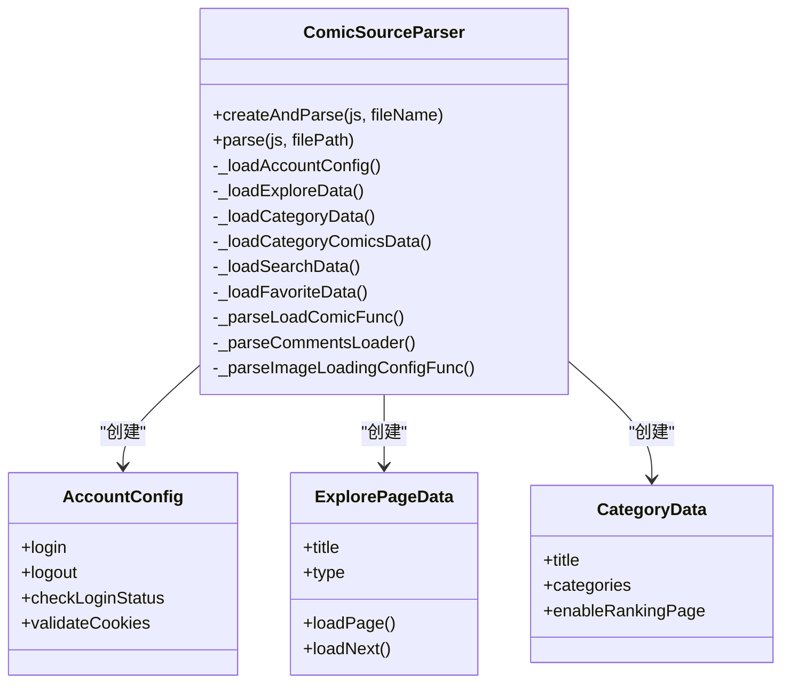
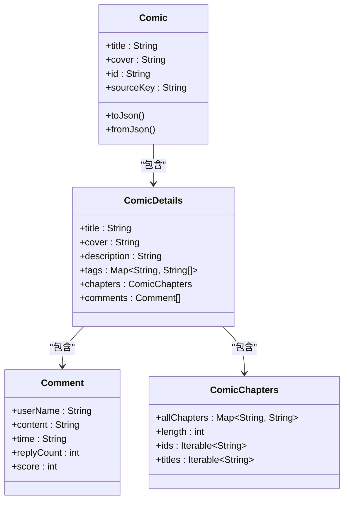
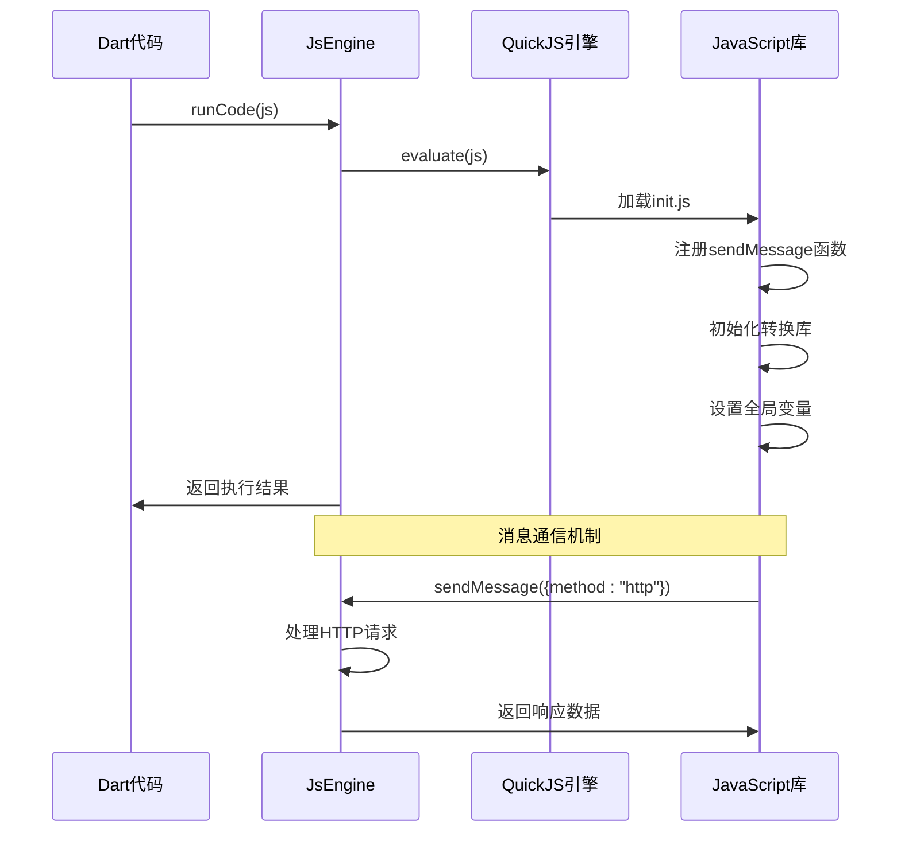
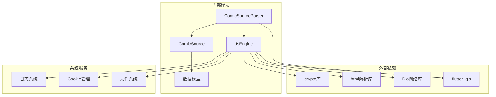
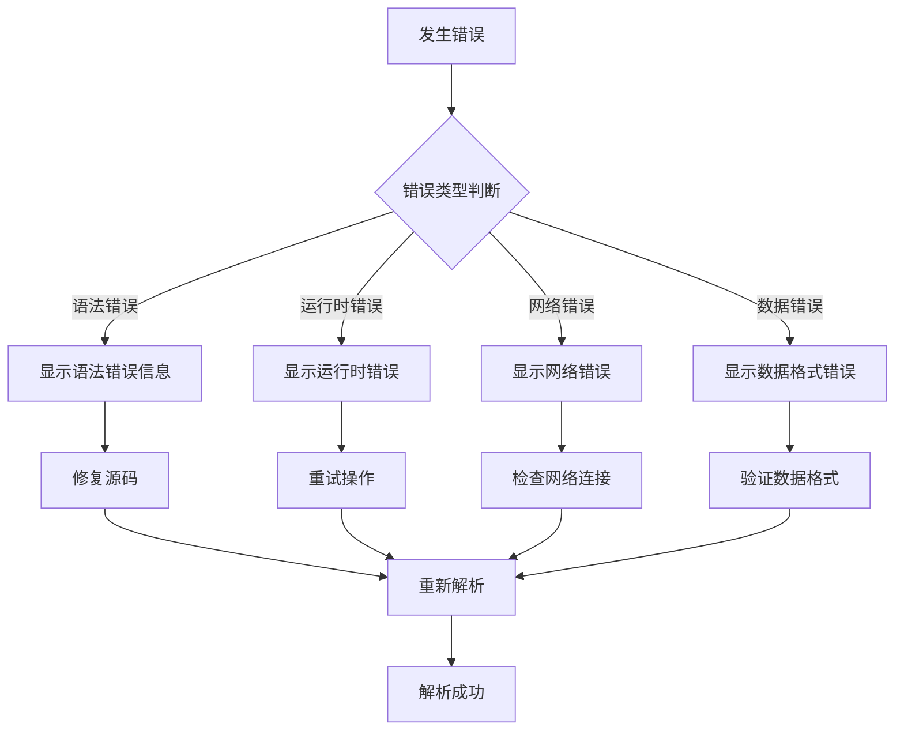

# 漫画源解析机制

<cite>
**本文档引用的文件**
- [parser.dart](file://lib/foundation/comic_source/parser.dart)
- [comic_source.dart](file://lib/foundation/comic_source/comic_source.dart)
- [models.dart](file://lib/foundation/comic_source/models.dart)
- [types.dart](file://lib/foundation/comic_source/types.dart)
- [js_engine.dart](file://lib/foundation/js_engine.dart)
- [init.js](file://assets/init.js)
- [comic_source.md](file://doc/comic_source.md)
- [comic_source_page.dart](file://lib/pages/comic_source_page.dart)
</cite>

## 目录
1. [简介](#简介)
2. [项目结构](#项目结构)
3. [核心组件](#核心组件)
4. [架构概览](#架构概览)
5. [详细组件分析](#详细组件分析)
6. [依赖关系分析](#依赖关系分析)
7. [性能考虑](#性能考虑)
8. [故障排除指南](#故障排除指南)
9. [结论](#结论)

## 简介

Venera 是一个基于 Flutter 的漫画阅读器，支持通过 JavaScript 源动态加载漫画内容。该系统使用 flutter_qjs 作为 JavaScript 引擎，实现了完整的漫画源解析机制。

漫画源解析机制的核心目标是将 JavaScript 源码转换为 Dart 对象，建立漫画源与应用之间的交互接口，实现漫画数据的动态加载和管理。

## 项目结构

漫画源解析相关的代码主要分布在以下文件中：



**图表来源**
- [parser.dart](file://lib/foundation/comic_source/parser.dart#L53-L179)
- [js_engine.dart](file://lib/foundation/js_engine.dart#L48-L110)

**章节来源**
- [parser.dart](file://lib/foundation/comic_source/parser.dart#L1-L1302)
- [comic_source.dart](file://lib/foundation/comic_source/comic_source.dart#L1-L502)

## 核心组件

### ComicSourceParser 类

ComicSourceParser 是漫画源解析的核心类，负责将 JavaScript 源码转换为 Dart 对象。

**主要职责：**
- JavaScript 源码验证和加载
- 源码关键信息提取（名称、密钥、版本等）
- 功能函数解析和封装
- 源码生命周期管理

**关键方法：**
- `createAndParse()`: 创建并解析漫画源
- `parse()`: 执行实际解析逻辑
- `_checkKeyValidation()`: 验证密钥格式
- 各种 `_parse*()` 方法：解析不同功能模块

### ComicSource 类

ComicSource 是解析后的核心对象，封装了漫画源的所有功能。

**主要属性：**
- 基本信息：name, key, version, url
- 功能模块：账户管理、分类、搜索、收藏等
- 数据持久化：loadData(), saveData()

**章节来源**
- [parser.dart](file://lib/foundation/comic_source/parser.dart#L53-L179)
- [comic_source.dart](file://lib/foundation/comic_source/comic_source.dart#L110-L280)

## 架构概览

漫画源解析系统的整体架构如下：



**图表来源**
- [parser.dart](file://lib/foundation/comic_source/parser.dart#L59-L84)
- [js_engine.dart](file://lib/foundation/js_engine.dart#L80-L110)

## 详细组件分析

### JavaScript 源码解析流程



**图表来源**
- [parser.dart](file://lib/foundation/comic_source/parser.dart#L86-L179)

### 源码验证机制

系统实现了多层次的源码验证：

1. **语法验证**：检查 JavaScript 源码是否符合基本语法要求
2. **类定义验证**：确保源码包含正确的 ComicSource 继承结构
3. **必需字段验证**：验证 name、key、version 等必需字段
4. **密钥格式验证**：确保密钥只包含允许的字符

**章节来源**
- [parser.dart](file://lib/foundation/comic_source/parser.dart#L86-L128)

### 功能模块解析

系统支持多种功能模块的自动解析：



**图表来源**
- [parser.dart](file://lib/foundation/comic_source/parser.dart#L199-L275)
- [parser.dart](file://lib/foundation/comic_source/parser.dart#L277-L428)

**章节来源**
- [parser.dart](file://lib/foundation/comic_source/parser.dart#L199-L965)

### 数据模型设计

系统使用强类型的数据模型来表示漫画相关内容：



**图表来源**
- [models.dart](file://lib/foundation/comic_source/models.dart#L42-L117)
- [models.dart](file://lib/foundation/comic_source/models.dart#L139-L321)

**章节来源**
- [models.dart](file://lib/foundation/comic_source/models.dart#L1-L562)

### JavaScript 引擎集成

系统通过 JsEngine 类与 JavaScript 引擎进行深度集成：



**图表来源**
- [js_engine.dart](file://lib/foundation/js_engine.dart#L80-L110)
- [init.js](file://assets/init.js#L1-L80)

**章节来源**
- [js_engine.dart](file://lib/foundation/js_engine.dart#L48-L284)

## 依赖关系分析

漫画源解析机制的依赖关系如下：



**图表来源**
- [js_engine.dart](file://lib/foundation/js_engine.dart#L1-L32)
- [parser.dart](file://lib/foundation/comic_source/parser.dart#L1-L34)

**章节来源**
- [js_engine.dart](file://lib/foundation/js_engine.dart#L1-L737)
- [parser.dart](file://lib/foundation/comic_source/parser.dart#L1-L1302)

## 性能考虑

### JavaScript 引擎优化

1. **单例模式**：JsEngine 使用单例模式避免重复初始化
2. **消息缓存**：支持初始化脚本的缓存以提高启动速度
3. **资源管理**：自动清理不再使用的 JavaScript 函数引用

### 源码解析优化

1. **增量加载**：支持按需加载不同的功能模块
2. **错误隔离**：单个模块的错误不影响其他模块的加载
3. **缓存机制**：已解析的源码在内存中缓存

### 内存管理

1. **自动垃圾回收**：利用 Dart 和 JavaScript 的垃圾回收机制
2. **资源释放**：及时释放不再使用的 DOM 文档和元素
3. **Cookie 管理**：自动清理过期的 Cookie

## 故障排除指南

### 常见错误类型

1. **源码格式错误**
   - 检查 JavaScript 语法是否正确
   - 确保类定义符合 ComicSource 继承要求
   - 验证必需字段是否完整

2. **JavaScript 引擎初始化失败**
   - 检查 flutter_qjs 是否正确安装
   - 验证初始化脚本是否可读
   - 确认权限设置是否正确

3. **功能模块解析失败**
   - 检查函数签名是否符合预期
   - 验证返回数据格式是否正确
   - 确认异步操作是否正确处理

### 调试技巧

1. **启用详细日志**
   ```dart
   // 在解析过程中添加日志输出
   Log.debug("解析进度", "正在解析账户模块");
   ```

2. **使用浏览器开发者工具**
   - 利用 Flutter 的调试功能
   - 检查 JavaScript 控制台输出
   - 监控网络请求和响应

3. **分模块测试**
   - 先测试基础功能模块
   - 逐步添加复杂功能
   - 验证每个模块的独立运行

### 错误处理策略



**章节来源**
- [parser.dart](file://lib/foundation/comic_source/parser.dart#L806-L820)
- [js_engine.dart](file://lib/foundation/js_engine.dart#L37-L46)

## 结论

Venera 的漫画源解析机制通过精心设计的架构实现了 JavaScript 源码到 Dart 对象的无缝转换。该系统的主要优势包括：

1. **高度模块化**：支持功能模块的独立解析和管理
2. **强大的扩展性**：通过 JavaScript 提供了丰富的扩展能力
3. **完善的错误处理**：提供了多层次的错误检测和恢复机制
4. **优秀的性能表现**：通过缓存和优化策略确保了良好的运行效率

开发者可以通过理解这些核心机制，更好地开发和维护漫画源，为用户提供更加丰富和流畅的漫画阅读体验。