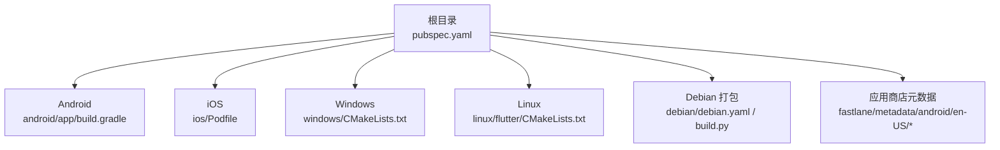
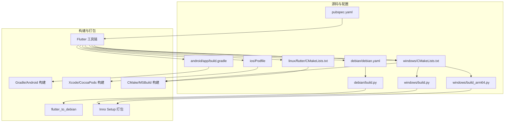
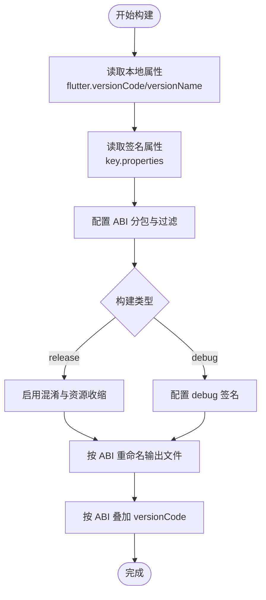
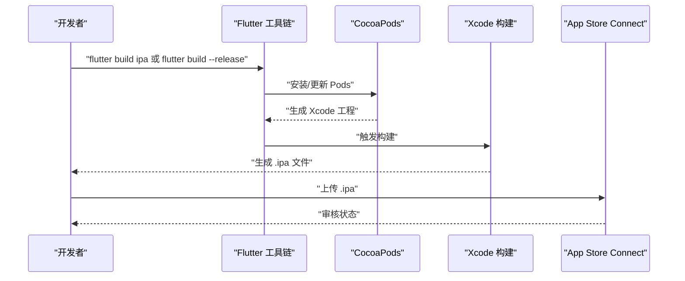
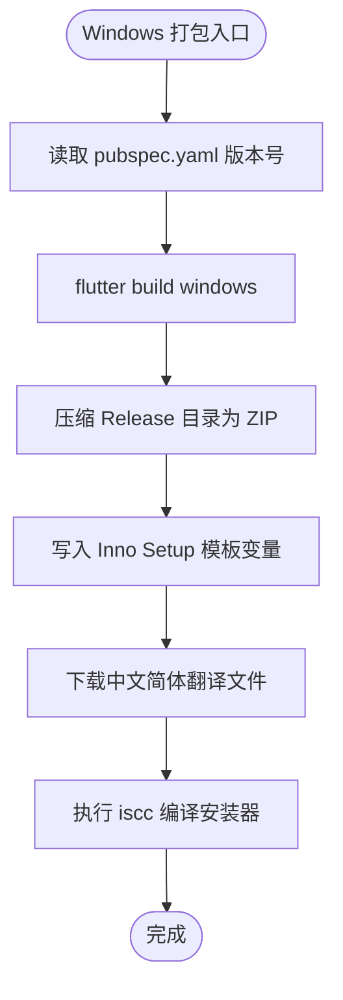
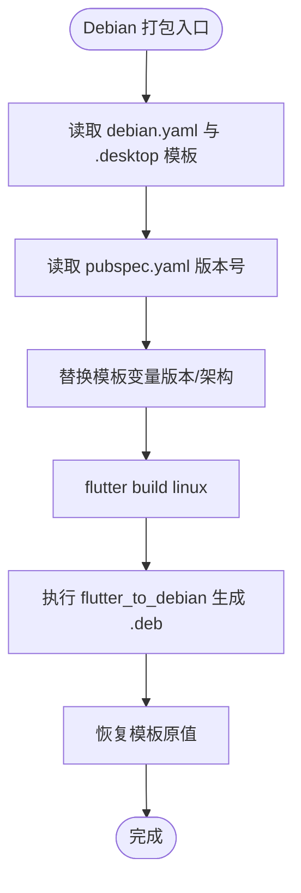
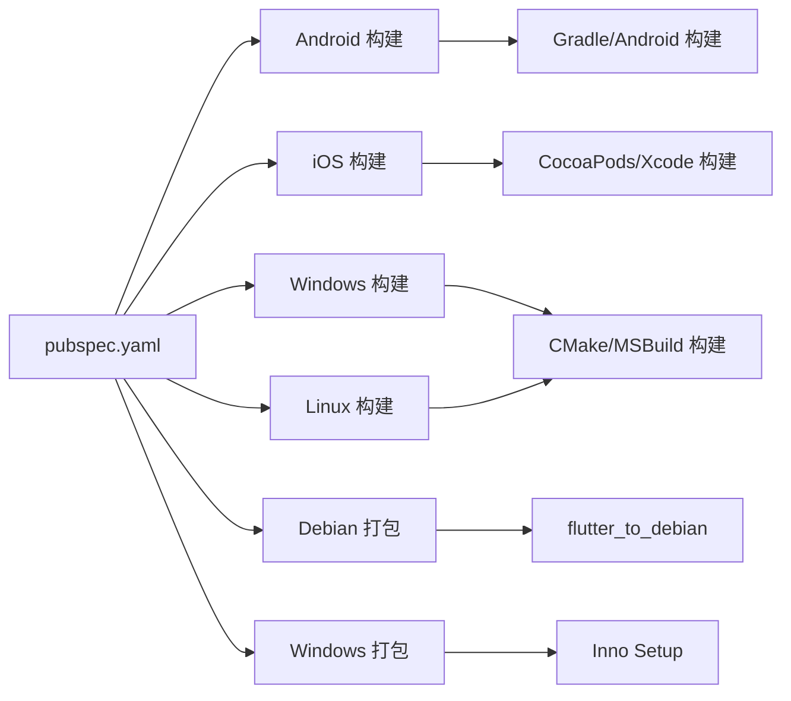

# 部署运维

<cite>
**本文引用的文件**
- [pubspec.yaml](file://pubspec.yaml)
- [android/build.gradle](file://android/build.gradle)
- [android/app/build.gradle](file://android/app/build.gradle)
- [android/settings.gradle](file://android/settings.gradle)
- [android/gradle.properties](file://android/gradle.properties)
- [ios/Podfile](file://ios/Podfile)
- [linux/flutter/CMakeLists.txt](file://linux/flutter/CMakeLists.txt)
- [windows/CMakeLists.txt](file://windows/CMakeLists.txt)
- [debian/debian.yaml](file://debian/debian.yaml)
- [debian/build.py](file://debian/build.py)
- [windows/build.py](file://windows/build.py)
- [windows/build_arm64.py](file://windows/build_arm64.py)
- [fastlane/metadata/android/en-US/full_description.txt](file://fastlane/metadata/android/en-US/full_description.txt)
</cite>

## 目录
1. [简介](#简介)
2. [项目结构](#项目结构)
3. [核心组件](#核心组件)
4. [架构总览](#架构总览)
5. [详细组件分析](#详细组件分析)
6. [依赖关系分析](#依赖关系分析)
7. [性能考虑](#性能考虑)
8. [故障排除指南](#故障排除指南)
9. [结论](#结论)
10. [附录](#附录)

## 简介
本文件面向项目维护者与运维人员，提供覆盖多平台（Android、iOS、Windows、Linux、macOS）的构建与发布运维指南。内容涵盖：
- 各平台构建配置与产物命名规则
- 自动化构建脚本的使用方法与可定制项
- 应用商店发布流程要点（Android APK/AAB、iOS IPA、桌面应用分发）
- 持续集成与持续部署（CI/CD）建议
- 版本管理与更新机制
- 监控、日志与故障排除实践

## 项目结构
该仓库采用 Flutter 多平台工程组织方式，根目录包含跨平台源码与各平台专用配置/脚本：
- android：Android 构建配置与 Gradle 插件设置
- ios：iOS 依赖与 Xcode 工程配置
- linux、windows、macos：桌面端 CMake 构建与安装规则
- debian：基于 flutter_to_debian 的 Debian 包生成
- fastlane：Android 应用商店元数据
- 根级 pubspec.yaml：版本号、依赖与桌面包元信息

**图表来源**
- [pubspec.yaml](file://pubspec.yaml#L1-L122)
- [android/app/build.gradle](file://android/app/build.gradle#L1-L138)
- [ios/Podfile](file://ios/Podfile#L1-L45)
- [windows/CMakeLists.txt](file://windows/CMakeLists.txt#L1-L109)
- [linux/flutter/CMakeLists.txt](file://linux/flutter/CMakeLists.txt#L1-L89)
- [debian/debian.yaml](file://debian/debian.yaml#L1-L17)
- [fastlane/metadata/android/en-US/full_description.txt](file://fastlane/metadata/android/en-US/full_description.txt#L1-L16)

**章节来源**
- [pubspec.yaml](file://pubspec.yaml#L1-L122)
- [android/app/build.gradle](file://android/app/build.gradle#L1-L138)
- [ios/Podfile](file://ios/Podfile#L1-L45)
- [windows/CMakeLists.txt](file://windows/CMakeLists.txt#L1-L109)
- [linux/flutter/CMakeLists.txt](file://linux/flutter/CMakeLists.txt#L1-L89)
- [debian/debian.yaml](file://debian/debian.yaml#L1-L17)
- [fastlane/metadata/android/en-US/full_description.txt](file://fastlane/metadata/android/en-US/full_description.txt#L1-L16)

## 核心组件
- 版本与元信息：根级 pubspec.yaml 定义版本号、Flutter SDK 与桌面包元信息（如 Debian 打包字段）
- Android 构建：Gradle 多 ABI 分包、签名配置、产物命名与版本号叠加策略
- iOS 构建：CocoaPods 依赖与 Xcode 构建配置
- 桌面端构建：Windows/Linux/macOS 的 CMake 规则与安装目标
- Debian 打包：通过 flutter_to_debian 生成 .deb 包，Python 脚本替换模板变量
- Windows 打包：Inno Setup 安装器脚本与压缩打包流程

**章节来源**
- [pubspec.yaml](file://pubspec.yaml#L5-L122)
- [android/app/build.gradle](file://android/app/build.gradle#L32-L128)
- [ios/Podfile](file://ios/Podfile#L1-L45)
- [windows/CMakeLists.txt](file://windows/CMakeLists.txt#L1-L109)
- [linux/flutter/CMakeLists.txt](file://linux/flutter/CMakeLists.txt#L1-L89)
- [debian/debian.yaml](file://debian/debian.yaml#L1-L17)
- [debian/build.py](file://debian/build.py#L1-L36)
- [windows/build.py](file://windows/build.py#L1-L40)
- [windows/build_arm64.py](file://windows/build_arm64.py#L1-L43)

## 架构总览
下图展示从源码到多平台产物的关键路径与工具链：

**图表来源**
- [pubspec.yaml](file://pubspec.yaml#L1-L122)
- [android/app/build.gradle](file://android/app/build.gradle#L1-L138)
- [ios/Podfile](file://ios/Podfile#L1-L45)
- [windows/CMakeLists.txt](file://windows/CMakeLists.txt#L1-L109)
- [linux/flutter/CMakeLists.txt](file://linux/flutter/CMakeLists.txt#L1-L89)
- [debian/debian.yaml](file://debian/debian.yaml#L1-L17)
- [debian/build.py](file://debian/build.py#L1-L36)
- [windows/build.py](file://windows/build.py#L1-L40)
- [windows/build_arm64.py](file://windows/build_arm64.py#L1-L43)

## 详细组件分析

### Android 构建与发布
- 多 ABI 分包与产物命名
  - 使用 ABI 切割并生成独立 APK，同时保留通用 APK；发布时可选择生成 AAB（需在构建类型中启用并配置上传密钥）
  - 产物命名包含版本号与 ABI，便于分发与回溯
- 签名与混淆
  - 在 release 构建类型中启用混淆与资源收缩，并配置签名信息
  - debug 与 release 均配置签名，确保调试与发布一致性
- 版本号叠加策略
  - release 构建按 ABI 对 versionCode 进行叠加，避免 Play 商店版本冲突
  - debug 构建附加固定后缀以区分
- 关键配置位置
  - Gradle 仓库与全局清理任务
  - 子模块构建目录与依赖评估
  - Gradle 属性开关（AndroidX、Jetifier、BuildConfig）

**图表来源**
- [android/app/build.gradle](file://android/app/build.gradle#L10-L128)
- [android/build.gradle](file://android/build.gradle#L1-L19)
- [android/gradle.properties](file://android/gradle.properties#L1-L6)
- [android/settings.gradle](file://android/settings.gradle#L1-L26)

**章节来源**
- [android/app/build.gradle](file://android/app/build.gradle#L32-L128)
- [android/build.gradle](file://android/build.gradle#L1-L19)
- [android/gradle.properties](file://android/gradle.properties#L1-L6)
- [android/settings.gradle](file://android/settings.gradle#L1-L26)

### iOS 构建与发布
- 平台与依赖
  - 指定最低系统版本，使用 CocoaPods 管理依赖
  - 通过 flutter_install_all_ios_pods 安装 Flutter 相关 Pods
- 构建变体
  - 支持 Debug/Profile/Release 三种变体，遵循 Flutter 生成的 Xcode 配置
- 发布准备
  - 需要配置 Apple 开发者账号、证书与描述文件
  - 使用 Xcode Archive 导出 IPA，或通过 Fastlane 自动化

**图表来源**
- [ios/Podfile](file://ios/Podfile#L1-L45)

**章节来源**
- [ios/Podfile](file://ios/Podfile#L1-L45)

### Windows 桌面应用打包
- 构建与安装
  - 通过 CMake 生成可执行文件与资源，安装阶段复制运行时与资产
  - 支持 Debug/Profile/Release 三种模式
- 自动化打包
  - Python 脚本读取版本号，调用 Flutter 构建，再进行压缩打包
  - 使用 Inno Setup 生成安装器，支持中文简体翻译文件自动下载
- ARM64 专项打包
  - 提供独立脚本与脚本参数，生成 arm64 版本的压缩包与安装器

**图表来源**
- [windows/build.py](file://windows/build.py#L1-L40)
- [windows/build_arm64.py](file://windows/build_arm64.py#L1-L43)
- [windows/CMakeLists.txt](file://windows/CMakeLists.txt#L1-L109)

**章节来源**
- [windows/build.py](file://windows/build.py#L1-L40)
- [windows/build_arm64.py](file://windows/build_arm64.py#L1-L43)
- [windows/CMakeLists.txt](file://windows/CMakeLists.txt#L1-L109)

### Linux 桌面应用打包（Debian）
- 打包流程
  - Python 脚本读取版本号，替换 debian.yaml 与 .desktop 模板中的占位符
  - 调用 flutter_to_debian 生成 .deb 包
  - 最终恢复模板原值，避免污染工作区
- 控制字段
  - 包名、版本、架构、依赖等由模板统一管理

**图表来源**
- [debian/build.py](file://debian/build.py#L1-L36)
- [debian/debian.yaml](file://debian/debian.yaml#L1-L17)

**章节来源**
- [debian/build.py](file://debian/build.py#L1-L36)
- [debian/debian.yaml](file://debian/debian.yaml#L1-L17)

### macOS 桌面应用打包
- 构建与安装
  - 通过 CMake 生成可执行文件与资源，安装阶段复制运行时与资产
  - 支持 Debug/Profile/Release 三种模式
- 发布准备
  - 需要配置 Apple 开发者账号、证书与描述文件
  - 使用 Xcode Archive 导出 .app 或 .pkg

**章节来源**
- [macos/Podfile](file://macos/Podfile#L1-L45)
- [macos/CMakeLists.txt](file://macos/CMakeLists.txt#L1-L109)

### 应用商店发布流程

#### Android APK/AAB
- 准备材料
  - 生成并上传 release 签名的 APK/AAB
  - 准备应用商店元数据（标题、简述、完整描述、截图等）
- 元数据位置
  - 应用商店描述位于 fastlane/metadata/android/en-US/full_description.txt
- 发布步骤
  - 通过 Google Play Console 上传 AAB
  - 设置内测/封闭测试轨道或生产轨道
  - 提交审核并跟踪状态

**章节来源**
- [fastlane/metadata/android/en-US/full_description.txt](file://fastlane/metadata/android/en-US/full_description.txt#L1-L16)

#### iOS IPA
- 准备材料
  - 使用 Xcode Archive 导出 .ipa
  - 配置 Apple Developer 账号、证书与描述文件
- 发布步骤
  - 通过 Transporter 或 Xcode 上传至 App Store Connect
  - 在 App Store Connect 中提交审核

**章节来源**
- [ios/Podfile](file://ios/Podfile#L1-L45)

#### 桌面应用分发
- Windows
  - 使用 Inno Setup 生成安装器，分发 ZIP 与安装器两种形式
- Linux
  - 生成 .deb 包，可通过软件中心或命令行安装
- macOS
  - 生成 .app 或 .pkg，分发至官网或 Mac App Store（如适用）

**章节来源**
- [windows/build.py](file://windows/build.py#L1-L40)
- [windows/build_arm64.py](file://windows/build_arm64.py#L1-L43)
- [debian/debian.yaml](file://debian/debian.yaml#L1-L17)

### CI/CD 配置示例（概念性说明）
以下为通用 CI/CD 流程建议，具体实现需结合所选平台（如 GitHub Actions、GitLab CI、Jenkins 等）：
- 触发条件
  - 推送标签（用于正式版本发布）
  - PR 合并到主分支（预发布/测试版）
- 步骤
  - 依赖安装（Flutter SDK、Android NDK、Xcode、Inno Setup、CMake、Pkg-config 等）
  - Android：Gradle 构建 release，生成 APK/AAB
  - iOS：CocoaPods 安装，Xcode 构建并导出 IPA
  - Windows/Linux/macOS：CMake 构建，打包安装器或 DEB
  - 应用商店上传：Android 使用 Fastlane 或 Google API；iOS 使用 Transporter
  - 资产归档：将产物与变更日志上传到发布页面或制品库

[本节为通用指导，不直接分析具体文件，故无“章节来源”]

## 依赖关系分析
- 组件耦合
  - Android 构建依赖 Gradle 与 Flutter 工具链；iOS 构建依赖 CocoaPods 与 Xcode；桌面端依赖 CMake/MSBuild
  - Debian 打包依赖 flutter_to_debian 与 Python 脚本；Windows 打包依赖 Inno Setup
- 外部依赖
  - Android 使用 Google/Maven 仓库；iOS 使用 CocoaPods；桌面端依赖 GTK/Webkit2 等系统库
- 版本与元信息
  - pubspec.yaml 统一管理版本号与桌面包元信息，被各平台脚本读取

**图表来源**
- [pubspec.yaml](file://pubspec.yaml#L1-L122)
- [android/app/build.gradle](file://android/app/build.gradle#L1-L138)
- [ios/Podfile](file://ios/Podfile#L1-L45)
- [windows/CMakeLists.txt](file://windows/CMakeLists.txt#L1-L109)
- [linux/flutter/CMakeLists.txt](file://linux/flutter/CMakeLists.txt#L1-L89)
- [debian/debian.yaml](file://debian/debian.yaml#L1-L17)
- [debian/build.py](file://debian/build.py#L1-L36)
- [windows/build.py](file://windows/build.py#L1-L40)
- [windows/build_arm64.py](file://windows/build_arm64.py#L1-L43)

**章节来源**
- [pubspec.yaml](file://pubspec.yaml#L1-L122)
- [android/app/build.gradle](file://android/app/build.gradle#L1-L138)
- [ios/Podfile](file://ios/Podfile#L1-L45)
- [windows/CMakeLists.txt](file://windows/CMakeLists.txt#L1-L109)
- [linux/flutter/CMakeLists.txt](file://linux/flutter/CMakeLists.txt#L1-L89)
- [debian/debian.yaml](file://debian/debian.yaml#L1-L17)
- [debian/build.py](file://debian/build.py#L1-L36)
- [windows/build.py](file://windows/build.py#L1-L40)
- [windows/build_arm64.py](file://windows/build_arm64.py#L1-L43)

## 性能考虑
- 构建性能
  - Android：启用 Gradle 并行与 JVM 参数优化；合理设置 NDK 版本与 ABI 过滤
  - iOS：缓存 Pods 与构建产物；使用并行构建
  - 桌面端：CMake 缓存与增量构建；减少不必要的资源拷贝
- 产物体积
  - 启用混淆与资源收缩；移除未使用资源；按 ABI 分包降低单包体积
- 依赖管理
  - 固定 Flutter SDK 与插件版本，避免构建不稳定

[本节提供通用建议，不直接分析具体文件，故无“章节来源”]

## 故障排除指南
- Android
  - 签名失败：检查 key.properties 字段是否正确；确认 storeFile 路径存在
  - ABI 过滤异常：核对 splits.abi.include 与 ndk.abiFilters 是否一致
  - 依赖元数据问题：关闭 dependenciesInfo.includeInApk/includeInBundle
- iOS
  - Pods 安装失败：先执行 flutter pub get 再 pod install；检查 Generated.xcconfig 是否存在
  - 构建错误：确认 Xcode 版本与最低系统版本匹配
- Windows
  - Inno Setup 报错：检查中文简体翻译文件下载是否成功；确认 iscc 命令可用
  - 压缩失败：确认 Release 目录存在且非空
- Linux
  - 依赖缺失：确保系统已安装 GTK/Webkit2 等运行时库
  - flutter_to_debian 失败：确认模板变量替换成功且权限正确
- macOS
  - 证书/描述文件问题：重新登录 Apple 开发者账号并刷新证书
  - 构建失败：检查 Xcode 与 CocoaPods 版本

**章节来源**
- [android/app/build.gradle](file://android/app/build.gradle#L28-L128)
- [ios/Podfile](file://ios/Podfile#L13-L26)
- [windows/build.py](file://windows/build.py#L30-L40)
- [windows/build_arm64.py](file://windows/build_arm64.py#L33-L43)
- [debian/build.py](file://debian/build.py#L1-L36)

## 结论
本指南提供了从源码到多平台产物的全链路运维方案。通过规范化的构建配置、自动化脚本与清晰的发布流程，可显著提升发布效率与稳定性。建议在 CI/CD 中固化上述流程，并结合监控与日志体系持续改进。

[本节为总结性内容，不直接分析具体文件，故无“章节来源”]

## 附录

### 版本管理与更新机制
- 版本号来源
  - 根级 pubspec.yaml 的 version 字段用于所有平台打包脚本读取
- 更新建议
  - 采用语义化版本控制；在发布前统一更新版本号与变更日志
  - 通过 Git 标签标记发布版本，便于回溯与自动化发布

**章节来源**
- [pubspec.yaml](file://pubspec.yaml#L5-L5)

### 监控、日志与运维实践
- 日志采集
  - Android：使用 Android Logcat 或第三方 SDK（如崩溃上报）
  - iOS：使用 Xcode Console 或崩溃报告服务
  - 桌面端：记录应用启动日志与关键错误栈
- 监控指标
  - 启动耗时、内存占用、网络请求成功率
- 故障定位
  - 结合构建日志与设备日志快速定位问题；建立最小复现步骤

[本节为通用指导，不直接分析具体文件，故无“章节来源”]