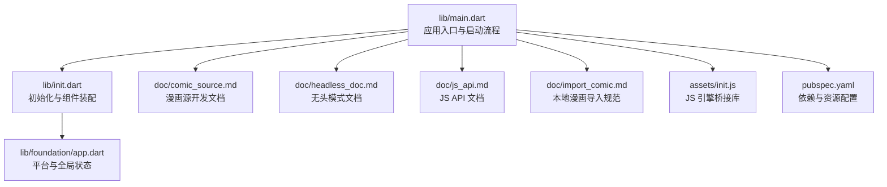
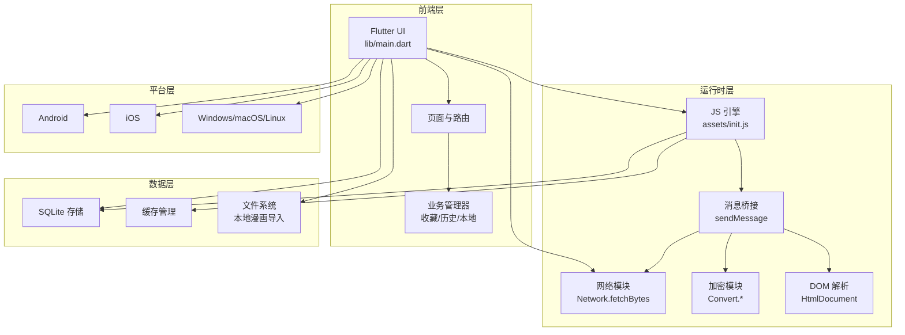
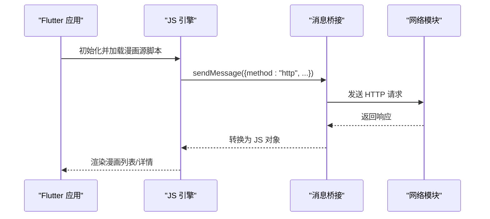
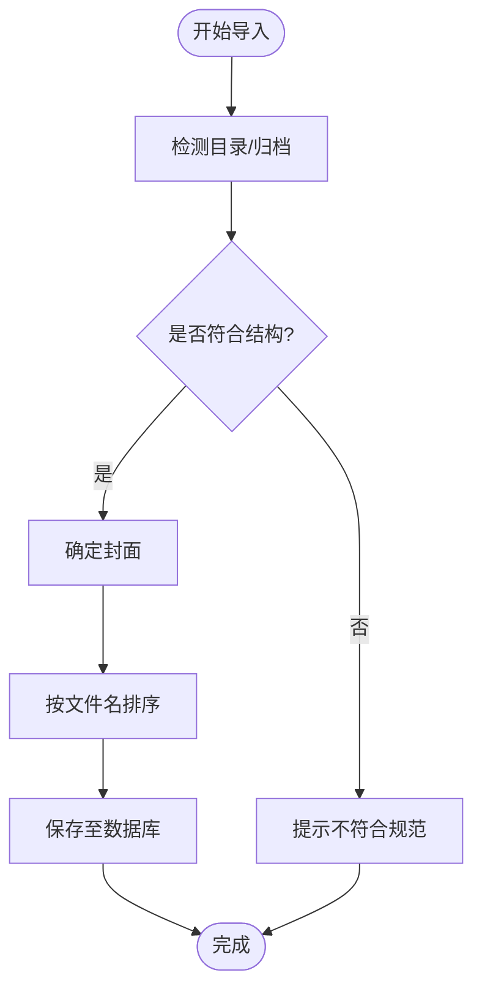
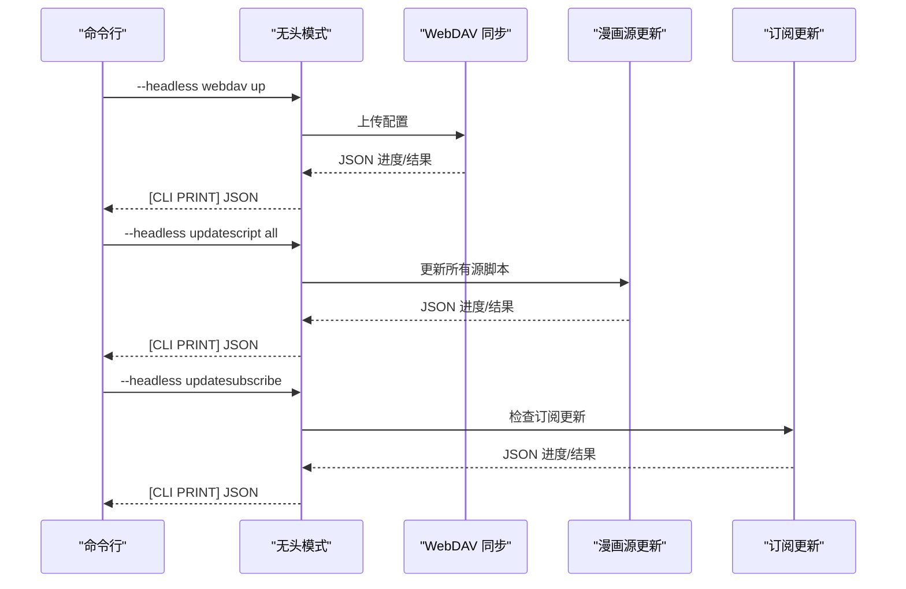
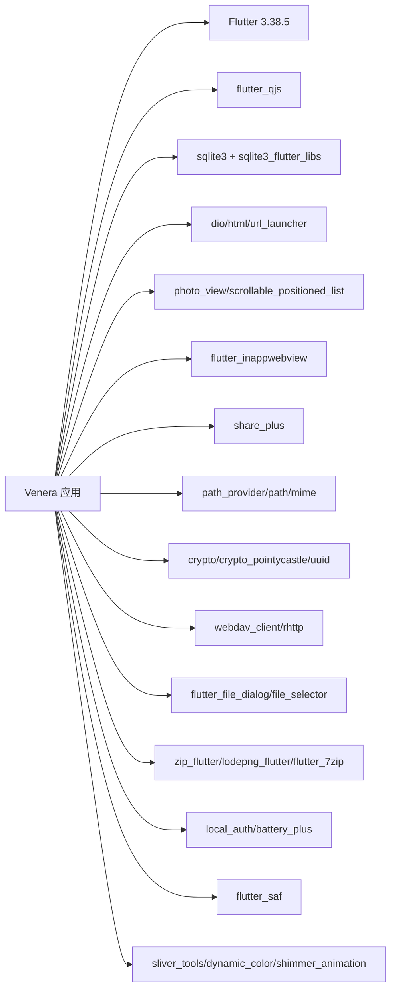

# 项目概述

<cite>
**本文档引用的文件**
- [README.md](file://README.md)
- [pubspec.yaml](file://pubspec.yaml)
- [LICENSE](file://LICENSE)
- [lib/main.dart](file://lib/main.dart)
- [lib/init.dart](file://lib/init.dart)
- [lib/foundation/app.dart](file://lib/foundation/app.dart)
- [doc/comic_source.md](file://doc/comic_source.md)
- [doc/headless_doc.md](file://doc/headless_doc.md)
- [doc/js_api.md](file://doc/js_api.md)
- [doc/import_comic.md](file://doc/import_comic.md)
- [assets/init.js](file://assets/init.js)
</cite>

## 目录
1. [简介](#简介)
2. [项目结构](#项目结构)
3. [核心组件](#核心组件)
4. [架构总览](#架构总览)
5. [详细组件分析](#详细组件分析)
6. [依赖关系分析](#依赖关系分析)
7. [性能考虑](#性能考虑)
8. [故障排除指南](#故障排除指南)
9. [结论](#结论)
10. [附录](#附录)

## 简介
Venera 是一个基于 Flutter 3.38.5 开发的跨平台漫画阅读应用，支持本地与网络漫画阅读、JavaScript 漫画源脚本扩展、收藏管理、下载功能、评论与标签展示、WebDAV 同步以及无头模式自动化任务。项目采用 GPL-3.0 许可证，提供多平台构建与分发能力，并通过内置的 JavaScript 引擎实现灵活的内容源扩展。

- 支持平台：Android、iOS、Windows、macOS、Linux
- 核心特性：本地漫画导入、网络漫画源、收藏与下载、评论与标签、WebDAV 同步、无头模式命令行工具
- 技术亮点：Flutter/Dart 跨平台、JavaScript 沙盒引擎、SQLite 数据存储、Material 风格 UI、动态主题与语言

**章节来源**
- [README.md](file://README.md#L1-L39)
- [pubspec.yaml](file://pubspec.yaml#L1-L122)

## 项目结构
项目采用典型的 Flutter 应用结构，核心代码位于 lib 目录，资源与文档位于 assets 与 doc 目录，平台特定配置在 android、ios、windows、linux、macos 等目录中。pubspec.yaml 定义了应用元数据、版本、依赖与资源清单。

**图表来源**
- [lib/main.dart](file://lib/main.dart#L1-L321)
- [lib/init.dart](file://lib/init.dart#L1-L124)
- [lib/foundation/app.dart](file://lib/foundation/app.dart#L1-L113)
- [doc/comic_source.md](file://doc/comic_source.md#L1-L740)
- [doc/headless_doc.md](file://doc/headless_doc.md#L1-L181)
- [doc/js_api.md](file://doc/js_api.md#L1-L513)
- [doc/import_comic.md](file://doc/import_comic.md#L1-L62)
- [assets/init.js](file://assets/init.js#L1-L800)
- [pubspec.yaml](file://pubspec.yaml#L102-L122)

**章节来源**
- [pubspec.yaml](file://pubspec.yaml#L102-L122)
- [lib/main.dart](file://lib/main.dart#L1-L321)

## 核心组件
- 应用入口与生命周期
  - 入口函数解析参数，支持无头模式与 WebView 标题栏模式；初始化 IO、日志、窗口管理与主题系统；注册未捕获异常处理器。
- 初始化流程
  - 并行初始化应用、组件、SAF、翻译、OpenCC、JS 引擎、漫画源管理器与缓存策略；处理链接与文本分享、高刷显示模式、Windows 心跳通道。
- 平台与全局状态
  - 统一管理平台判断、路径、导航键、历史记录、收藏与本地管理；提供强制重建回调与弹出栈控制。

**章节来源**
- [lib/main.dart](file://lib/main.dart#L20-L58)
- [lib/init.dart](file://lib/init.dart#L37-L77)
- [lib/foundation/app.dart](file://lib/foundation/app.dart#L82-L108)

## 架构总览
Venera 的整体架构围绕“Flutter 前端 + JS 引擎桥接 + 多平台后端”的模式设计。Flutter 负责 UI 与平台集成，JS 引擎负责漫画源脚本执行与网络请求，SQLite 存储用户数据与缓存，WebDAV 提供云端同步。

**图表来源**
- [lib/main.dart](file://lib/main.dart#L1-L321)
- [lib/init.dart](file://lib/init.dart#L37-L77)
- [assets/init.js](file://assets/init.js#L1-L800)
- [pubspec.yaml](file://pubspec.yaml#L11-L90)

## 详细组件分析

### 组件 A：漫画源与 JS 引擎
- JS 引擎桥接
  - 通过 sendMessage 实现 Dart 与 JS 的双向通信，支持延迟、随机数、UUID、HTTP 请求、Cookie 管理、HTML 解析与转换等。
- 漫画源开发
  - 支持探索页、分类页、搜索、收藏、详情、评论、标签翻译、设置等完整生命周期接口；通过 JSON 列表加载外部源脚本。
- 无头模式
  - 提供 WebDAV 同步、漫画源更新、订阅更新等命令行工具，输出结构化 JSON 日志，便于自动化集成。

**图表来源**
- [assets/init.js](file://assets/init.js#L460-L642)
- [doc/comic_source.md](file://doc/comic_source.md#L1-L740)
- [doc/headless_doc.md](file://doc/headless_doc.md#L1-L181)

**章节来源**
- [assets/init.js](file://assets/init.js#L1-L800)
- [doc/comic_source.md](file://doc/comic_source.md#L1-L740)
- [doc/headless_doc.md](file://doc/headless_doc.md#L1-L181)

### 组件 B：本地漫画导入与组织
- 目录结构
  - 支持带章节与不带章节两种目录结构；封面可选，排序按文件名；章节目录作为章节标题。
- 归档格式
  - 支持 CBZ/CB7/ZIP/7Z 等归档格式，自动解压并读取图像序列。
- 导入流程
  - 通过文件选择器或 SAF 授权访问外部存储；扫描目录与归档，生成漫画条目并写入数据库。

**图表来源**
- [doc/import_comic.md](file://doc/import_comic.md#L8-L62)

**章节来源**
- [doc/import_comic.md](file://doc/import_comic.md#L1-L62)

### 组件 C：无头模式命令与输出
- 命令体系
  - webdav up/down：上传/下载配置；updatescript all：批量更新漫画源；updatesubscribe：检查订阅更新。
- 输出格式
  - 所有命令以 [CLI PRINT] 前缀输出 JSON 对象，包含 status、message 与 data 字段；支持进度与错误日志。

**图表来源**
- [doc/headless_doc.md](file://doc/headless_doc.md#L1-L181)

**章节来源**
- [doc/headless_doc.md](file://doc/headless_doc.md#L1-L181)

## 依赖关系分析
- Flutter 与核心依赖
  - Flutter SDK 3.38.5、Material 设计、动态颜色、窗口管理、SQLite3、网络请求、HTML 解析、图片查看、分享、滚动定位、Webview 等。
- JS 引擎与第三方
  - flutter_qjs 作为 JS 引擎；rhttp、webdav_client、photo_view、scrollable_positioned_list 等增强功能。
- 资源与国际化
  - assets 中包含翻译、初始化 JS、图标与标签数据；支持简体/繁体中文与英文。

**图表来源**
- [pubspec.yaml](file://pubspec.yaml#L11-L90)

**章节来源**
- [pubspec.yaml](file://pubspec.yaml#L1-L122)

## 性能考虑
- 初始化优化
  - 使用 Future.wait 并行初始化多个组件，减少冷启动时间；仅在 Android 上尝试设置高刷新率。
- 缓存与存储
  - 通过 CacheManager 设置缓存上限；SQLite 存储用户数据与历史；本地漫画按需解压与排序。
- 网络与渲染
  - Network.fetchBytes 返回字节流，避免重复解析；PhotoView 提供高性能缩放与翻页；WebView 用于登录与交互场景。
- 跨平台适配
  - 动态主题与字体回退；桌面端窗口管理与透明背景；移动端系统 UI 模式与状态栏适配。

[本节为通用指导，无需具体文件分析]

## 故障排除指南
- 未捕获异常
  - 应用注册全局错误处理器，记录异常堆栈并统一展示；建议在 JS 源脚本中使用 try/catch 包裹异步逻辑。
- 初始化失败
  - init() 中对每个 Future 调用 wait() 包装，避免崩溃；检查网络、权限与外部存储可用性。
- Windows 心跳
  - Windows 平台通过 MethodChannel 定时心跳上报，确保前台运行；如出现黑屏或冻结，检查心跳通道是否存在。
- 本地漫画导入失败
  - 确认目录结构与文件扩展名；检查权限与外部存储授权；归档格式需为受支持类型。

**章节来源**
- [lib/main.dart](file://lib/main.dart#L54-L56)
- [lib/init.dart](file://lib/init.dart#L24-L35)
- [lib/init.dart](file://lib/init.dart#L66-L68)
- [doc/import_comic.md](file://doc/import_comic.md#L1-L62)

## 结论
Venera 通过 Flutter 跨平台能力与 JS 引擎桥接，实现了强大的漫画源扩展与多平台体验。其模块化架构、完善的初始化流程与丰富的平台适配，使其既能满足初学者快速上手，也能为高级用户提供深度定制与自动化能力。配合 GPL-3.0 许可证，鼓励社区协作与开源共享。

[本节为总结性内容，无需具体文件分析]

## 附录

### 版本与许可证
- 当前版本：1.6.2（内部版本号 162）
- 许可证：GNU General Public License v3.0
- 发布渠道：GitHub Releases、AUR、F-Droid

**章节来源**
- [pubspec.yaml](file://pubspec.yaml#L5-L5)
- [LICENSE](file://LICENSE#L1-L675)
- [README.md](file://README.md#L6-L8)

### 社区贡献指南
- 漫画源贡献
  - 参考漫画源开发文档，提供 JSON 列表与 JS 脚本；遵循 API 规范与最小 App 版本要求。
- 无头模式自动化
  - 使用命令行工具进行 WebDAV 同步与漫画源更新；解析结构化 JSON 输出以集成 CI/CD。
- 本地漫画导入
  - 遵循目录与归档规范，确保封面与章节命名正确；优先使用受支持的图像扩展名。

**章节来源**
- [doc/comic_source.md](file://doc/comic_source.md#L1-L740)
- [doc/headless_doc.md](file://doc/headless_doc.md#L1-L181)
- [doc/import_comic.md](file://doc/import_comic.md#L1-L62)